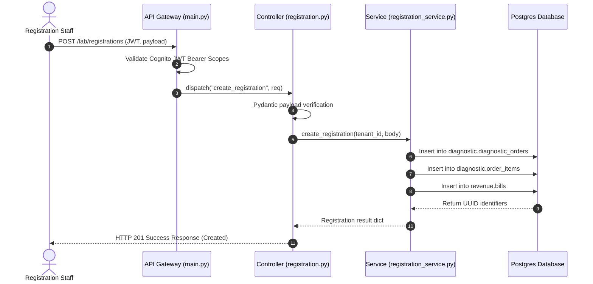
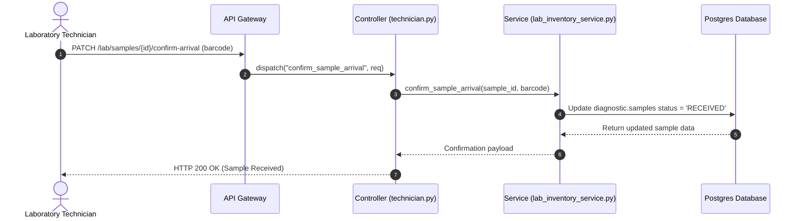
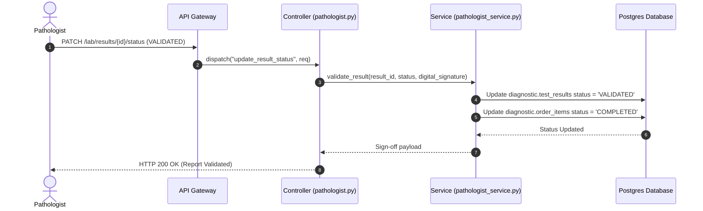

# Laboratory Module Sequence Workflows
Version: 1.0.0
Author: Systems Architect

---

## 1. Laboratory Order Registration Flow
This diagram illustrates order registration completed by the registration clerk.

---

## 2. Bio-Sample Collection and Tracking Flow
Illustrates sample scanning at the receiving bench.

---

## 3. Results Verification & Sign-off Flow
Enforces Pathologist verification and PDF report building.

