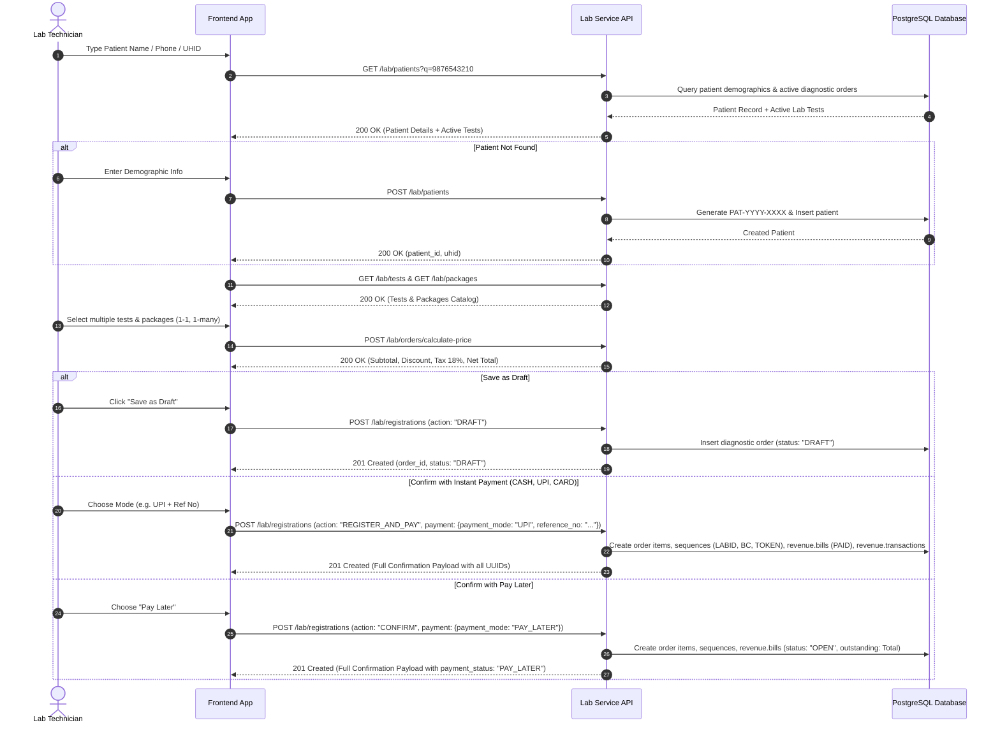

# Laboratory Patient Registration, Search, Booking & Billing API Specification

This document provides complete technical specifications for the redesigned **Laboratory Service Patient Registration, Search, Catalog Discovery, Dynamic Pricing, Booking, and Flexible Billing** workflows.

---

## 1. Global Architectural Overview

### Base Gateway URL
```http
https://<api-id>.execute-api.ap-south-1.amazonaws.com/<stage>
```
All routes are available under standard aliases (`/lab/...` and `/diagnostic-orders/lab/...`).

### Authorization Header
Every request requires a standard JWT Bearer token containing tenant claims:
```http
Authorization: Bearer <access_token>
```

### Standard Response Envelope
All API endpoints return standard enveloped responses:
```json
{
  "success": true,
  "data": { ... },
  "message": "Descriptive message"
}
```

---

## 2. Comprehensive API Directory

| # | Workflow Step | Method | Route | Description |
|---|---|---|---|---|
| **1** | Patient Search | `GET` | `/lab/patients` | Search registered patients with enriched active lab tests |
| **2** | Patient Registration | `POST` | `/lab/patients` | Register patient with sequential `PAT-YYYY-XXXX` UHID |
| **3** | Tests Catalog | `GET` | `/lab/tests` | List all active diagnostic tests |
| **4** | Packages Catalog | `GET` | `/lab/packages` | List all active bundled test packages with member tests |
| **5** | Price Calculation | `POST` | `/lab/orders/calculate-price` | Dynamic invoice calculation for arbitrary tests and packages |
| **6** | Booking & Drafts | `POST` | `/lab/registrations` | Create draft booking or confirm with flexible payment |
| **7** | Instant Order & Pay | `POST` | `/lab/orders/pay-and-create` | Direct confirmation and payment processing |
| **8** | Order Statistics | `GET` | `/lab/orders/statistics` | Summary KPI cards (Total, Pending, Completed, In Transit, Processing, Reviewed) |
| **9** | Order Management List | `GET` | `/lab/orders` | Paginated and filterable orders table with Patient Type and Collector |
| **10** | Addendum Reports List | `GET` | `/lab/addendums` | Paginated post-validation Addendum Reports audit table |
| **11** | Create Addendum Report | `POST` | `/lab/addendums` | Submit addendum report revision with clinical reasons |
| **12** | Reschedule Tests / Packages | `POST` | `/lab/orders/{id}/reschedule` | Reschedule specific tests or packages by Date, Time, and Reason |
| **13** | Cancel Tests / Order | `POST` | `/lab/orders/{id}/cancel` | Cancel specific tests, packages, or whole order with reason |
| **14** | Patient Bills & Invoices | `GET` | `/lab/patients/{id}/bills` | List all historical and active bills according to a patient |
| **15** | Download / Print Bill Receipt | `GET` | `/lab/invoices/{id}` | Complete itemized receipt with all test items, GST, barcode, and notes |
| **17** | Start Testing / Process Sample | `PATCH` | `/lab/samples/{id}/process` | Transitions test item from `SCHEDULED` to `IN_PROGRESS` |
| **18** | List Laboratory Packages | `GET` | `/lab/packages` | Searchable multi-test packages catalogue with test counts & child items |
| **19** | Package Details & Child Tests | `GET` | `/lab/packages/{id}` | Full package metadata with all constituent test definitions & prices |

---

## 3. Detailed Endpoint Specifications

### 3.1 Search Patients & Order List (`GET /lab/patients`)
Searches and returns the patient registry aligned by diagnostic order records matching the **Patient List** table. Enriches each record with its `order_id`, human order identifier (`order_number`), total count of tests/packages, dynamically assigned technician(s), order date, lifecycle status, payment status (`PAID`, `UNPAID`, `PARTIAL`), and itemized test items.

* **HTTP Method:** `GET`
* **Route:** `/lab/patients`
* **Gateway Route Alias:** `/diagnostic-orders/lab/patients`
* **Required Permission:** `diagnostics:order:view`

#### Query Parameters & Filters
| Parameter | Type | Required? | Default | Description |
| :--- | :--- | :--- | :--- | :--- |
| `q` / `search` | `string` | **Optional** | `""` | Search query matching full name, UHID (`PAT-2026-XXXX`), phone number, barcode (`BC-XXXXX`), or Order ID (`LABID-XXXXX`). |
| `status` | `string` | **Optional** | `""` | Filter by order status: `SCHEDULED` (or `Scheduled`), `COMPLETED` (or `Completed`), `IN_PROGRESS` (or `Inprocess`), `ADDENDUM` (or `Addendum`), `PENDING`, `CANCELLED`. |
| `payment_status` | `string` | **Optional** | `""` | Filter by order payment status: `PAID` (or `Paid`), `UNPAID` (or `Unpaid` / `PAY_LATER`), `PARTIAL` (or `Partial`). |
| `technician` | `string` | **Optional** | `""` | Filter by technician name or UUID. Set to `null`, `none`, or `unassigned` to fetch orders with unassigned technicians. |
| `date_start` | `string` | **Optional** | `""` | Start date filter (`YYYY-MM-DD` or ISO timestamp). |
| `date_end` | `string` | **Optional** | `""` | End date filter (`YYYY-MM-DD` or ISO timestamp). |
| `page` | `integer` | **Optional** | `1` | Page number for pagination. |
| `limit` | `integer` | **Optional** | `50` | Number of records per page (`rows_per_page`). |

#### Request Headers
```http
GET /lab/patients?q=Kavita&status=Scheduled&payment_status=Paid HTTP/1.1
Host: api.arovita.com
Authorization: Bearer <access_token>
```

#### Success Response (`200 OK`)
```json
{
  "success": true,
  "code": 200,
  "data": [
    {
      "order_id": "b16cc357-fb70-404f-aa70-51bb20763cd7",
      "order_number": "ORD-001",
      "lab_unique_id": "LABID-29333",
      "patient_id": "401fcd56-3bd0-4247-8ece-d2cc47b616dd",
      "uhid": "PAT-2026-6481",
      "patient_name": "Aisha Khan",
      "dob": "1994-08-12",
      "age": 32,
      "gender": "FEMALE",
      "age_gender_display": "32Y • F",
      "blood_group": "A+",
      "phone": "9876543210",
      "address": "Baner, Pune, Maharashtra",
      "test_count": 1,
      "assigned_to": "Priya Nair",
      "assigned_technicians": [
        "Priya Nair"
      ],
      "date": "August 25, 2026",
      "order_date": "2026-08-25",
      "created_at": "2026-08-25T10:15:30.000000+00:00",
      "status": "Completed",
      "payment_status": "PAID",
      "payment_status_label": "Paid",
      "bill_details": {
        "id": "c16cc357-fb70-404f-aa70-51bb20763cd8",
        "invoice_number": "INV-LAB-4A2D19B4",
        "status": "PAID",
        "total_amount": 350.0,
        "paid_amount": 350.0,
        "outstanding": 0.0,
        "payment_mode": "UPI"
      },
      "tests": [
        {
          "order_id": "b16cc357-fb70-404f-aa70-51bb20763cd7",
          "lab_unique_id": "LABID-29333",
          "order_item_id": "c293538f-fbfb-4d48-b769-ebcf5a43c547",
          "test_id": "2570848a-74ce-48db-b1f7-1fc450e060c5",
          "test_name": "Erythrocyte Sedimentation Rate (ESR)",
          "test_code": "HEM-003",
          "test_category": "Haematology",
          "specimen_type": "BLOOD",
          "status": "COMPLETED",
          "priority": "ROUTINE",
          "barcode": "BC-56796",
          "token_number": "LAB-1015",
          "technician_id": "7b79d2bf-e2b2-4d2c-80ea-73599cf37cf3",
          "technician_name": "Priya Nair",
          "assigned_to": "Priya Nair",
          "sample_collected_by": "8ca080fe-f8aa-475a-a309-84382c4ee97f",
          "sample_collected_by_name": "Ravi Kumar",
          "sample_collected_at": "2026-08-25T10:18:00+00:00",
          "processed_at": "2026-08-25T10:30:00+00:00",
          "created_at": "2026-08-25T10:15:30.000000+00:00"
        }
      ],
      "has_active_tests": true,
      "active_orders_count": 1,
      "last_order_date": "2026-08-25T10:15:30.000000+00:00"
    }
  ]
}
```

---

### 3.2 Patient Registration (`POST /lab/patients`)
Registers a new patient into the hospital master registry, generating a sequential `PAT-{YYYY}-{seq:04d}` UHID. This matches the **Patient Information — New Registration** form specifications.

* **HTTP Method:** `POST`
* **Route:** `/lab/patients`
* **Gateway Route Alias:** `/diagnostic-orders/lab/patients`
* **Required Permission:** `diagnostics:order:view`

#### Request Body Schema
| Category | Field Name | Type | Required? | Description |
| :--- | :--- | :--- | :--- | :--- |
| **Personal Information** | `id_type` | `string` | **Mandatory** | Government ID type (e.g., `Aadhar Card`, `PAN`, `Passport`, `Voter ID`, `Driving License`, `ABHA`) |
| | `id_number` | `string` | **Mandatory** | Unique ID number (e.g. `12-digit Aadhar number`) |
| | `first_name` | `string` | **Mandatory** | Patient's first name (e.g., `Rajesh`) |
| | `last_name` | `string` | **Mandatory** | Patient's last name (e.g., `Kumar`) |
| | `full_name` | `string` | Optional | Full name (computed as `first_name + " " + last_name` if omitted) |
| | `date_of_birth` | `string` | Optional | Date of birth format: `YYYY-MM-DD` (e.g. `1978-03-07`) |
| | `age` | `integer` | Optional | Age in years (e.g. `42`) |
| | `gender` | `string` | **Mandatory** | Values: `Male`, `Female`, `Other` |
| | `blood_group` | `string` | Optional | Values: `A+`, `A-`, `B+`, `B-`, `AB+`, `AB-`, `O+`, `O-` |
| | `phone` | `string` | **Mandatory** | 10-digit mobile number with optional country prefix (e.g. `+91 87654 3210` or `9876543210`) |
| **Address & Communication** | `pincode` | `string` | Optional | 6-digit postal code (e.g. `560003`) |
| | `street_name` | `string` | Optional | Street / house / flat address (e.g. `24, 3rd Cross`) |
| | `city` | `string` | Optional | City / Town / Village (e.g. `Bengaluru`) |
| | `district` | `string` | Optional | District name (e.g. `Bengaluru Urban`) |
| | `state` | `string` | Optional | State name (e.g. `Karnataka`) |
| | `country` | `string` | Optional | Country name (Default: `India`) |
| | `email` | `string` | Optional | Valid email address (e.g. `rajeshk@email.com`) |
| **Emergency Contacts** | `emergency_contacts` | `array` | Optional | List of emergency contact objects: `[{"relationship": "Mother", "name": "Heer Kumar", "contact_number": "+91 78901 23456"}]` |
| **Consent** | `consent_confirmed` | `boolean` | Optional | Checkbox confirmation to use medical info for healthcare & administrative purposes (Default: `true`) |

#### Example Request Body (Matching UI Form)
```json
{
  "id_type": "Aadhar Card",
  "id_number": "4920 1827 3849",
  "first_name": "Rajesh",
  "last_name": "Kumar",
  "date_of_birth": "1978-03-07",
  "age": 42,
  "gender": "Male",
  "blood_group": "B+",
  "phone": "+91 87654 3210",
  "pincode": "560003",
  "street_name": "24, 3rd Cross",
  "city": "Bengaluru",
  "district": "Bengaluru Urban",
  "state": "Karnataka",
  "country": "India",
  "email": "rajeshk@email.com",
  "emergency_contacts": [
    {
      "relationship": "Mother",
      "name": "Heer Kumar",
      "contact_number": "+91 78901 23456"
    }
  ],
  "consent_confirmed": true
}
```

#### Success Response (`200 OK`)
```json
{
  "success": true,
  "message": "Patient registered successfully",
  "data": {
    "patient_id": "83d637f3-bcde-491d-9364-3ddd0d0d518d",
    "id": "83d637f3-bcde-491d-9364-3ddd0d0d518d",
    "uhid": "PAT-2026-6482",
    "patient_number": "PAT-2026-6482",
    "first_name": "Rajesh",
    "last_name": "Kumar",
    "full_name": "Rajesh Kumar",
    "id_type": "Aadhar Card",
    "id_number": "4920 1827 3849",
    "phone": "+91 87654 3210",
    "email": "rajeshk@email.com",
    "dob": "1978-03-07",
    "age": 42,
    "gender": "MALE",
    "blood_group": "B+",
    "street_name": "24, 3rd Cross",
    "city": "Bengaluru",
    "district": "Bengaluru Urban",
    "state": "Karnataka",
    "pincode": "560003",
    "country": "India",
    "address": "24, 3rd Cross, Bengaluru, Bengaluru Urban, Karnataka - 560003, India",
    "emergency_contacts": [
      {
        "relationship": "Mother",
        "name": "Heer Kumar",
        "contact_number": "+91 78901 23456"
      }
    ],
    "consent_confirmed": true,
    "created_at": "2026-08-22 12:28:10.123456+05:30"
  }
}
```

---

### 3.3 List Diagnostic Tests Catalog (`GET /lab/tests`)
Fetches all available active laboratory diagnostic tests.

* **HTTP Method:** `GET`
* **Route:** `/lab/tests`
* **Gateway Route Alias:** `/diagnostic-orders/lab/tests`
* **Required Permission:** `diagnostics:order:view`

#### Success Response (`200 OK`)
```json
{
  "success": true,
  "data": [
    {
      "id": "2570848a-74ce-48db-b1f7-1fc450e060c5",
      "test_name": "Erythrocyte Sedimentation Rate (ESR)",
      "test_code": "HEM-003",
      "department_name": "Pathology",
      "category": "Haematology",
      "specimen_type": "BLOOD",
      "tat_hours": 4,
      "price": 350.00,
      "is_active": true
    },
    {
      "id": "16a43dca-eb71-4b85-ab0a-3b984816cadf",
      "test_name": "Complete Blood Count (CBC)",
      "test_code": "HEM-001",
      "department_name": "Pathology",
      "category": "Haematology",
      "specimen_type": "Whole Blood",
      "tat_hours": 6,
      "price": 450.00,
      "is_active": true
    }
  ]
}
```

---

### 3.4 List Test Packages Catalog (`GET /lab/packages`)
Fetches all bundled diagnostic test packages with member tests.

* **HTTP Method:** `GET`
* **Route:** `/lab/packages`
* **Gateway Route Alias:** `/diagnostic-orders/lab/packages`
* **Required Permission:** `diagnostics:order:view`

#### Success Response (`200 OK`)
```json
{
  "success": true,
  "data": [
    {
      "id": "b5d66607-f4de-4ac4-bfed-c9b27adad890",
      "package_id": "b5d66607-f4de-4ac4-bfed-c9b27adad890",
      "package_name": "Comprehensive Executive Health Check",
      "package_code": "PKG-EXEC-01",
      "description": "Full body screening package including CBC, Liver & Renal profiles",
      "price": 1200.00,
      "is_active": true,
      "tests": [
        {
          "test_id": "16a43dca-eb71-4b85-ab0a-3b984816cadf",
          "test_name": "Complete Blood Count (CBC)",
          "category": "Haematology",
          "price": 450.00
        },
        {
          "test_id": "2570848a-74ce-48db-b1f7-1fc450e060c5",
          "test_name": "Erythrocyte Sedimentation Rate (ESR)",
          "category": "Haematology",
          "price": 350.00
        }
      ]
    }
  ]
}
```

---

### 3.5 Calculate Order Price / Invoice Preview (`POST /lab/orders/calculate-price`)
Dynamically computes itemized subtotal, discounts, GST (18%), and net payable amount for arbitrary combinations of individual tests and packages (1-1, 1-many).

* **HTTP Method:** `POST`
* **Route:** `/lab/orders/calculate-price`
* **Gateway Route Alias:** `/diagnostic-orders/lab/orders/calculate-price`
* **Required Permission:** `diagnostics:order:view`

#### Request Body Schema (Mandatory vs Optional Fields)
| Field | Type | Requirement | Default | Description |
| :--- | :--- | :--- | :--- | :--- |
| `selected_tests` | `object[]` | **CONDITIONAL** | `[]` | List of test objects: `[{"test_id": "UUID"}]`. *(At least 1 test or 1 package is required)* |
| `selected_packages`| `object[]` | **CONDITIONAL** | `[]` | List of package objects: `[{"package_id": "UUID"}]`. *(At least 1 test or 1 package is required)* |
| `patient_id` | `UUID` | **OPTIONAL** | `null` | Target patient ID to apply patient-specific discount tier or insurance rate card |

#### Example Request Body
```json
{
  "selected_tests": [
    { "test_id": "2570848a-74ce-48db-b1f7-1fc450e060c5" }
  ],
  "selected_packages": [
    { "package_id": "b5d66607-f4de-4ac4-bfed-c9b27adad890" }
  ]
}
```

#### Success Response (`200 OK`)
```json
{
  "success": true,
  "data": {
    "subtotal": 1550.00,
    "discount_amount": 0.00,
    "taxable_amount": 1550.00,
    "tax": 279.00,
    "tax_amount": 279.00,
    "total_amount": 1829.00,
    "tests": [
      {
        "test_id": "2570848a-74ce-48db-b1f7-1fc450e060c5",
        "test_name": "Erythrocyte Sedimentation Rate (ESR)",
        "test_code": "HEM-003",
        "category": "Haematology",
        "specimen_type": "BLOOD",
        "price": 350.00
      }
    ],
    "packages": [
      {
        "package_id": "b5d66607-f4de-4ac4-bfed-c9b27adad890",
        "package_name": "Comprehensive Executive Health Check",
        "package_code": "PKG-EXEC-01",
        "price": 1200.00,
        "discount": 0.00,
        "test_ids": [
          "16a43dca-eb71-4b85-ab0a-3b984816cadf",
          "2570848a-74ce-48db-b1f7-1fc450e060c5"
        ]
      }
    ]
  }
}
```

---

### 3.6 Lab Booking & Flexible Payment (`POST /lab/registrations`)
Unified intake endpoint supporting:
1. **Draft Bookings** (`action: "DRAFT"`): Saves the intake in draft mode without collecting immediate payment.
2. **Immediate Confirmation & Payment** (`action: "REGISTER_AND_PAY"` or `"CONFIRM"`):
   - **`CASH`**: Directly confirmed with status `PAID`.
   - **`UPI`**: Directly confirmed with status `PAID`; takes `reference_no` (optional).
   - **`CARD`**: Directly confirmed with status `PAID`; takes `reference_no` (optional).
   - **`PAY_LATER`**: Directly confirmed with payment status `PAY_LATER` / `OPEN`. The full amount is added as an outstanding balance to the patient's billing ledger (`revenue.bills`).
   - **`INSURANCE` / `OTHERS`**: Recorded with policy claim details.

* **HTTP Method:** `POST`
* **Route:** `/lab/registrations`
* **Gateway Route Aliases:** `/diagnostic-orders/lab/registrations`, `/lab/orders/pay-and-create`
* **Required Permission:** `diagnostics:order:view`

#### Request Body Schema (Mandatory vs Optional Fields)
| Category | Field Name | Type | Requirement | Default | Clinical / Operational Description |
| :--- | :--- | :--- | :--- | :--- | :--- |
| **Patient** | `patient_id` | `UUID` | **MANDATORY** | — | Target patient UUID from patient registry. |
| **Order Items** | `selected_tests` | `object[]` | **CONDITIONAL** | `[]` | Array of `{"test_id": "UUID"}`. *(At least 1 test or package is mandatory)* |
| | `selected_packages`| `object[]` | **CONDITIONAL** | `[]` | Array of `{"package_id": "UUID"}`. *(At least 1 test or package is mandatory)* |
| **Workflow** | `action` | `string` | **OPTIONAL** | `"CONFIRM"` | Values: `DRAFT` (draft order), `CONFIRM` (confirmed order), `REGISTER_AND_PAY` (instant order + payment). |
| | `visit_type` | `string` | **OPTIONAL** | `"Walk-in"` | Values: `Hospital`, `Walk-in`, `Referral`. |
| | `priority` | `string` | **OPTIONAL** | `"Routine"` | Values: `Routine`, `Urgent`, `STAT`. |
| **Patient Guidance** | `fasting_required` | `boolean` | **OPTIONAL** | `false` | When `true`, patient fasting guidelines are automatically printed on the bill receipt. |
| | `special_instructions`| `string`| **OPTIONAL** | `""` | Clinical instructions, preparation rules, or fasting hours (e.g. `"10-12 hrs fasting mandatory"`). |
| | `remarks` | `string` | **OPTIONAL** | `""` | Administrative notes or internal comments. |
| **Referral Details** | `referred_by_doctor` | `string` | **CONDITIONAL** | `null` | Referring doctor name. *(**MANDATORY** if `visit_type: "Referral"`)* |
| | `referred_by_hospital` | `string` | **CONDITIONAL** | `null` | Referring hospital / clinic name. *(**MANDATORY** if `visit_type: "Referral"`)* |
| | `referring_doctor` | `object` | **OPTIONAL** | `null` | Object format: `{"doctor_name": "Dr. Sarah", "hospital_name": "City Care Hospital", "department_name": "General Medicine", "referral_code": "DOC-102"}`. |
| | `doctor_id` | `UUID` | **OPTIONAL** | System Default | Direct doctor user UUID. |
| | `department_id` | `UUID` | **OPTIONAL** | System Default | Department UUID. |
| **Payment Details**| `payment` | `object` | **CONDITIONAL** | `null` | Payment object. *(Mandatory if `action: "REGISTER_AND_PAY"` or confirming payment)* |
| | `payment.payment_mode` | `string` | **MANDATORY (in payment)** | `"CASH"` | Values: `UPI`, `CARD`, `CASH`, `PAY_LATER`, `INSURANCE`. |
| | `payment.reference_no` | `string` | **OPTIONAL** | `null` | Transaction ID, UPI UTR reference number, or Cheque number. |
| | `payment.amount` | `number` | **OPTIONAL** | Total Amount | Paid amount (defaults to calculated bill total). |
| | `payment.notes` | `string` | **OPTIONAL** | `""` | Payment specific notes. |

#### Example 1: Create Draft Booking (`action: "DRAFT"`)
```json
{
  "action": "DRAFT",
  "patient_id": "401fcd56-3bd0-4247-8ece-d2cc47b616dd",
  "visit_type": "Walk-in",
  "priority": "Routine",
  "selected_tests": [
    { "test_id": "2570848a-74ce-48db-b1f7-1fc450e060c5" }
  ],
  "selected_packages": [
    { "package_id": "b5d66607-f4de-4ac4-bfed-c9b27adad890" }
  ]
}
```

#### Example 2: Confirm with PAY_LATER (Adds to Patient Profile Billing)
```json
{
  "action": "CONFIRM",
  "patient_id": "401fcd56-3bd0-4247-8ece-d2cc47b616dd",
  "visit_type": "Walk-in",
  "priority": "Routine",
  "selected_tests": [
    { "test_id": "2570848a-74ce-48db-b1f7-1fc450e060c5" }
  ],
  "selected_packages": [
    { "package_id": "b5d66607-f4de-4ac4-bfed-c9b27adad890" }
  ],
  "payment": {
    "payment_mode": "PAY_LATER"
  }
}
```

#### Example 3: Confirm with Instant Payment (`action: "REGISTER_AND_PAY"`)
```json
{
  "action": "REGISTER_AND_PAY",
  "patient_id": "401fcd56-3bd0-4247-8ece-d2cc47b616dd",
  "visit_type": "Walk-in",
  "priority": "Urgent",
  "fasting_required": true,
  "special_instructions": "12 hours fasting required",
  "selected_tests": [
    { "test_id": "2570848a-74ce-48db-b1f7-1fc450e060c5" }
  ],
  "selected_packages": [
    { "package_id": "b5d66607-f4de-4ac4-bfed-c9b27adad890" }
  ],
  "payment": {
    "payment_mode": "UPI",
    "reference_no": "UPI-TXN-2026-9911"
  }
}
```

#### Example 4: Confirm Referral Booking (`visit_type: "Referral"`)
```json
{
  "action": "CONFIRM",
  "patient_id": "401fcd56-3bd0-4247-8ece-d2cc47b616dd",
  "visit_type": "Referral",
  "referred_by_doctor": "Dr. Sarah Jenkins",
  "referred_by_hospital": "City Care Hospital",
  "priority": "Urgent",
  "selected_tests": [
    { "test_id": "2570848a-74ce-48db-b1f7-1fc450e060c5" }
  ],
  "payment": {
    "payment_mode": "CASH"
  }
}
```

---

## 4. Universal Confirmation Payload Specification (UI Card Parity)

Upon registration and booking confirmation, the API returns a comprehensive response payload that drives the **"Lab Registration Completed"** UI card with synchronized identifiers, queue token, demographics, test badges, pathologist signature, and billing breakdown:

### 4.1 Identifier Taxonomy & Relationships
| Badge / UI Field | Response Key | Prefix / Format | Architectural Definition |
| :--- | :--- | :--- | :--- |
| **Patient LABID** (Cyan Pill) | `labid`, `patient_lab_id` | `LABID-XXXXX` | Unique identifier of the patient in the laboratory master system |
| **Booking LAB-ID** (Blue Pill) | `lab_id`, `order_number` | `LAB-XXXX` | Unique identifier for each specific booking / set of tests and packages booked at a time |
| **Barcode BC-ID** (Purple Pill) | `barcode`, `barcode_id` | `BC-XXXX` | Physical specimen/tube barcode associated with that `lab-id` booking set |
| **Queue Token** (Blue Banner) | `token_number` | `LAB-XXXX` | Phlebotomy waiting queue token number (synchronized with `LAB-XXXX`) |
| **Master UHID** | `uhid` | `ARV-YYYY-XXXX` / `PAT-YYYY-XXXX` | Hospital-wide universal health identifier |

```json
{
  "success": true,
  "message": "Registration completed successfully",
  "data": {
    "order_id": "73aaa2f0-e1d0-442f-9f9b-4bf0d58a08a5",
    "id": "73aaa2f0-e1d0-442f-9f9b-4bf0d58a08a5",
    "labid": "LABID-29184",
    "patient_lab_id": "LABID-29184",
    "lab_unique_id": "LABID-29184",
    "lab_id": "LAB-2419",
    "order_number": "LAB-2419",
    "barcode": "BC-2419",
    "barcode_id": "7151abcf-5a89-4339-8c6a-b49d21c5084f",
    "token_number": "LAB-2419",
    "registration_date": "2026-04-20",
    "registration_time": "10:45:00",
    "registration_datetime": "10:45 AM, 20 April 2026",
    "patient_id": "401fcd56-3bd0-4247-8ece-d2cc47b616dd",
    "patient_name": "Ananya Sharma",
    "uhid": "ARV-2024-8932",
    "age": 32,
    "gender": "Female",
    "phone_number": "+91 9938283477",
    "contact": "+91 9938283477",
    "visit_type": "Walk-in",
    "priority": "Routine",
    "pathologist": "Dr. Sarah Smith",
    "doctor_name": "Dr. Sarah Smith",
    "status": "CONFIRMED",
    "payment_status": "PAID",
    "payment_mode": "UPI",
    "reference_no": "UPI-TXN-2026-9911",
    "billing": {
      "subtotal": 1500.00,
      "discount_amount": 0.00,
      "tax_amount": 250.00,
      "total_amount": 1750.00,
      "amount_paid": 1750.00,
      "outstanding_balance": 0.00
    },
    "total_amount": 1750.00,
    "test_names": [
      "CBC (Complete Blood Count)",
      "Lipid Profile",
      "HbA1c"
    ],
    "tests": [
      {
        "order_item_id": "7151abcf-5a89-4339-8c6a-b49d21c5084f",
        "id": "7151abcf-5a89-4339-8c6a-b49d21c5084f",
        "test_id": "2570848a-74ce-48db-b1f7-1fc450e060c5",
        "test_name": "CBC (Complete Blood Count)",
        "test_code": "HEM-001",
        "test_category": "Haematology",
        "specimen_type": "Whole Blood",
        "test_price": 500.00,
        "price": 500.00,
        "status": "PENDING",
        "barcode": "BC-2419",
        "barcode_id": "7151abcf-5a89-4339-8c6a-b49d21c5084f",
        "token_number": "LAB-2419"
      },
      {
        "order_item_id": "427c9384-0ce8-4599-952a-acf6afb85541",
        "id": "427c9384-0ce8-4599-952a-acf6afb85541",
        "test_id": "1a0ef01c-36ac-4c8f-a451-110f9d60d393",
        "test_name": "Lipid Profile",
        "test_code": "BIO-004",
        "test_category": "Biochemistry",
        "specimen_type": "Serum",
        "test_price": 750.00,
        "price": 750.00,
        "status": "PENDING",
        "barcode": "BC-2419",
        "barcode_id": "7151abcf-5a89-4339-8c6a-b49d21c5084f",
        "token_number": "LAB-2419"
      },
      {
        "order_item_id": "9b183fd4-8b01-4475-ae90-7bbec9267104",
        "id": "9b183fd4-8b01-4475-ae90-7bbec9267104",
        "test_id": "b301fd45-9852-45e0-91cd-ef9034561001",
        "test_name": "HbA1c",
        "test_code": "BIO-008",
        "test_category": "Biochemistry",
        "specimen_type": "Whole Blood",
        "test_price": 500.00,
        "price": 500.00,
        "status": "PENDING",
        "barcode": "BC-2419",
        "barcode_id": "7151abcf-5a89-4339-8c6a-b49d21c5084f",
        "token_number": "LAB-2419"
      }
    ],
    "packages": []
  }
}
```

### Confirmation Payload Key Definitions

| Field Name | Type | Description |
| :--- | :--- | :--- |
| `order_id` / `id` | `UUID` | Master Diagnostic Order identifier (`diagnostic.diagnostic_orders.id`) |
| `lab_id` / `lab_unique_id` | `string` | Unique laboratory sequence ID (e.g. `LABID-29333`) |
| `barcode` | `string` | Specimen tube barcode sequence ID (e.g. `BC-56796`) |
| `barcode_id` | `UUID` | Order item reference UUID |
| `token_number` | `string` | Patient queue token number (e.g. `LAB-1015`) |
| `registration_date` | `string` | Date of registration (`YYYY-MM-DD`) |
| `registration_time` | `string` | Local time of registration (`HH:MM:SS`) |
| `patient_id` | `UUID` | Patient demographic ID (`patient.patients.id`) |
| `patient_name` | `string` | Full name of patient |
| `uhid` | `string` | Sequential hospital UHID (`PAT-YYYY-XXXX`) |
| `age` / `gender` / `phone_number` | `int`/`str` | Patient demographic details |
| `payment_status` | `string` | `PAID` or `PAY_LATER` |
| `payment_mode` | `string` | `CASH`, `UPI`, `CARD`, `PAY_LATER`, `INSURANCE` |
| `reference_no` | `string` | Optional transaction reference for UPI/Card |
| `billing.subtotal` | `float` | Sum of test catalog base prices |
| `billing.discount_amount` | `float` | Total package / promotional discount |
| `billing.tax_amount` | `float` | Calculated GST tax (18%) |
| `billing.total_amount` | `float` | Final net total |
| `billing.amount_paid` | `float` | Collected amount (`0.00` for `PAY_LATER`, `total` for paid) |
| `billing.outstanding_balance`| `float` | Added to patient's profile ledger |
| `tests[].order_item_id` | `UUID` | Line item ID (`diagnostic.lab_order_items.id`) |
| `tests[].test_id` | `UUID` | Master test ID (`diagnostic.lab_tests.id`) |
| `packages[].package_id` | `UUID` | Master package ID (`diagnostic.lab_test_packages.id`) |
| `packages[].test_ids` | `UUID[]` | Array of UUIDs for all member tests expanded from the package |

---

## 5. End-to-End Client Integration Sequence Flow



---

## 6. Order Management & Addendum Reports API Specifications

### 6.1 Order Management Summary Statistics (KPI Cards)
Retrieves high-level summary counters displayed across the top KPI cards on the Order Management dashboard.

* **HTTP Method:** `GET`
* **Route:** `/lab/orders/statistics` *(Aliases: `GET /diagnostic-orders/lab/orders/statistics`, `GET /lab/dashboard`)*
* **Required Permission:** `diagnostics:order:view`

#### Query Parameters
| Parameter | Type | Required? | Description |
| :--- | :--- | :--- | :--- |
| `date` | `string` | Optional | Date filter (`YYYY-MM-DD`). Defaults to current date. |
| `department_id`| `UUID` | Optional | Filter by specific lab department |

#### Success Response (`200 OK`)
```json
{
  "success": true,
  "data": {
    "total_orders": 342,
    "pending": 47,
    "completed": 89,
    "in_transit": 28,
    "processing": 163,
    "reviewed": 31
  }
}
```

---

### 6.2 Order Management Table List (`GET /lab/orders`)
Retrieves the paginated and searchable laboratory orders list for the Order Management table.

* **HTTP Method:** `GET`
* **Route:** `/lab/orders`
* **Gateway Route Alias:** `/diagnostic-orders/lab/orders`
* **Required Permission:** `diagnostics:order:view`

#### Query Parameters
| Parameter | Type | Required? | Default | Description |
| :--- | :--- | :--- | :--- | :--- |
| `search` / `q` | `string` | Optional | `""` | Search query matching Patient Name, UHID, Phone, or Barcode |
| `status` | `string` | Optional | `""` | Filter by status: `Waiting` (`PENDING`), `Inprocess` (`IN_PROGRESS`), `Completed` (`COMPLETED`) |
| `patient_type` | `string` | Optional | `""` | Filter by patient origin: `Walk-In`, `Hospital`, `Referral` |
| `collector_id` | `UUID` | Optional | `null` | Filter by phlebotomist / collector staff ID |
| `date` | `string` | Optional | `""` | Date filter format: `YYYY-MM-DD` |
| `page` | `integer`| Optional | `1` | Page number |
| `limit` | `integer`| Optional | `10` | Number of items per page |

#### Success Response (`200 OK`)
```json
{
  "success": true,
  "data": {
    "items": [
      {
        "order_id": "c8542c47-f3e5-4ec0-8f24-b9f7e58c32f2",
        "order_item_id": "df86d618-0977-4579-a061-e75b1d14d4dd",
        "patient_id": "d1d96f70-b397-457c-8954-c8728e03ca0c",
        "patient_name": "Rahul Verma",
        "uhid": "UHID-9821",
        "age": 34,
        "gender": "F",
        "barcode": "BC-881234",
        "test_names": [
          "ESR (Erythrocyte Sedimentation Rate)"
        ],
        "collector": {
          "name": "ARAV SHARMA",
          "role": "Pathologist"
        },
        "patient_type": "Walk-In",
        "status": "Completed",
        "created_at": "2026-04-20T09:30:00Z"
      },
      {
        "order_id": "93643ddd-0d0d-491d-83d6-37f3bcde518d",
        "order_item_id": "83d637f3-bcde-491d-9364-3ddd0d0d518d",
        "patient_id": "eebc2909-e099-4f1a-b1df-11c4c026aa0d",
        "patient_name": "Rajesh Sharma",
        "uhid": "UHID-9821",
        "age": 34,
        "gender": "F",
        "barcode": "BC-881234",
        "test_names": [
          "ESR (Erythrocyte Sedimentation Rate)"
        ],
        "collector": {
          "name": "ARAV SHARMA",
          "role": "Front Desk"
        },
        "patient_type": "Hospital",
        "status": "Waiting",
        "created_at": "2026-04-20T09:45:00Z"
      },
      {
        "order_id": "a9184dca-8319-48fe-99d8-1fc450e060c5",
        "order_item_id": "16a43dca-eb71-4b85-ab0a-3b984816cadf",
        "patient_id": "b16cc357-fb70-404f-aa70-51bb20763cd7",
        "patient_name": "Rajesh Sharma",
        "uhid": "UHID-9821",
        "age": 34,
        "gender": "F",
        "barcode": "BC-881234",
        "test_names": [
          "Digestive Enzyme Tests"
        ],
        "collector": {
          "name": "ARAV SHARMA",
          "role": "Pathologist"
        },
        "patient_type": "Walk-In",
        "status": "Completed",
        "created_at": "2026-04-20T10:00:00Z"
      },
      {
        "order_id": "42e82d23-96f8-4981-b068-52a12dc10de4",
        "order_item_id": "2570848a-74ce-48db-b1f7-1fc450e060c5",
        "patient_id": "b16cc357-fb70-404f-aa70-51bb20763cd7",
        "patient_name": "Rajesh Sharma",
        "uhid": "UHID-9821",
        "age": 34,
        "gender": "F",
        "barcode": "BC-881234",
        "test_names": [
          "CRP (C-Reactive Protein)"
        ],
        "collector": {
          "name": "ARAV SHARMA",
          "role": "Front Desk"
        },
        "patient_type": "Referral",
        "status": "Waiting",
        "created_at": "2026-04-20T10:05:00Z"
      },
      {
        "order_id": "6f90b5f9-8db4-4645-9da6-7cd9224cd268",
        "order_item_id": "d6481d58-1c42-4883-a3b6-5a5d30d37d81",
        "patient_id": "b16cc357-fb70-404f-aa70-51bb20763cd7",
        "patient_name": "Rajesh Sharma",
        "uhid": "UHID-9821",
        "age": 34,
        "gender": "F",
        "barcode": "BC-881234",
        "test_names": [
          "CBC",
          "ESR"
        ],
        "collector": {
          "name": "ARAV SHARMA",
          "role": "Lab Technician"
        },
        "patient_type": "Hospital",
        "status": "Inprocess",
        "created_at": "2026-04-20T10:15:00Z"
      }
    ],
    "pagination": {
      "total_records": 124,
      "page": 1,
      "limit": 10,
      "total_pages": 13
    }
  }
}
```

---

### 6.3 Addendum Reports Table List (`GET /lab/addendums`)
Retrieves the paginated and searchable post-validation Addendum Reports audit table.

* **HTTP Method:** `GET`
* **Route:** `/lab/addendums`
* **Gateway Route Alias:** `/diagnostic-orders/lab/addendums`
* **Required Permission:** `diagnostics:order:view`

#### Query Parameters
| Parameter | Type | Required? | Default | Description |
| :--- | :--- | :--- | :--- | :--- |
| `search` / `q` | `string` | Optional | `""` | Search query matching Report ID (`REP-10245`), Patient Name, or UHID |
| `status` | `string` | Optional | `""` | Filter by status: `Pending`, `Approved`, `Rejected` |
| `amendment_type`| `string`| Optional | `""` | Filter by amendment: `Value Correction`, `Comment Added`, `Test Result Updated`, `Typographical Correction`, `Additional Findings` |
| `date` | `string` | Optional | `""` | Date filter format: `YYYY-MM-DD` |
| `page` | `integer`| Optional | `1` | Page number |
| `limit` | `integer`| Optional | `10` | Items per page |

#### Success Response (`200 OK`)
```json
{
  "success": true,
  "data": {
    "items": [
      {
        "addendum_id": "5d78936b-aaa0-457c-beb3-2d13853fc909",
        "report_id": "REP-10245",
        "lab_result_id": "401fcd56-3bd0-4247-8ece-d2cc47b616dd",
        "patient_name": "Rajesh Kumar",
        "patient_uhid": "PAT-2026-6483",
        "original_report_date": "16 Jul 2026",
        "addendum_date": "16 Jul 2026",
        "amendment_type": "Value Correction",
        "reason": "Analyzer recalibration",
        "requested_by": "Dr. Mehta",
        "status": "Approved",
        "created_at": "2026-07-16T14:20:00Z"
      },
      {
        "addendum_id": "8936b5d7-aaa0-457c-beb3-2d13853fc910",
        "report_id": "REP-10246",
        "lab_result_id": "d87e7986-af0a-4deb-a4c7-039da3b60505",
        "patient_name": "Priya Sharma",
        "patient_uhid": "PAT-2026-6420",
        "original_report_date": "16 Jul 2026",
        "addendum_date": "16 Jul 2026",
        "amendment_type": "Comment Added",
        "reason": "Clinical interpretation",
        "requested_by": "Dr. Rao",
        "status": "Approved",
        "created_at": "2026-07-16T15:10:00Z"
      },
      {
        "addendum_id": "c9284dca-8319-48fe-99d8-1fc450e060c5",
        "report_id": "REP-10247",
        "lab_result_id": "b16cc357-fb70-404f-aa70-51bb20763cd7",
        "patient_name": "Sunita Verma",
        "patient_uhid": "PAT-2026-6390",
        "original_report_date": "14 Jul 2026",
        "addendum_date": "15 Jul 2026",
        "amendment_type": "Test Result Updated",
        "reason": "Repeat sample received",
        "requested_by": "Dr. Patel",
        "status": "Approved",
        "created_at": "2026-07-15T11:00:00Z"
      },
      {
        "addendum_id": "faac243b-43d1-4372-a62d-e5c65a818bb1",
        "report_id": "REP-10248",
        "lab_result_id": "68ecfe2e-ca06-4990-b78e-de1498c99f28",
        "patient_name": "Rajesh Kumar",
        "patient_uhid": "PAT-2026-6483",
        "original_report_date": "14 Jul 2026",
        "addendum_date": "15 Jul 2026",
        "amendment_type": "Typographical Correction",
        "reason": "Report formatting error",
        "requested_by": "Lab Admin",
        "status": "Approved",
        "created_at": "2026-07-15T16:30:00Z"
      },
      {
        "addendum_id": "e3a60e56-af80-4786-bda6-9044634010c5",
        "report_id": "REP-10249",
        "lab_result_id": "f1effc96-fa13-4038-af99-47ce58ef3c7e",
        "patient_name": "Nil Patel",
        "patient_uhid": "PAT-2026-6412",
        "original_report_date": "14 Jul 2026",
        "addendum_date": "15 Jul 2026",
        "amendment_type": "Additional Findings",
        "reason": "Pathologist observation",
        "requested_by": "Dr. Singh",
        "status": "Approved",
        "created_at": "2026-07-15T17:45:00Z"
      }
    ],
    "pagination": {
      "total_records": 48,
      "page": 1,
      "limit": 10,
      "total_pages": 5
    }
  }
}
```

---

### 6.4 Create Addendum Report (`POST /lab/addendums`)
Creates an addendum to revise or append findings to a validated diagnostic report.

* **HTTP Method:** `POST`
* **Route:** `/lab/addendums`
* **Gateway Route Alias:** `/diagnostic-orders/lab/addendums`
* **Required Permission:** `diagnostics:order:write`

#### Request Body Schema (Mandatory vs Optional Fields)
| Field | Type | Requirement | Default | Description |
| :--- | :--- | :--- | :--- | :--- |
| `lab_result_id` | `UUID` | **MANDATORY** | — | Unique identifier of the validated lab result to amend |
| `amendment_type` | `string` | **MANDATORY** | — | Values: `Value Correction`, `Comment Added`, `Test Result Updated`, `Typographical Correction`, `Additional Findings` |
| `reason` | `string` | **MANDATORY** | — | Clinical or operational reason for addendum (e.g., `"Analyzer recalibration"`) |
| `clinical_notes` | `string` | **OPTIONAL** | `""` | Detailed clinical notes, new observations, or revised readings |
| `requested_by` | `string` | **OPTIONAL** | Authenticated User | Doctor name or user ID requesting the addendum |

#### Example Request Body
```json
{
  "lab_result_id": "401fcd56-3bd0-4247-8ece-d2cc47b616dd",
  "amendment_type": "Value Correction",
  "reason": "Analyzer recalibration",
  "requested_by": "Dr. Mehta",
  "clinical_notes": "Recalibrated on Sysmex XN-1000; Hemoglobin updated from 11.2 to 12.8 g/dL."
}
```

#### Success Response (`201 Created`)
```json
{
  "success": true,
  "message": "Addendum report created successfully",
  "data": {
    "addendum_id": "5d78936b-aaa0-457c-beb3-2d13853fc909",
    "report_id": "REP-10245",
    "lab_result_id": "401fcd56-3bd0-4247-8ece-d2cc47b616dd",
    "amendment_type": "Value Correction",
    "reason": "Analyzer recalibration",
    "requested_by": "Dr. Mehta",
    "status": "Pending",
    "created_at": "2026-08-22T12:45:00Z"
  }
}
```

---

### 6.5 Addendum Progression & Approval Workflow (`PATCH /lab/addendums/{id}`)
Once an addendum is initiated (status: `ADDENDUM` / `Pending`), the lab technician or pathologist can re-evaluate parameters, update readings via `POST /lab/results/{item_id}/submit`, and approve the final amended report.

* **HTTP Method:** `PATCH`
* **Route:** `/lab/addendums/{id}`
* **Gateway Route Alias:** `/diagnostic-orders/lab/addendums/{id}`
* **Required Permission:** `diagnostics:order:write`

#### Request Body Schema (Mandatory vs Optional Fields)
| Field | Type | Requirement | Default | Description |
| :--- | :--- | :--- | :--- | :--- |
| `status` | `string` | **MANDATORY** | — | Approval status: `Approved`, `Rejected`, `In_Review` |
| `clinical_notes` | `string` | **OPTIONAL** | `""` | Pathologist sign-off comments and verification notes |
| `updated_by` | `UUID` | **OPTIONAL** | Authenticated User | User ID of the approving pathologist |

#### Example Request Body
```json
{
  "status": "Approved",
  "clinical_notes": "Addendum finalized and approved by pathologist. Hemoglobin recalibrated and verified.",
  "updated_by": "143b85f9-0073-4b51-8357-bf5ccfcffcea"
}
```

#### Success Response (`200 OK`)
```json
{
  "success": true,
  "message": "Addendum report updated successfully",
  "data": {
    "addendum_id": "5d78936b-aaa0-457c-beb3-2d13853fc909",
    "report_id": "REP-10245",
    "lab_result_id": "401fcd56-3bd0-4247-8ece-d2cc47b616dd",
    "patient_name": "Rajesh Kumar",
    "patient_uhid": "PAT-2026-6483",
    "amendment_type": "Value Correction",
    "reason": "Analyzer recalibration",
    "requested_by": "Dr. Mehta",
    "clinical_notes": "Addendum finalized and approved by pathologist. Hemoglobin recalibrated and verified.",
    "status": "Approved",
    "created_at": "2026-08-22T12:45:00Z",
    "updated_at": "2026-08-22T12:50:00Z"
  }
}
```

---

### 6.6 Full Lab Test Status Lifecycle with Addendum

| Status Code | Stage Name | Action Allowed / Next Step |
| :--- | :--- | :--- |
| `PENDING` | Order Created | Order paid or billed; awaiting sample collection schedule |
| `SCHEDULED` | Awaiting Collection | Patient called into phlebotomy booth |
| `SAMPLE_COLLECTED` | Specimen Drawn | Phlebotomist prints & attaches tube barcode label (`BC-XXXXX`) |
| `DELIVERED` | Lab Received | Specimen arrival confirmed at lab intake bench |
| `IN_PROGRESS` | Analyzer Testing | Specimen running on analyzer (e.g. Sysmex, Roche Cobas) |
| `REPORT_READY` | Results Submitted | Technician typed numerical readings; awaiting pathologist |
| `VALIDATED` / `COMPLETED` | Doctor Approved | Pathologist digitally signs; PDF report published |
| **`ADDENDUM`** | **Amendment In-Progress** | **Report re-opened for modification; allows re-testing, revised parameter entry, and pathologist re-approval** |

---

### 6.7 Reschedule Lab Tests & Packages (`POST /lab/orders/{id}/reschedule`)
Reschedules one or more selected tests, order items, or entire bundled packages under an active order based on a revised date, time, and clinical/patient reason. All entity references strictly enforce UUID standards.

* **HTTP Method:** `POST`
* **Route:** `/lab/orders/{id}/reschedule` *(Aliases: `POST /diagnostic-orders/lab/orders/{id}/reschedule`, `POST /lab/orders/reschedule`)*
* **Required Permission:** `diagnostics:order:write`

#### Request Body Schema (Mandatory vs Optional Fields)
| Field | Type | Requirement | Default | Description |
| :--- | :--- | :--- | :--- | :--- |
| `rescheduled_date` | `string` | **MANDATORY** | — | Revised date in ISO format (`YYYY-MM-DD`, e.g. `"2026-08-25"`). |
| `reason` | `string` | **MANDATORY** | — | Clinical or patient reason (e.g. `"Patient requested morning fasting slot"`). |
| `rescheduled_time` | `string` | **OPTIONAL** | `null` | Revised time slot (e.g. `"10:30 AM"`). |
| `selected_tests` | `object[]` | **OPTIONAL** | `[]` | Array of test objects `[{"test_id": "UUID"}]`. *(If omitted and no items specified, reschedules all tests in order)* |
| `selected_packages`| `object[]` | **OPTIONAL** | `[]` | Array of package objects `[{"package_id": "UUID"}]` (expands to member tests). |
| `order_item_ids` | `UUID[]` | **OPTIONAL** | `[]` | Direct array of order item UUIDs `["UUID1", "UUID2"]`. |
| `order_id` | `UUID` | **OPTIONAL** | URL `{id}` | Order UUID (defaults to URL path parameter `{id}`). |

#### Example Request Payload
```json
{
  "selected_tests": [
    {
      "test_id": "2570848a-74ce-48db-b1f7-1fc450e060c5"
    }
  ],
  "selected_packages": [
    {
      "package_id": "b5d66607-f4de-4ac4-bfed-c9b27adad890"
    }
  ],
  "rescheduled_date": "2026-08-25",
  "rescheduled_time": "10:30 AM",
  "reason": "Patient requested morning fasting slot"
}
```

#### Success Response (`200 OK`)
```json
{
  "success": true,
  "message": "Lab test(s) rescheduled successfully",
  "data": {
    "order_id": "812ef6f8-ffce-45c0-8000-3979b96c898f",
    "lab_id": "LABID-29354",
    "rescheduled_date": "2026-08-25",
    "rescheduled_time": "10:30 AM",
    "reason": "Patient requested morning fasting slot",
    "rescheduled_items": [
      {
        "order_item_id": "3bb24083-5e74-47cb-aeeb-a1e28f13bed7",
        "test_id": "1a0ef01c-36ac-4c8f-a451-110f9d60d393",
        "test_name": "Special CBC Parameters Verification",
        "barcode": "BC-56817",
        "status": "SCHEDULED",
        "rescheduled_date": "2026-08-25",
        "rescheduled_time": "10:30 AM",
        "reason": "Patient requested morning fasting slot",
        "updated_at": "2026-08-22 13:02:30.659419+05:30"
      },
      {
        "order_item_id": "b2bb9ab9-24f5-4ccc-99f1-715f7731cb2e",
        "test_id": "2570848a-74ce-48db-b1f7-1fc450e060c5",
        "test_name": "Erythrocyte Sedimentation Rate (ESR)",
        "barcode": "BC-56817",
        "status": "SCHEDULED",
        "rescheduled_date": "2026-08-25",
        "rescheduled_time": "10:30 AM",
        "reason": "Patient requested morning fasting slot",
        "updated_at": "2026-08-22 13:02:30.659419+05:30"
      }
    ],
    "rescheduled_packages": [
      {
        "package_id": "b5d66607-f4de-4ac4-bfed-c9b27adad890"
      }
    ]
  }
}
```

---

### 6.8 Cancel Lab Tests & Orders (`POST /lab/orders/{id}/cancel`)
Cancels specified individual tests, packages, or an entire diagnostic order with a mandatory cancellation audit reason. All entity references strictly enforce UUID standards.

* **HTTP Method:** `POST`
* **Route:** `/lab/orders/{id}/cancel` *(Aliases: `POST /diagnostic-orders/lab/orders/{id}/cancel`, `POST /lab/orders/cancel`, `POST /lab/registrations/{id}/cancel`)*
* **Required Permission:** `diagnostics:order:write`

#### Request Body Schema (Mandatory vs Optional Fields)
| Field | Type | Requirement | Default | Description |
| :--- | :--- | :--- | :--- | :--- |
| `reason` | `string` | **MANDATORY** | — | Cancellation rationale (e.g. `"Patient decided not to take individual ESR test"`). |
| `selected_tests` | `object[]` | **OPTIONAL** | `[]` | Array of test UUIDs `[{"test_id": "UUID"}]`. *(If omitted, cancels entire order)* |
| `cancel_items` | `object[]` | **OPTIONAL** | `[]` | Array of item UUIDs `[{"order_item_id": "UUID"}]`. |
| `selected_packages`| `object[]` | **OPTIONAL** | `[]` | Array of package UUIDs `[{"package_id": "UUID"}]` to cancel. |
| `order_id` | `UUID` | **OPTIONAL** | URL `{id}` | Target Order UUID (defaults to URL path parameter `{id}`). |

#### Example Request Payload
```json
{
  "selected_tests": [
    {
      "test_id": "2570848a-74ce-48db-b1f7-1fc450e060c5"
    }
  ],
  "reason": "Patient decided not to take individual ESR test"
}
```

#### Success Response (`200 OK`)
```json
{
  "success": true,
  "message": "Lab test(s) cancelled successfully",
  "data": {
    "order_id": "85fc6d09-9da0-4bbc-9482-832113d3998b",
    "order_number": "LABID-29360",
    "lab_id": "LABID-29360",
    "order_status": "PARTIALLY_CANCELLED",
    "cancellation_reason": "Patient decided not to take individual ESR test",
    "payment_details": {
      "payment_method": "UPI",
      "reference_no": "UPI-TXN-2026-9911",
      "invoice_number": "INV-LAB-BDEB8852",
      "original_total_amount": 1829.00,
      "original_amount_paid": 1829.00,
      "previous_outstanding": 0.00
    },
    "refund_details": {
      "refund_amount": 413.00,
      "refund_status": "REFUND_DUE",
      "refund_mode": "UPI (Original Payment Method)",
      "refund_reference_no": "REF-UPI-27855955",
      "outstanding_balance_adjusted": 0.00,
      "remaining_order_balance": 1416.00
    },
    "cancelled_items": [
      {
        "order_item_id": "0b2de937-4e21-40c1-aa41-65bb4d59cd07",
        "test_id": "2570848a-74ce-48db-b1f7-1fc450e060c5",
        "test_name": "Erythrocyte Sedimentation Rate (ESR)",
        "test_price": 350.00,
        "refund_amount": 413.00,
        "status": "CANCELLED",
        "reason": "Patient decided not to take individual ESR test",
        "cancelled_at": "2026-08-22 13:06:29.213111+05:30"
      }
    ],
    "cancelled_packages": []
  }
}
```

---

## 7. Patient Billing & Invoices APIs

### 7.1 List All Bills for a Patient (`GET /lab/patients/{id}/bills`)
Retrieves all historical and active bills, invoices, and payment statuses for a specific patient by `patient_id` (UUID) or `uhid`.

* **HTTP Method:** `GET`
* **Route:** `/lab/patients/{id}/bills` *(Aliases: `GET /lab/patients/{id}/invoices`, `GET /diagnostic-orders/lab/patients/{id}/bills`)*
* **Required Permission:** `diagnostics:billing:view`

#### Query Parameters
| Parameter | Type | Required? | Description |
| :--- | :--- | :--- | :--- |
| `status` | `string` | Optional | Filter by status: `PAID`, `OPEN` (`PAY_LATER`), `PARTIALLY_PAID`, `CANCELLED`, `REFUNDED` |
| `payment_method` | `string` | Optional | Filter by payment mode: `CASH`, `UPI`, `CARD`, `PAY_LATER` |
| `start_date` | `string` | Optional | Format: `YYYY-MM-DD` |
| `end_date` | `string` | Optional | Format: `YYYY-MM-DD` |
| `page` | `integer` | Optional | Page number (Default: `1`) |
| `limit` | `integer` | Optional | Records per page (Default: `10`) |

#### Example Request
```http
GET /lab/patients/96077f2b-2fae-4f8d-999a-742d6a9d290d/bills?page=1&limit=10
Authorization: Bearer <access_token>
```

#### Success Response (`200 OK`)
```json
{
  "success": true,
  "code": 200,
  "data": {
    "items": [
      {
        "bill_id": "621b59c1-f2e0-44c0-b60b-e9f2a18de59f",
        "invoice_id": "621b59c1-f2e0-44c0-b60b-e9f2a18de59f",
        "invoice_number": "INV-LAB-D4BAB345",
        "patient_id": "96077f2b-2fae-4f8d-999a-742d6a9d290d",
        "patient_name": "Rajesh Kumar",
        "patient_uhid": "PAT-2026-6495",
        "patient_age": 42,
        "patient_gender": "MALE",
        "patient_phone": "9823461993",
        "rx_id": "fad29ebf-f072-4f4f-9e46-0ab1663b7e71",
        "order_number": "LABID-29372",
        "rx_number": "LABID-29372",
        "payment_method": "UPI",
        "payment_mode": "UPI",
        "amount": 1829.00,
        "total_amount": 1829.00,
        "subtotal_amount": 1550.00,
        "discount_amount": 0.00,
        "tax_amount": 279.00,
        "paid_amount": 1829.00,
        "outstanding_amount": 0.00,
        "status": "PAID",
        "invoice_date": "2026-08-22",
        "created_at": "2026-08-22T13:25:41.733580+05:30"
      },
      {
        "bill_id": "fcf20c85-b528-4765-9701-a9f643a75f33",
        "invoice_id": "fcf20c85-b528-4765-9701-a9f643a75f33",
        "invoice_number": "INV-LAB-83C689FB",
        "patient_id": "96077f2b-2fae-4f8d-999a-742d6a9d290d",
        "patient_name": "Rajesh Kumar",
        "patient_uhid": "PAT-2026-6495",
        "patient_age": 42,
        "patient_gender": "MALE",
        "patient_phone": "9823461993",
        "rx_id": "709af13a-22fd-405f-9300-2e8fa865daf5",
        "order_number": "LABID-29371",
        "rx_number": "LABID-29371",
        "payment_method": null,
        "payment_mode": null,
        "amount": 1829.00,
        "total_amount": 1829.00,
        "subtotal_amount": 1550.00,
        "discount_amount": 0.00,
        "tax_amount": 279.00,
        "paid_amount": 0.00,
        "outstanding_amount": 1829.00,
        "status": "OPEN",
        "invoice_date": "2026-08-22",
        "created_at": "2026-08-22T13:25:40.231401+05:30"
      }
    ],
    "total": 2
  }
}
```

---

### 7.2 General Invoices Endpoint with Query Filters (`GET /lab/invoices`)
Lists all diagnostic bills and invoices across the laboratory with powerful query filter capabilities (by Patient UUID, UHID, Patient Name search keyword, status, and payment method).

* **HTTP Method:** `GET`
* **Route:** `/lab/invoices`
* **Gateway Route Aliases:** `/lab/billing/invoices`, `/lab/bills`, `/diagnostic-orders/billing/invoices`
* **Required Permission:** `diagnostics:billing:view`

#### Request Examples
```http
# Filter by Patient UUID
GET /lab/invoices?patient_id=96077f2b-2fae-4f8d-999a-742d6a9d290d
Authorization: Bearer <access_token>

# Filter by Patient UHID
GET /lab/invoices?uhid=PAT-2026-6495
Authorization: Bearer <access_token>

# Filter by Patient Name or Keyword Search
GET /lab/invoices?search=Rajesh
Authorization: Bearer <access_token>

# Filter by Status & Payment Method with Pagination
GET /lab/invoices?patient_id=96077f2b-2fae-4f8d-999a-742d6a9d290d&status=PAID&payment_method=UPI&page=1&limit=10
Authorization: Bearer <access_token>
```

#### Query Parameters Reference
| Parameter | Type | Required? | Description |
| :--- | :--- | :--- | :--- |
| `patient_id` | `uuid` | Optional | Filter bills for a specific patient UUID |
| `uhid` | `string` | Optional | Filter bills by hospital patient UHID (e.g. `PAT-2026-6495`) |
| `search` | `string` | Optional | Substring match against invoice number, patient name, or UHID |
| `status` | `string` | Optional | Filter by status: `PAID`, `OPEN` (`PAY_LATER`), `PARTIALLY_PAID`, `CANCELLED`, `REFUNDED` |
| `payment_method` | `string` | Optional | Filter by payment mode: `CASH`, `UPI`, `CARD`, `PAY_LATER`, `INSURANCE` |
| `start_date` | `string` | Optional | Filter invoices generated from date (`YYYY-MM-DD`) |
| `end_date` | `string` | Optional | Filter invoices generated up to date (`YYYY-MM-DD`) |
| `sort_by` | `string` | Optional | Sort field: `invoice_number`, `total_amount`, `bill_date`, `status` (Default: `invoice_number`) |
| `sort_order` | `string` | Optional | Sort direction: `ASC`, `DESC` (Default: `DESC`) |
| `page` | `integer` | Optional | Page number (Default: `1`) |
| `limit` | `integer` | Optional | Records per page (Default: `10`) |

#### Success Response (`200 OK`)
```json
{
  "success": true,
  "code": 200,
  "data": {
    "items": [
      {
        "bill_id": "621b59c1-f2e0-44c0-b60b-e9f2a18de59f",
        "invoice_id": "621b59c1-f2e0-44c0-b60b-e9f2a18de59f",
        "invoice_number": "INV-LAB-D4BAB345",
        "patient_id": "96077f2b-2fae-4f8d-999a-742d6a9d290d",
        "patient_name": "Rajesh Kumar",
        "patient_uhid": "PAT-2026-6495",
        "patient_age": 42,
        "patient_gender": "MALE",
        "patient_phone": "9823461993",
        "rx_id": "fad29ebf-f072-4f4f-9e46-0ab1663b7e71",
        "order_number": "LABID-29372",
        "rx_number": "LABID-29372",
        "payment_method": "UPI",
        "payment_mode": "UPI",
        "amount": 1829.00,
        "total_amount": 1829.00,
        "subtotal_amount": 1550.00,
        "discount_amount": 0.00,
        "tax_amount": 279.00,
        "paid_amount": 1829.00,
        "outstanding_amount": 0.00,
        "status": "PAID",
        "invoice_date": "2026-08-22",
        "created_at": "2026-08-22T13:25:41.733580+05:30"
      },
      {
        "bill_id": "fcf20c85-b528-4765-9701-a9f643a75f33",
        "invoice_id": "fcf20c85-b528-4765-9701-a9f643a75f33",
        "invoice_number": "INV-LAB-83C689FB",
        "patient_id": "96077f2b-2fae-4f8d-999a-742d6a9d290d",
        "patient_name": "Rajesh Kumar",
        "patient_uhid": "PAT-2026-6495",
        "patient_age": 42,
        "patient_gender": "MALE",
        "patient_phone": "9823461993",
        "rx_id": "709af13a-22fd-405f-9300-2e8fa865daf5",
        "order_number": "LABID-29371",
        "rx_number": "LABID-29371",
        "payment_method": null,
        "payment_mode": null,
        "amount": 1829.00,
        "total_amount": 1829.00,
        "subtotal_amount": 1550.00,
        "discount_amount": 0.00,
        "tax_amount": 279.00,
        "paid_amount": 0.00,
        "status": "OPEN",
        "invoice_date": "2026-08-22",
        "created_at": "2026-08-22T13:25:40.231401+05:30"
      }
    ],
    "total": 2354,
    "total_records": 2354,
    "page": 1,
    "page_number": 1,
    "limit": 10,
    "size": 10,
    "page_size": 10,
    "total_pages": 236,
    "pagination": {
      "page": 1,
      "limit": 10,
      "total": 2354,
      "totalPages": 236,
      "hasNext": true,
      "hasPrevious": false
    },
    "meta": {
      "total": 2354,
      "page": 1,
      "page_size": 10,
      "total_pages": 236
    }
  }
}
```

## 8. "Filter Options" Modal Query Parameters & Contract

The **Filter Options** modal in the UI directly interfaces with `GET /lab/invoices` and `GET /lab/patients/{id}/bills` using the following standardized query parameters:

```
┌──────────────────────────────────────────────┐
│  🔍 Filter Options                       (X) │
├──────────────────────────────────────────────┤
│  STATUS                                      │
│  [x] Completed   [ ] Pending                 │
│  [ ] Paid        [ ] Cancelled               │
│                                              │
│  DATE RANGE                                  │
│  [ From Date 📅 ]     [ To Date 📅 ]         │
│                                              │
│  PAYMENT METHOD                              │
│  ( UPI )           ( Card )          ( Cash )│
├──────────────────────────────────────────────┤
│  [   Reset   ]          [   Apply Filters  ] │
└──────────────────────────────────────────────┘
```

### 8.1 UI-to-API Filter Mapping Specification

| UI Modal Field | Input Type | API Query Key | Supported Values | Backend Mapping & Behavior |
| :--- | :--- | :--- | :--- | :--- |
| **STATUS** | Checkboxes (Multi-select) | `status` | `Completed`, `Pending`, `Paid`, `Cancelled` | • `Completed` / `Paid` ➔ `PAID`<br>• `Pending` ➔ `OPEN`<br>• `Cancelled` ➔ `CANCELLED`<br>• Comma-separated: `status=Paid,Completed` |
| **DATE RANGE** | Calendar Pickers | `from_date`<br>`to_date` | `YYYY-MM-DD`<br>(e.g. `2026-08-01`) | • `from_date` (alias: `startDate`) ➔ `bill_date >= from_date`<br>• `to_date` (alias: `endDate`) ➔ `bill_date <= to_date` |
| **PAYMENT METHOD**| Selectable Chips | `payment_method` | `UPI`, `Card`, `Cash` | • `UPI` ➔ `UPI`<br>• `Card` ➔ `CARD`<br>• `Cash` ➔ `CASH`<br>• Comma-separated: `payment_method=UPI,Card` |
| **Reset** | Button | *None* | *None* | Clears all query parameters: `GET /lab/invoices` |
| **Apply Filters** | Button | *Query String* | *Combined* | Fires `GET /lab/invoices?<params>` |

---

### 8.2 Query String Combinations

#### 1. Filter by Status (Single or Multi-select)
```http
# Single status
GET /lab/invoices?status=Completed
Authorization: Bearer <access_token>

# Multi-select statuses
GET /lab/invoices?status=Completed,Paid
Authorization: Bearer <access_token>
```

#### 2. Filter by Date Range (From Date & To Date)
```http
GET /lab/invoices?from_date=2026-08-01&to_date=2026-08-31
Authorization: Bearer <access_token>
```

#### 3. Filter by Payment Method (Chips)
```http
# Single payment method
GET /lab/invoices?payment_method=UPI
Authorization: Bearer <access_token>

# Multiple payment methods
GET /lab/invoices?payment_method=UPI,Card
Authorization: Bearer <access_token>
```

#### 4. Combined Modal Filters (Status + Date Range + Payment Method + Patient)
```http
GET /lab/invoices?status=Paid&from_date=2026-08-01&to_date=2026-08-31&payment_method=UPI&patient_id=96077f2b-2fae-4f8d-999a-742d6a9d290d&page=1&limit=10
Authorization: Bearer <access_token>
```

---

### 8.3 Filtered Response Payload (`200 OK`)
```json
{
  "success": true,
  "code": 200,
  "data": {
    "items": [
      {
        "bill_id": "621b59c1-f2e0-44c0-b60b-e9f2a18de59f",
        "invoice_id": "621b59c1-f2e0-44c0-b60b-e9f2a18de59f",
        "invoice_number": "INV-LAB-D4BAB345",
        "patient_id": "96077f2b-2fae-4f8d-999a-742d6a9d290d",
        "patient_name": "Rajesh Kumar",
        "patient_uhid": "PAT-2026-6495",
        "patient_age": 42,
        "patient_gender": "MALE",
        "patient_phone": "9823461993",
        "rx_id": "fad29ebf-f072-4f4f-9e46-0ab1663b7e71",
        "order_number": "LABID-29372",
        "rx_number": "LABID-29372",
        "payment_method": "UPI",
        "payment_mode": "UPI",
        "amount": 1829.00,
        "total_amount": 1829.00,
        "subtotal_amount": 1550.00,
        "discount_amount": 0.00,
        "tax_amount": 279.00,
        "paid_amount": 1829.00,
        "outstanding_amount": 0.00,
        "status": "PAID",
        "invoice_date": "2026-08-22",
        "created_at": "2026-08-22T13:25:41.733580+05:30"
      }
    ],
    "total": 1
  }
}
```

---

## 9. Download / Print Bill Receipt API (`GET /lab/invoices/{id}`)

This endpoint returns the comprehensive, structured bill receipt payload required to render the **"LAB REGISTRATION & TEST ORDER"** receipt modal, generate printable PDFs, or trigger thermal receipt printers.

```
┌────────────────────────────────────────────────────────────────────────┐
│ [🏥 Logo]               Sai LJB Hospital                  [🖨️] [📥] [✕] │
│           204, Saket Medical Complex, Saket, New Delhi 110017          │
│                          P: +91 98765 43210                            │
├────────────────────────────────────────────────────────────────────────┤
│                      LAB REGISTRATION & TEST ORDER      |||||||||||||| │
│                                                            BC-2419     │
├───────────────────────────────────┬────────────────────────────────────┤
│ PATIENT INFORMATION               │ LAB INFORMATION   Date: 20 Apr 2026│
│ Patient Name:  Rajesh Sharma      │ Lab Report ID:    LRD-2026-90412   │
│ Age / Gender:  29 Yrs / Male      │ Sample Type:      Blood (Whole EDTA│
│ Mobile Number: +91 98765-45318    │ Pathologist:      Dr. Anita Verma  │
├───────────────────────────────────┴────────────────────────────────────┤
│ BILLING INVOICE                         INVOICE NO:       DATE:        │
│                                         INV-2026-2419     20 Apr 2026  │
│                                                                        │
│ ITEM DESCRIPTION                                                AMOUNT │
│ ────────────────────────────────────────────────────────────────────── │
│ Consultation Fee                                              ₹ 800.00 │
│ CBC (Complete Blood Count)                                    ₹ 450.00 │
│ Lipid Profile                                                 ₹ 650.00 │
│ HbA1c                                                         ₹ 400.00 │
│ Registration Fee                                               ₹ 50.00 │
│ ────────────────────────────────────────────────────────────────────── │
│ [ PAID ]                                   Subtotal:        ₹ 2,350.00 │
│                                            GST (18%):         ₹ 423.00 │
│                                            Discount:            ₹ 0.00 │
│                                            Total Amount Paid: ₹ 2,773.00
├────────────────────────────────────────────────────────────────────────┤
│ ℹ️ Please Note that Fasting is required                                 │
│ ℹ️ Please retain this document for sample collection & report tracking.│
├────────────────────────────────────────────────────────────────────────┤
│ AUTHORIZED REPRESENTATIVE NOTE                           Anita Verma   │
│ This document serves as proof of clinical order       ──────────────── │
│ placement. Please present at collection station.    DESK SIGNEE / STAMP│
│ Registered By: Reception Desk                                          │
│                                                                        │
│ This is a system-generated report.                         Page 1 of 1 │
└────────────────────────────────────────────────────────────────────────┘
```

* **HTTP Method:** `GET`
* **Route:** `/lab/invoices/{id}`
* **Gateway Route Aliases:** `/lab/bills/{id}`, `/diagnostic-orders/billing/invoices/{id}`
* **Required Permission:** `diagnostics:billing:view`

#### Example Request
```http
GET /lab/invoices/1072c717-eeee-4165-8c22-983e6703f599
Authorization: Bearer <access_token>
```

#### Success Response (`200 OK`)
```json
{
  "success": true,
  "code": 200,
  "data": {
    "hospital_info": {
      "hospital_name": "Sai LJB Hospital",
      "hospital_address": "204, Saket Medical Complex, Saket, New Delhi 110017",
      "hospital_phone": "+91 98765 43210",
      "document_title": "LAB REGISTRATION & TEST ORDER"
    },
    "patient_info": {
      "patient_id": "4f75d527-5b3c-4fa1-b127-260f96bc90fd",
      "patient_name": "Rajesh Sharma",
      "age": 29,
      "gender": "Male",
      "age_gender": "29 Yrs / Male",
      "mobile_number": "+91 98765-45318",
      "contact": "+91 98765-45318",
      "uhid": "PAT-2026-6498",
      "email": ""
    },
    "lab_info": {
      "date": "20 April 2026",
      "lab_report_id": "LRD-2026-90412",
      "labid": "LABID-29184",
      "lab_id": "LAB-2419",
      "order_number": "LAB-2419",
      "barcode": "BC-2419",
      "token_number": "LAB-2419",
      "sample_type": "Blood (Whole Blood EDTA)",
      "pathologist": "Dr. Anita Verma, MD",
      "doctor_name": "Dr. Anita Verma, MD"
    },
    "billing_summary": {
      "invoice_number": "INV-2026-2419",
      "invoice_date": "20 Apr 2026",
      "payment_status": "PAID",
      "status": "PAID",
      "payment_mode": "UPI",
      "payment_method": "UPI",
      "reference_no": "UPI-TXN-2026-9911",
      "subtotal": 2350.00,
      "gst_tax": 423.00,
      "tax_amount": 423.00,
      "discount": 0.00,
      "discount_amount": 0.00,
      "total_amount": 2773.00,
      "total_amount_paid": 2773.00,
      "amount_paid": 2773.00,
      "outstanding_balance": 0.00,
      "items": [
        {
          "item_description": "Consultation Fee",
          "description": "Consultation Fee",
          "category": "Consultation",
          "quantity": 1,
          "unit_price": 800.00,
          "amount": 800.00,
          "discount": 0.00,
          "tax_amount": 144.00,
          "final_amount": 944.00
        },
        {
          "item_description": "CBC (Complete Blood Count)",
          "description": "CBC (Complete Blood Count)",
          "category": "Haematology",
          "quantity": 1,
          "unit_price": 450.00,
          "amount": 450.00,
          "discount": 0.00,
          "tax_amount": 81.00,
          "final_amount": 531.00
        },
        {
          "item_description": "Lipid Profile",
          "description": "Lipid Profile",
          "category": "Biochemistry",
          "quantity": 1,
          "unit_price": 650.00,
          "amount": 650.00,
          "discount": 0.00,
          "tax_amount": 117.00,
          "final_amount": 767.00
        },
        {
          "item_description": "HbA1c",
          "description": "HbA1c",
          "category": "Biochemistry",
          "quantity": 1,
          "unit_price": 400.00,
          "amount": 400.00,
          "discount": 0.00,
          "tax_amount": 72.00,
          "final_amount": 472.00
        },
        {
          "item_description": "Registration Fee",
          "description": "Registration Fee",
          "category": "Administrative",
          "quantity": 1,
          "unit_price": 50.00,
          "amount": 50.00,
          "discount": 0.00,
          "tax_amount": 9.00,
          "final_amount": 59.00
        }
      ]
    },
    "tests": [
      {
        "order_item_id": "546673b9-2957-405c-9387-7cefa3ac930a",
        "id": "546673b9-2957-405c-9387-7cefa3ac930a",
        "test_id": "1a0ef01c-36ac-4c8f-a451-110f9d60d393",
        "test_name": "CBC (Complete Blood Count)",
        "test_code": "HEM-001",
        "test_category": "Haematology",
        "specimen_type": "Blood (Whole Blood EDTA)",
        "test_price": 450.00,
        "price": 450.00,
        "barcode": "BC-2419",
        "token_number": "LAB-2419",
        "status": "PENDING"
      },
      {
        "order_item_id": "cfe55b83-f84a-4216-b4bd-e3c2a3f0d301",
        "id": "cfe55b83-f84a-4216-b4bd-e3c2a3f0d301",
        "test_id": "2570848a-74ce-48db-b1f7-1fc450e060c5",
        "test_name": "Lipid Profile",
        "test_code": "BIO-004",
        "test_category": "Biochemistry",
        "specimen_type": "Serum",
        "test_price": 650.00,
        "price": 650.00,
        "barcode": "BC-2419",
        "token_number": "LAB-2419",
        "status": "PENDING"
      },
      {
        "order_item_id": "89bb3142-9901-4475-ae90-7bbec9267104",
        "id": "89bb3142-9901-4475-ae90-7bbec9267104",
        "test_id": "b301fd45-9852-45e0-91cd-ef9034561001",
        "test_name": "HbA1c",
        "test_code": "BIO-008",
        "test_category": "Biochemistry",
        "specimen_type": "Whole Blood EDTA",
        "test_price": 400.00,
        "price": 400.00,
        "barcode": "BC-2419",
        "token_number": "LAB-2419",
        "status": "PENDING"
      }
    ],
    "test_names": [
      "CBC (Complete Blood Count)",
      "Lipid Profile",
      "HbA1c"
    ],
    "special_instructions": "10-12 hours overnight fasting mandatory. Do not take morning thyroid medicine before sample draw.",
    "fasting_required": true,
    "instructions": [
      "10-12 hours overnight fasting mandatory. Do not take morning thyroid medicine before sample draw.",
      "Please Note that Fasting is required (10-12 hours overnight fasting prior to sample collection).",
      "Please retain this document for sample collection and report tracking."
    ],
    "authorized_representative": {
      "note": "This document serves as proof of clinical order placement. Please present this card at the corresponding collection station.",
      "registered_by": "Reception Desk",
      "signee": "Anita Verma",
      "role": "DESK SIGNEE / STAMP",
      "designation": "DESK SIGNEE / STAMP"
    }
  }
}
```

---

## 10. Sample Queue Table & Active Filters Modal API (`GET /lab/sample-queue`)

This endpoint powers the **Sample Queue** screen and its **Active Filters Modal**. It supports real-time text searching (by Order ID, Patient Name, UHID, Barcode, Phone), multi-parameter dropdown/checkbox filtering (Test Type, Priority `STAT`/`Routine`, Status `Pending`/`Processing`/`Verification`/`Completed`/`Waiting`, and Date Range), and full pagination with configurable rows per page.

### 10.1 UI Visual Layout Mapping

#### Sample Queue Table
```text
┌──────────────────────────────────────────────────────────────────────────────────────────────────────────┐
│ Sample Queue                                                                                             │
│ 🔍 [ Search order ID or patient...                                                ]  [ ⊞ Filters ]       │
├─────────────┬─────────────────────┬───────────────────┬──────────────────────┬─────────────┬─────────────┤
│ ORDER ID    │ PATIENT NAME        │ TEST TYPE         │ DATE TIME            │ STATUS      │ ACTION      │
├─────────────┼─────────────────────┼───────────────────┼──────────────────────┼─────────────┼─────────────┤
│ ORD-10482   │ Aisha Khan          │ CBC + ESR         │ 12 Mar 2026 09:15 AM │ [Completed] │     👁      │
│ ORD-10483   │ Omar Patel          │ Lipid Profile     │ 12 Mar 2026 09:45 AM │ [In-Process]│     👁      │
│ ORD-10484   │ Priya Nair          │ HbA1c             │ 12 Mar 2026 10:05 AM │ [Waiting]   │     👁      │
│ ORD-10485   │ Daniel Lee          │ Thyroid Panel     │ 12 Mar 2026 10:30 AM │ [Completed] │     👁      │
│ ORD-10486   │ Sofia Martin        │ Urine Routine     │ 12 Mar 2026 11:10 AM │ [In-Process]│     👁      │
├─────────────┴─────────────────────┴───────────────────┴──────────────────────┴─────────────┴─────────────┤
│ Showing 1-5 of 124 samples                        Rows Per Page: [ 5 ▼ ]      [1] 2 3 4 5 ... 13         │
└──────────────────────────────────────────────────────────────────────────────────────────────────────────┘
```

#### Active Filters Modal
```text
┌────────────────────────────────────────┐
│ ▽ Active Filters                    ⊗ │
├────────────────────────────────────────┤
│ TEST TYPE                              │
│ [ All Test Types                   ▼ ] │
│                                        │
│ PRIORITY                               │
│ [x] STAT (Urgent)               [HIGH] │
│ [ ] Routine                            │
│                                        │
│ STATUS                                 │
│ [ ] 🟠 Pending                         │
│ [x] 🔵 Processing                      │
│ [ ] 🟢 Verification                    │
│                                        │
│ DATE RANGE                             │
│ From                  To               │
│ [📅 2026-02-01   ]    [📅 YYYY-MM-DD ] │
├────────────────────────────────────────┤
│ [ Reset ]              [ Apply Filters]│
└────────────────────────────────────────┘
```

---

### 10.2 Endpoint Specification

* **HTTP Method:** `GET`
* **Route:** `/lab/sample-queue`
* **Gateway Route Aliases:** `GET /lab/samples`, `GET /lab/orders/samples`, `GET /diagnostic-orders/lab/samples`, `GET /diagnostic-orders/lab/sample-queue`
* **Required Permission:** `diagnostics:order:view`

#### Key Behavioral Rules
1. **Current Day by Default:** When no date parameters (`from_date`, `to_date`, `date`, or `all_time`) are provided, the endpoint automatically filters for tests registered on the **Current Day** (`CURRENT_DATE`).
2. **Latest One First (Default Order):** Samples are sorted with the newest arrivals/orders at the very top (`ORDER BY created_at DESC`).
3. **Past Date Ranges Allowed:** Users can supply custom date ranges or single dates to inspect past queues (`from_date=2026-02-01&to_date=2026-08-22`) or query all history (`all_time=true`).
4. **Strict Future Date Restriction:** Queries requesting future dates (e.g. tomorrow, next week) automatically return an **empty queue** (`total: 0`, `items: []`).

#### Query Parameters Schema (Active Filters Modal & Search)
| Filter Category | Query Parameter | Type | Required? | Default | Description & Allowed Values |
| :--- | :--- | :--- | :--- | :--- | :--- |
| **Search Box** | `search` / `q` | `string` | Optional | `""` | Search Order ID (`ORD-10482`, `LABID-29184`), Patient Name (`Aisha Khan`), UHID (`PAT-2026-6495`), Barcode (`BC-2419`), Phone (`9876543210`), or Test Name. |
| **Test Type** | `test_type` / `category` | `string` | Optional | `""` | Filter by test type or category (e.g. `All Test Types`, `Haematology`, `Biochemistry`, `CBC + ESR`, `Lipid Profile`, `Urine Routine`). |
| **Priority** | `priority` | `string` | Optional | `""` | Filter by priority: `STAT (Urgent)`, `STAT`, `Routine` (supports multi-selection via comma: `priority=STAT,Routine`). |
| **Status** | `status` | `string` | Optional | `""` | Filter by sample status: `Pending`, `Processing`, `In-Process`, `Verification`, `Completed`, `Waiting` (supports multi-selection via comma: `status=Processing,Verification`). |
| **Date Range** | `from_date` / `startDate` / `from` | `string` | Optional | Current Day | Start date filter format: `YYYY-MM-DD` (e.g. `2026-02-01`). If omitted, defaults to Today. |
| | `to_date` / `endDate` / `to` | `string` | Optional | Current Day | End date filter format: `YYYY-MM-DD` (e.g. `2026-03-31`). Capped at today. |
| | `date` | `string` | Optional | `""` | Single date shortcut filter: `YYYY-MM-DD`. |
| | `all_time` | `boolean` | Optional | `false` | When `true`, disables the default current-day filter to query all historical samples. |
| **Pagination** | `page` | `integer` | Optional | `1` | Current page number (1-indexed). |
| | `limit` / `rows_per_page` | `integer` | Optional | `10` | Number of sample rows per page (e.g. `5`, `10`, `25`, `50`). |
| **Sorting** | `sortBy` | `string` | Optional | `"created_at"` | Values: `created_at` (latest first), `priority`, `patient_name`, `status`, `date_time`. |
| | `sortOrder` | `string` | Optional | `"desc"` | Values: `asc`, `desc` (Default: `desc` for latest first). |

---

### 10.3 Example Requests

#### Example 1: Standard Table Request (`Rows Per Page: 5`)
```http
GET /lab/sample-queue?page=1&limit=5
Authorization: Bearer <access_token>
```

#### Example 2: Active Filters Modal Request (Combined Filters)
```http
GET /lab/sample-queue?test_type=CBC&priority=STAT%20(Urgent)&status=Processing,Pending&from_date=2026-02-01&to_date=2026-08-22&page=1&limit=5
Authorization: Bearer <access_token>
```

---

### 10.4 Success Response (`200 OK`)

```json
{
  "success": true,
  "code": 200,
  "data": {
    "items": [
      {
        "order_id": "ORD-10482",
        "raw_order_id": "812ef6f8-ffce-45c0-8000-3979b96c898f",
        "sample_id": "3bb24083-5e74-47cb-aeeb-a1e28f13bed7",
        "patient_id": "401fcd56-3bd0-4247-8ece-d2cc47b616dd",
        "patient_name": "Aisha Khan",
        "patient_uhid": "PAT-2026-6481",
        "patient_phone": "+91 98765-45318",
        "patient_gender": "FEMALE",
        "patient_age": 28,
        "test_type": "CBC + ESR",
        "test_name": "Complete Blood Count + ESR",
        "test_code": "HEM-001",
        "test_category": "Haematology",
        "specimen_type": "Whole Blood EDTA",
        "date_time": "12 Mar 2026 09:15 AM",
        "date": "12 Mar 2026",
        "time": "09:15 AM",
        "status": "Completed",
        "raw_status": "COMPLETED",
        "priority": "STAT (Urgent)",
        "priority_badge": "HIGH",
        "raw_priority": "STAT",
        "barcode": "BC-56817",
        "token_number": "LAB-2419",
        "technician_name": "Kiran Patil",
        "machine_name": "Sysmex XN-1000",
        "tat_minutes": 24.5
      },
      {
        "order_id": "ORD-10483",
        "raw_order_id": "85fc6d09-9da0-4bbc-9482-832113d3998b",
        "sample_id": "7151abcf-5a89-4339-8c6a-b49d21c5084f",
        "patient_id": "35aae7ba-ea02-428a-8d0b-5fb7f7ebec25",
        "patient_name": "Omar Patel",
        "patient_uhid": "PAT-2026-6482",
        "patient_phone": "+91 98234-61993",
        "patient_gender": "MALE",
        "patient_age": 45,
        "test_type": "Lipid Profile",
        "test_name": "Lipid Profile Comprehensive",
        "test_code": "BIO-004",
        "test_category": "Biochemistry",
        "specimen_type": "Serum",
        "date_time": "12 Mar 2026 09:45 AM",
        "date": "12 Mar 2026",
        "time": "09:45 AM",
        "status": "In-Process",
        "raw_status": "IN_PROGRESS",
        "priority": "Routine",
        "priority_badge": "NORMAL",
        "raw_priority": "ROUTINE",
        "barcode": "BC-56818",
        "token_number": "LAB-2420",
        "technician_name": "Arav Sharma",
        "machine_name": "Roche Cobas 6000",
        "tat_minutes": 42.0
      },
      {
        "order_id": "ORD-10484",
        "raw_order_id": "fc63ee91-d6ce-42e1-9032-d17ae4388449",
        "sample_id": "f2f6450b-5358-44c9-99bd-cf9c5cceae21",
        "patient_id": "b0ec5a74-0928-4e5a-802c-886002ea125e",
        "patient_name": "Priya Nair",
        "patient_uhid": "PAT-2026-6483",
        "patient_phone": "+91 98111-22334",
        "patient_gender": "FEMALE",
        "patient_age": 34,
        "test_type": "HbA1c",
        "test_name": "Glycated Hemoglobin (HbA1c)",
        "test_code": "BIO-008",
        "test_category": "Biochemistry",
        "specimen_type": "Whole Blood EDTA",
        "date_time": "12 Mar 2026 10:05 AM",
        "date": "12 Mar 2026",
        "time": "10:05 AM",
        "status": "Waiting",
        "raw_status": "SCHEDULED",
        "priority": "Routine",
        "priority_badge": "NORMAL",
        "raw_priority": "ROUTINE",
        "barcode": "BC-56819",
        "token_number": "LAB-2421",
        "technician_name": "Kiran Patil",
        "machine_name": "Bio-Rad D-10",
        "tat_minutes": 10.0
      },
      {
        "order_id": "ORD-10485",
        "raw_order_id": "e8eb6be1-c6cf-4ae3-aa9b-537274f19f3b",
        "sample_id": "b818de03-9e80-4fa5-bc93-e64081954c46",
        "patient_id": "5b35c41f-d029-430d-94c7-126117921f48",
        "patient_name": "Daniel Lee",
        "patient_uhid": "PAT-2026-6484",
        "patient_phone": "+91 98456-78901",
        "patient_gender": "MALE",
        "patient_age": 52,
        "test_type": "Thyroid Panel",
        "test_name": "Thyroid Profile (T3, T4, TSH)",
        "test_code": "IMM-002",
        "test_category": "Immunology",
        "specimen_type": "Serum",
        "date_time": "12 Mar 2026 10:30 AM",
        "date": "12 Mar 2026",
        "time": "10:30 AM",
        "status": "Completed",
        "raw_status": "COMPLETED",
        "priority": "STAT (Urgent)",
        "priority_badge": "HIGH",
        "raw_priority": "STAT",
        "barcode": "BC-56820",
        "token_number": "LAB-2422",
        "technician_name": "Dr. Anita Verma",
        "machine_name": "Abbott Architect i2000SR",
        "tat_minutes": 18.0
      },
      {
        "order_id": "ORD-10486",
        "raw_order_id": "da72e489-bd87-4107-9efe-ab970144f001",
        "sample_id": "74916f6a-fd93-4fc0-accf-3e0ac4c749b1",
        "patient_id": "d87e7986-af0a-4deb-a4c7-039da3b60505",
        "patient_name": "Sofia Martin",
        "patient_uhid": "PAT-2026-6485",
        "patient_phone": "+91 98777-66554",
        "patient_gender": "FEMALE",
        "patient_age": 22,
        "test_type": "Urine Routine",
        "test_name": "Urine Routine & Microscopic Examination",
        "test_code": "CLN-001",
        "test_category": "Clinical Pathology",
        "specimen_type": "Midstream Urine",
        "date_time": "12 Mar 2026 11:10 AM",
        "date": "12 Mar 2026",
        "time": "11:10 AM",
        "status": "In-Process",
        "raw_status": "IN_PROGRESS",
        "priority": "Routine",
        "priority_badge": "NORMAL",
        "raw_priority": "ROUTINE",
        "barcode": "BC-56821",
        "token_number": "LAB-2423",
        "technician_name": "Arav Sharma",
        "machine_name": "Dirui H-800",
        "tat_minutes": 35.0
      }
    ],
    "pagination": {
      "total_records": 124,
      "page": 1,
      "limit": 5,
      "total_pages": 25
    },
    "total": 124,
    "page": 1,
    "limit": 5
  }
}
```

---

## 11. Start Testing & Process Sample API (`PATCH /lab/samples/{id}/process`)

Transitions an individual lab test item from **`SCHEDULED`** to **`IN_PROGRESS`** when the sample is loaded onto an analyzer bench or manual testing begins.

* **HTTP Method:** `PATCH` (or `POST`)
* **Route:** `/lab/samples/{id}/process`
* **Gateway Route Aliases:** `PATCH /diagnostic-orders/lab/samples/{id}/process`, `PATCH /lab/items/{id}/process`, `POST /lab/samples/{id}/process`
* **Required Permission:** `diagnostics:lab:collect` or `diagnostics:order:write`

### 11.1 Path Parameters
| Parameter | Type | Requirement | Description |
| :--- | :--- | :--- | :--- |
| `id` | `UUID` | **Mandatory** | The unique Lab Order Item identifier (`diagnostic.lab_order_items.id`) |

### 11.2 Request Body Schema
| Field | Type | Requirement | Default | Description |
| :--- | :--- | :--- | :--- | :--- |
| `machine_name` | `string` | Optional | `""` | Name of the analyzer/bench (e.g. `"Sysmex XN-1000"`, `"Roche Cobas"`, `"Manual Bench"`). **No prior machine setup required!** Directly saved to the test record. |
| `notes` | `string` | Optional | `""` | Technician processing notes / bench remarks. |
| `machine_id` | `UUID` | Optional | `null` | Optional analyzer machine UUID (if configured). |

### 11.3 Example Request
```http
PATCH /lab/samples/d9b609af-1d54-4a11-a24d-46e4f6feab4d/process
Authorization: Bearer <access_token>
Content-Type: application/json

{
  "machine_name": "Sysmex XN-1000",
  "notes": "Sample loaded onto Sysmex XN-1000 for CBC analysis"
}
```

### 11.4 Success Response (`200 OK`)
```json
{
  "success": true,
  "code": 200,
  "message": "Sample processing started",
  "data": {
    "id": "d9b609af-1d54-4a11-a24d-46e4f6feab4d",
    "diagnostic_order_id": "812ef6f8-ffce-45c0-8000-3979b96c898f",
    "test_id": "2570848a-74ce-48db-b1f7-1fc450e060c5",
    "status": "IN_PROGRESS",
    "assigned_analyzer": "Sysmex XN-1000",
    "machine_name": "Sysmex XN-1000",
    "notes": "10-12 hours overnight fasting mandatory. \nSample loaded onto Sysmex XN-1000 for CBC analysis",
    "barcode": "BC-56817",
    "processed_at": "2026-08-22T16:21:46.651842+05:30",
    "processed_by": "b1da0859-f222-4a4a-83d6-785b779295fb",
    "received_at": "2026-08-22T16:21:46.651842+05:30",
    "updated_at": "2026-08-22T16:21:46.651842+05:30"
  }
}
```

---

## 12. Laboratory Packages & Multi-Test Bundles API (`GET /lab/packages`)

Lists all pre-configured multi-test health packages (e.g. Executive Health Checkup, Diabetic Care, Cardiac Profile) along with their bundled child test items and package pricing.

* **HTTP Methods:** `GET /lab/packages` (List/Search) and `GET /lab/packages/{id}` (Details)
* **Gateway Route Aliases:** `GET /diagnostic-orders/lab/packages`, `GET /lab/catalog?type=packages`
* **Required Permission:** `diagnostics:order:view` or `config.read`

### 12.1 Query Parameters (`GET /lab/packages`)
| Parameter | Type | Requirement | Default | Description |
| :--- | :--- | :--- | :--- | :--- |
| `search` / `q` | `string` | Optional | `""` | Search by package name (`Executive`, `Diabetic`, `Cardiac`, `Senior`) or package code (`PKG-EXEC-HLTH`). |
| `page` | `integer` | Optional | `1` | Page number for pagination. |
| `limit` | `integer` | Optional | `10` | Number of packages per page. |

### 12.2 Seeded Standard Health Packages Catalogue
| Package Code | Package Name | Tests Included | Bundle Price (INR) |
| :--- | :--- | :---: | :---: |
| `PKG-EXEC-HLTH` | **Executive Comprehensive Health Checkup Package** | **9 tests** (CBC, ESR, Fasting Glucose, HbA1c, Lipid Profile, LFT, KFT, Electrolytes, Urine R/M) | **₹2,499** |
| `PKG-BASIC-HLTH` | **Basic Health & Wellness Screening Package** | **5 tests** (CBC, Fasting Glucose, Lipid Profile, Creatinine, Urine R/M) | **₹999** |
| `PKG-DIAB-CARE` | **Advanced Diabetic Care & Glycemic Control Package** | **6 tests** (FBS, PPBS, HbA1c, Lipid Profile, KFT, Urine Microalbumin PCR) | **₹1,499** |
| `PKG-CARD-RISK` | **Comprehensive Cardiac Risk & Lipid Profile Package** | **7 tests** (Lipid Profile, hs-CRP, Homocysteine, CBC, Fasting Glucose, Electrolytes, KFT) | **₹1,899** |
| `PKG-SR-CITIZEN` | **Master Senior Citizen Comprehensive Profile** | **10 tests** (CBC, ESR, Lipid Profile, LFT, KFT, Vitamin D, Vitamin B12, Calcium, Uric Acid, Urine R/M) | **₹2,999** |
| `PKG-WOMEN-WELL` | **Women's Complete Wellness & Vitality Package** | **9 tests** (CBC, Ferritin, Iron, TIBC, Vitamin D, Vitamin B12, Calcium, Fasting Glucose, Urine R/M) | **₹2,199** |
| `PKG-PRE-OP` | **Pre-Operative & Surgical Fitness Panel** | **10 tests** (CBC, Blood Group & Rh, PT/INR, APTT, Fasting Glucose, Creatinine, HIV, HBsAg, HCV, Urine R/M) | **₹1,650** |
| `PKG-FEVER-PANEL` | **Acute Fever & Infectious Disease Profile** | **7 tests** (CBC with Diff, ESR, Dengue NS1, Dengue IgM/IgG, Malaria RDT, Widal, Urine R/M) | **₹1,299** |
| `PKG-LIVER-KIDNEY`| **Vital Organs Profile (Liver + Kidney + Electrolytes)** | **4 tests** (LFT, KFT, Serum Electrolytes, Urine Routine) | **₹1,350** |
| `PKG-VIT-MIN` | **Essential Vitamins & Bone Mineral Profile** | **5 tests** (Vitamin D 25-OH, Vitamin B12, Calcium, Phosphorus, Serum Ferritin) | **₹1,450** |

---

### 12.3 Example Request: List Packages
```http
GET /lab/packages?search=Executive&limit=10
Authorization: Bearer <access_token>
```

#### Success Response (`200 OK`):
```json
{
  "success": true,
  "code": 200,
  "data": {
    "items": [
      {
        "package_id": "b5d66607-f4de-4ac4-bfed-c9b27adad890",
        "package_code": "PKG-EXEC-HLTH",
        "package_name": "Executive Comprehensive Health Checkup Package",
        "price": 2499.0,
        "description": "Full-body preventive health assessment including CBC, ESR, Fasting Glucose, HbA1c, Complete Lipid Profile, Liver Function, Kidney Function, Serum Electrolytes, and Urine Routine.",
        "test_count": 9,
        "total_tests": 9,
        "status": "Active",
        "is_active": true,
        "tests": [
          {
            "testId": "116a0b90-ec8e-4a90-835e-4713588d3999",
            "testName": "Complete Blood Count (CBC)",
            "code": "HEM-001",
            "basePrice": 350.0,
            "displayOrder": 1
          },
          {
            "testId": "2570848a-74ce-48db-b1f7-1fc450e060c5",
            "testName": "Erythrocyte Sedimentation Rate (ESR)",
            "code": "HEM-003",
            "basePrice": 350.0,
            "displayOrder": 2
          },
          {
            "testId": "9e77ed6d-5cbb-4e6b-be0f-8452bacfcc3f",
            "testName": "Fasting Blood Sugar (FBS)",
            "code": "BCH-001",
            "    - **`items` Array:** Table rows containing `order_number` (`ORD-1024`), `report_id` (`RID-5341`), `test_package_count` (`test_count`), tests summary array, formatted `date` (`12 Aug 2026`), and `status` (`Completed`).

---

## 11.2 Endpoint Specification

* **HTTP Method:** `GET`
* **Route:** `/lab/patients/{patient_id}/history`
* **Route Aliases:** `GET /lab/patients/{id}/report-history`, `GET /diagnostic-orders/lab/patients/{id}/history`
* **Identifier Support:** Accepts either Patient UUID (e.g. `7acd7680-a041-4ad8-a1c3-32cd1a1c9691`) or Patient UHID (e.g. `ARV-2026-09283`, `PAT-2026-2174`).
* **Required Permission:** `diagnostics:order:view`

### Query Parameters

| Parameter | Type | Required? | Default | Description |
| :--- | :--- | :--- | :--- | :--- |
| `page` | `integer` | Optional | `1` | Page number for table pagination. |
| `limit` / `rows_per_page` | `integer` | Optional | `10` | Number of report rows per page (e.g. `5`, `10`, `25`). |
| `search` / `q` | `string` | Optional | `""` | Search by test name, order number, or barcode. |
| `from_date` / `startDate` | `string` | Optional | `""` | Start date filter (`YYYY-MM-DD`). |
| `to_date` / `endDate` | `string` | Optional | `""` | End date filter (`YYYY-MM-DD`). |

### Response Example (`200 OK`)

```json
{
  "success": true,
  "code": 200,
  "data": {
    "patient": {
      "patient_id": "7acd7680-a041-4ad8-a1c3-32cd1a1c9691",
      "uhid": "ARV-2026-09283",
      "patient_name": "Rahul Verma",
      "dob": "1991-04-12",
      "age": 35,
      "gender": "Male",
      "age_gender_display": "35 / Male",
      "blood_group": "O+",
      "phone": "+91 8912345681",
      "address": "Bangalore, Karnataka",
      "attending_doctor": "Dr. Sarah Connor",
      "registration_time": "10:42 AM"
    },
    "total": 124,
    "page": 1,
    "limit": 10,
    "total_pages": 13,
    "items": [
      {
        "order_id": "3a244c74-3e10-45c4-a263-0f1837e2f1a5",
        "order_number": "ORD-1024",
        "lab_unique_id": "LABID-30391",
        "report_id": "RID-5341",
        "report_uuid": "3a244c74-3e10-45c4-a263-0f1837e2f1a5",
        "test_package_count": 1,
        "test_count": 1,
        "tests_summary": [
          "Complete Blood Count (CBC)"
        ],
        "tests": [
          {
            "item_id": "8e364e0a-b102-4411-9a72-8822998fce01",
            "test_id": "bb3cdae0-2821-4f46-a36a-2d4e78f9fbc3",
            "test_name": "Complete Blood Count (CBC)",
            "test_code": "HEM-001",
            "category": "Haematology",
            "status": "COMPLETED"
          }
        ],
        "date": "12 Aug 2026",
        "created_at": "2026-08-12T10:42:00.000000+05:30",
        "status": "Completed"
      },
      {
        "order_id": "42858ba0-533c-43dd-86ed-024546083473",
        "order_number": "ORD-1024",
        "lab_unique_id": "LABID-30390",
        "report_id": "RID-5049",
        "report_uuid": "42858ba0-533c-43dd-86ed-024546083473",
        "test_package_count": 3,
        "test_count": 3,
        "tests_summary": [
          "Lipid Profile",
          "Liver Function Test (LFT)",
          "HbA1c"
        ],
        "tests": [
          {
            "item_id": "9f464e0a-b102-4411-9a72-8822998fce02",
            "test_id": "cc3cdae0-2821-4f46-a36a-2d4e78f9fbc4",
            "test_name": "Lipid Profile",
            "test_code": "BCH-005",
            "category": "Biochemistry",
            "status": "COMPLETED"
          }
        ],
        "date": "12 Aug 2026",
        "created_at": "2026-08-12T10:42:00.000000+05:30",
        "status": "Completed"
      }
    ]
  }
}
```

---

# SECTION 12: DETAILED LAB TEST REPORT & PARAMETERS API

## 12.1 Overview

This endpoint powers the **Eye Symbol (View Details)**, **Download**, and **Print** actions on the report history table. It delivers full test results, parameter values, reference ranges, units, abnormality flags, and pathologist validation signatures.

---

## 12.2 Endpoint Specification

* **HTTP Method:** `GET`
* **Route:** `/lab/reports/{report_id}`
* **Route Aliases:** `GET /diagnostic-orders/lab/reports/{id}`, `GET /lab/orders/{order_id}/results`, `GET /lab/orders/{order_id}/report`
* **Identifier Support:** Accepts Report ID (`RID-5341`), Order ID UUID (`3a244c74-3e10-45c4-a263-0f1837e2f1a5`), or Order Human ID (`ORD-1024`).
* **Required Permission:** `diagnostics:order:view`

### Response Example (`200 OK`)

```json
{
  "success": true,
  "code": 200,
  "data": {
    "report_id": "RID-5341",
    "order_id": "3a244c74-3e10-45c4-a263-0f1837e2f1a5",
    "order_number": "ORD-1024",
    "lab_unique_id": "LABID-30391",
    "report_date": "12 Aug 2026",
    "created_at": "2026-08-12T10:42:00.000000+05:30",
    "status": "COMPLETED",
    "patient": {
      "patient_id": "7acd7680-a041-4ad8-a1c3-32cd1a1c9691",
      "uhid": "ARV-2026-09283",
      "patient_name": "Rahul Verma",
      "age": 35,
      "gender": "Male",
      "age_gender_display": "35 / Male",
      "blood_group": "O+",
      "phone": "+91 8912345681",
      "address": "Bangalore, Karnataka"
    },
    "doctor": {
      "doctor_name": "Dr. Sarah Connor",
      "department_name": "General Medicine"
    },
    "test_count": 1,
    "tests": [
      {
        "item_id": "8e364e0a-b102-4411-9a72-8822998fce01",
        "test_id": "bb3cdae0-2821-4f46-a36a-2d4e78f9fbc3",
        "test_name": "Complete Blood Count (CBC)",
        "test_code": "HEM-001",
        "category": "Haematology",
        "specimen_type": "BLOOD",
        "status": "COMPLETED",
        "barcode": "BC-84920",
        "technician_name": "Shivam Gupta",
        "pathologist_name": "Dr. Amit Verma",
        "validated_at": "2026-08-12T14:30:00+05:30",
        "technician_notes": "Sample received in good condition, no haemolysis.",
        "pathologist_comments": "Parameters within normal biological reference limits.",
        "parameters": [
          {
            "parameter_id": "01b2a92c-5541-4cf5-a89e-0129841f3e01",
            "parameter_name": "Hemoglobin (Hb)",
            "parameter_code": "HB",
            "result_value": "14.5",
            "unit": "g/dL",
            "reference_range": "13.0 - 17.0",
            "flag": "NORMAL",
            "is_abnormal": false,
            "is_critical": false
          },
          {
            "parameter_id": "01b2a92c-5541-4cf5-a89e-0129841f3e02",
            "parameter_name": "Total Leukocyte Count (TLC)",
            "parameter_code": "WBC",
            "result_value": "6800",
            "unit": "/cumm",
            "reference_range": "4000 - 11000",
            "flag": "NORMAL",
            "is_abnormal": false,
            "is_critical": false
          },
          {
            "parameter_id": "01b2a92c-5541-4cf5-a89e-0129841f3e03",
            "parameter_name": "Platelet Count",
            "parameter_code": "PLT",
            "result_value": "240000",
            "unit": "/cumm",
            "reference_range": "150000 - 450000",
            "flag": "NORMAL",
            "is_abnormal": false,
            "is_critical": false
          }
        ]
      }
    ]
  }
}
```


