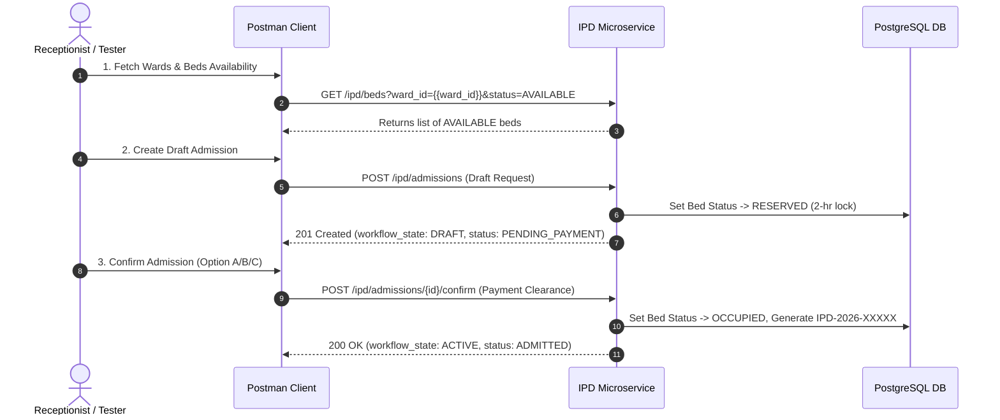

# Postman Testing Guide: IPD Registration & Lodging Master Data APIs

This guide details how to import and execute test scenarios in **Postman** for the **Split-Stage IPD Registration Workflow** and **Lodging Master Data APIs (Floors, Blocks, Wards, Beds)**.

---

## 1. Quick Start & Postman Collection Import

1. Open Postman.
2. Click **Import** -> Select File.
3. Choose the file: [`postman/ipd_split_stage_registration_postman_collection.json`](file:///f:/LJB/ops-hms-ljb/postman/ipd_split_stage_registration_postman_collection.json).
4. Set collection environment variables or collection variables:

| Variable Name | Sample Value | Description |
| :--- | :--- | :--- |
| `base_url` | `http://localhost:3000/ipd` | Service Base URL. |
| `jwt_token` | `eyJhbGciOiJSUzI1Ni...` | Bearer JWT token. |
| `tenant_id` | `tenant-001` | Branch/Tenant UUID. |
| `patient_id` | `e302008e-5b12-421c-a111-9a99fcd23b89` | Target patient UUID. |
| `attending_doctor_id` | `b12d2bc4-f5ee-45df-98bd-674cd7bb0ecc` | Attending doctor UUID. |
| `department_id` | `dept-cardio-9988` | Department UUID. |
| `floor_id` | `11111111-2222-3333-4444-555555555555` | Floor UUID. |
| `block_id` | `22222222-3333-4444-5555-666666666666` | Block UUID. |
| `ward_id` | `902d2bc4-f5ee-45df-98bd-674cd7bb0eef` | Ward UUID. |
| `bed_id` | `a32d2bc4-f5ee-45df-98bd-674cd7bb0eee` | Bed UUID (must be `AVAILABLE`). |
| `admission_id` | `f8bb5a02-0eb1-4366-814c-0763ba4f2b74` | Draft admission ID returned by Step 1. |

---

## 2. Test Execution Sequence



---

## 3. Detailed Endpoint Specs for Postman

---

### Step 1: Draft Admission Creation (Bed Reservation)

Pre-registers a patient into IPD, validates resource availability, reserves the selected bed (`RESERVED` status for 2 hours), and sets the workflow state to `DRAFT` / `PENDING_PAYMENT`.

* **Method:** `POST`
* **URL:** `{{base_url}}/admissions`
* **Headers:**
  - `Content-Type`: `application/json`
  - `Authorization`: `Bearer {{jwt_token}}`
  - `x-tenant-id`: `{{tenant_id}}`

#### Field Matrix

| Field | Type | Mandatory? | Description |
| :--- | :--- | :--- | :--- |
| `patient_id` | `UUID` | **Mandatory** | Patient UUID. |
| `attending_doctor_id` | `UUID` | **Mandatory** | Doctor UUID. |
| `ward_id` | `UUID` | **Mandatory** | Target ward UUID. |
| `bed_id` | `UUID` | **Mandatory** | Target bed UUID (`AVAILABLE`). |
| `admission_reason` | `String` | **Mandatory** | Clinical reason. |
| `visit_type` | `String` | Optional | `"IPD"`. |
| `department_id` | `UUID` | Optional | Department UUID. |
| `floor_id` | `UUID` | Optional | Floor UUID. |
| `block_id` | `UUID` | Optional | Block UUID. |
| `admission_type` | `String` | Optional | `ELECTIVE` (default), `EMERGENCY`, `TRANSFER`. |
| `was_referred` | `Boolean` | Optional | Set `true` if referred. |
| `referral_details` | `Object` | Optional | Mandatory if `was_referred` is `true`. |
| `notes` | `String` | Optional | Reception notes. |

#### Postman Raw JSON Body
```json
{
  "patient_id": "{{patient_id}}",
  "visit_type": "IPD",
  "attending_doctor_id": "{{attending_doctor_id}}",
  "department_id": "{{department_id}}",
  "admission_date": "2026-04-20",
  "floor_id": "{{floor_id}}",
  "block_id": "{{block_id}}",
  "ward_id": "{{ward_id}}",
  "bed_id": "{{bed_id}}",
  "admission_reason": "Acute Myocardial Infarction - Inpatient Monitoring",
  "admission_type": "ELECTIVE",
  "was_referred": true,
  "referral_details": {
    "referred_by_doctor": "Dr. Sarah Connor",
    "referral_source": "City Clinic & Diagnostics",
    "notes": "Patient transferred for specialized cardiac care"
  },
  "notes": "Window bed requested by attendant"
}
```

#### Expected Postman Response (`201 Created`)
```json
{
  "success": true,
  "code": 201,
  "data": {
    "admission_id": "f8bb5a02-0eb1-4366-814c-0763ba4f2b74",
    "workflow_state": "DRAFT",
    "admission_status": "PENDING_PAYMENT",
    "bed_id": "a32d2bc4-f5ee-45df-98bd-674cd7bb0eee",
    "bed_status": "RESERVED",
    "reserved_until": "2026-08-01T12:00:00Z"
  }
}
```

---

### Step 2: Admission Confirmations (3 Financial Pathways)

* **Method:** `POST`
* **URL:** `{{base_url}}/admissions/{{admission_id}}/confirm`

#### Option A: Immediate Payment (Cash / Card / UPI)

##### Postman Body
```json
{
  "payment_workflow": "IMMEDIATE",
  "payment_details": {
    "method": "UPI",
    "amount": "15000.00",
    "transaction_reference": "TXN987654321",
    "receipt_notes": "Advance deposit paid via GPay"
  }
}
```

##### Expected Response (`200 OK`)
```json
{
  "success": true,
  "code": 200,
  "data": {
    "admission_id": "f8bb5a02-0eb1-4366-814c-0763ba4f2b74",
    "admission_number": "IPD-2026-00384",
    "workflow_state": "ACTIVE",
    "admission_status": "ADMITTED",
    "bed_status": "OCCUPIED",
    "confirmed_at": "2026-08-01T10:15:00Z",
    "receipt_id": "RCPT-2026-11234",
    "approving_staff_id": null
  }
}
```

---

#### Option B: Pay Later (Corporate / Emergency Credit)

##### Postman Body
```json
{
  "payment_workflow": "PAY_LATER",
  "pay_later_details": {
    "reason": "Emergency surgery - post-operative settlement approved",
    "due_date": "2026-08-15",
    "remarks": "Approved corporate credit alignment"
  }
}
```

##### Expected Response (`200 OK`)
```json
{
  "success": true,
  "code": 200,
  "data": {
    "admission_id": "f8bb5a02-0eb1-4366-814c-0763ba4f2b74",
    "admission_number": "IPD-2026-00385",
    "workflow_state": "ACTIVE",
    "admission_status": "ADMITTED",
    "bed_status": "OCCUPIED",
    "confirmed_at": "2026-08-01T10:16:30Z",
    "receipt_id": null,
    "approving_staff_id": "user-uuid-extracted-from-jwt"
  }
}
```

---

#### Option C: Insurance / TPA Pre-Authorization

##### Postman Body
```json
{
  "payment_workflow": "INSURANCE",
  "insurance_details": {
    "insurance_provider": "Star Health Insurance",
    "policy_number": "POL-88776655",
    "member_id": "MEM-12345-A",
    "policy_holder": "Amit Kumar",
    "relationship": "SELF",
    "coverage_type": "CASHLESS",
    "pre_auth_number": "AUTH-2026-9988",
    "claim_reference": "CLM-2026-5544",
    "copayment": 10.0,
    "approved_amount": "125000.00",
    "remarks": "Laparoscopic treatment package pre-authorized"
  }
}
```

##### Expected Response (`200 OK`)
```json
{
  "success": true,
  "code": 200,
  "data": {
    "admission_id": "f8bb5a02-0eb1-4366-814c-0763ba4f2b74",
    "admission_number": "IPD-2026-00386",
    "workflow_state": "ACTIVE",
    "admission_status": "ADMITTED",
    "bed_status": "OCCUPIED",
    "confirmed_at": "2026-08-01T10:20:00Z",
    "receipt_id": null,
    "approving_staff_id": null
  }
}
```

---

### Step 3: Draft Admission Cancellation

Cancels draft registration and instantly releases bed lock back to `AVAILABLE`.

* **Method:** `POST`
* **URL:** `{{base_url}}/admissions/{{admission_id}}/cancel`

##### Postman Body
```json
{
  "reason": "Patient opted for outpatient treatment elsewhere"
}
```

##### Expected Response (`200 OK`)
```json
{
  "success": true,
  "data": {
    "admission_id": "f8bb5a02-0eb1-4366-814c-0763ba4f2b74",
    "workflow_state": "CANCELLED",
    "admission_status": "CANCELLED",
    "bed_status": "AVAILABLE"
  }
}
```

---

## 4. Lodging Master Data Postman Requests

| Request Name | Method | Path | Query Params | Key Body Fields |
| :--- | :--- | :--- | :--- | :--- |
| **List Floors** | `GET` | `/ipd/floors` | None | None |
| **List Blocks** | `GET` | `/ipd/blocks` | `floor_id` (Optional) | None |
| **Create Block** | `POST` | `/ipd/blocks` | None | `floor_id` (Mandatory), `name` (Mandatory), `code` (Mandatory) |
| **List Wards** | `GET` | `/ipd/wards` | `floor_id`, `block_id`, `ward_type`, `is_active`, `page`, `page_size` | None |
| **List Beds** | `GET` | `/ipd/beds` | `ward_id`, `status`, `bed_type`, `page`, `page_size` | None |
| **Create Bed** | `POST` | `/ipd/beds` | None | `ward_id` (Mandatory), `bed_number` (Mandatory), `bed_type` (Mandatory) |
| **Bed Availability** | `GET` | `/ipd/beds/availability` | `ward_id` (Optional) | None |
