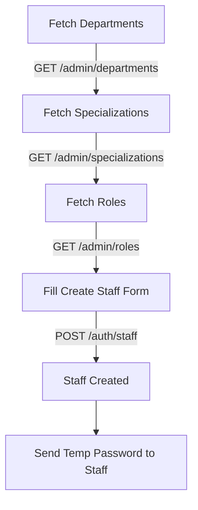
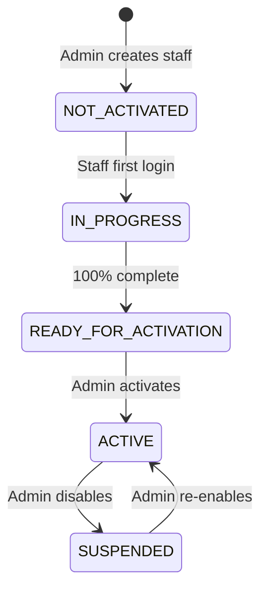
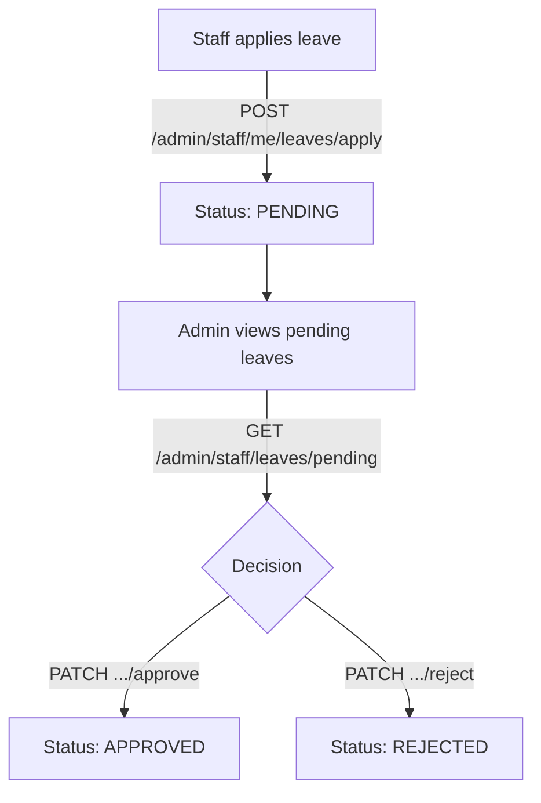

# HMS — Auth & Admin API Guide (Frontend Developer Reference)

> **Audience**: Frontend engineers integrating with the HMS backend.
> This document covers every flow, endpoint, request body, response body, and edge case you will encounter when building the Auth and Admin UI.

---

## Table of Contents

1. [Global Conventions](#1-global-conventions)
2. [Authentication Flows (Auth Service)](#2-authentication-flows)
   - 2.1 Standard Login
   - 2.2 First-Time Login (Password Challenge)
   - 2.3 SYSTEM_ADMINISTRATOR Login with MFA
   - 2.4 Token Refresh
   - 2.5 Logout
   - 2.6 My Profile (GET /auth/me)
   - 2.7 Change Password
   - 2.8 Admin Reset Password
3. [Staff Management (Auth Service)](#3-staff-management)
   - 3.1 Creating a Staff Member (Full Flow)
   - 3.2 List Staff
   - 3.3 Update Staff Status (Enable / Disable)
   - 3.4 Update Staff Profile
4. [HRMS — Self-Onboarding (Auth Service)](#4-hrms-self-onboarding)
   - 4.1 Schedule
   - 4.2 On-Call
   - 4.3 Payroll
   - 4.4 Bank Account
   - 4.5 Tax Profile
   - 4.6 Documents (Compliance)
   - 4.7 Onboarding Progress
   - 4.8 Activate Staff (Admin)
   - 4.9 Blocked Staff Queue
   - 4.10 Pending Verification Queue
5. [Organization & Tenant Switching (Auth Service)](#5-organization--tenant-switching)
   - 5.1 List Tenants
   - 5.2 Active Tenant
   - 5.3 Send Switch OTP
   - 5.4 Verify Switch OTP
6. [Admin Dashboard & Staff (Admin Service)](#6-admin-dashboard--staff)
   - 6.1 Dashboard Summary
   - 6.2 List Staff (Admin View)
   - 6.3 Update Doctor Consultation Fee
   - 6.4 Promote / Change Staff Role
   - 6.5 Custom Staff Permissions
7. [Roles & Permissions (Admin Service)](#7-roles--permissions)
8. [Departments & Specializations (Admin Service)](#8-departments--specializations)
9. [Leave Management (Admin Service)](#9-leave-management)
   - 9.1 Self-Service Leave (Any Staff)
   - 9.2 Admin Leave Approval Flow
10. [Wards, Units & Beds (Admin Service)](#10-wards-units--beds)
11. [Audit Logs (Admin Service)](#11-audit-logs)
12. [Error Reference](#12-error-reference)
13. [Role Reference](#13-role-reference)

---

## 1. Global Conventions

### Base URLs
Both services sit behind different API Gateway stages:

| Service | Base Path |
|---------|----------|
| Auth | `https://<api-id>.execute-api.ap-south-1.amazonaws.com/<stage>` |
| Admin | `https://<api-id>.execute-api.ap-south-1.amazonaws.com/<stage>` |

> Use environment variables `VITE_AUTH_BASE_URL` and `VITE_ADMIN_BASE_URL` to configure these.

### Authorization Header
Every **protected** endpoint requires:
```
Authorization: Bearer <access_token>
```

Public endpoints (login, refresh, new-password) do **not** require a header.

### Token Types

| Token | Use |
|-------|-----|
| `access_token` | All protected API calls (short-lived, ~1 hour) |
| `refresh_token` | Token refresh only — `POST /auth/refresh` |
| `id_token` | Identity claims (for decoding role/email client-side), **never** send as `Authorization` header to API |
| `session_id` | Returned on MFA login — store alongside tokens for admin session validation |

### Universal Response Envelope

All responses follow this shape:

```json
// Success
{
  "success": true,
  "data": { ... },
  "message": "Optional success message"
}

// Error
{
  "success": false,
  "code": 403,
  "message": "Permission denied: STF-002 required."
}
```

### Pagination
Paginated endpoints accept:
```
?page=1&page_size=20
```
And return:
```json
{
  "items": [...],
  "total": 150,
  "page": 1,
  "page_size": 20,
  "total_pages": 8
}
```

---

## 2. Authentication Flows

### 2.1 Standard Login

> Works for all roles **except** `SYSTEM_ADMINISTRATOR` (which always requires MFA).

```
POST /auth/login
```

**Request body:**
```json
{
  "username": "doctor@hospital.com",
  "password": "MyPass@2024",
  "device_info": "Chrome 120 / Windows 11"
}
```

`username` accepts three formats:
- Email address: `doctor@hospital.com`
- 10-digit Indian phone: `9876543210` (auto-normalised to `+919876543210`)
- Employee ID: `DOC-001`

**Success response (200):**
```json
{
  "success": true,
  "data": {
    "tokens": {
      "access_token": "eyJ...",
      "refresh_token": "eyJ...",
      "id_token": "eyJ...",
      "token_type": "Bearer",
      "expires_in": 3600
    },
    "user": {
      "user_id": "8b7f50c4-fa3a-4aef-ab27-f42b7fb0e54f",
      "employee_id": "DOC-00123",
      "full_name": "Dr. Arjun Mehta",
      "email": "arjun@hospital.com",
      "phone": "+919876543210",
      "role": "DOCTOR",
      "role_category": "MEDICAL",
      "tenant_id": "46fc39d8-7c4e-4704-9430-f82d6dcfa34c",
      "department_id": "dept-uuid",
      "department_name": "Cardiology",
      "specialization_id": "spec-uuid",
      "specialization_name": "Cardiologist",
      "registration_number": "MCI/2019/12345",
      "qualification": "MBBS, MD",
      "experience_years": 7,
      "profile_photo": null,
      "is_active": true,
      "login_enabled": true,
      "gender": "MALE",
      "date_of_birth": "1988-03-15",
      "last_login_at": "2025-06-09T10:22:00Z",
      "joining_date": "2021-01-15",
      "created_at": "2021-01-14T09:00:00Z"
    },
    "permissions": ["staff:view", "staff:edit", "bed:view"],
    "session_id": ""
  },
  "message": "Login successful"
}
```

**Failure scenarios:**

| Scenario | HTTP | Message |
|----------|------|---------|
| Wrong password | 401 | `Authentication failed` |
| Account disabled | 403 | `Account disabled. Contact admin.` |
| Rate limit (too many attempts) | 429 | `Too many requests` |
| Invalid phone format | 400 | `Invalid phone number — expected 10-digit Indian...` |

---

### 2.2 First-Time Login (Password Challenge)

When staff log in for the **first time** (after admin creates their account), Cognito returns a challenge.

**Step 1** — `POST /auth/login` returns:
```json
{
  "success": true,
  "data": {
    "challenge": "NEW_PASSWORD_REQUIRED",
    "session": "AYABe..."
  },
  "message": "New password required"
}
```

> Store the `session` string — it expires in 3 minutes.

**Step 2** — Submit new password:
```
POST /auth/new-password
```
```json
{
  "username": "doctor@hospital.com",
  "session": "AYABe...",
  "new_password": "NewSecure@2024"
}
```

Password rules: minimum 8 characters, must contain uppercase, lowercase, digit, and special character.

**Success response (200):**
Same as a standard login response — tokens + user + permissions are all returned immediately, no need to log in again.

---

### 2.3 SYSTEM_ADMINISTRATOR Login with MFA

The `SYSTEM_ADMINISTRATOR` role always goes through a two-step MFA flow.

**Step 1** — `POST /auth/login` → server returns challenge:
```json
{
  "success": true,
  "data": {
    "challenge": "MFA_OTP_REQUIRED",
    "username": "SYS-ADMIN01"
  },
  "message": "MFA OTP required"
}
```
An SMS OTP is sent to the admin's registered phone.

**Step 2** — Submit OTP:
```
POST /auth/login/mfa/verify
```
```json
{
  "username": "SYS-ADMIN01",
  "otp": "483921",
  "device_info": "Chrome 120 / Windows 11"
}
```

**Success response (200):**
Same as standard login — tokens + user + `session_id` (non-empty for SYSTEM_ADMINISTRATOR):
```json
{
  "data": {
    "tokens": { ... },
    "user": { "role": "SYSTEM_ADMINISTRATOR", ... },
    "permissions": [...],
    "session_id": "sess-uuid-1234"
  }
}
```

> **Important**: Store the `session_id` returned here. If your token ever gets rejected with `Session invalidated`, the admin has logged in from another device and this session was terminated.

**Failure scenarios:**

| Scenario | HTTP | Message |
|----------|------|---------|
| Wrong OTP | 401 | `Invalid OTP` |
| OTP expired (>5 min) | 401 | `OTP expired` |
| Too many wrong attempts | 403 | `OTP blocked after N attempts` |

---

### 2.4 Token Refresh

Call this before the `access_token` expires (at ~50 min to be safe).

```
POST /auth/refresh
```
```json
{
  "refresh_token": "eyJ..."
}
```

**Success response:**
```json
{
  "data": {
    "tokens": {
      "access_token": "eyJ...",
      "refresh_token": "eyJ...",
      "id_token": "eyJ...",
      "token_type": "Bearer",
      "expires_in": 3600
    }
  }
}
```

If the refresh token is expired/revoked, you get `401 — Session expired`. Redirect the user to login.

---

### 2.5 Logout

```
POST /auth/logout
Authorization: Bearer <access_token>
```
```json
{
  "access_token": "eyJ..."
}
```

This calls Cognito's `GlobalSignOut` — all sessions for this user are invalidated on Cognito's side.

**Success:**
```json
{ "success": true, "message": "Logged out successfully" }
```

---

### 2.6 My Profile

```
GET /auth/me
Authorization: Bearer <access_token>
```

**Response:**
```json
{
  "data": {
    "user": { ...StaffProfileResponse... },
    "permissions": ["staff:view", "bed:view"],
    "onboarding": { ... },
    "completion": { ... },
    "activation_validation": { ... },
    "schedule": { ... },
    "oncall": { ... },
    "payroll": { ... },
    "bank_accounts": [...],
    "tax_profile": { ... },
    "documents": [...],
    "training": [...],
    "sessions": [...],
    "meta": {
      "onboarding_ready": true,
      "can_activate": false,
      "profile_completion_percentage": 72
    }
  }
}
```

> Use this as your **dashboard loader**. It contains all the user's data in one call. Cache it and update selectively.

---

### 2.7 Change Password (Self-Service)

```
POST /auth/change-password
Authorization: Bearer <access_token>
```
```json
{
  "old_password": "OldPass@2024",
  "new_password": "NewSecure@2025"
}
```

**Success:**
```json
{ "data": { "message": "Password changed successfully" } }
```

---

### 2.8 Admin Reset Password (Force-Reset Another User)

Only roles with `system:users:manage` permission can call this.

```
POST /auth/reset-password
Authorization: Bearer <access_token>
```
```json
{
  "phone": "+919876543210",
  "new_password": "TempReset@2024"
}
```

**Success:**
```json
{
  "data": {
    "message": "Password reset successfully",
    "reset_by": "<admin-user-id>"
  }
}
```

---

## 3. Staff Management

### 3.1 Creating a Staff Member (Full Flow)

Creating a staff member involves cross-module data from the Admin service:



**Step 1: Fetch reference data from Admin service**

```
GET /admin/departments
Authorization: Bearer <access_token>
```
Response:
```json
{
  "data": {
    "items": [
      { "department_id": "dept-uuid", "department_name": "Cardiology", "is_active": true },
      { "department_id": "dept-uuid-2", "department_name": "Neurology", "is_active": true }
    ],
    "total": 12
  }
}
```

```
GET /admin/specializations
Authorization: Bearer <access_token>
```
Response:
```json
{
  "data": {
    "items": [
      { "specialization_id": "spec-uuid", "specialization_name": "Cardiologist" }
    ],
    "total": 8
  }
}
```

```
GET /admin/roles?active_only=true
Authorization: Bearer <access_token>
```
Response:
```json
{
  "data": {
    "items": [
      { "role_id": "DOC-001", "role_name": "DOCTOR", "role_category": "MEDICAL", "is_active": true },
      { "role_id": "NRS-001", "role_name": "NURSE", "role_category": "MEDICAL", "is_active": true }
    ],
    "total": 35
  }
}
```

**Step 2: Create the staff member**

```
POST /auth/staff
Authorization: Bearer <access_token>
```

> Only roles: `HOSPITAL_ADMIN`, `HR_MANAGER`, `SYSTEM_ADMINISTRATOR`, `OPERATIONS_MANAGER` can call this.

**Request body:**
```json
{
  "full_name": "Dr. Priya Sharma",
  "email": "priya.sharma@hospital.com",
  "phone": "9123456789",
  "role": "DOCTOR",
  "department_id": "dept-uuid",
  "specialization_id": "spec-uuid",
  "registration_number": "MCI/2022/98765",
  "qualification": "MBBS, MS (Ortho)",
  "experience_years": 4,
  "joining_date": "2025-07-01",
  "gender": "FEMALE",
  "date_of_birth": "1990-05-20"
}
```

**Field rules:**
- `role` — must be one of the valid role strings (see [Role Reference](#13-role-reference))
- `phone` — 10-digit Indian or 12-digit with country code
- `gender` — `MALE`, `FEMALE`, `OTHER`, `PREFER_NOT_TO_SAY`
- `date_of_birth` — staff must be 18-80 years old
- `department_id` / `specialization_id` — optional, use IDs from step 1
- `registration_number` — required for doctors (MCI number)

**Success response (201):**
```json
{
  "data": {
    "user_id": "new-user-uuid",
    "employee_id": "DOC-00456",
    "email": "priya.sharma@hospital.com",
    "role": "DOCTOR",
    "onboarding_status": "NOT_ACTIVATED",
    "temp_password": "Temp@78923",
    "message": "Staff record created and Cognito credentials provisioned. Transmit the temporary password to the staff member securely..."
  }
}
```

> **Critical**: The `temp_password` is shown **only once**. Copy it and send it to the staff member via secure channel (WhatsApp, email, SMS). They will be required to change it on first login.

**Failure scenarios:**

| Scenario | HTTP | Message |
|----------|------|---------|
| Email already registered | 409 | `Email already in use` |
| Invalid role string | 400 | `Invalid role 'XYZ'. Must be one of: ...` |
| Age under 18 | 400 | `Staff member must be at least 18 years old` |
| Missing permission | 403 | `Permission denied: staff:create required` |

---

### 3.2 List Staff

```
GET /auth/staff?role=DOCTOR&is_active=true&page=1&page_size=20
Authorization: Bearer <access_token>
```

**Query parameters:**

| Param | Type | Description |
|-------|------|-------------|
| `role` | string | Filter by role name (e.g. `DOCTOR`) |
| `is_active` | boolean | `true` / `false` |
| `page` | int | Page number (default: 1) |
| `page_size` | int | Results per page (default: 20) |

**Response:**
```json
{
  "data": {
    "items": [
      {
        "user_id": "uuid",
        "employee_id": "DOC-00123",
        "full_name": "Dr. Arjun Mehta",
        "email": "arjun@hospital.com",
        "role": "DOCTOR",
        "role_category": "MEDICAL",
        "department_name": "Cardiology",
        "is_active": true,
        "login_enabled": true,
        "onboarding_status": "ACTIVE",
        "last_login_at": "2025-06-09T10:22:00Z",
        "created_at": "2021-01-14T09:00:00Z"
      }
    ],
    "total": 45,
    "page": 1,
    "page_size": 20
  }
}
```

> **Tip**: The Admin service also has `GET /admin/staff` which includes richer filtering (search by name/email, leave summary). Prefer `GET /admin/staff` for admin dashboards.

---

### 3.3 Update Staff Status (Enable / Disable)

```
PATCH /auth/staff/{user_id}/status
Authorization: Bearer <access_token>
```
```json
{
  "action": "disable",
  "reason": "Resigned effective 2025-06-30"
}
```

`action` must be exactly `"enable"` or `"disable"`.

**Success:**
```json
{ "data": { "message": "Staff account disabled successfully" } }
```

---

### 3.4 Update Staff Profile

```
PATCH /auth/staff/{user_id}/profile
Authorization: Bearer <access_token>
```

All fields are optional — send only what you want to update:
```json
{
  "full_name": "Dr. Arjun Kumar Mehta",
  "phone": "9988776655",
  "department_id": "new-dept-uuid",
  "specialization_id": "new-spec-uuid",
  "qualification": "MBBS, MD, DM",
  "experience_years": 9,
  "bio": "Senior Cardiologist with 9 years of interventional experience.",
  "gender": "MALE",
  "date_of_birth": "1988-03-15"
}
```

At least one field must be present. Empty body returns `400 — At least one field must be provided for update`.

---

## 4. HRMS — Self-Onboarding

After first login, staff complete a self-onboarding flow tracked by `completion_percentage` in `/auth/me`. The flow is:



The completion checklist:
1. Schedule configured
2. Payroll configured
3. Bank account added
4. Tax profile added
5. Mandatory documents uploaded and **verified** by compliance officer
6. Mandatory training completed

---

### 4.1 Schedule

```
GET /hrms/staff/{user_id}/schedule
PUT /hrms/staff/{user_id}/schedule
Authorization: Bearer <access_token>
```

**PUT request body:**
```json
{
  "primary_shift_type": "MORNING",
  "duty_start_time": "08:00",
  "duty_end_time": "16:00",
  "weekly_hours": 40.0,
  "active_days": ["MON", "TUE", "WED", "THU", "FRI"],
  "is_rotating": false,
  "rotation_cycle_days": null,
  "notes": "Prefers early start"
}
```

Valid `primary_shift_type`: `MORNING`, `EVENING`, `NIGHT`, `ROTATING`
Valid `active_days`: `MON`, `TUE`, `WED`, `THU`, `FRI`, `SAT`, `SUN`

> If `is_rotating = true`, `rotation_cycle_days` is required.

**GET response:**
```json
{
  "data": {
    "id": "sched-uuid",
    "user_id": "user-uuid",
    "tenant_id": "tenant-uuid",
    "primary_shift_type": "MORNING",
    "duty_start_time": "08:00",
    "duty_end_time": "16:00",
    "weekly_hours": 40.0,
    "active_days": ["MON", "TUE", "WED", "THU", "FRI"],
    "is_rotating": false,
    "rotation_cycle_days": null,
    "notes": null,
    "created_at": "2025-06-01T10:00:00Z",
    "updated_at": "2025-06-01T10:00:00Z"
  }
}
```

---

### 4.2 On-Call

```
GET /hrms/staff/{user_id}/oncall
PUT /hrms/staff/{user_id}/oncall
Authorization: Bearer <access_token>
```

**PUT request body:**
```json
{
  "on_call_enabled": true,
  "on_call_frequency": "WEEKENDS_ONLY",
  "emergency_contact_number": "+919876543210",
  "escalation_contact": "+919123456789",
  "notes": "Available after 10 PM only on Saturdays"
}
```

Valid `on_call_frequency`: `WEEKENDS_ONLY`, `DAILY`, `ROTATIONAL`, `EMERGENCY_ONLY`
> `on_call_frequency` is required when `on_call_enabled = true`.

---

### 4.3 Payroll

```
GET /hrms/staff/{user_id}/payroll
PUT /hrms/staff/{user_id}/payroll
Authorization: Bearer <access_token>
```

**PUT request body:**
```json
{
  "payment_cycle": "MONTHLY",
  "currency": "INR",
  "annual_base_salary": 1800000.00,
  "annual_bonus": 200000.00,
  "effective_from": "2025-07-01"
}
```

Valid `payment_cycle`: `MONTHLY`, `BIWEEKLY`, `WEEKLY`

**GET response:**
```json
{
  "data": {
    "id": "pay-uuid",
    "user_id": "user-uuid",
    "payment_cycle": "MONTHLY",
    "currency": "INR",
    "annual_base_salary": 1800000.0,
    "annual_bonus": 200000.0,
    "estimated_monthly_payout": 166666.67,
    "effective_from": "2025-07-01",
    "created_at": "...",
    "updated_at": "..."
  }
}
```

---

### 4.4 Bank Account

```
GET /hrms/staff/{user_id}/bank-accounts
POST /hrms/staff/{user_id}/bank-accounts
Authorization: Bearer <access_token>
```

**POST request body:**
```json
{
  "account_holder_name": "Priya Sharma",
  "bank_name": "HDFC Bank",
  "branch_name": "Koramangala",
  "account_number": "50100123456789",
  "ifsc_code": "HDFC0001234",
  "is_primary": true
}
```

`ifsc_code` — must match `^[A-Z]{4}0[A-Z0-9]{6}$` (e.g. `HDFC0000123`).

**GET response (list):**
```json
{
  "data": [
    {
      "id": "bank-uuid",
      "account_holder_name": "Priya Sharma",
      "bank_name": "HDFC Bank",
      "branch_name": "Koramangala",
      "account_number_masked": "****6789",
      "ifsc_code": "HDFC0001234",
      "is_primary": true,
      "created_at": "..."
    }
  ]
}
```

> Account numbers are masked in responses. Only last 4 digits shown.

---

### 4.5 Tax Profile

```
GET /hrms/staff/{user_id}/tax-profile
PUT /hrms/staff/{user_id}/tax-profile
Authorization: Bearer <access_token>
```

**PUT request body:**
```json
{
  "pan_number": "ABCDE1234F",
  "tax_regime": "NEW",
  "pf_opted": true
}
```

- `pan_number` — must match `^[A-Z]{5}[0-9]{4}[A-Z]$`
- `tax_regime` — `OLD` or `NEW`

---

### 4.6 Documents (Compliance)

Staff submit document details (not files). A compliance officer then verifies or rejects.

```
GET /hrms/staff/{user_id}/documents
POST /hrms/staff/{user_id}/documents
Authorization: Bearer <access_token>
```

**POST request body:**
```json
{
  "document_type": "MEDICAL_LICENSE",
  "document_name": "MCI Registration Certificate",
  "document_id_number": "MCI/2022/98765",
  "expiry_date": "2027-12-31"
}
```

**GET response:**
```json
{
  "data": [
    {
      "id": "doc-uuid",
      "document_type": "MEDICAL_LICENSE",
      "document_name": "MCI Registration Certificate",
      "document_id_number": "MCI/2022/98765",
      "verification_status": "PENDING",
      "expiry_date": "2027-12-31",
      "uploaded_by": "user-uuid",
      "verified_by": null,
      "verified_at": null,
      "rejection_reason": null
    }
  ]
}
```

`verification_status` values: `PENDING`, `VERIFIED`, `REJECTED`, `MISSING`

**Compliance Officer — Verify:**
```
POST /hrms/documents/{doc_id}/verify
Authorization: Bearer <access_token>
```
(No request body needed.)

**Compliance Officer — Reject:**
```
POST /hrms/documents/{doc_id}/reject
Authorization: Bearer <access_token>
```
```json
{
  "rejection_reason": "Document number does not match MCI registry"
}
```

**View pending verification queue:**
```
GET /hrms/compliance/pending-verifications?page=1&page_size=20
Authorization: Bearer <access_token>
```

---

### 4.7 Onboarding Progress

```
GET /hrms/staff/{user_id}/onboarding
Authorization: Bearer <access_token>
```

**Response:**
```json
{
  "data": {
    "id": "onb-uuid",
    "user_id": "user-uuid",
    "current_step": 3,
    "completion_percentage": 65,
    "onboarding_status": "IN_PROGRESS",
    "completed_steps": [1, 2, 3],
    "next_action": "Upload mandatory documents",
    "activation_blocked": true,
    "blocking_reasons": ["Mandatory documents not uploaded", "Tax profile missing"]
  }
}
```

**Full onboarding dashboard (admin view):**
```
GET /hrms/staff/{user_id}/full-onboarding
Authorization: Bearer <access_token>
```
Returns a combined object with schedule, payroll, documents, training, onboarding progress, and activation check in one call.

---

### 4.8 Activate Staff (Admin)

Once `completion_percentage` reaches 100% and all required documents are verified:

```
POST /hrms/staff/{user_id}/activate
Authorization: Bearer <access_token>
```
```json
{
  "activation_notes": "All documents verified. Account activated."
}
```

**Success response:**
```json
{
  "data": {
    "user_id": "user-uuid",
    "is_active": true,
    "onboarding_status": "ACTIVE",
    "message": "Staff activated successfully"
  }
}
```

**Blocked activation scenario:** If not fully ready:
```json
{
  "success": false,
  "code": 400,
  "message": "Cannot activate: Mandatory documents not verified; Tax profile missing"
}
```

To check activation readiness before calling activate, use `GET /hrms/staff/{user_id}/onboarding` and check `activation_blocked` and `blocking_reasons`.

---

### 4.9 Blocked Staff Queue

```
GET /hrms/staff/blocked?page=1&page_size=20
Authorization: Bearer <access_token>
```

Shows staff who cannot be activated yet:
```json
{
  "data": {
    "items": [
      {
        "user_id": "user-uuid",
        "employee_id": "DOC-00456",
        "full_name": "Dr. Priya Sharma",
        "role": "DOCTOR",
        "onboarding_status": "IN_PROGRESS",
        "completion_percentage": 65,
        "blocking_reasons": ["Medical license not uploaded"]
      }
    ],
    "total": 3
  }
}
```

---

### 4.10 Pending Activation Queue

```
GET /hrms/staff/pending-activation?page=1&page_size=20
Authorization: Bearer <access_token>
```

Staff who have completed all steps (`READY_FOR_ACTIVATION`) and are waiting for an admin to hit the activate button.

---

## 5. Organization & Tenant Switching

These endpoints are for `SYSTEM_ADMINISTRATOR` only — branch users get `403` on all of them.

### 5.1 List Tenants

```
GET /organization/tenants
Authorization: Bearer <access_token>
```

**Response:**
```json
{
  "data": {
    "tenants": [
      {
        "branch_id": "branch-uuid-1",
        "branch_name": "LJB Main Hospital",
        "branch_code": "LJB-001",
        "is_active": true
      },
      {
        "branch_id": "branch-uuid-2",
        "branch_name": "LJB North Wing",
        "branch_code": "LJB-002",
        "is_active": true
      }
    ]
  }
}
```

---

### 5.2 Active Tenant

```
GET /organization/active-tenant
Authorization: Bearer <access_token>
```

Returns which branch the current session is scoped to.

---

### 5.3 Send Switch OTP

```
POST /organization/switch-tenant/send-otp
Authorization: Bearer <access_token>
```
```json
{
  "target_branch_id": "branch-uuid-2"
}
```

OTP is sent via SMS to the admin's registered phone.

**Success:**
```json
{ "data": { "message": "OTP sent to registered phone" } }
```

---

### 5.4 Verify Switch OTP

```
POST /organization/switch-tenant/verify
Authorization: Bearer <access_token>
```
```json
{
  "target_branch_id": "branch-uuid-2",
  "otp": "192847"
}
```

**Success:**
```json
{
  "data": {
    "active_branch_id": "branch-uuid-2",
    "active_branch_name": "LJB North Wing",
    "message": "Branch switched successfully"
  }
}
```

After switching, all subsequent API calls are automatically scoped to the new branch — no need to change headers. The session's `active_branch_id` is updated server-side.

> **UI hint**: After a successful switch, reload the dashboard. Show a toast: `"Now viewing: LJB North Wing"`.

---

## 6. Admin Dashboard & Staff

### 6.1 Dashboard Summary

```
GET /admin/dashboard/summary
Authorization: Bearer <access_token>
```

**Requires**: `SYS-001` permission.

**Response:**
```json
{
  "data": {
    "total_staff": 85,
    "active_staff": 78,
    "inactive_staff": 7,
    "pending_leaves": 4,
    "total_beds": 200,
    "occupied_beds": 142,
    "available_beds": 58
  }
}
```

For a **full dashboard** with lab, pharmacy, and financial metrics:
```
GET /admin/dashboard/full
Authorization: Bearer <access_token>
```

---

### 6.2 List Staff (Admin View)

```
GET /admin/staff?role_id=DOC-001&is_active=true&search=Arjun&page=1&page_size=20
Authorization: Bearer <access_token>
```

**Requires**: `STF-002` permission.

**Query parameters:**

| Param | Description |
|-------|-------------|
| `role_id` | Filter by role ID (e.g. `DOC-001`) |
| `is_active` | `true` / `false` / omit (all) |
| `search` | ILIKE search on name, email, employee_id |
| `page` | Page number |
| `page_size` | Max 100 |

**Response:**
```json
{
  "data": {
    "items": [
      {
        "id": "user-uuid",
        "employee_id": "DOC-00123",
        "full_name": "Dr. Arjun Mehta",
        "email": "arjun@hospital.com",
        "role_name": "DOCTOR",
        "department_name": "Cardiology",
        "is_active": true,
        "onboarding_status": "ACTIVE",
        "consultation_fee": 500.00
      }
    ],
    "meta": {
      "total": 45,
      "page": 1,
      "page_size": 20,
      "total_pages": 3
    }
  }
}
```

**Staff with leave balances:**
```
GET /admin/staff/leaves/summary?year=2025&role_id=DOC-001&page=1&page_size=20
Authorization: Bearer <access_token>
```

---

### 6.3 Update Doctor Consultation Fee

```
PATCH /admin/staff/{user_id}/fee
Authorization: Bearer <access_token>
```

**Requires**: `HOSPITAL_ADMIN` role or super-admin.
Only works for `DOCTOR` and `EXTERNAL_DOCTOR` roles — other roles return `400`.

**Request body:**
```json
{
  "consultation_fee": 750.00
}
```

---

### 6.4 Promote / Change Staff Role

```
PATCH /admin/staff/{user_id}/role
Authorization: Bearer <access_token>
```

**Requires**: `HOSPITAL_ADMIN` role or super-admin.

> Use `GET /admin/roles?active_only=true` to populate the role dropdown first.

**Request body:**
```json
{
  "role_id": "NUR-001"
}
```

**Failure scenarios:**

| Scenario | HTTP | Message |
|----------|------|---------|
| Invalid role ID | 400 | `Role NUR-999 not found` |
| Inactive role | 400 | `Role NUR-001 is inactive` |
| Not admin | 403 | `Only ADM-001 or super-admin roles may perform this action` |
| User not found | 404 | `Staff member not found` |

---

### 6.5 Custom Staff Permissions

Grants a user extra permissions **on top of their role** — without changing the role. Useful for temporary privilege escalation.

**Get current custom permissions:**
```
GET /admin/staff/{user_id}/permissions
Authorization: Bearer <access_token>
```

**Response:**
```json
{
  "data": {
    "user_id": "user-uuid",
    "custom_permissions": [
      { "permission_id": "STF-001", "permission_name": "staff:create", "granted_at": "2025-06-10T08:00:00Z" },
      { "permission_id": "BED-001", "permission_name": "bed:view", "granted_at": "2025-06-10T08:00:00Z" }
    ]
  }
}
```

**Assign permissions:**
```
POST /admin/staff/{user_id}/permissions
Authorization: Bearer <access_token>
```
```json
{
  "permission_ids": ["STF-001", "STF-002", "BED-001"]
}
```

> Idempotent — re-sending already-assigned IDs is safe.

**Revoke permissions:**
```
DELETE /admin/staff/{user_id}/permissions
Authorization: Bearer <access_token>
```
```json
{
  "permission_ids": ["STF-001"]
}
```

**Success for both POST and DELETE:**
```json
{
  "data": {
    "user_id": "user-uuid",
    "custom_permissions": [ ...updated list... ]
  }
}
```

---

## 7. Roles & Permissions

### View all roles

```
GET /admin/roles?active_only=true&role_category=MEDICAL
Authorization: Bearer <access_token>
```

**Requires**: `SYS-001` permission.

| Query param | Description |
|------------|-------------|
| `active_only` | `true` (default) / `false` |
| `role_category` | `MEDICAL`, `ADMIN`, `FINANCIAL`, `PHARMACY`, `LAB`, `IT`, `EMERGENCY`, `EXTERNAL` |

**Response:**
```json
{
  "data": {
    "items": [
      {
        "role_id": "DOC-001",
        "role_name": "DOCTOR",
        "role_category": "MEDICAL",
        "is_active": true,
        "is_super_admin": false
      }
    ],
    "total": 8
  }
}
```

### View all permissions

```
GET /admin/permissions?module=staff
Authorization: Bearer <access_token>
```

**Response:**
```json
{
  "data": {
    "items": [
      { "permission_id": "STF-001", "permission_name": "staff:create", "module": "staff" },
      { "permission_id": "STF-002", "permission_name": "staff:view", "module": "staff" }
    ],
    "total": 25
  }
}
```

### Get permissions for a role

```
GET /admin/roles/{role_id}/permissions
Authorization: Bearer <access_token>
```

**Response:**
```json
{
  "data": {
    "role_id": "DOC-001",
    "role_name": "DOCTOR",
    "permissions": [
      { "permission_id": "STF-002", "permission_name": "staff:view" },
      { "permission_id": "BED-001", "permission_name": "bed:view" }
    ]
  }
}
```

### Assign permissions to a role

```
POST /admin/roles/{role_id}/permissions
Authorization: Bearer <access_token>
```
```json
{ "permission_ids": ["STF-001", "BED-001"] }
```

### Revoke a permission from a role

```
DELETE /admin/roles/{role_id}/permissions
Authorization: Bearer <access_token>
```
```json
{ "permission_id": "STF-001" }
```

---

## 8. Departments & Specializations

### Departments

```
GET /admin/departments?include_inactive=false
Authorization: Bearer <access_token>
```

> **Requires** `STF-002`. Also call this from the Create Staff form to populate the dropdown.

**Response:**
```json
{
  "data": {
    "items": [
      { "department_id": "dept-uuid", "department_name": "Cardiology", "is_active": true }
    ],
    "total": 12
  }
}
```

**Create department:**
```
POST /admin/departments
Authorization: Bearer <access_token>
```
```json
{ "department_name": "Oncology" }
```

**Update department:**
```
PATCH /admin/departments/{department_id}
Authorization: Bearer <access_token>
```
```json
{ "department_name": "Oncology & Haematology", "is_active": true }
```

### Specializations

```
GET /admin/specializations
POST /admin/specializations
PATCH /admin/specializations/{specialization_id}
Authorization: Bearer <access_token>
```

Same pattern as departments. Used in the Create Staff form dropdown.

---

## 9. Leave Management

### 9.1 Self-Service Leave (Any Staff)

All authenticated users can manage their own leaves.

**View my leaves:**
```
GET /admin/staff/me/leaves?page=1&page_size=20
Authorization: Bearer <access_token>
```

**View my leave balances:**
```
GET /admin/staff/me/leaves/balance?year=2025
Authorization: Bearer <access_token>
```
```json
{
  "data": {
    "year": 2025,
    "items": [
      { "leave_type": "CASUAL", "total_days": 12, "used_days": 3, "remaining_days": 9 },
      { "leave_type": "SICK", "total_days": 8, "used_days": 0, "remaining_days": 8 }
    ]
  }
}
```

**Apply for leave:**
```
POST /admin/staff/me/leaves/apply
Authorization: Bearer <access_token>
```
```json
{
  "leave_type": "CASUAL",
  "from_date": "2025-07-10",
  "to_date": "2025-07-12",
  "reason": "Family function"
}
```

**Failure scenarios:**

| Scenario | HTTP | Message |
|----------|------|---------|
| Overlapping leave | 409 | `Leave request overlaps with an existing pending or approved leave` |
| Insufficient balance | 409 | `Insufficient leave balance. Remaining: 2 day(s)` |
| Cross-year range | 400 | `Cross-year leave requests are not supported` |
| Balance not configured | 404 | `Leave balance is not configured for this leave type and year` |

**Cancel pending leave:**
```
DELETE /admin/staff/me/leaves/{leave_id}
Authorization: Bearer <access_token>
```

---

### 9.2 Admin Leave Approval Flow



**View pending leaves:**
```
GET /admin/staff/leaves/pending?leave_type=CASUAL&user_id=uuid&page=1&page_size=20
Authorization: Bearer <access_token>
```

**Approve:**
```
PATCH /admin/staff/leaves/{leave_id}/approve
Authorization: Bearer <access_token>
```
(No request body needed.)

**Reject:**
```
PATCH /admin/staff/leaves/{leave_id}/reject
Authorization: Bearer <access_token>
```
```json
{
  "reason": "Critical roster period — cannot approve"
}
```

**Success response (both):**
```json
{
  "data": {
    "id": "leave-uuid",
    "user_id": "user-uuid",
    "staff_name": "Dr. Arjun Mehta",
    "leave_type": "CASUAL",
    "from_date": "2025-07-10",
    "to_date": "2025-07-12",
    "days": 3,
    "status": "APPROVED",
    "approved_by": "admin-uuid",
    "approved_at": "2025-06-10T12:00:00Z"
  }
}
```

---

## 10. Wards, Units & Beds

### Wards

```
GET /admin/wards?floor=2&ward_type=ICU&include_inactive=false
POST /admin/wards
GET /admin/wards/{ward_id}
PATCH /admin/wards/{ward_id}
Authorization: Bearer <access_token>
```

**Create ward request body:**
```json
{
  "name": "ICU Block A",
  "ward_type": "ICU",
  "floor": "2",
  "capacity": 20,
  "work_area_id": "work-area-uuid"
}
```

**GET /admin/wards response:**
```json
{
  "data": {
    "items": [
      {
        "id": "ward-uuid",
        "name": "ICU Block A",
        "ward_type": "ICU",
        "floor": "2",
        "capacity": 20,
        "is_active": true,
        "beds_total": 20,
        "beds_occupied": 14,
        "beds_available": 6
      }
    ],
    "total": 5
  }
}
```

### Units (Sub-wards)

```
GET /admin/wards/{ward_id}/units
POST /admin/units
GET /admin/units?ward_id=uuid&is_active=true&page=0&size=10
Authorization: Bearer <access_token>
```

**Create unit request body:**
```json
{
  "ward_id": "ward-uuid",
  "name": "East Wing",
  "code": "EW-01",
  "description": "East side of ICU Block A",
  "capacity": 10
}
```

> Duplicate unit names within the same ward return `409 — Unit already exists in ward`.

### Beds

```
GET /admin/beds?ward_id=uuid&status=AVAILABLE&bed_type=GENERAL&floor=2&page=1&page_size=20
GET /admin/beds/summary
POST /admin/beds
GET /admin/beds/{bed_id}
PATCH /admin/beds/{bed_id}
PATCH /admin/beds/{bed_id}/status
Authorization: Bearer <access_token>
```

**Create bed request body:**
```json
{
  "ward_id": "ward-uuid",
  "bed_number": "A-101",
  "bed_type": "ICU",
  "floor": "2",
  "features": ["VENTILATOR", "OXYGEN", "MONITOR"]
}
```

Valid `bed_type`: `GENERAL`, `ICU`, `PRIVATE`, `SEMI_PRIVATE`, `MATERNITY`, `PAEDIATRIC`, `ISOLATION`

**Update bed status:**
```
PATCH /admin/beds/{bed_id}/status
```
```json
{
  "status": "MAINTENANCE",
  "reason": "Deep cleaning after discharge"
}
```

Valid `status`: `AVAILABLE`, `MAINTENANCE`, `CLOSED`
> `OCCUPIED` is **not** manually settable. It is managed by the admissions service.

**Beds summary response:**
```json
{
  "data": {
    "total_beds": 200,
    "occupied_beds": 142,
    "available_beds": 44,
    "maintenance_beds": 10,
    "closed_beds": 4,
    "occupancy_percentage": 71.0
  }
}
```

---

## 11. Audit Logs

```
GET /admin/audit-logs?user_id=uuid&action=staff.role.update&entity=staff_profile&from_dt=2025-06-01T00:00:00&to_dt=2025-06-10T23:59:59&page=1&page_size=50
Authorization: Bearer <access_token>
```

**Requires**: `AUD-001` permission.

**Response:**
```json
{
  "data": {
    "items": [
      {
        "id": "log-uuid",
        "user_id": "admin-uuid",
        "user_name": "Admin User",
        "user_email": "admin@hospital.com",
        "action": "staff.role.update",
        "entity": "staff_profile",
        "entity_id": "target-user-uuid",
        "role_id": "ADM-001",
        "status": "success",
        "ip_address": "103.21.45.10",
        "metadata": { "role_id": "NUR-001", "role_name": "NURSE" },
        "created_at": "2025-06-10T09:30:00Z"
      }
    ],
    "meta": { "total": 234, "page": 1, "page_size": 50, "total_pages": 5 }
  }
}
```

**Common `action` values to filter on:**

| Action | Meaning |
|--------|---------|
| `staff.role.update` | Role changed |
| `staff.fee.update` | Doctor fee changed |
| `staff.permissions.assign` | Custom permission granted |
| `staff.permissions.revoke` | Custom permission removed |
| `staff.leave.apply` | Staff applied for leave |
| `leave.approve` | Leave approved |
| `leave.reject` | Leave rejected |
| `bed.status_update` | Bed status toggled |
| `ward.create` | Ward created |
| `department.create` | Department created |

---

## 12. Error Reference

All errors follow this envelope:
```json
{
  "success": false,
  "code": <HTTP status>,
  "message": "<human-readable reason>"
}
```

| Code | Meaning | Common Causes |
|------|---------|---------------|
| `400` | Bad Request / Validation Error | Missing required fields, invalid format, business rule violation |
| `401` | Unauthorized | Missing/expired/invalid JWT, wrong session |
| `403` | Forbidden | Correct credentials but insufficient permissions for the action |
| `404` | Not Found | Resource (user, ward, leave, etc.) not found in DB |
| `409` | Conflict | Duplicate resource, leave overlap, inactive role |
| `429` | Too Many Requests | Rate limit hit on login or reset password |
| `500` | Internal Server Error | Unhandled backend exception — report to backend team |

---

## 13. Role Reference

| Role Name | Employee ID Prefix | Category |
|-----------|-------------------|----------|
| `DOCTOR` | `DOC` | MEDICAL |
| `NURSE` | `NRS` | MEDICAL |
| `HEAD_NURSE` | `HNR` | MEDICAL |
| `LAB_TECHNICIAN` | `LAB` | MEDICAL |
| `RADIOLOGIST` | `RAD` | MEDICAL |
| `PHARMACIST` | `PHM` | MEDICAL |
| `HOSPITAL_ADMIN` | `ADM` | ADMIN |
| `RECEPTIONIST` | `RCP` | ADMIN |
| `HR_MANAGER` | `HRM` | ADMIN |
| `OPERATIONS_MANAGER` | `OPS` | ADMIN |
| `WARD_STAFF` | `WRS` | ADMIN |
| `MEDICAL_RECORDS_OFFICER` | `MRO` | ADMIN |
| `QUALITY_COMPLIANCE_OFFICER` | `QCO` | ADMIN |
| `BILLING_EXECUTIVE` | `BIL` | FINANCIAL |
| `INSURANCE_COORDINATOR` | `INS` | FINANCIAL |
| `ACCOUNTANT` | `ACC` | FINANCIAL |
| `PHARMACY_MANAGER` | `PMG` | PHARMACY |
| `INVENTORY_MANAGER` | `INV` | PHARMACY |
| `STORE_KEEPER` | `SKP` | PHARMACY |
| `STORE_MANAGER` | `SMG` | PHARMACY |
| `LAB_ADMIN` | `LAD` | LAB |
| `SAMPLE_COLLECTOR` | `SMP` | LAB |
| `REPORT_VALIDATOR` | `RPV` | LAB |
| `RADIOLOGY_TECH` | `RDT` | LAB |
| `SYSTEM_ADMINISTRATOR` | `SYS` | IT |
| `DEVOPS_ENGINEER` | `DEV` | IT |
| `SUPPORT_ENGINEER` | `SUP` | IT |
| `AMBULANCE_DRIVER` | `AMB` | EMERGENCY |
| `EMERGENCY_STAFF` | `EMG` | EMERGENCY |
| `WARD_BOY` | `WRD` | EMERGENCY |
| `EXTERNAL_DOCTOR` | `EDC` | EXTERNAL |
| `INSURANCE_PROVIDER` | `EIP` | EXTERNAL |
| `GOVT_AUTHORITY` | `GOV` | EXTERNAL |
