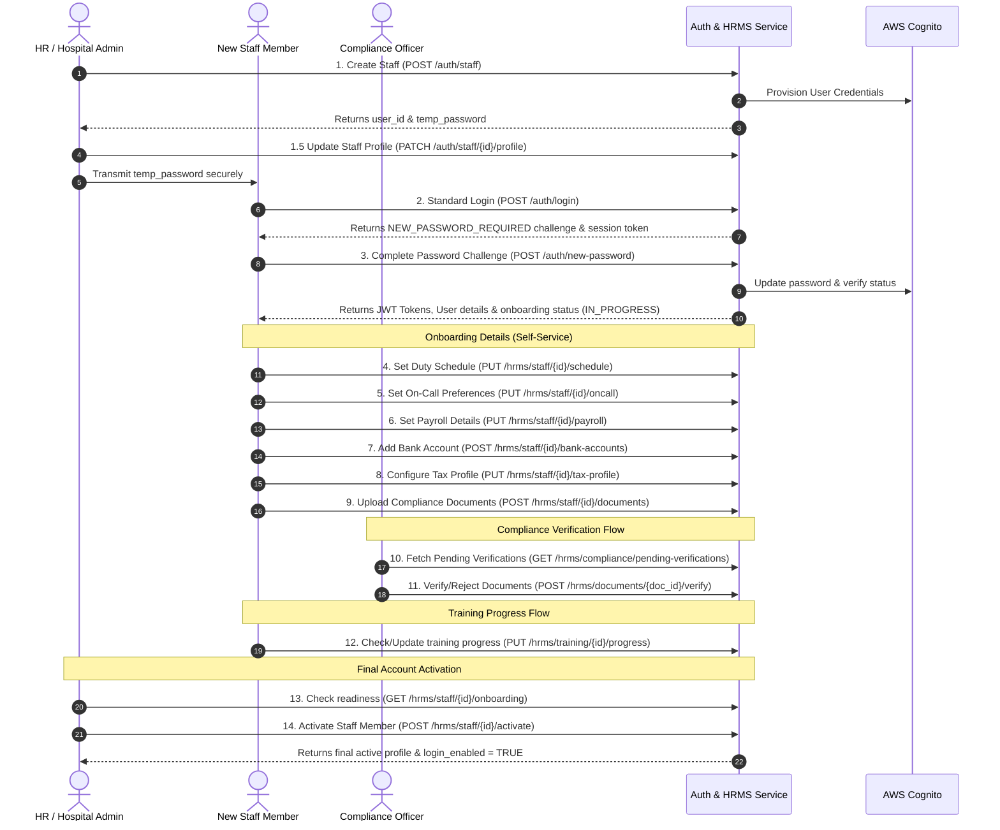

# HMS — Auth & HRMS Service API Documentation

This document covers all authentication, session management, staff administration, tenant switching, and step-by-step self-onboarding endpoints for the HMS **Auth & HRMS Service**.

---

## 1. Global Conventions

### Base URL
All requests are sent to the Auth Service API Gateway endpoint:
```
https://<api-id>.execute-api.ap-south-1.amazonaws.com/<stage>
```

### Authorization Header
Protected endpoints require a valid JWT Access Token passed in the `Authorization` header:
```http
Authorization: Bearer <access_token>
```
Public endpoints (such as `/auth/login`, `/auth/refresh`, and `/auth/new-password`) do **not** require this header.

### Universal Response Envelope
All API responses follow a unified envelope format:

**Success Response (200 / 201):**
```json
{
  "success": true,
  "data": { ... },
  "message": "Optional descriptive success message"
}
```

**Error Response (4xx / 5xx):**
```json
{
  "success": false,
  "code": 403,
  "message": "Permission denied: STF-002 required."
}
```

---

## 2. Step-by-Step Staff Onboarding Flow

The staff onboarding flow is a sequential process starting from an administrator creating the initial account, to the staff member setting their password, completing onboarding profiles, and final admin activation.

### Flow Diagram



---

### Step 1: Admin Initiates Staff Record Creation
An administrator (with `staff:create` permission) registers the new staff member. The backend creates a database profile and provisions the Cognito credentials.

* **Endpoint:** `POST /auth/staff`
* **Headers:** `Authorization: Bearer <access_token>`
* **Request Body:**
```json
{
  "full_name": "Dr. Priya Sharma",
  "email": "priya.sharma@arovita.com",
  "phone": "9123456789",
  "role": "DOCTOR",
  "department_id": "8b7f50c4-fa3a-4aef-ab27-f42b7fb0e54f",
  "specialization_id": "46fc39d8-7c4e-4704-9430-f82d6dcfa34c",
  "registration_number": "MCI/2022/98765",
  "qualification": "MBBS, MS (Ortho)",
  "experience_years": 4,
  "joining_date": "2025-07-01",
  "gender": "FEMALE",
  "date_of_birth": "1990-05-20"
}
```

* **Success Response (201 Created):**
```json
{
  "success": true,
  "data": {
    "user_id": "902d2bc4-f5ee-45df-98bd-674cd7bb0eef",
    "employee_id": "DOC-00456",
    "email": "priya.sharma@arovita.com",
    "role": "DOCTOR",
    "onboarding_status": "NOT_ACTIVATED",
    "temp_password": "Temp@Password2026",
    "message": "Staff record created and Cognito credentials provisioned. Transmit the temporary password to the staff member securely. They must log in and complete self-onboarding before the account is activated."
  }
}
```
> [!IMPORTANT]
> The `temp_password` is returned only once in this response payload.

---

### Step 1.5: Update Staff Profile
Updates specific onboarding fields for a staff member (such as `gender`, `date_of_birth`, `department_id`, `specialization_id`, `qualification`, `experience_years`, etc.).

* **Endpoint:** `PATCH /auth/staff/{user_id}/profile`
* **Headers:** `Authorization: Bearer <access_token>`
* **Request Body:**
```json
{
  "full_name": "Dr. Priya Sharma",
  "phone": "+919123456789",
  "department_id": "8b7f50c4-fa3a-4aef-ab27-f42b7fb0e54f",
  "specialization_id": "46fc39d8-7c4e-4704-9430-f82d6dcfa34c",
  "qualification": "MBBS, MD",
  "experience_years": 6,
  "gender": "FEMALE",
  "date_of_birth": "1992-04-18"
}
```

* **Success Response (200 OK):**
```json
{
  "success": true,
  "data": {
    "user_id": "902d2bc4-f5ee-45df-98bd-674cd7bb0eef",
    "full_name": "Dr. Priya Sharma",
    "email": "priya.sharma@arovita.com",
    "role": "DOCTOR",
    "gender": "FEMALE",
    "date_of_birth": "1992-04-18"
  },
  "message": "Staff profile updated successfully"
}
```

---

### Step 2: Staff Performs First Login
The newly created staff member logs in using their email, phone number, or Employee ID and the temporary password.

* **Endpoint:** `POST /auth/login`
* **Request Body:**
```json
{
  "username": "priya.sharma@arovita.com",
  "password": "Temp@Password2026",
  "device_info": "Chrome 125 / macOS Sonoma"
}
```

* **Challenge Response (200 OK):**
```json
{
  "success": true,
  "data": {
    "challenge": "NEW_PASSWORD_REQUIRED",
    "session": "AYABe3491_session_identifier_token_..."
  },
  "message": "New password required"
}
```
> [!NOTE]
> The `session` string is a temporary token required for the challenge completion step.

---

### Step 3: Complete Password Challenge
The staff member submits their desired permanent password alongside the challenge session token.

* **Endpoint:** `POST /auth/new-password`
* **Request Body:**
```json
{
  "username": "priya.sharma@arovita.com",
  "session": "AYABe3491_session_identifier_token_...",
  "new_password": "SecurePassword@2026"
}
```

* **Success Response (200 OK):**
```json
{
  "success": true,
  "data": {
    "tokens": {
      "access_token": "eyJ...",
      "refresh_token": "eyJ...",
      "id_token": "eyJ...",
      "token_type": "Bearer",
      "expires_in": 3600
    },
    "user": {
      "user_id": "902d2bc4-f5ee-45df-98bd-674cd7bb0eef",
      "employee_id": "DOC-00456",
      "full_name": "Dr. Priya Sharma",
      "email": "priya.sharma@arovita.com",
      "phone": "+919123456789",
      "role": "DOCTOR",
      "role_category": "MEDICAL",
      "tenant_id": "a1b2c3d4-e5f6-7a8b-9c0d-1e2f3a4b5c6d",
      "department_id": "8b7f50c4-fa3a-4aef-ab27-f42b7fb0e54f",
      "department_name": "Orthopaedics",
      "specialization_id": "46fc39d8-7c4e-4704-9430-f82d6dcfa34c",
      "specialization_name": "Orthopaedic Surgeon",
      "registration_number": "MCI/2022/98765",
      "qualification": "MBBS, MS (Ortho)",
      "experience_years": 4,
      "is_active": true,
      "login_enabled": false,
      "gender": "FEMALE",
      "date_of_birth": "1990-05-20",
      "last_login_at": "2026-06-13T11:20:00Z",
      "joining_date": "2025-07-01",
      "created_at": "2026-06-13T11:15:00Z"
    },
    "permissions": ["staff:me:view", "staff:me:update"],
    "session_id": ""
  },
  "message": "Password set. You are now logged in."
}
```
The staff member's onboarding status changes to `IN_PROGRESS`.

---

### Step 4: Configure Work Schedule
The staff member configures their primary shift schedule.

* **Endpoint:** `PUT /hrms/staff/{user_id}/schedule`
* **Headers:** `Authorization: Bearer <access_token>`
* **Request Body:**
```json
{
  "primary_shift_type": "MORNING",
  "duty_start_time": "08:00",
  "duty_end_time": "16:00",
  "weekly_hours": 40.0,
  "active_days": ["MON", "TUE", "WED", "THU", "FRI"],
  "is_rotating": false,
  "rotation_cycle_days": null,
  "notes": "Prefer Morning shifts"
}
```

* **Success Response (200 OK):**
```json
{
  "success": true,
  "data": {
    "id": "c1f77d33-4dfd-4b8c-8ef8-bde88de6d4f9",
    "user_id": "902d2bc4-f5ee-45df-98bd-674cd7bb0eef",
    "tenant_id": "a1b2c3d4-e5f6-7a8b-9c0d-1e2f3a4b5c6d",
    "primary_shift_type": "MORNING",
    "duty_start_time": "08:00",
    "duty_end_time": "16:00",
    "weekly_hours": 40.0,
    "active_days": ["MON", "TUE", "WED", "THU", "FRI"],
    "is_rotating": false,
    "rotation_cycle_days": null,
    "notes": "Prefer Morning shifts",
    "created_at": "2026-06-13T11:22:00Z",
    "updated_at": "2026-06-13T11:22:00Z"
  }
}
```

---

### Step 5: Configure On-Call Preferences
Configures backup or emergency availability parameters.

* **Endpoint:** `PUT /hrms/staff/{user_id}/oncall`
* **Headers:** `Authorization: Bearer <access_token>`
* **Request Body:**
```json
{
  "on_call_enabled": true,
  "on_call_frequency": "ROTATIONAL",
  "emergency_contact_number": "+919876543210",
  "escalation_contact": "+919123456789",
  "notes": "Emergency escalation backup contact"
}
```

* **Success Response (200 OK):**
```json
{
  "success": true,
  "data": {
    "id": "e2f77d33-4dfd-4b8c-8ef8-bde88de6d4f9",
    "user_id": "902d2bc4-f5ee-45df-98bd-674cd7bb0eef",
    "tenant_id": "a1b2c3d4-e5f6-7a8b-9c0d-1e2f3a4b5c6d",
    "on_call_enabled": true,
    "on_call_frequency": "ROTATIONAL",
    "emergency_contact_number": "+919876543210",
    "escalation_contact": "+919123456789",
    "notes": "Emergency escalation backup contact",
    "created_at": "2026-06-13T11:24:00Z",
    "updated_at": "2026-06-13T11:24:00Z"
  }
}
```

---

### Step 6: Configure Payroll Details
Details parameters of contract compensation.

* **Endpoint:** `PUT /hrms/staff/{user_id}/payroll`
* **Headers:** `Authorization: Bearer <access_token>`
* **Request Body:**
```json
{
  "payment_cycle": "MONTHLY",
  "currency": "INR",
  "annual_base_salary": 1800000.00,
  "annual_bonus": 150000.00,
  "effective_from": "2025-07-01"
}
```

* **Success Response (200 OK):**
```json
{
  "success": true,
  "data": {
    "id": "d3f77d33-4dfd-4b8c-8ef8-bde88de6d4f9",
    "user_id": "902d2bc4-f5ee-45df-98bd-674cd7bb0eef",
    "payment_cycle": "MONTHLY",
    "currency": "INR",
    "annual_base_salary": 1800000.0,
    "annual_bonus": 150000.0,
    "estimated_monthly_payout": 150000.0,
    "effective_from": "2025-07-01",
    "created_at": "2026-06-13T11:25:00Z",
    "updated_at": "2026-06-13T11:25:00Z"
  }
}
```

---

### Step 7: Add Bank Account
Bank accounts hold salary disbursement paths.

* **Endpoint:** `POST /hrms/staff/{user_id}/bank-accounts`
* **Headers:** `Authorization: Bearer <access_token>`
* **Request Body:**
```json
{
  "account_holder_name": "Priya Sharma",
  "bank_name": "HDFC Bank",
  "branch_name": "Koramangala",
  "account_number": "50100123456789",
  "ifsc_code": "HDFC0000123",
  "is_primary": true
}
```

* **Success Response (201 Created):**
```json
{
  "success": true,
  "data": {
    "id": "f4f77d33-4dfd-4b8c-8ef8-bde88de6d4f9",
    "user_id": "902d2bc4-f5ee-45df-98bd-674cd7bb0eef",
    "tenant_id": "a1b2c3d4-e5f6-7a8b-9c0d-1e2f3a4b5c6d",
    "account_holder_name": "Priya Sharma",
    "bank_name": "HDFC Bank",
    "branch_name": "Koramangala",
    "account_number_masked": "**********6789",
    "ifsc_code": "HDFC0000123",
    "is_primary": true,
    "created_at": "2026-06-13T11:27:00Z",
    "updated_at": "2026-06-13T11:27:00Z"
  }
}
```
> [!NOTE]
> Bank account numbers are automatically masked in the API responses to display only the last four digits.

---

### Step 8: Configure Tax Profile
Saves state tax identities (PAN and regimes).

* **Endpoint:** `PUT /hrms/staff/{user_id}/tax-profile`
* **Headers:** `Authorization: Bearer <access_token>`
* **Request Body:**
```json
{
  "pan_number": "ABCDE1234F",
  "tax_regime": "NEW",
  "pf_opted": true
}
```

* **Success Response (200 OK):**
```json
{
  "success": true,
  "data": {
    "id": "a5f77d33-4dfd-4b8c-8ef8-bde88de6d4f9",
    "user_id": "902d2bc4-f5ee-45df-98bd-674cd7bb0eef",
    "tenant_id": "a1b2c3d4-e5f6-7a8b-9c0d-1e2f3a4b5c6d",
    "pan_number": "ABCDE1234F",
    "tax_regime": "NEW",
    "pf_opted": true,
    "created_at": "2026-06-13T11:29:00Z",
    "updated_at": "2026-06-13T11:29:00Z"
  }
}
```

---

### Step 9: Submit Compliance Document
New staff upload verification attributes. Files are uploaded separately to S3; only meta references are stored here.

* **Endpoint:** `POST /hrms/staff/{user_id}/documents`
* **Headers:** `Authorization: Bearer <access_token>`
* **Request Body:**
```json
{
  "document_type": "MEDICAL_LICENSE",
  "document_name": "MCI License Registration Certificate",
  "document_id_number": "MCI/2022/98765",
  "expiry_date": "2027-12-31"
}
```

* **Success Response (201 Created):**
```json
{
  "success": true,
  "data": {
    "id": "b6f77d33-4dfd-4b8c-8ef8-bde88de6d4f9",
    "user_id": "902d2bc4-f5ee-45df-98bd-674cd7bb0eef",
    "tenant_id": "a1b2c3d4-e5f6-7a8b-9c0d-1e2f3a4b5c6d",
    "document_type": "MEDICAL_LICENSE",
    "document_name": "MCI License Registration Certificate",
    "document_id_number": "MCI/2022/98765",
    "verification_status": "PENDING",
    "expiry_date": "2027-12-31",
    "uploaded_by": "902d2bc4-f5ee-45df-98bd-674cd7bb0eef",
    "verified_by": null,
    "verified_at": null,
    "rejection_reason": null,
    "created_at": "2026-06-13T11:31:00Z",
    "updated_at": "2026-06-13T11:31:00Z"
  }
}
```

---

### Step 10: Compliance Officer Reviews Pending Queue
Compliance officers query items waiting to be checked.

* **Endpoint:** `GET /hrms/compliance/pending-verifications`
* **Query Parameters:** `?page=1&page_size=20`
* **Headers:** `Authorization: Bearer <access_token>`

* **Success Response (200 OK):**
```json
{
  "success": true,
  "data": {
    "items": [
      {
        "document_id": "b6f77d33-4dfd-4b8c-8ef8-bde88de6d4f9",
        "user_id": "902d2bc4-f5ee-45df-98bd-674cd7bb0eef",
        "user_name": "Dr. Priya Sharma",
        "employee_id": "DOC-00456",
        "document_type": "MEDICAL_LICENSE",
        "document_name": "MCI License Registration Certificate",
        "uploaded_at": "2026-06-13T11:31:00Z",
        "expiry_date": "2027-12-31"
      }
    ],
    "total": 1,
    "page": 1,
    "page_size": 20
  }
}
```

---

### Step 11: Document Verification Decision
Compliance officers verify or reject the documents.

#### Path A: Verify Document
* **Endpoint:** `POST /hrms/documents/{doc_id}/verify`
* **Headers:** `Authorization: Bearer <access_token>`

* **Success Response (200 OK):**
```json
{
  "success": true,
  "data": {
    "id": "b6f77d33-4dfd-4b8c-8ef8-bde88de6d4f9",
    "verification_status": "VERIFIED",
    "verified_by": "00000000-0000-0000-0000-000000000001",
    "verified_at": "2026-06-13T11:35:00Z"
  },
  "message": "Document verified successfully"
}
```

#### Path B: Reject Document
* **Endpoint:** `POST /hrms/documents/{doc_id}/reject`
* **Headers:** `Authorization: Bearer <access_token>`
* **Request Body:**
```json
{
  "rejection_reason": "Licence expiry date does not match the uploaded physical copy scan."
}
```

* **Success Response (200 OK):**
```json
{
  "success": true,
  "data": {
    "id": "b6f77d33-4dfd-4b8c-8ef8-bde88de6d4f9",
    "verification_status": "REJECTED",
    "rejection_reason": "Licence expiry date does not match the uploaded physical copy scan."
  },
  "message": "Document rejected successfully"
}
```

---

### Step 12: Assign and Complete Training
Required orientation training modules must be logged.

#### Path A: Assign Training (Admin or System Initiated)
* **Endpoint:** `POST /hrms/staff/{user_id}/training`
* **Headers:** `Authorization: Bearer <access_token>`
* **Request Body:**
```json
{
  "training_type": "ORIENTATION",
  "training_name": "Hospital Safety Protocols & HIPAA Orientation",
  "expiry_date": "2027-06-30"
}
```

* **Success Response (201 Created):**
```json
{
  "success": true,
  "data": {
    "id": "d7f77d33-4dfd-4b8c-8ef8-bde88de6d4f9",
    "user_id": "902d2bc4-f5ee-45df-98bd-674cd7bb0eef",
    "training_type": "ORIENTATION",
    "training_name": "Hospital Safety Protocols & HIPAA Orientation",
    "completion_status": "NOT_STARTED",
    "completion_percentage": 0,
    "expiry_date": "2027-06-30",
    "created_at": "2026-06-13T11:38:00Z"
  }
}
```

#### Path B: Update Training Progress
* **Endpoint:** `PUT /hrms/training/{training_id}/progress`
* **Headers:** `Authorization: Bearer <access_token>`
* **Request Body:**
```json
{
  "completion_percentage": 100
}
```

* **Success Response (200 OK):**
```json
{
  "success": true,
  "data": {
    "id": "d7f77d33-4dfd-4b8c-8ef8-bde88de6d4f9",
    "completion_status": "COMPLETED",
    "completion_percentage": 100,
    "completed_at": "2026-06-13T11:42:00Z"
  }
}
```

---

### Step 13: Fetch Onboarding Status & Activation Validation
Admins review progress checkpoints before executing activation.

* **Endpoint:** `GET /hrms/staff/{user_id}/onboarding`
* **Headers:** `Authorization: Bearer <access_token>`

* **Success Response (200 OK):**
```json
{
  "success": true,
  "data": {
    "id": "e8f77d33-4dfd-4b8c-8ef8-bde88de6d4f9",
    "user_id": "902d2bc4-f5ee-45df-98bd-674cd7bb0eef",
    "current_step": 6,
    "completion_percentage": 100,
    "onboarding_status": "PENDING_VERIFICATION",
    "completed_steps": [1, 2, 3, 4, 5, 6],
    "next_action": "Admin Activation Required",
    "activation_blocked": false,
    "blocking_reasons": []
  }
}
```

---

### Step 14: Activate Onboarded Staff Member
Once all blocking criteria are resolved, the administrator changes the status to active, which enables standard login.

* **Endpoint:** `POST /hrms/staff/{user_id}/activate`
* **Headers:** `Authorization: Bearer <access_token>`
* **Request Body:**
```json
{
  "activation_notes": "All mandatory onboarding segments validated. Credentials authorized."
}
```

* **Success Response (200 OK):**
```json
{
  "success": true,
  "data": {
    "user_id": "902d2bc4-f5ee-45df-98bd-674cd7bb0eef",
    "is_active": true,
    "onboarding_status": "ACTIVE",
    "message": "Staff activated successfully"
  }
}
```

---

## 3. Core Authentication APIs

### Standard Login
Autodetects whether the `username` field contains an Email, Indian Phone number, or Employee ID.

* **Endpoint:** `POST /auth/login`
* **Request Body:**
```json
{
  "username": "priya.sharma@arovita.com",
  "password": "SecurePassword@2026",
  "device_info": "Chrome 125 / Windows 11"
}
```

* **Success Response (200 OK):**
```json
{
  "success": true,
  "data": {
    "tokens": {
      "access_token": "eyJ...",
      "refresh_token": "eyJ...",
      "id_token": "eyJ...",
      "token_type": "Bearer",
      "expires_in": 3600
    },
    "user": {
      "user_id": "902d2bc4-f5ee-45df-98bd-674cd7bb0eef",
      "employee_id": "DOC-00456",
      "full_name": "Dr. Priya Sharma",
      "email": "priya.sharma@arovita.com",
      "role": "DOCTOR",
      "is_active": true,
      "login_enabled": true
    },
    "permissions": ["staff:view", "bed:view", "leave:apply"],
    "session_id": ""
  }
}
```

---

### MFA Verification Login
Required for accounts containing administrative authority, such as `SYSTEM_ADMINISTRATOR`. Standard login for these users triggers a challenge returning `challenge: MFA_OTP_REQUIRED`.

* **Endpoint:** `POST /auth/login/mfa/verify`
* **Request Body:**
```json
{
  "username": "SYS-ADMIN01",
  "otp": "456123",
  "device_info": "Firefox / macOS Sonoma"
}
```

* **Success Response (200 OK):**
```json
{
  "success": true,
  "data": {
    "tokens": {
      "access_token": "eyJ...",
      "refresh_token": "eyJ...",
      "id_token": "eyJ...",
      "token_type": "Bearer",
      "expires_in": 3600
    },
    "user": {
      "user_id": "e2f77d33-4dfd-4b8c-8ef8-bde88de6d4f9",
      "employee_id": "SYS-00001",
      "role": "SYSTEM_ADMINISTRATOR",
      "is_active": true
    },
    "permissions": ["*"],
    "session_id": "session-uuid-987654"
  }
}
```

---

### Token Refresh
Refreshes credentials before token expiry.

* **Endpoint:** `POST /auth/refresh`
* **Request Body:**
```json
{
  "refresh_token": "eyJ_refresh_token_string..."
}
```

* **Success Response (200 OK):**
```json
{
  "success": true,
  "data": {
    "tokens": {
      "access_token": "eyJ...",
      "refresh_token": "eyJ...",
      "id_token": "eyJ...",
      "token_type": "Bearer",
      "expires_in": 3600
    }
  }
}
```

---

### Logout
Invalidates all sessions associated with the user sub on Cognito.

* **Endpoint:** `POST /auth/logout`
* **Headers:** `Authorization: Bearer <access_token>`
* **Request Body:**
```json
{
  "access_token": "eyJ_access_token_string..."
}
```

* **Success Response (200 OK):**
```json
{
  "success": true,
  "message": "Logged out successfully"
}
```

---

### Get My Profile
Provides the caller's session details and profile checklists in a single payload.

* **Endpoint:** `GET /auth/me`
* **Headers:** `Authorization: Bearer <access_token>`

* **Success Response (200 OK):**
```json
{
  "success": true,
  "data": {
    "user": {
      "user_id": "902d2bc4-f5ee-45df-98bd-674cd7bb0eef",
      "employee_id": "DOC-00456",
      "full_name": "Dr. Priya Sharma",
      "email": "priya.sharma@arovita.com",
      "role": "DOCTOR",
      "is_active": true
    },
    "permissions": ["staff:me:view", "staff:me:update"],
    "schedule": { ... },
    "payroll": { ... },
    "bank_accounts": [ ... ],
    "tax_profile": { ... },
    "documents": [ ... ],
    "training": [ ... ],
    "meta": {
      "onboarding_ready": true,
      "profile_completion_percentage": 100
    }
  }
}
```

---

### Change Password
Permits staff to change their own password.

* **Endpoint:** `POST /auth/change-password`
* **Headers:** `Authorization: Bearer <access_token>`
* **Request Body:**
```json
{
  "old_password": "SecurePassword@2026",
  "new_password": "NewSecurePassword@2026"
}
```

* **Success Response (200 OK):**
```json
{
  "success": true,
  "data": {
    "message": "Password changed successfully"
  }
}
```

---

### Admin Reset Password
Allows authorized administrative roles to trigger force password updates on staff members.

* **Endpoint:** `POST /auth/reset-password`
* **Headers:** `Authorization: Bearer <access_token>`
* **Request Body:**
```json
{
  "phone": "+919123456789",
  "new_password": "TempReset@Password2026"
}
```

* **Success Response (200 OK):**
```json
{
  "success": true,
  "data": {
    "message": "Password reset successfully",
    "reset_by": "00000000-0000-0000-0000-000000000001"
  }
}
```

---

## 4. Organization & Tenant Switching

For `SYSTEM_ADMINISTRATOR` accounts, this flow grants access to multiple branches without requiring separate accounts.

### List Tenants
Returns the list of branches accessible to the system administrator.

* **Endpoint:** `GET /organization/tenants`
* **Headers:** `Authorization: Bearer <access_token>`

* **Success Response (200 OK):**
```json
{
  "success": true,
  "data": {
    "tenants": [
      {
        "branch_id": "a1b2c3d4-e5f6-7a8b-9c0d-1e2f3a4b5c6d",
        "branch_name": "Arovita Main Hospital",
        "branch_code": "LJB-001",
        "is_active": true
      },
      {
        "branch_id": "22222222-2222-2222-2222-222222222222",
        "branch_name": "Arovita North Branch",
        "branch_code": "LJB-002",
        "is_active": true
      }
    ]
  }
}
```

---

### Send Switch OTP
Initiates tenant context changes by requesting an OTP.

* **Endpoint:** `POST /organization/switch-tenant/send-otp`
* **Headers:** `Authorization: Bearer <access_token>`
* **Request Body:**
```json
{
  "target_branch_id": "22222222-2222-2222-2222-222222222222"
}
```

* **Success Response (200 OK):**
```json
{
  "success": true,
  "data": {
    "message": "OTP sent to registered phone"
  }
}
```

---

### Verify Switch OTP
Verifies OTP and changes token focus to target tenant.

* **Endpoint:** `POST /organization/switch-tenant/verify`
* **Headers:** `Authorization: Bearer <access_token>`
* **Request Body:**
```json
{
  "target_branch_id": "22222222-2222-2222-2222-222222222222",
  "otp": "998877"
}
```

* **Success Response (200 OK):**
```json
{
  "success": true,
  "data": {
    "active_branch_id": "22222222-2222-2222-2222-222222222222",
    "active_branch_name": "Arovita North Branch",
    "message": "Branch switched successfully"
  }
}
```
All subsequent API operations are transparently scoped to the new tenant.
