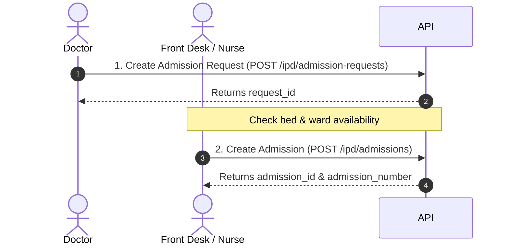
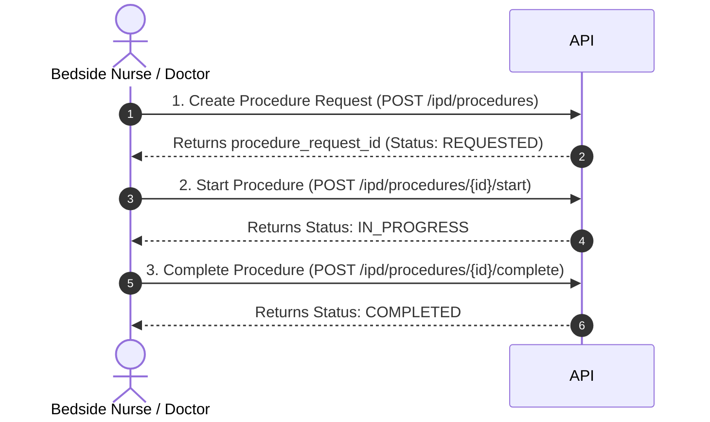
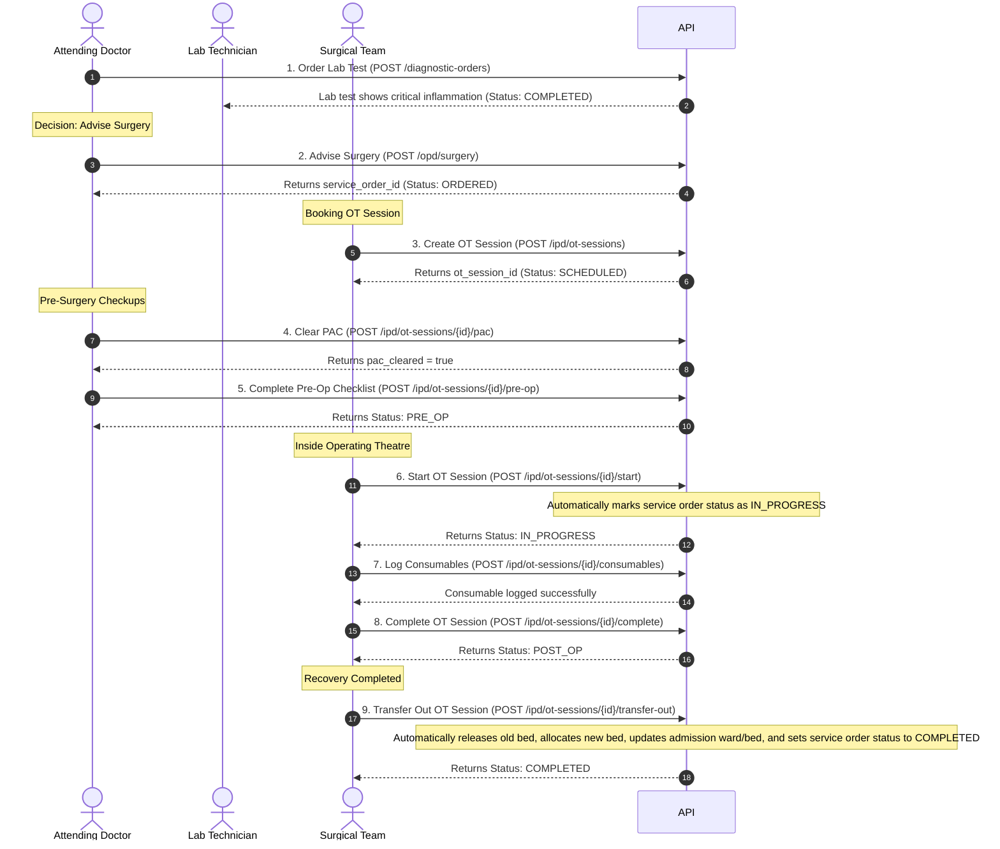

# HMS V2 Inpatient Clinical Workflows Integration Guide

> [!IMPORTANT]
> The OT / Surgery flow has been simplified and consolidated. Please refer to [unified_ot_surgery_flow.md](file:///c:/Users/saika/OneDrive/Desktop/Arovita/ops-hms-ljb/docs/unified_ot_surgery_flow.md) for the latest unified sequence and API quick reference.

This guide details the APIs, request schemas (mandatory/optional fields), response formats, and step-by-step API integration sequences for standard inpatient clinical workflows.


---

## 1. Core API Catalog

### 1.1 Admissions

#### A. Create Admission Request (from OPD/Emergency)
* **Endpoint**: `POST /ipd/admission-requests`
* **Purpose**: Treating doctor decides the patient requires inpatient care.
* **Request Body**:
```json
{
  "patient_id": "93643ddd-0d0d-491d-83d6-37f3bcde518d",       // Mandatory (UUID)
  "source_type": "OPD",                                      // Mandatory (Enum: OPD, EMERGENCY, REFERRAL)
  "source_reference": "opd-visit-uuid",                      // Mandatory (UUID/String)
  "request_reason": "Acute chest pain for inpatient monitor", // Mandatory (String)
  "admission_type": "EMERGENCY",                             // Mandatory (Enum: ROUTINE, EMERGENCY, ELECTIVE)
  "priority": "URGENT",                                      // Mandatory (Enum: ROUTINE, URGENT, EMERGENCY)
  "preferred_ward_id": "ward-uuid",                          // Optional (UUID)
  "preferred_bed_type": "ICU",                               // Optional (String)
  "notes": "Patient allergic to penicillin"                  // Optional (String)
}
```
* **Success Response (201 Created)**:
```json
{
  "success": true,
  "code": 201,
  "data": {
    "id": "admission-request-uuid",
    "patient_id": "93643ddd-0d0d-491d-83d6-37f3bcde518d",
    "status": "REQUESTED",
    "priority": "URGENT",
    "created_at": "2026-06-20T16:50:00Z"
  }
}
```

#### B. Create Admission (Formalizes Inpatient Care)
* **Endpoint**: `POST /ipd/admissions`
* **Purpose**: Front desk/nursing assigns a ward, bed, and attending doctor to check in the patient.
* **Request Body**:
```json
{
  "patient_id": "93643ddd-0d0d-491d-83d6-37f3bcde518d",       // Mandatory (UUID)
  "admission_request_id": "admission-request-uuid",          // Mandatory (UUID)
  "ward_id": "ward-uuid",                                    // Mandatory (UUID)
  "bed_id": "bed-uuid",                                      // Mandatory (UUID)
  "attending_doctor_id": "doctor-uuid",                      // Mandatory (UUID)
  "admission_type": "EMERGENCY",                             // Mandatory (Enum: ROUTINE, EMERGENCY, ELECTIVE)
  "admission_reason": "Formal admission for chest pain",     // Mandatory (String)
  "expected_discharge": "2026-06-22",                        // Optional (ISO Date YYYY-MM-DD)
  "notes": "Patient has latex allergy"                       // Optional (String)
}
```
* **Success Response (201 Created)**:
```json
{
  "success": true,
  "code": 201,
  "data": {
    "id": "admission-uuid",
    "admission_number": "ADM-2026-0001",
    "patient_id": "93643ddd-0d0d-491d-83d6-37f3bcde518d",
    "status": "ADMITTED",
    "ipd_status": "ADMITTED"
  }
}
```

---

### 1.2 Context-Aware Diagnostics (Lab / Radiology Orders)

#### Create Diagnostic Order
* **Endpoint**: `POST /diagnostic-orders`
* **Purpose**: Orders blood tests, scans, or imaging under a specific clinical context.
* **Request Body**:
```json
{
  "patient_id": "93643ddd-0d0d-491d-83d6-37f3bcde518d",       // Mandatory (UUID)
  "doctor_id": "doctor-uuid",                                // Mandatory (UUID)
  "order_type": "LAB",                                       // Mandatory (Enum: LAB, RADIOLOGY)
  "priority": "ROUTINE",                                     // Mandatory (Enum: ROUTINE, URGENT, STAT)
  "context_type": "IPD_ADMISSION",                           // Mandatory (Enum: OPD_VISIT, IPD_ADMISSION, SURGERY, PROCEDURE)
  "context_id": "admission-uuid",                            // Mandatory (UUID)
  "source_module": "IPD",                                    // Mandatory (Enum: OPD, IPD, OT, ICU, EMERGENCY)
  "encounter_type": "WARD_ROUND",                            // Mandatory (Enum: CONSULTATION, WARD_ROUND, SURGERY)
  "lab_items": [                                             // Mandatory (At least one test)
    {
      "test_id": "16a43dca-eb71-4b85-ab0a-3b984816cadf",     // Mandatory (UUID)
      "notes": "Perform renal functions test"                // Optional (String)
    }
  ],
  "clinical_notes": "Follow-up renal clearance monitoring"    // Optional (String)
}
```
* **Success Response (201 Created)**:
```json
{
  "success": true,
  "code": 201,
  "data": {
    "id": "diagnostic-order-uuid",
    "patient_id": "93643ddd-0d0d-491d-83d6-37f3bcde518d",
    "status": "PENDING",
    "version_no": 1
  }
}
```

---

### 1.3 Inpatient Bedside Procedures

Procedures represent low-risk, bedside actions (e.g., catheter insertion, dressing, minor drainage) that do not require an OR (Operating Room) or clinical escalation approval.

#### A. Create Procedure Request
* **Endpoint**: `POST /ipd/procedures`
* **Request Body**:
```json
{
  "admission_id": "admission-uuid",                          // Mandatory (UUID)
  "patient_id": "93643ddd-0d0d-491d-83d6-37f3bcde518d",       // Mandatory (UUID)
  "doctor_id": "doctor-uuid",                                // Mandatory (UUID)
  "procedure_id": "procedure-catalogue-uuid",                // Optional (UUID) - If provided, resolves name from master clinical catalogue
  "procedure_name": "Bedside Dressing and Drainage",         // Mandatory if procedure_id not provided (String) - Free-text fallback
  "notes": "Foley catheter insertion notes"                  // Optional (String)
}
```
* **Success Response (201 Created)**:
```json
{
  "success": true,
  "code": 201,
  "data": {
    "id": "procedure-request-uuid",
    "procedure_name": "Bedside Dressing and Drainage",
    "status": "REQUESTED"
  }
}
```

#### B. Start Procedure Request
* **Endpoint**: `POST /ipd/procedures/{procedure_id}/start`
* **Request Body**:
```json
{
  "doctor_id": "doctor-uuid"                                 // Mandatory (UUID)
}
```
* **Success Response (200 OK)**:
```json
{
  "success": true,
  "code": 200,
  "data": {
    "id": "procedure-request-uuid",
    "status": "IN_PROGRESS"
  }
}
```

#### C. Complete Procedure Request
* **Endpoint**: `POST /ipd/procedures/{procedure_id}/complete`
* **Request Body**:
```json
{
  "completed_by": "doctor-uuid",                             // Mandatory (UUID)
  "outcome": "Drainage successful",                          // Mandatory (String)
  "complications": "None"                                    // Optional (String)
}
```
* **Success Response (200 OK)**:
```json
{
  "success": true,
  "code": 200,
  "data": {
    "id": "procedure-request-uuid",
    "status": "COMPLETED",
    "outcome": "Drainage successful",
    "complications": "None"
  }
}
```

---

### 1.4 Clinical Escalations (ICU, Surgery, Referral, etc.)

Admitting a patient only means "requires inpatient care." Any critical change of care (e.g., ICU transfer, surgery decision) must pass through a **Clinical Escalation** approved by the responsible doctor.

#### A. Create Clinical Escalation
* **Endpoint**: `POST /ipd/clinical-escalations`
* **Request Body**:
```json
{
  "patient_id": "93643ddd-0d0d-491d-83d6-37f3bcde518d",       // Mandatory (UUID)
  "admission_id": "admission-uuid",                          // Mandatory (UUID)
  "doctor_id": "doctor-uuid",                                // Mandatory (UUID)
  "escalation_type": "SURGERY",                              // Mandatory (Enum: SURGERY, ICU, PROCEDURE, REFERRAL, DIAGNOSTICS, DISCHARGE)
  "clinical_reason": "Acute appendicitis with perforation",  // Mandatory (String)
  "notes": "Fast track to OT Room 2",                        // Optional (String)
  "source_type": "IPD"                                       // Mandatory (Enum: IPD, OPD, EMERGENCY)
}
```
* **Success Response (201 Created)**:
```json
{
  "success": true,
  "code": 201,
  "data": {
    "id": "escalation-uuid",
    "escalation_type": "SURGERY",
    "status": "REQUESTED"
  }
}
```

#### B. Approve Clinical Escalation
* **Endpoint**: `POST /ipd/clinical-escalations/{escalation_id}/approve`
* **Request Body**:
```json
{
  "approved_by": "doctor-uuid",                              // Mandatory (UUID)
  "notes": "Approved by Lead Surgeon"                         // Optional (String)
}
```
* **Success Response (200 OK)**:
```json
{
  "success": true,
  "code": 200,
  "data": {
    "id": "escalation-uuid",
    "status": "APPROVED",
    "notes": "Approved by Lead Surgeon"
  }
}
```

---

### 1.5 Surgeries (Operating Theater Workflows)

Surgeries follow a unified clinical advice and session management process (no separate duplicate surgery requests).

#### A. Advise Surgery / Create Surgery Advice
* **Endpoint**: `POST /opd/surgery`
* **Request Body**:
```json
{
  "patient_id": "93643ddd-0d0d-491d-83d6-37f3bcde518d",       // Mandatory (UUID)
  "service_name": "Laparoscopic Appendectomy",               // Mandatory (String)
  "order_type": "SURGERY",                                   // Mandatory (Enum: SURGERY, PROCEDURE)
  "priority": "HIGH",                                        // Mandatory (Enum: ROUTINE, URGENT, EMERGENCY)
  "admission_id": "admission-uuid",                          // Optional (UUID) - Binds to inpatient admission
  "notes": "Advised for acute appendicitis."                 // Optional (String)
}
```
* **Success Response (201 Created)**:
```json
{
  "success": true,
  "code": 201,
  "data": {
    "id": "service-order-uuid",
    "service_name": "Laparoscopic Appendectomy",
    "status": "ORDERED"
  }
}
```

#### B. Cancel OT Session
* **Endpoint**: `POST /ipd/ot-sessions/{id}/cancel`
* **Request Body**:
```json
{
  "reason": "Patient developed high fever prior to surgery."  // Mandatory (String)
}
```
* **Success Response (200 OK)**:
```json
{
  "success": true,
  "code": 200,
  "data": {
    "id": "ot-session-uuid",
    "status": "CANCELLED",
    "cancellation_reason": "Patient developed high fever prior to surgery."
  }
}
```
* **Note**: Reverts the linked service order status back to `ORDERED` to preserve the advice for later scheduling.

#### C. Log OT Consumables
* **Endpoint**: `POST /ipd/ot-sessions/{id}/consumables`
* **Request Body**:
```json
{
  "item_name": "Suture Thread",                              // Mandatory (String)
  "quantity": 2.0,                                           // Mandatory (Numeric)
  "batch_no": "B-99812",                                     // Optional (String)
  "implant_serial": "SN-10298"                               // Optional (String)
}
```
* **Success Response (201 Created)**:
```json
{
  "success": true,
  "code": 201,
  "data": {
    "id": "consumable-uuid",
    "ot_session_id": "ot-session-uuid",
    "item_name": "Suture Thread (Batch: B-99812, Serial: SN-10298)",
    "quantity": 2.0
  }
}
```
* **Note**: Can only be called while the OT session status is `IN_PROGRESS`.


---

### 1.6 OT Sessions (Operating Theatre)

OT sessions coordinate actual patient surgery sessions inside the Operating Theatre.

#### A. Create OT Session (Schedules OT)
* **Endpoint**: `POST /ipd/ot-sessions`
* **Request Body**:
```json
{
  "service_order_id": "service-order-uuid",                  // Mandatory (UUID)
  "admission_id": "admission-uuid",                          // Optional (UUID)
  "patient_id": "93643ddd-0d0d-491d-83d6-37f3bcde518d",       // Mandatory (UUID)
  "surgeon_id": "doctor-uuid",                                // Mandatory (UUID)
  "anaesthetist_id": "anaesthetist-uuid",                     // Optional (UUID)
  "scrub_nurse_id": "nurse-uuid",                             // Optional (UUID)
  "ot_number": "OT-101",                                      // Optional (String)
  "ot_room_id": "OT-ROOM-1",                                  // Optional (String)
  "scheduled_start": "2026-06-20T17:00:00Z",                  // Optional (ISO Timestamp)
  "scheduled_end": "2026-06-20T19:00:00Z"                    // Optional (ISO Timestamp)
}
```
* **Success Response (201 Created)**:
```json
{
  "success": true,
  "code": 201,
  "data": {
    "id": "ot-session-uuid",
    "status": "SCHEDULED"
  }
}
```

#### B. Clear PAC (Pre-Anesthetic Checkup)
* **Endpoint**: `POST /ipd/ot-sessions/{id}/pac`
* **Business Logic**: PAC clearance will be blocked (returning a 400 Bad Request error) if there are unsigned mandatory consents for the corresponding OT session, unless an emergency override is requested and approved.
* **Standard Request Body**:
```json
{
  "notes": "PAC cleared. Patient fit for general anesthesia." // Optional (String)
}
```
* **Emergency Override Request Body**:
```json
{
  "notes": "Emergency override PAC clearance without all consents signed.", // Optional (String)
  "emergency_override": true, // Mandatory for override (Boolean)
  "override_reason": "Life-threatening internal hemorrhage requiring immediate surgery", // Mandatory for override (String)
  "primary_doctor_id": "ffeee23d-9a29-454f-9f46-192f1aaab285", // Mandatory for override (UUID)
  "second_doctor_id": "e4d2a1b9-38cd-47ef-a152-78ab9c0d12e4" // Mandatory for override (UUID)
}
```
* **Success Response (200 OK)**:
```json
{
  "success": true,
  "code": 200,
  "data": {
    "id": "ot-session-uuid",
    "pac_cleared": true,
    "emergency_override": true,
    "override_reason": "Life-threatening internal hemorrhage requiring immediate surgery",
    "override_primary_doctor_id": "ffeee23d-9a29-454f-9f46-192f1aaab285",
    "override_second_doctor_id": "e4d2a1b9-38cd-47ef-a152-78ab9c0d12e4"
  }
}
```

#### C. Complete Pre-Op Checklist
* **Endpoint**: `POST /ipd/ot-sessions/{id}/pre-op`
* **Request Body**:
```json
{
  "pre_op_checklist": {                                       // Mandatory (JSON Dict)
    "consent": true,
    "fasting": true,
    "site_marked": true
  }
}
```
* **Success Response (200 OK)**:
```json
{
  "success": true,
  "code": 200,
  "data": {
    "id": "ot-session-uuid",
    "status": "PRE_OP"
  }
}
```

#### D. Start OT Session (Starts Surgery)
* **Endpoint**: `POST /ipd/ot-sessions/{id}/start`
* **Request Body**: `{}`
* **Success Response (200 OK)**:
```json
{
  "success": true,
  "code": 200,
  "data": {
    "id": "ot-session-uuid",
    "status": "IN_PROGRESS"
  }
}
```

#### E. Complete OT Session (Moves to Recovery)
* **Endpoint**: `POST /ipd/ot-sessions/{id}/complete`
* **Request Body**:
```json
{
  "intra_op_notes": "Procedure completed successfully.",       // Optional (String)
  "anaesthesia_type": "GENERAL"                               // Mandatory (Enum: GENERAL, SPINAL, EPIDURAL, LOCAL, REGIONAL, SEDATION)
}
```
* **Success Response (200 OK)**:
```json
{
  "success": true,
  "code": 200,
  "data": {
    "id": "ot-session-uuid",
    "status": "POST_OP"
  }
}
```

#### F. Transfer Out OT Session (Recovery Completed)
* **Endpoint**: `POST /ipd/ot-sessions/{id}/transfer-out`
* **Purpose**: Updates bed/ward on admission to target location and releases old bed.
* **Request Body**:
```json
{
  "transferred_to_ward_id": "ward-uuid",                      // Mandatory (UUID)
  "transferred_to_bed_id": "bed-uuid",                        // Mandatory (UUID)
  "recovery_notes": "Patient awake and alert"                 // Optional (String)
}
```
* **Success Response (200 OK)**:
```json
{
  "success": true,
  "code": 200,
  "data": {
    "id": "ot-session-uuid",
    "status": "COMPLETED"
  }
}
```

#### G. Get OT Session Details
* **Endpoint**: `GET /ipd/ot-sessions/{id}`
* **Success Response (200 OK)**:
```json
{
  "success": true,
  "code": 200,
  "data": {
    "id": "ot-session-uuid",
    "status": "COMPLETED",
    "pac_cleared": true,
    "anaesthesia_type": "GENERAL",
    "intra_op_notes": "Procedure completed successfully."
  }
}
```

---

### 1.7 Patient Clinical Timeline

* **Endpoint**: `GET /ipd/patients/{patient_id}/timeline`
* **Purpose**: Retrieves a unified audit trail of all patient clinical events.
* **Success Response (200 OK)**:
```json
{
  "success": true,
  "code": 200,
  "data": {
    "patient_name": "E2E Simulation Patient",
    "uhid": "PAT-2026-0001",
    "events": [
      {
        "timestamp": "2026-06-18T13:24:51.066650+05:30",
        "event_type": "ADMISSION",
        "event_name": "IPD Admission",
        "details": "Admitted under Admission No: ADM-TEST-999. Reason: None",
        "doctor_name": "Kiran Patil",
        "doctor_id": "doctor-uuid-1"
      },
      {
        "timestamp": "2026-06-20T10:41:40.622767+05:30",
        "event_type": "DIAGNOSTICS",
        "event_name": "Diagnostics Ordered: LAB",
        "details": "Status: PENDING. Notes: Updated notes for order",
        "doctor_name": "Dr. Arjun Mehta",
        "doctor_id": "doctor-uuid-2"
      },
      {
        "timestamp": "2026-06-20T16:51:04.317089+05:30",
        "event_type": "ESCALATION_SURGERY",
        "event_name": "Clinical Escalation: SURGERY",
        "details": "Status: COMPLETED. Reason: Emergency surgery for acute appendicitis escalation",
        "doctor_name": "Dr. Arjun Mehta",
        "doctor_id": "doctor-uuid-2"
      }
    ]
  }
}
```

---

## 2. Step-by-Step Scenario Sequences

### Scenario A: OPD Decision is ADMIT


### Scenario B: Admission to Bedside Procedure


### Scenario C: Admission -> Lab Test -> OT Surgery


