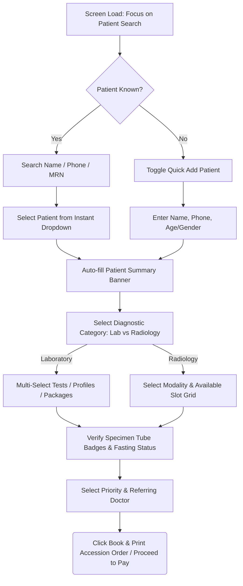

# HMS Diagnostics Booking & Order Screen — Designer Requirements & UX Specification
**Version:** 1.0 (Production Designer Spec)  
**Target User Persona:** `DIAGNOSTIC_RECEPTIONIST` / `LAB_BILLING_CLERK` / `DIAGNOSTICS_COORDINATOR`  
**Core Objective:** Enable staff to register diagnostic investigation requests (Laboratory tests & Radiology imaging studies) in **under 15 seconds** with automated test selection, tube indicators, and instant billing verification.

---

## 🎯 Design Objectives & Principles

* **Dual-Domain Selection Engine**: Seamlessly handles both Laboratory Investigations (multi-test bucket list with instant draw indicators) and Radiology Studies (modality slot scheduling) on a unified screen.
* **Dual-Track Patient Resolution**: Instant switching between searching existing hospital records and 2-field quick registration for walk-in diagnostic patients.
* **Multi-Test Aggregator Bucket**: Fast multi-select lookup allowing staff to quickly stack individual tests, profiles, and health check packages with real-time total price calculation.
* **Clinical Prerequisite Safeguards**: Visual alerts for test preparation requirements (e.g., Fasting verified, Contrast Creatinine check, MRI safety screening).
* **Keyboard-Driven Throughput**: Complete booking execution via barcode scanners and keyboard shortcuts (`Tab`, `Down Arrow`, `Enter`).

---

## 🗺️ User Flow & State Machine



---

## 🎴 UI Wireframes & Layout Transitions

### Screen Layout Architecture (Single Page Split-View)
The screen uses an asynchronous split-pane layout (55% Order Entry & Patient Details / 45% Investigation Bucket & Slot Matrix).

```
+-------------------------------------------------------------------------------------------------------+
| 🔬 DIAGNOSTICS BOOKING CONSOLE                                              [⚡ Reset Form (Esc)]      |
+-------------------------------------------------------------------------+-----------------------------+
| LEFT PANE: PATIENT & ORDER SELECTION (55%)                              | RIGHT PANE: TEST BUCKET (45%)|
+-------------------------------------------------------------------------+-----------------------------+
| 👥 STEP 1: PATIENT RESOLUTION                                           | 🛒 SELECTED INVESTIGATIONS  |
|  (•) Search Existing Patient      ( ) Quick Add New Patient             |                             |
|  +------------------------------------------------------------------+  | 1. Complete Blood Count (CBC)|
|  | 🔍 Type Name, Phone (+91), or MRN...                             |  |    Type: Lab | Tube: 🟪 EDTA |
|  +------------------------------------------------------------------+  |    Fee: ₹ 350.00            |
|  ✅ Selected: John Doe (MRN-9021) | Male, 38 Yrs | +91 98765 43210        |                             |
|                                                                         | 2. Lipid Profile (Fasting)  |
| 🔬 STEP 2: INVESTIGATION SEARCH                                         |    Type: Lab | Tube: 🟡 SST  |
|  [ Domain ]             [ Search Investigation / Profile / Package ]    |    Fee: ₹ 750.00            |
|  [ All / Lab / Rad (v)] [ 🔍 Type CBC, Lipid, Chest X-Ray...       ]    |    ⚠️ Fasting Required       |
|                                                                         |                             |
| 🏷️ STEP 3: ORDER OPTIONS & REFERRAL                                      | --------------------------- |
|  Referring Doctor:   [ Dr. A. P. J. Abdul (External / Self) (v)     ]   | Total Items: 2              |
|  Priority Level:     (•) Routine   ( ) STAT / Urgent                    | Total Amount: ₹ 1,100.00    |
|  Clinical Notes:     [ e.g., Pre-op evaluation / Fever for 3 days     ] |                             |
|                                                                         | Required Specimens / Tubes: |
| +--------------------------------------------------------------------+  | [🟪 EDTA Purple] [🟡 SST Yellow]
| | 💳 [ BOOK & PROCEED TO BILLING (Enter) ]                           |  |                             |
| +--------------------------------------------------------------------+  |                             |
+-------------------------------------------------------------------------+-----------------------------+
```

---

### Alternative View: Quick Add New Patient Mode (Diagnostics Specific)
Since diagnostic reference ranges depend strictly on age and biological gender, the quick-add bar includes minimal age/gender fields alongside name and phone.

```
+-------------------------------------------------------------------------------------------------------+
| 👥 STEP 1: PATIENT RESOLUTION                                                                          |
|                                                                                                       |
|  ( ) Search Existing Patient      (•) Quick Add New Patient ⚡                                        |
|  +---------------------------+ +------------------------+ +-----------------+ +-------------------+ |
|  | Full Name *               | | Phone Number (+91) *   | | Age (Yrs/Mths) *| | Gender *          | |
|  | Rahul Verma               | | 98765 12345            | | 29 Yrs          | | Male (v)          | |
|  +---------------------------+ +------------------------+ +-----------------+ +-------------------+ |
|  ℹ️ Minimal diagnostic registration active. Full demographic profiling deferred to report delivery.    |
+-------------------------------------------------------------------------------------------------------+
```

---

## 🧩 Component Specifications & Behavior

### 1. Patient Resolution Module (Dual Flow)
* **Flow 1: Existing Patient Search**:
  * **Input Type**: Predictive Auto-suggest Combobox.
  * **Search Scope**: Matches against `MRN`, `Patient Full Name`, and `Phone Number`.
  * **Selection Banner**: Displays Patient Name, MRN badge, Mobile Number, Age/Gender badge, and previous diagnostic history link.
* **Flow 2: Quick Add New Patient (Minimal Diagnostic Draw)**:
  * **Fields Required**: `Full Name`, `Phone Number`, `Age`, `Gender`.
  * **Clinical Justification**: Age and Gender are mandatory even in quick registration to ensure the automated engine pulls the correct biological reference ranges for test results.

### 2. Multi-Test Aggregator Bucket (Right Pane)
* **Search & Add Experience**: Staff types investigation name or code (e.g., `CBC`, `LFT`, `CT BRAIN`); pressing `Enter` or clicking adds it directly to the right-hand bucket list.
* **Itemized Details in Bucket**:
  * Investigation Name & Code.
  * Category Badge (`LAB` vs `RAD`).
  * **Specimen Tube Color Badge** for Lab tests (e.g., `🟪 EDTA`, `🟡 SST Gel`, `🟦 Citrate`).
  * Unit Price & Discount Indicator.
  * Action: `[X]` Delete item from bucket.
* **Summary Banner**:
  * Live updates of Total Investigation Count and Cumulative Billing Amount.
  * Consolidated Specimen Requirement Summary (e.g., *"Requires: 1x Purple Tube, 1x Yellow Tube"*).

### 3. Radiology Slot Scheduling Integration (Modal / Expansion)
* If a selected investigation is of type `RADIOLOGY` requiring scheduled machine time (e.g., Ultrasound, CT, MRI):
  * A slot selector widget unfolds inline beneath the study item in the bucket.
  * Shows available modality time slots for the current date or allows picking an alternate date.
  * Routine X-Rays or ECGs bypass slot booking and route directly to the walk-in radiology queue.

### 4. Diagnostic Tags & Clinical Warnings
* **Fasting Status Warning**: If an added test requires fasting (e.g., Fasting Blood Sugar, Lipid Profile), a prominent yellow warning pill appears (`⚠️ Fasting Required (8-10 Hrs)`). Staff checks a confirmation box: `[x] Patient Fasting Confirmed`.
* **Priority Tags**: Toggle between `ROUTINE` and `STAT / URGENT`. `STAT` orders highlight the bucket banner in red and trigger immediate priority badges in downstream lab workstations.

---

## 📋 Field Specifications & Validation Catalog

| Field Name | Component Type | Mandatory | Default Value | Validation Rules | UX / Auto-population Behavior |
| :--- | :--- | :--- | :--- | :--- | :--- |
| `patient_search` | Predictive Search | Conditional | Blank | Min 2 chars / 3 digits | Auto-focuses on load. Press `Down Arrow` to navigate results. |
| `quick_full_name` | Text Input | Conditional | Blank | Min 2 chars, Alpha + spaces | Mandatory if Quick Add mode selected. Capitalizes automatically. |
| `quick_phone` | Tel Input | Conditional | Blank | Exactly 10 numeric digits | Validates mobile number format (`^[6-9]\d{9}$`). |
| `quick_age` | Numeric + Unit | Conditional | Blank | Integer > 0 (Days/Mths/Yrs)| Mandatory for age-specific reference ranges in lab reports. |
| `quick_gender` | Dropdown | Conditional | Blank | `MALE`, `FEMALE`, `OTHER` | Mandatory for gender-specific reference ranges. |
| `investigation_search`| Predictive Multi-Select| Yes | Blank | Must select at least 1 test | Searches by Test Name, Short Code (e.g., `HbA1c`), or Synonym. |
| `referring_doctor` | Combobox | No | `Self / Internal` | Valid Doctor ID or Free Text | Auto-suggests hospital doctors or allows typing external doctor name. |
| `fasting_verified` | Checkbox | Conditional | `False` | Mandatory check if test requires fasting | System displays warning if unverified for fasting-sensitive tests. |
| `priority` | Toggle Pill | No | `ROUTINE` | `ROUTINE`, `STAT` | `STAT` adds priority surge badge to laboratory accession queue. |
| `clinical_notes` | Text Area | No | Blank | Max 250 characters | Optional notes for pathologist or radiologist context. |

---

## ⚙️ Business Rules & UX Logic

### 1. Diagnostic Order Integrity Rule (`BR-DX-01`)
The System shall strictly prevent order submission unless **AT LEAST ONE** diagnostic investigation (Lab or Radiology) is added to the selection bucket and a valid patient record (Existing or Quick Add) is assigned.

### 2. Duplicate Investigation Warning (`BR-DX-02`)
If staff attempts to add an investigation that the patient has already undergone within the past **24 hours**, the system displays an inline warning banner: *"Patient John Doe completed CBC today at 09:30 AM. Add anyway? [Yes] [No]"*.

### 3. Automated Specimen Consolidator (`BR-DX-03`)
When multiple laboratory tests are added to the bucket that share the same specimen container type (e.g., CBC and HbA1c both use EDTA Purple tubes), the system automatically consolidates the requirement to **1 physical tube barcode** rather than generating duplicate blood draw requisitions.

### 4. Payment & Accession Workflow Options (`BR-DX-04`)
* **Mode A (Immediate Collection & Billing)**: Confirmation generates an Accession Order Number (`ACC-XXXXX`), prints barcode labels at the billing desk, and routes billing to POS.
* **Mode B (Order Only / Bill at Lab)**: Order generated in `PENDING_PAYMENT` status; specimen barcode printed upon arrival at phlebotomy station.

---

## 🎨 Design System & Keyboard Shortcuts

### Color Palette & Visual Coding
* **Primary Booking Button**: Deep Teal 600 (`#0D9488`)
* **Lab Investigation Badge**: Purple 600 (`#9333EA`)
* **Radiology Study Badge**: Blue 600 (`#2563EB`)
* **STAT / Urgent Warning**: Crimson Red (`#E11D48`)
* **Fasting Alert Pill**: Amber 500 (`#F59E0B`)

### Ergonomic Keyboard Shortcuts
* `Alt + S`: Jump focus to Patient Search / Quick Add.
* `Alt + I`: Jump focus to Investigation Search Bar.
* `Alt + Q`: Toggle Quick Add Patient Mode.
* `Enter` (when in search bar): Add highlighted test to bucket.
* `Ctrl + Enter`: Confirm Order & Proceed to Billing.
* `Esc`: Clear form and reset to default state.
