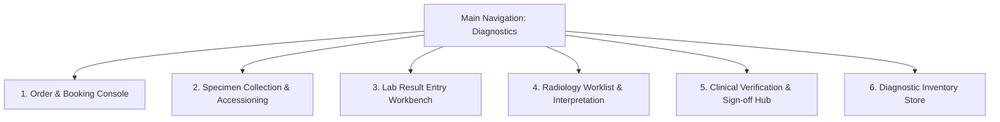

# HMS Full Diagnostics Module — Master UI/UX Designer Specification
**Version:** 1.0 (Production UI/UX Master Blueprint)  
**Target Audience:** UI/UX Designers, Product Designers, Design Systems Engineers, Front-End Developers  
**Core Objective:** Provide a unified, end-to-end design specification for building the complete Diagnostics Module interface across Laboratory Pathology, Radiology Imaging, Verification Hubs, and Inventory Control.

---

## 🗺️ 1. Global Information Architecture & Navigation

The Diagnostics Module is structured into 6 primary screens accessible from the main clinical navigation sidebar.



---

## 🎴 2. Complete Screen Wireframes & Component Specs

### Screen 1: Diagnostic Order & Booking Console
* **Target Users**: `DIAGNOSTIC_RECEPTIONIST`, `BILLING_EXECUTIVE`
* **Layout**: 55/45 Split-Pane (Left: Patient Resolution & Order Form / Right: Live Multi-Test Bucket & Slot Selector).

```
+-------------------------------------------------------------------------------------------------------+
| 🔬 DIAGNOSTICS BOOKING CONSOLE                                              [⚡ Reset Form (Esc)]      |
+-------------------------------------------------------------------------+-----------------------------+
| LEFT PANE: PATIENT RESOLUTION & ORDER FORM (55%)                        | RIGHT PANE: TEST BUCKET (45%)|
+-------------------------------------------------------------------------+-----------------------------+
| 👥 STEP 1: PATIENT RESOLUTION                                           | 🛒 SELECTED INVESTIGATIONS  |
|  (•) Search Existing Patient      ( ) Quick Add New Patient             |                             |
|  +------------------------------------------------------------------+  | 1. Complete Blood Count (CBC)|
|  | 🔍 Type Name, Phone (+91), or MRN...                             |  |    Type: Lab | Tube: 🟪 EDTA |
|  +------------------------------------------------------------------+  |    Fee: ₹ 350.00            |
|  ✅ Selected: John Doe (MRN-9021) | Male, 38 Yrs | +91 98765 43210        |                             |
|                                                                         | 2. Lipid Profile (Fasting)  |
| 🔬 STEP 2: INVESTIGATION SEARCH                                         |    Type: Lab | Tube: 🟡 SST  |
|  [ Domain ]             [ Search Investigation / Profile / Package ]    |    Fee: ₹ 750.00            |
|  [ All / Lab / Rad (v)] [ 🔍 Type CBC, Lipid, Chest X-Ray...       ]    |    ⚠️ Fasting Required       |
|                                                                         |                             |
| 🏷️ STEP 3: ORDER OPTIONS & REFERRAL                                      | --------------------------- |
|  Referring Doctor:   [ Dr. A. P. J. Abdul (External / Self) (v)     ]   | Total Items: 2              |
|  Priority Level:     (•) Routine   ( ) STAT / Urgent                    | Total Amount: ₹ 1,100.00    |
|  Clinical Notes:     [ e.g., Pre-op evaluation / Fever for 3 days     ] |                             |
|                                                                         | Required Specimens / Tubes: |
| +--------------------------------------------------------------------+  | [🟪 EDTA Purple] [🟡 SST Yellow]
| | 💳 [ BOOK & PROCEED TO BILLING (Enter) ]                           |  |                             |
| +--------------------------------------------------------------------+  |                             |
+-------------------------------------------------------------------------+-----------------------------+
```
* **Key Design Rules**:
  * Switching to **Quick Add New Patient** dynamically collapses search into 4 minimal fields: `Full Name`, `Phone Number`, `Age`, and `Gender`.
  * Adding tests to the bucket automatically calculates total price and consolidates specimen tube requirements (e.g., `🟪 EDTA`, `🟡 SST`).

---

### Screen 2: Specimen Collection & Accessioning Station
* **Target Users**: `PHLEBOTOMIST`, `LAB_RECEIVING_TECHNICIAN`
* **Layout**: Dual Queue Workbench (Left: Phlebotomy Collection Queue / Right: Lab Bench Accession Desk).

```
+-------------------------------------------------------------------------------------------------------+
| 🧪 SPECIMEN COLLECTION & LAB ACCESSIONING CONSOLE                                                     |
+-------------------------------------------------------------------------+-----------------------------+
| LEFT PANE: PHLEBOTOMY DRAW QUEUE (50%)                                  | RIGHT PANE: LAB BENCH (50%) |
+-------------------------------------------------------------------------+-----------------------------+
| 🔍 Filter: [ All Floors / Wards (v) ]   [ Auto-Refresh: 30s ]           | 📥 ACCESSION CHECK-IN DESK  |
|                                                                         |  [ 🔍 Scan Specimen Barcode ]|
| Patient: Rahul Sharma (MRN-4019) | Ward 3B, Bed 12                      |  +--------------------------+|
| Tests: CBC, KFT | Req Draw: 2x Tubes (🟪 EDTA, 🟡 SST)                   |                              |
| Status: PENDING DRAW                                                    | Scanned: ACC-20260629-0012   |
| Action: [ 🖨️ Print Barcode Labels ]   [ ✅ Mark Collected ]              | Patient: Anita Verma (MRN-88)|
| ----------------------------------------------------------------------- | Specimen: EDTA Whole Blood   |
| Patient: Meera Patel (MRN-1092) | OPD Clinic 2                          | Inspection Status:           |
| Tests: Glucose Fasting | Req Draw: 1x Tube (⚪ Gray Sodium Fluoride)    | (•) Normal  ( ) Hemolyzed    |
| Action: [ 🖨️ Print Barcode Labels ]   [ ✅ Mark Collected ]              | ( ) Clotted ( ) Insufficient |
|                                                                         | [ 📥 ACCEPT ]  [ ❌ REJECT ] |
+-------------------------------------------------------------------------+-----------------------------+
```
* **Key Design Rules**:
  * Scanning a barcode (`ACC-XXXXX`) on the right pane instantly triggers specimen lookup.
  * Clicking `❌ REJECT` opens a modal prompting for standardized rejection reasons (Hemolyzed, Clotted, Volume Insufficient) and sends an automated recollect alert to nursing floors.

---

### Screen 3: Laboratory Result Entry Workbench
* **Target Users**: `LABORATORY_TECHNICIAN`, `SENIOR_BENCH_TECH`
* **Layout**: High-Density Parameter Matrix with Historical Delta-Check Graphing.

```
+-------------------------------------------------------------------------------------------------------+
| 📊 LABORATORY RESULT WORKBENCH                                         Workgroup: [ Hematology B1 (v) ]|
+-------------------------------------------------------------------------------------------------------+
| Accession #: ACC-20260629-0012 | Patient: Anita Verma (F, 42 Yrs) | Test: Complete Blood Count (CBC)   |
+-------------------------------------------------------------------------------------------------------+
| PARAMETER NAME            | OBSERVED VALUE | UNIT    | STANDARD RANGE | DELTA (%) | STATUS / FLAG     |
+---------------------------+----------------+---------+----------------+-----------+-------------------+
| Hemoglobin (Hb)           | 11.2           | g/dL    | 12.0 - 15.5    | -3.4%     | 🟡 LOW            |
| Total Leucocyte Count(TLC)| 14,500         | /cu.mm  | 4,000 - 11,000 | +22.0%    | 🔴 HIGH           |
| Platelet Count            | 210,000        | /cu.mm  | 150,000-450,000| 0.0%      | 🟢 NORMAL         |
| Packed Cell Volume (PCV)  | 34.1           | %       | 37.0 - 48.0    | -2.1%     | 🟡 LOW            |
+-------------------------------------------------------------------------------------------------------+
| Result Source: 🤖 Analyzer Sysmex-XN1000 (Auto-captured)   [ 🔄 Trigger Rerun ]  [ 📝 Add Tech Note ] |
|                                                                                                       |
|                                                     [ 💾 Save Draft ]   [ ↗️ SUBMIT FOR SIGN-OFF ]     |
+-------------------------------------------------------------------------------------------------------+
```
* **Key Design Rules**:
  * Out-of-range parameters auto-highlight in colored pills (`Yellow` for High/Low, `Red` for Critical Panic limits).
  * Hovering over the `DELTA (%)` column renders a popover micro-chart showing the patient's last 5 historical result values.

---

### Screen 4: Radiology Worklist & Interpretation Console
* **Target Users**: `RADIOLOGY_TECHNOLOGIST`, `CONSULTANT_RADIOLOGIST`
* **Layout**: 40/60 Split-Screen (Left: Modality Worklist & Appointment Grid / Right: DICOM Viewer Link & Structured Reporting Editor).

```
+-------------------------------------------------------------------------------------------------------+
| 💀 RADIOLOGY INTERPRETATION WORKBENCH                                   Modality: [ MRI Scanner 1 (v) ]|
+-------------------------------------------------------------------------+-----------------------------+
| LEFT PANE: STUDY WORKLIST (40%)                                         | RIGHT PANE: REPORTING (60%) |
+-------------------------------------------------------------------------+-----------------------------+
| [ 🔍 Search Patient / Accession ]  Filter: [ Unreported Studies (v) ]  | Patient: Suresh Kumar (52M) |
|                                                                         | Study: MRI Brain with Contrast|
| 🔴 STAT | Acc: RAD-9021 | MRI Brain with Contrast                      | PACS: [ 👁️ Launch PACS Viewer ]|
| Patient: Suresh Kumar (M, 52 Yrs) | Time in Queue: 18 mins              | --------------------------- |
| Status: IMAGES ACQUIRED (24 Series, 412 Images)                         | STRUCTURED FINDINGS:        |
| ----------------------------------------------------------------------- | [ Template: Brain Normal (v)]|
| 🟢 ROUTINE | Acc: RAD-9018 | X-Ray Chest PA View                       | "Well-defined hyperintense  |
| Patient: David Miller (M, 29 Yrs) | Time in Queue: 1 hr 10 mins        | lesion observed in right    |
| Status: IMAGES ACQUIRED (2 Images)                                      | temporal lobe..."           |
|                                                                         | IMPRESSION:                 |
|                                                                         | [ Free text impression... ] |
|                                                                         |                             |
|                                                                         | [ 🚨 MARK CRITICAL FINDING ] |
|                                                                         | [ 🖊️ SIGN & FINALIZE REPORT]|
+-------------------------------------------------------------------------+-----------------------------+
```
* **Key Design Rules**:
  * Clicking `👁️ Launch PACS Viewer` opens the zero-footprint DICOM viewer in a synchronized dual-monitor or split window.
  * Clicking `🚨 MARK CRITICAL FINDING` opens a high-priority broadcasting popover to alert the attending physician.

---

### Screen 5: Clinical Verification & Sign-off Hub
* **Target Users**: `PATHOLOGIST`, `CONSULTANT_RADIOLOGIST`, `LAB_DIRECTOR`
* **Layout**: Executive Audit & Sign-off Split Pane.

```
+-------------------------------------------------------------------------------------------------------+
| 🛡️ DIAGNOSTIC CLINICAL VERIFICATION HUB                                                                |
+-------------------------------------------------------------------------------------------------------+
| Tabs: [ 🧪 Pending Lab Sign-off (12) ]   [ 💀 Pending Radiology Sign-off (4) ]   [ 🚨 Criticals (2) ]  |
+-------------------------------------------------------------------------------------------------------+
| Accession: ACC-20260629-0012 | Patient: Anita Verma (42F) | Preliminary Tech: Johnathan Swamy, MT     |
| Test: Complete Blood Count | Result Flags: 🔴 Leucocytosis (TLC: 14,500)                              |
+-------------------------------------------------------------------------------------------------------+
| PRELIMINARY REPORT PREVIEW:                                                                           |
| Hemoglobin: 11.2 g/dL | TLC: 14,500 /cu.mm | Platelets: 210,000 /cu.mm                                |
| Tech Notes: "Sample re-run executed on Bench B2. Slide peripheral smear confirms neutrophilia."       |
+-------------------------------------------------------------------------------------------------------+
| CONSULTANT CLINICAL IMPRESSION / REMARKS:                                                             |
| [ Type consultant correlation note...                                                               ] |
|                                                                                                       |
| [ 🔄 Reject to Tech ]             [ 📞 Contact Clinician ]            [ 🖊️ APPROVE & DIGITAL SIGN ]    |
+-------------------------------------------------------------------------------------------------------+
```
* **Key Design Rules**:
  * `🖊️ APPROVE & DIGITAL SIGN` applies a cryptographic digital signature badge and instantly publishes the PDF report to the EMR and Patient Portal.

---

### Screen 6: Diagnostic Inventory & Store Workbench
* **Target Users**: `DIAGNOSTICS_INVENTORY_MANAGER`, `LAB_STORE_KEEPER`
* **Layout**: 4-Tab Control Center (`Stock Dashboard`, `Procurement / PO`, `Goods Receiving (GRN)`, `QC & Expiry Alerts`).

```
+-------------------------------------------------------------------------------------------------------+
| 📦 DIAGNOSTIC INVENTORY & REAGENT STORE                                                               |
+-------------------------------------------------------------------------------------------------------+
| Tabs: [ 📊 Stock Master ]   [ 📝 Purchase Orders ]   [ 🚚 Goods Receiving (GRN) ]   [ ⚠️ QC & Alerts ]|
+-------------------------------------------------------------------------------------------------------+
| REAGENT / CONSUMABLE ITEM NAME  | CATEGORY | CURRENT STOCK | REORDER LVL | ACTIVE LOT # | EXPIRY DATE |
+---------------------------------+----------+---------------+-------------+--------------+-------------+
| Sysmex Lysercell WDF (5L)       | REAGENT  | 2 Bottles     | 5 Bottles   | LOT-89012A   | 2026-07-15  |
| Cobas c311 HbA1c Cassette (200T)| REAGENT  | 14 Kits       | 10 Kits     | LOT-44102B   | 2026-11-30  |
| Vacutainer EDTA 4mL (Purple)    | CONSUMABLE| 1,200 Pieces  | 500 Pieces  | LOT-99210C   | 2027-04-01  |
+-------------------------------------------------------------------------------------------------------+
| Quick Actions: [ ➕ New Purchase Order ]   [ 📥 Log Goods Receipt ]   [ 🗑️ Log Waste / Disposal ]      |
+-------------------------------------------------------------------------------------------------------+
```
* **Key Design Rules**:
  * Items below safety reorder levels highlight with amber warning counters. Items within 30 days of expiry display red badges.

---

## 🎨 3. Design System Tokens & Color Conventions

### Domain Specific Color Coding
To prevent visual confusion between departments, use strict color tokens:
* **Laboratory Pathology**: Primary Purple (`#9333EA` / Tailwind `purple-600`)
* **Radiology Imaging**: Primary Blue (`#2563EB` / Tailwind `blue-600`)
* **Diagnostic Booking / Front Desk**: Primary Teal (`#0D9488` / Tailwind `teal-600`)
* **Critical Panic / STAT Alert**: Crimson Red (`#E11D48` / Tailwind `rose-600`)
* **Fasting Warning / Low Stock**: Amber Yellow (`#F59E0B` / Tailwind `amber-500`)

---

## ⌨️ 4. Global Keyboard Shortcut Standards

| Shortcut | Context | Executed Action |
| :--- | :--- | :--- |
| `Alt + S` | Global | Focus primary Search Bar (Patient / Order / Test). |
| `Alt + Q` | Booking Screen | Toggle Quick Add New Patient Mode. |
| `Alt + B` | Lab Bench | Focus Barcode Scanner Listener Input. |
| `Alt + V` | Verification Hub| Open Digital Signature Dialog. |
| `Ctrl + Enter`| All Forms | Primary Submit / Confirm Action. |
| `Esc` | Modals / Workbenches | Close Modal / Clear Active Selection. |
