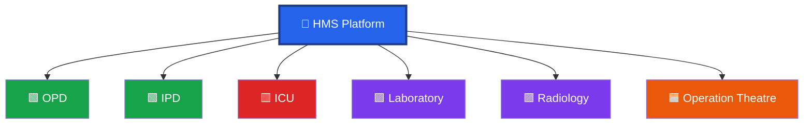
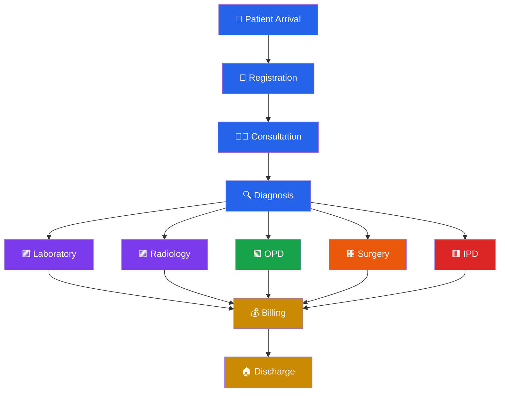
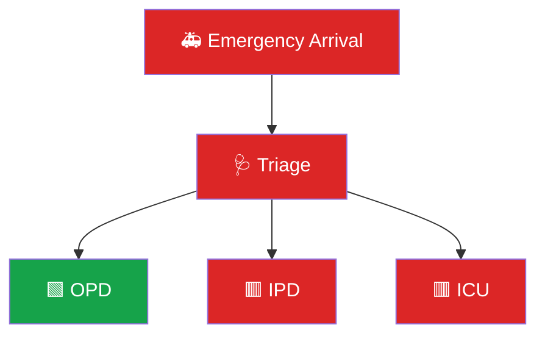
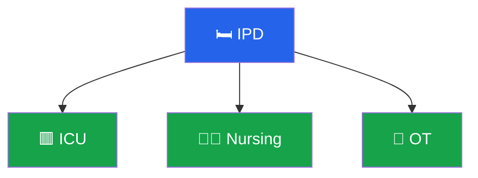
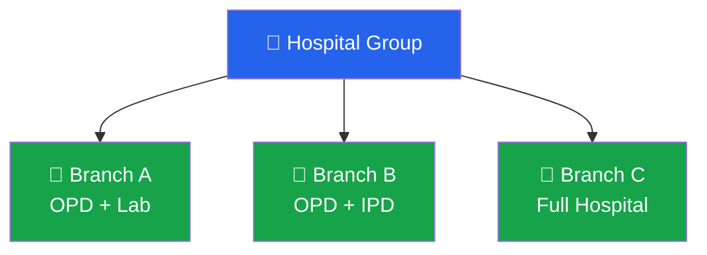

# 🎨 HMS Visual Theme

| Component | Color   | Meaning                   |
| --------- | ------- | ------------------------- |
| 🟦 Blue   | #2563EB | Core HMS Platform         |
| 🟩 Green  | #16A34A | Active Modules            |
| 🟧 Orange | #EA580C | Clinical Operations       |
| 🟪 Purple | #7C3AED | Diagnostics               |
| 🟥 Red    | #DC2626 | Emergency / Critical Care |
| 🟨 Yellow | #CA8A04 | Administrative Functions  |

---

# 🏥 HMS Architecture

---

# 🎛️ Module Activation Flow

---

# 🏥 Patient Journey

---

# 🚑 Emergency Flow

---

# 🧠 Smart Dependency Logic

---

# 🌍 Multi-Branch Configuration

---

# 🚀 Plug-and-Play Vision

