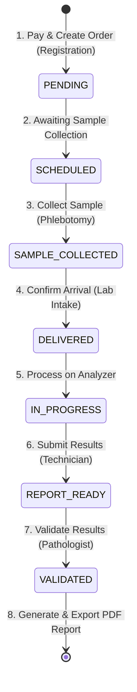

# Laboratory Order Life Cycle & Status Transitions

This document details the lifecycle of a Laboratory Order from initial check-in/registration through sample collection, analyzer processing, result submission, validation, and final PDF report generation.

---

## 1. Lifecycle Workflow Diagram

The diagram below maps the status changes of the individual **ordered test items** (`diagnostic.lab_order_items.status`) as they pass through different stages:

---

## 2. Step-by-Step Lifecycle Phases

### Phase 1: Check-in & Checkout (Order Creation)
* **Trigger**: The patient check-in is initiated (either Walk-in or OPD Referral). Once checkout payment is successful, the order is created.
* **API Endpoints**:
  * OPD Patient Lookup: `GET /diagnostic-orders/lab/opd-visits/lookup`
  * Visit Details POST: `POST /diagnostic-orders/lab/orders/visit-details`
  * Pay and Create Order: `POST /diagnostic-orders/lab/orders/pay-and-create`
* **Status Changes**:
  * **Lab Order**: `PENDING`
  * **Lab Order Items (Tests)**: `PENDING` (Initial unpaid/uncollected state)
  * **Payment status**: `PAID`

---

### Phase 2: Sample Awaiting Collection
* **Trigger**: Once payment is completed, the system schedules the tests for sample collection.
* **API Endpoints**:
  * Barcode scanning/Label printing
* **Status Changes**:
  * **Lab Order Items (Tests)**: Transitions from `PENDING` to `SCHEDULED`.

---

### Phase 3: Sample Collection (Phlebotomy)
* **Trigger**: Phlebotomist prints the generated shared barcode label, draws the sample (blood, urine, stool, etc.), and matches it to the patient.
* **API Endpoints**:
  * Unified Barcode Scan: `GET /diagnostic-orders/lab/samples?barcode={barcode}`
* **Status Changes**:
  * **Lab Order Items (Tests)**: Transitions from `SCHEDULED` to `SAMPLE_COLLECTED`.

---

### Phase 4: Intake & Arrival Confirmation
* **Trigger**: Collected samples arrive at the Laboratory intake station, and the technician scans the barcode to confirm the physical arrival of the sample.
* **API Endpoints**:
  * Confirm Arrival: `PATCH /diagnostic-orders/lab/samples/{item_id}/confirm-arrival`
* **Status Changes**:
  * **Lab Order Items (Tests)**: Transitions from `SAMPLE_COLLECTED` to `DELIVERED`.

---

### Phase 5: Analyzer Processing & testing
* **Trigger**: The sample is sent to the analyzer bench for testing. When testing begins on the bench, the status updates to indicate active processing.
* **Status Changes**:
  * **Lab Order Items (Tests)**: Transitions from `DELIVERED` to `IN_PROGRESS`.

---

### Phase 6: Result Submission (Technician Dashboard)
* **Trigger**: The technician reviews parameter values from the analyzer, pulls the result-entry sheet, types the result values (e.g. Hemoglobin `14.5`), and clicks **Submit**.
* **API Endpoints**:
  * Technician Dashboard List: `GET /diagnostic-orders/lab/dashboard/technician`
  * Result Entry Form Parameters: `GET /diagnostic-orders/lab/orders/{order_id}/result-entry`
  * Submit Result values: `POST /diagnostic-orders/lab/results/{item_id}/submit`
* **Status Changes**:
  * **Lab Order Items (Tests)**: Transitions from `IN_PROGRESS` to `REPORT_READY` (also known as `READY_FOR_REVIEW`).

---

### Phase 7: Result Validation (Pathologist Approval)
* **Trigger**: The pathologist reviews the submitted values (flagging abnormal/critical values) and approves the laboratory report.
* **API Endpoints**:
  * Pathologist Review/Release: `PATCH /diagnostic-orders/lab/results/{id}/status`
* **Status Changes**:
  * **Lab Order Items (Tests)**: Transitions from `REPORT_READY` to `VALIDATED`.
  * **Lab Order**: Transitions from `PENDING` to `COMPLETED` (triggered when all child tests are `VALIDATED`).

---

### Phase 8: Report Export
* **Trigger**: The patient or doctor downloads the final verified PDF diagnostic report.
* **API Endpoints**:
  * Download PDF Report: `GET /diagnostic-orders/lab/reports/{id}/pdf`
