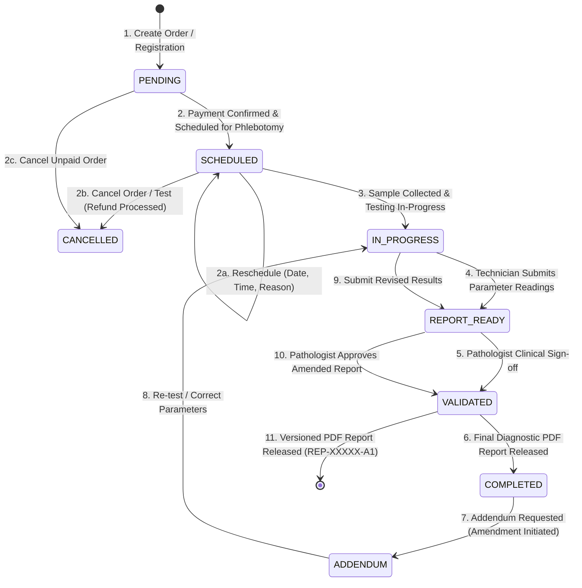

# Laboratory Order Life Cycle & Patient Status Transitions

This document details the streamlined lifecycle of a Laboratory Order from initial patient check-in/registration through active analyzer processing, result submission, pathologist validation, and final PDF report release.

---

## 1. Streamlined Patient Lifecycle Diagram

The diagram below reflects the clean, patient-facing lifecycle where internal specimen-handling intermediate states (`SAMPLE_COLLECTED` and `DELIVERED`) are collapsed directly into active testing (**`IN_PROGRESS`**):

```mermaid
stateDiagram-v2
    [*] --> PENDING : 1. Create Order / Registration
    PENDING --> SCHEDULED : 2. Payment Confirmed & Scheduled for Phlebotomy
    
    %% Exception Branch: Rescheduling & Cancellation
    SCHEDULED --> SCHEDULED : 2a. Reschedule (Date, Time, Reason)
    SCHEDULED --> CANCELLED : 2b. Cancel Order / Test (Refund Processed)
    PENDING --> CANCELLED : 2c. Cancel Unpaid Order

    SCHEDULED --> IN_PROGRESS : 3. Sample Collected & Testing In-Progress
    IN_PROGRESS --> REPORT_READY : 4. Technician Submits Parameter Readings
    REPORT_READY --> VALIDATED : 5. Pathologist Clinical Sign-off
    VALIDATED --> COMPLETED : 6. Final Diagnostic PDF Report Released
    
    %% Exception Branch: Post-Release Clinical Addendum
    COMPLETED --> ADDENDUM : 7. Addendum Requested (Amendment Initiated)
    ADDENDUM --> IN_PROGRESS : 8. Re-test / Correct Parameters
    IN_PROGRESS --> REPORT_READY : 9. Submit Revised Results
    REPORT_READY --> VALIDATED : 10. Pathologist Approves Amended Report
    VALIDATED --> [*] : 11. Versioned PDF Report Released (REP-XXXXX-A1)
```

---

## 2. Step-by-Step Patient Lifecycle Phases

### Phase 1: Order Registration (`PENDING`)
* **Trigger**: The patient checks in at the laboratory desk (Walk-in or OPD Prescription) and the diagnostic test intake is created.
* **API Endpoints**:
  * Create Draft/Intake: `POST /lab/registrations` *(action: "DRAFT")*
* **Status**:
  * **Lab Order**: `PENDING`
  * **Lab Order Items (Tests)**: `PENDING`

---

### Phase 2: Payment Confirmation & Scheduled (`SCHEDULED`)
* **Trigger**: Payment is completed (Cash/UPI/Card/Pay Later) or order is confirmed. System issues token number (`LAB-XXXX`), barcode (`BC-XXXXX`), and places patient in the phlebotomy sample queue.
* **API Endpoints**:
  * Pay and Confirm: `POST /lab/registrations` or `POST /lab/orders/pay-and-create`
  * Print Bill & Guidance Receipt: `GET /lab/invoices/{id}`
  * Sample Queue: `GET /lab/sample-queue`
* **Status**:
  * **Lab Order**: `PENDING`
  * **Lab Order Items (Tests)**: `SCHEDULED`
  * **Billing**: `PAID` / `OPEN` *(Pay Later)*

---

### Phase 3: Active Testing & Analyzer Processing (`IN_PROGRESS`)
* **Trigger**: The patient enters the phlebotomy booth, the sample is drawn/barcoded, and immediately enters the active laboratory testing bench / automated analyzer (e.g. Sysmex, Roche Cobas).
* **UI Badge**: `In-Process` (Amber badge)
* **Status**:
  * **Lab Order Items (Tests)**: `IN_PROGRESS`

---

### Phase 4: Result Submission (`REPORT_READY` / `VERIFICATION`)
* **Trigger**: The laboratory technician reviews numerical parameter readings from the analyzer, enters results on the test entry sheet, and submits for clinical review.
* **API Endpoints**:
  * Result Entry Form: `GET /diagnostic-orders/lab/orders/{order_id}/result-entry`
  * Submit Result Values: `POST /diagnostic-orders/lab/results/{item_id}/submit`
* **UI Badge**: `Verification` (Green badge) / `Report Ready`
* **Status**:
  * **Lab Order Items (Tests)**: `REPORT_READY`

---

### Phase 5: Pathologist Validation & Sign-off (`VALIDATED` / `COMPLETED`)
* **Trigger**: The pathologist reviews submitted parameters, checks for abnormal/critical flags, verifies patient history, and digitally signs the report.
* **API Endpoints**:
  * Pathologist Approval: `PATCH /diagnostic-orders/lab/results/{id}/status`
  * Download PDF Report: `GET /diagnostic-orders/lab/reports/{id}/pdf`
* **UI Badge**: `Completed` (Green badge)
* **Status**:
  * **Lab Order Items (Tests)**: `VALIDATED`
  * **Lab Order**: `COMPLETED` *(Automatically triggered when all child tests are validated)*

---

### Phase 6: Post-Release Clinical Addendum (`ADDENDUM`)
* **Trigger**: A doctor or pathologist requests a post-release correction, repeat specimen analysis, analyzer recalibration, or additional clinical remarks.
* **API Endpoints**:
  * Create Addendum: `POST /lab/addendums`
  * Submit Revised Parameters: `POST /diagnostic-orders/lab/results/{item_id}/submit`
  * Approve & Finalize Addendum: `PATCH /lab/addendums/{id}`
* **Progression**:
  1. `COMPLETED` ➔ **`ADDENDUM`** (`status = "Pending"`)
  2. Unlocks parameter modification ➔ **`IN_PROGRESS`**
  3. Technician submits revised readings ➔ **`REPORT_READY`**
  4. Pathologist re-validates ➔ **`VALIDATED`**
  5. Versioned amended PDF published (e.g. `REP-10245-A1`).

---

## 3. Patient Status Summary Table

| Phase | Patient-Facing Status | System Status Code | Meaning for Patient / Front Desk |
| :---: | :--- | :--- | :--- |
| **1** | **Draft / Intake** | `PENDING` | Order created; intake registered awaiting payment |
| **2** | **Scheduled / Waiting** | `SCHEDULED` | Payment confirmed; token `LAB-XXXX` assigned; waiting in phlebotomy queue |
| **3** | **In-Process** | `IN_PROGRESS` | Specimen drawn and actively running on laboratory analyzers |
| **4** | **Under Verification** | `REPORT_READY` | Testing completed; undergoing clinical quality review |
| **5** | **Completed** | `COMPLETED` / `VALIDATED` | Doctor digitally approved report; PDF ready for download |
| **—** | **Rescheduled** | `SCHEDULED` (Revised Date) | Test moved to a future requested slot with audit reason |
| **—** | **Cancelled** | `CANCELLED` / `PARTIALLY_CANCELLED` | Order/test cancelled; refund initiated to original payment method |
| **—** | **Addendum** | `ADDENDUM` | Report re-opened for pathologist revision / clinical update |
