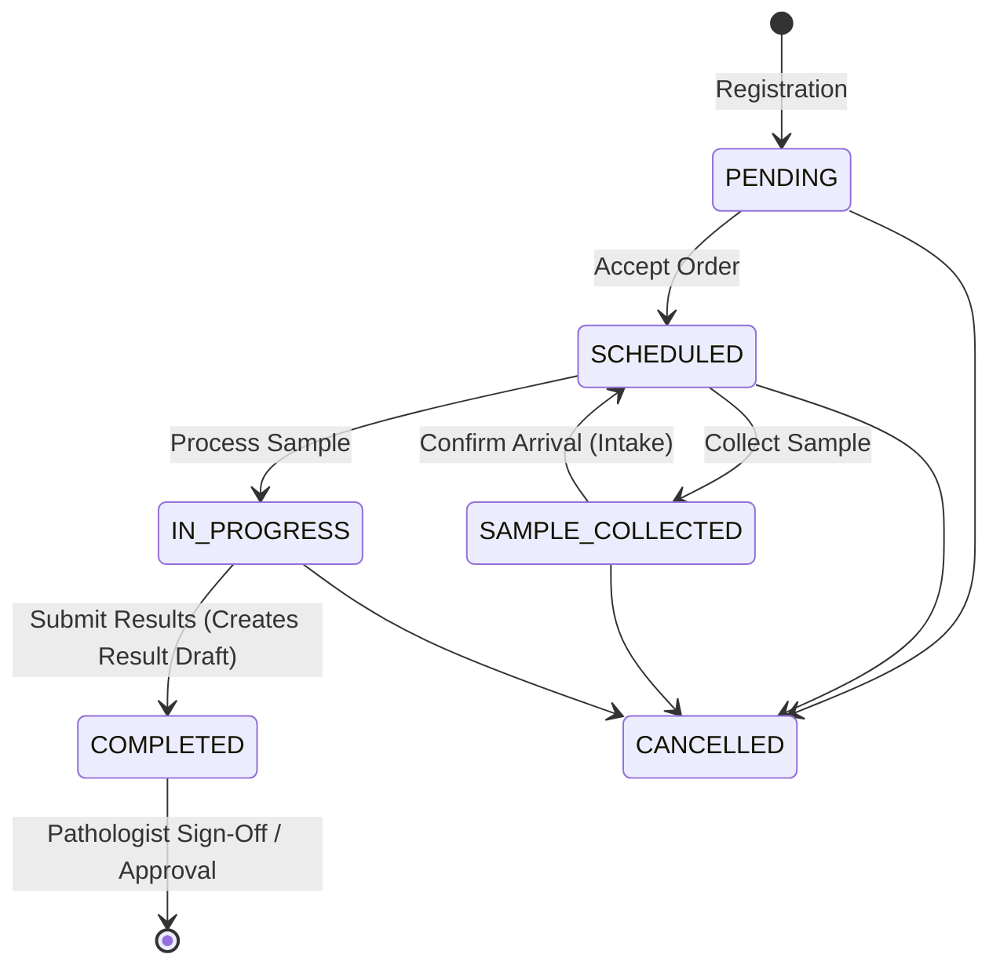

# Laboratory Order Lifecycle - API & Workflow Guide

This document provides a comprehensive reference for the complete lifecycle of a laboratory order—from patient registration through sample collection, intake, processing, validation, and delivery. 

Following the resolution of the workflow state-machine transition errors (such as `SCHEDULED` to `IN_PROGRESS`), this guide details the exact API endpoints, payloads, HTTP responses, and required role-based permissions for each stage of the lifecycle.

---

## Lab Order Status Flow & State Machine

The laboratory workflow is managed by a strict state-machine engine. The state diagram below outlines the valid transitions:



### Table of Status States:

| Database Status | Semantic / UI Mapping | Description |
| :--- | :--- | :--- |
| **`PENDING`** | `NEW` / `PENDING` | Order created and paid, awaiting technician acceptance. |
| **`SCHEDULED`** | `ACCEPTED` / `AWAITING_PROCESSING` | Order accepted or sample arrived at the laboratory. |
| **`SAMPLE_COLLECTED`**| `SAMPLE_COLLECTED` / `IN_TRANSIT` | Phlebotomist has collected the sample. |
| **`IN_PROGRESS`** | `IN_PROGRESS` / `ON_ANALYZER` | Sample has been verified and run on analyzers. |
| **`COMPLETED`** | `READY_FOR_REVIEW` | Results entered, waiting for Pathologist review. |
| **`APPROVED`** | `APPROVED` | Pathologist approved and signed off. |
| **`REPORT_GENERATED`**| `REPORT_GENERATED` | Final PDF report generated and stored. |
| **`CANCELLED`** | `CANCELLED` | Order rejected or cancelled. |

---

## 1. OPD Visit Lookup (Pre-Registration)
Used at the registration desk to lookup patient details using a visit number.

* **Role Required**: `RECEPTIONIST`
* **Method**: `GET`
* **Path**: `/diagnostic-orders/lab/opd-visits/lookup?visit_number=OPD-20260615-0001`
* **Request Body**: *None*
* **Response Body (200 OK)**:
```json
{
  "success": true,
  "code": 200,
  "data": {
    "patient": {
      "patient_id": "93643ddd-0d0d-491d-83d6-37f3bcde518d",
      "uhid": "PAT-2026-0005",
      "full_name": "E2E Simulation Patient",
      "age": 35,
      "gender": "MALE",
      "mobile_number": "+919953847134"
    },
    "referring_doctor": {
      "doctor_name": "Anita Rao",
      "department_name": "Surgery",
      "referral_code": "REF-OPD-20260615-0001"
    }
  }
}
```

---

## 2. Create Lab Registration (Stage 1: PENDING)
Registers a new lab order and initiates payment.

* **Role Required**: `RECEPTIONIST`
* **Method**: `POST`
* **Path**: `/diagnostic-orders/orders`
* **Request Body**:
```json
{
  "patient_id": "93643ddd-0d0d-491d-83d6-37f3bcde518d",
  "doctor_id": "b1da0859-f222-4a4a-83d6-785b779295fb",
  "department_id": "46d19155-09a1-462e-b256-ce2a5741b091",
  "priority": "Routine",
  "action": "REGISTER_AND_PAY",
  "selected_tests": [
    { "test_id": "e5e82d23-96f8-4981-b068-52a12dc10de4" }
  ],
  "remarks": "Fasting sample required."
}
```
* **Response Body (201 Created)**:
```json
{
  "success": true,
  "code": 201,
  "message": "Registration created successfully",
  "data": {
    "id": "bc3991bc-caba-4abe-a28c-2a82021427d8",
    "patient_id": "93643ddd-0d0d-491d-83d6-37f3bcde518d",
    "status": "PENDING"
  }
}
```

---

## 3. Accept Lab Order (Stage 2: SCHEDULED)
Technician accepts custody of the newly registered order.

* **Role Required**: `LAB_ADMIN` / `LAB_TECHNICIAN`
* **Method**: `POST`
* **Path**: `/diagnostic-orders/orders/{item_id}/actions`
* **Request Body**:
```json
{
  "action": "accept",
  "reason": "Accepted for processing"
}
```
* **Response Body (200 OK)**:
```json
{
  "success": true,
  "code": 200,
  "message": "Order accepted successfully",
  "data": {
    "id": "a744379c-5a4a-46e8-9f3e-8ed8cc7b622d",
    "status": "SCHEDULED"
  }
}
```

---

## 4. Collect Sample (Stage 3: SAMPLE_COLLECTED)
Phlebotomist collects the specimen and assigns a barcode.

* **Role Required**: `LAB_ADMIN` / `LAB_TECHNICIAN` / `PHLEBOTOMIST`
* **Method**: `POST`
* **Path**: `/diagnostic-orders/orders/{item_id}/actions`
* **Request Body**:
```json
{
  "action": "collect-sample",
  "barcode": "BC-E2E-119AC5",
  "notes": "EDTA tube, left arm"
}
```
* **Response Body (200 OK)**:
```json
{
  "success": true,
  "code": 200,
  "message": "Sample collected successfully",
  "data": {
    "id": "a744379c-5a4a-46e8-9f3e-8ed8cc7b622d",
    "status": "SAMPLE_COLLECTED",
    "barcode": "BC-E2E-119AC5"
  }
}
```

---

## 5. Confirm Sample Arrival (Stage 4: SCHEDULED)
Called when the collected sample arrives at the physical processing lab.

* **Role Required**: `LAB_ADMIN` / `LAB_TECHNICIAN`
* **Method**: `PATCH`
* **Path**: `/diagnostic-orders/lab/samples/{item_id}/confirm-arrival`
* **Request Body**: *None*
* **Response Body (200 OK)**:
```json
{
  "success": true,
  "code": 200,
  "message": "Sample arrival confirmed successfully",
  "data": {
    "id": "a744379c-5a4a-46e8-9f3e-8ed8cc7b622d",
    "status": "SCHEDULED"
  }
}
```

---

## 6. Start Sample Processing (Stage 5: IN_PROGRESS)
Technician loads the sample onto the analyzer.

* **Role Required**: `LAB_ADMIN` / `LAB_TECHNICIAN`
* **Method**: `POST`
* **Path**: `/diagnostic-orders/orders/{item_id}/actions`
* **Request Body**:
```json
{
  "action": "process"
}
```
* **Response Body (200 OK)**:
```json
{
  "success": true,
  "code": 200,
  "message": "Sample processing started",
  "data": {
    "id": "a744379c-5a4a-46e8-9f3e-8ed8cc7b622d",
    "status": "IN_PROGRESS"
  }
}
```

---

## 7. Submit Result Values (Stage 6: COMPLETED / READY_FOR_REVIEW)
Submits final parameter values to create a result record ready for review.

* **Role Required**: `LAB_ADMIN` / `LAB_TECHNICIAN`
* **Method**: `POST`
* **Path**: `/diagnostic-orders/orders/{item_id}/actions`
* **Request Body**:
```json
{
  "action": "submit-values",
  "result_values": {
    "param-uuid-1111": "12.5"
  },
  "remarks": "All values within normal range"
}
```
* **Response Body (200 OK)**:
```json
{
  "success": true,
  "code": 200,
  "message": "Results submitted successfully",
  "data": {
    "result_header": {
      "id": "b015eb55-9502-4aa4-9528-96ba0855a533",
      "status": "READY_FOR_REVIEW"
    }
  }
}
```

---

## 8. Pathologist Approval (Stage 7: APPROVED)
Pathologist reviews the submitted results and signs off digitally.

* **Role Required**: `PATHOLOGIST`
* **Method**: `PATCH`
* **Path**: `/diagnostic-orders/lab/results/{result_id}/status`
* **Request Body**:
```json
{
  "status": "APPROVED",
  "digitalSignature": true
}
```
* **Response Body (200 OK)**:
```json
{
  "success": true,
  "code": 200,
  "message": "Result status updated to APPROVED successfully",
  "data": {
    "result_id": "b015eb55-9502-4aa4-9528-96ba0855a533",
    "status": "APPROVED"
  }
}
```

---

## 9. Generate Report PDF (Stage 8: REPORT_GENERATED)
Compiles approved parameters into a secure PDF.

* **Role Required**: `PATHOLOGIST` / `LAB_ADMIN`
* **Method**: `PATCH`
* **Path**: `/diagnostic-orders/lab/results/{result_id}/status`
* **Request Body**:
```json
{
  "status": "REPORT_GENERATED"
}
```
* **Response Body (200 OK)**:
```json
{
  "success": true,
  "code": 200,
  "message": "Result status updated to REPORT_GENERATED successfully",
  "data": {
    "result_id": "b015eb55-9502-4aa4-9528-96ba0855a533",
    "status": "REPORT_GENERATED"
  }
}
```

---

## 10. Share Report (Stage 9: DELIVERED)
Shares a link to the generated report with the patient.

* **Role Required**: `PATHOLOGIST` / `LAB_ADMIN`
* **Method**: `POST`
* **Path**: `/diagnostic-orders/lab/reports/{order_id}/share`
* **Request Body**:
```json
{
  "channel": "whatsapp",
  "destination": "+919999999999"
}
```
* **Response Body (200 OK)**:
```json
{
  "success": true,
  "code": 200,
  "message": "Report RPT-48D898D9-20JUL2026 shared via WhatsApp to +919999999999",
  "destination": "+919999999999"
}
```

---

## E2E Test Suite Execution
You can run the complete E2E lifecycle test flow locally using:
```bash
python scratch/test_lab_lifecycle_local.py
```
This script dynamically sets up an order, walks through each of the 9 states, verifies the database logs, and outputs a complete execution summary.
