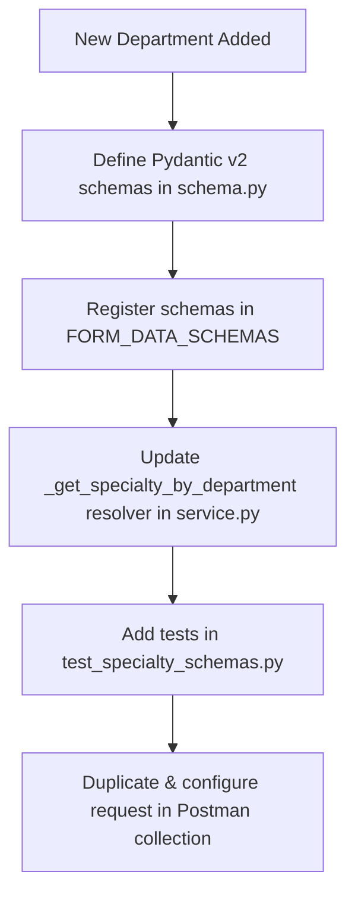

# Outpatient Department (OPD) Flow API Specification

This document provides the complete API specification for the Outpatient Department (OPD) patient journey, spanning from lobby registration to clinical finalization. 

---

## ── SECTION 1: OPD WORKFLOW OVERVIEW ──

The OPD journey is divided into sequential stages coordinated between the **Lobby/Receptionist Dashboard** and the **Doctor Consultation Workspace**.

```
[STAGE 1: Registration]  ──►  [STAGE 2: Booking]  ──►  [STAGE 3: Check-In & Billing]
          │                                                    │
          ▼                                                    ▼
[STAGE 5: Start Clinical] ◄──  [STAGE 4: Nurse Vitals] ◄───────┘
          │
          ▼
[STAGE 6: Clinical Forms] ──►  [STAGE 7: SOAP Notes]  ──►  [STAGE 8: Prescriptions]
                                                                  │
                                                                  ▼
                                                      [STAGE 9: Finalize Consult]
```

---

## ── SECTION 2: STAGE-BY-STAGE API SPECIFICATION ──

### STAGE 1: Patient Registration (Lobby/Reception)
Used to register a new patient in the hospital system.

* **Endpoint**: `POST /patients/register`
* **Service**: Patient Service (`services/patient`)
* **Required Permission**: `patients:create`

#### Request Body Schema
| Field | Type | Required? | Constraints / Description |
| :--- | :--- | :--- | :--- |
| `full_name` | String | **Mandatory** | Min length: 2, Max length: 100 characters. |
| `phone` | String | **Mandatory** | Min length: 10, Max length: 50 characters. Strips non-digits. |
| `age` | Integer | **Mandatory** | Must be between `0` and `150`. |
| `dob` | Date | Optional | Format: `YYYY-MM-DD`. |
| `gender` | String | Optional | Must be: `MALE`, `FEMALE`, `OTHER`, or `UNKNOWN`. |
| `blood_group`| String | Optional | Must be: `A+`, `A-`, `B+`, `B-`, `AB+`, `AB-`, `O+`, `O-`, or `UNKNOWN`. |
| `address` | Object | Optional | Nested `Address` object (see structure below). |
| `abha_number`| String | Optional | Max length: 100 characters. |
| `abha_address`| String | Optional | PHR Address. Max length: 255 characters. |

##### Address Sub-Object Structure:
* `line1` (String, Optional): Max 255 chars.
* `city` (String, Optional): Max 100 chars.
* `state` (String, Optional): Max 100 chars.
* `pincode` (String, Optional): Max 20 chars.

#### Example Request Body
```json
{
  "full_name": "Jane Doe",
  "phone": "+919999999999",
  "age": 29,
  "gender": "FEMALE",
  "blood_group": "O+",
  "address": {
    "line1": "Flat 302, Sector 12",
    "city": "Bengaluru",
    "state": "Karnataka",
    "pincode": "560001"
  }
}
```

#### Example Response Body
```json
{
  "statusCode": 201,
  "message": "Patient registered successfully",
  "data": {
    "id": "e302008e-5b12-421c-a111-9a99fcd23b89",
    "uhid": "PAT-2026-0010",
    "full_name": "Jane Doe",
    "phone": "+919999999999",
    "age": 29,
    "gender": "FEMALE",
    "blood_group": "O+"
  }
}
```

---

### STAGE 2: Create Appointment (Lobby/Booking)
Used to book a draft appointment for the patient. The appointment is created with a `PENDING_PAYMENT` status.

* **Endpoint**: `POST /opd/appointments`
* **Service**: OPD Service (`services/opd`)
* **Required Permission**: `appointments:book`

#### Request Body Schema
| Field | Type | Required? | Constraints / Description |
| :--- | :--- | :--- | :--- |
| `patient_id` | String (UUID) | **Mandatory** | The UUID of the registered patient. |
| `doctor_id` | String (UUID) | **Mandatory** | The UUID of the selected doctor. |
| `department_id`| String (UUID)| **Mandatory** | The UUID of the department. |
| `appointment_time`| DateTime | **Mandatory** | Timezone-aware ISO-8601 string. Must be in the future. |
| `appointment_type`| String | Optional | One of: `NEW`, `FOLLOW_UP`, `EMERGENCY`. Default: `NEW`. |
| `is_emergency` | Boolean | Optional | Default: `false`. If true, forces priority to `10`. |
| `priority` | Integer | Optional | Min: `0`, Max: `10`. Default: `0`. |
| `notes` | String | Optional | Free text notes. Max length: 2000 characters. |

#### Example Request Body
```json
{
  "patient_id": "e302008e-5b12-421c-a111-9a99fcd23b89",
  "doctor_id": "97d2a10d-1b8a-40b4-a37a-5daf4e35f630",
  "department_id": "46d19155-09a1-462e-b256-ce2a5741b091",
  "appointment_time": "2026-06-16T10:30:00Z",
  "appointment_type": "NEW",
  "is_emergency": false,
  "priority": 1,
  "notes": "Requires surgical evaluation"
}
```

#### Example Response Body
```json
{
  "statusCode": 200,
  "data": {
    "id": "2babb5b6-1b1d-45fb-92f6-ef47508160f2",
    "patient_id": "e302008e-5b12-421c-a111-9a99fcd23b89",
    "doctor_id": "97d2a10d-1b8a-40b4-a37a-5daf4e35f630",
    "department_id": "46d19155-09a1-462e-b256-ce2a5741b091",
    "appointment_time": "2026-06-16T10:30:00Z",
    "status": "PENDING_PAYMENT",
    "payment_status": "PENDING",
    "priority": 1
  }
}
```

---

### STAGE 3: Confirm Appointment & Check-In (Lobby/Billing)
Confirm payment for the draft appointment, which automatically marks the patient as checked-in (`SCHEDULED` / arrived status) and generates a lobby queue token.

* **Endpoint**: `POST /opd/appointments/{appointment_id}/confirm`
* **Service**: OPD Service (`services/opd`)
* **Required Permission**: `appointments:edit`

#### Request Body Schema
| Field | Type | Required? | Constraints / Description |
| :--- | :--- | :--- | :--- |
| `payment_status`| String | **Mandatory** | Must be: `PAID` or `WAIVED`. |
| `payment_mode` | String | Optional | One of: `CASH`, `UPI`, `CARD`, `WAIVED`. Mandatory if `payment_status` is `PAID`. |
| `amount_paid` | Float | Optional | Must be `>= 0.0`. Mandatory if `payment_status` is `PAID`. |
| `payment_ref` | String | Optional | Reference ID/Txn hash. Max length: 200 characters. |

#### Example Request Body
```json
{
  "payment_status": "PAID",
  "payment_mode": "CASH",
  "amount_paid": 500.0,
  "payment_ref": "REF-783921"
}
```

#### Example Response Body
```json
{
  "statusCode": 200,
  "data": {
    "id": "2babb5b6-1b1d-45fb-92f6-ef47508160f2",
    "status": "SCHEDULED",
    "payment_status": "PAID",
    "token_number": 6,
    "opd_visit_id": "bfb74b69-3e09-449d-85b6-5e13c03cffb3"
  }
}
```

---

### STAGE 4: Record Nurse Vitals (Clinical Vitals Area)
Record patient vital signs. Stored in `clinical.vitals` with full branch compliance.

* **Endpoint**: `POST /patients/{patient_id}/vitals`
* **Service**: Patient Service (`services/patient`)
* **Required Permission**: `patients:edit`

#### Path Parameters
* `patient_id` (UUID): The UUID of the patient.

#### Request Body Schema
| Field | Type | Required? | Constraints / Description |
| :--- | :--- | :--- | :--- |
| `recorded_at` | String (ISO) | **Mandatory** | Timestamp of vitals recording. Format: `YYYY-MM-DDTHH:MM:SSZ`. |
| `bp_systolic` | Integer | Optional | Must be between `50` and `250`. |
| `bp_diastolic`| Integer | Optional | Must be between `30` and `150`. |
| `pulse` | Integer | Optional | Heart rate in BPM. Must be between `30` and `250`. |
| `weight` | Float | Optional | Weight in kg. Must be greater than `0.0`. |
| `temperature` | Float | Optional | Temperature in **Celsius**. Must be between `30.0` and `45.0`. |
| `spo2` | Integer | Optional | Oxygen saturation %. Must be between `0` and `100`. |
| `respiratory_rate`| Integer| Optional | Must be between `5` and `50`. |
| `blood_sugar` | Integer | Optional | Must be between `10` and `999`. |
| `pain_score` | Integer | Optional | Must be between `0` and `10`. |
| `notes` | String | Optional | Max 1000 characters. |

#### Example Request Body
```json
{
  "recorded_at": "2026-06-23T11:15:00Z",
  "bp_systolic": 120,
  "bp_diastolic": 80,
  "pulse": 72,
  "weight": 75.0,
  "temperature": 37.0,
  "spo2": 99
}
```

#### Example Response Body
```json
{
  "statusCode": 200,
  "message": "Vitals signs recorded successfully",
  "data": {
    "id": "226d52e0-2afd-4005-a41c-e022f7efd4bf",
    "patient_id": "e302008e-5b12-421c-a111-9a99fcd23b89",
    "bp_systolic": 120,
    "bp_diastolic": 80,
    "pulse": 72,
    "weight": 75.0,
    "temperature": 37.0,
    "spo2": 99,
    "recorded_by": "c1a88b56-78e2-411a-8cfa-505697eaee2a",
    "recorded_at": "2026-06-23T11:15:00Z"
  }
}
```

---

### STAGE 5: Start Consultation (Doctor Workspace)
Flips the OPD visit status to `IN_PROGRESS` and initializes the clinical consultation record.

* **Endpoint**: `POST /opd/visits/{id}/start`
* **Service**: OPD Service (`services/opd`)
* **Required Permission**: `appointments:edit`

#### Request Body Schema (`POST /opd/visits/{id}/start`)
| Field | Type | Required? | Constraints / Description |
| :--- | :--- | :--- | :--- |
| `chief_complaint`| String | Optional | Brief complaint details. Max 2000 characters. |

#### Example Request Body (`POST /opd/visits/{id}/start`)
```json
{
  "chief_complaint": "Severe upper abdominal discomfort after meals"
}
```

#### Example Response Body
```json
{
  "statusCode": 200,
  "message": "Consultation started",
  "data": {
    "opd_visit_id": "bfb74b69-3e09-449d-85b6-5e13c03cffb3",
    "consultation_id": "d1ed6906-fdd4-4b82-b5e5-779ffcb5ce15",
    "patient_id": "e302008e-5b12-421c-a111-9a99fcd23b89",
    "status": "IN_PROGRESS",
    "started_at": "2026-06-15T12:02:15Z"
  }
}
```

---

### STAGE 6: Save Specialty Consultation Form (Doctor Workspace)
Used to save structured, specialty-specific consultation inputs (e.g., CURRENT_SYMPTOMS, EXAMINATION_FINDINGS, etc.) linked to a department.

* **Endpoint**: `PUT /clinical/consultations/{consultation_id}/forms/{form_type}`
* **Service**: Clinical Service (`services/clinical`)
* **Required Permission**: `consultations:edit`

#### Path Parameters
* `consultation_id` (UUID): Clinical consultation anchor UUID.
* `form_type` (String): Schema type code (e.g., `CURRENT_SYMPTOMS`, `EXAMINATION_FINDINGS`, `ASSESSMENT_PLAN`).

#### Request Body Schema
| Field | Type | Required? | Constraints / Description |
| :--- | :--- | :--- | :--- |
| `department_id`| String (UUID)| **Mandatory** | The department UUID. Allows overriding (e.g., Gastrotology). |
| `form_data` | Object | **Mandatory** | JSON structure matching the schema rules of the `form_type`. |

#### Example Request Body
```json
{
  "department_id": "7e82df0e-686b-4a73-9957-badf52458327",
  "form_data": {
    "pain": {
      "location": "Epigastric",
      "nature": "Burning",
      "severity": 6,
      "trigger": "Spicy food"
    },
    "bowel_habits": {
      "consistency": "Normal",
      "frequency": "Once daily"
    }
  }
}
```

#### Example Response Body
```json
{
  "statusCode": 200,
  "message": "Form 'CURRENT_SYMPTOMS' saved",
  "data": {
    "id": "c13cafa2-a9ae-4fbb-b04d-054a9253c3e1",
    "consultation_id": "d1ed6906-fdd4-4b82-b5e5-779ffcb5ce15",
    "department_id": "7e82df0e-686b-4a73-9957-badf52458327",
    "form_type": "CURRENT_SYMPTOMS",
    "form_data": {
      "pain": {
        "location": "Epigastric",
        "nature": "Burning",
        "severity": 6,
        "trigger": "Spicy food"
      },
      "bowel_habits": {
        "consistency": "Normal",
        "frequency": "Once daily"
      }
    }
  }
}
```

#### ── EXTENSIBILITY: ADDING NEW DEPARTMENTS & SPECIALTIES ──

The HMS clinical service uses a dynamic schema resolver to validate incoming consultation forms based on the department UUID. If a new department/specialty is added to the system, follow this developer flow to ensure structured clinical data is validated and integrated correctly.



##### 1. Backend Codebase Integration

###### Step A: Define the Validation Schemas
In [schema.py](file:///c:/Users/saika/OneDrive/Desktop/Arovita/ops-hms-ljb/services/clinical/app/schemas/schema.py), create Pydantic v2 models representing the new specialty's clinical constraints. 
* All new schemas should inherit from `ClinicalBase`.
* To support saving partial/draft documents, make all fields optional.
* Use appropriate field validations, lists, and nested objects to match clinical parameters.

*Example (for an Ophthalmology department):*
```python
class OphthalmologyCurrentSymptomsFormData(ClinicalBase):
    sex: Optional[str] = None
    visual_acuity_complaint: Optional[list[str]] = None
    eye_pain_severity: Optional[int] = None  # Scale 1-10
```

###### Step B: Register the Validation Schemas
In the `FORM_DATA_SCHEMAS` map inside [schema.py](file:///c:/Users/saika/OneDrive/Desktop/Arovita/ops-hms-ljb/services/clinical/app/schemas/schema.py), map the uppercase composite keys (format: `[SPECIALTY]_[FORM_TYPE]`) to the newly created classes.

```python
FORM_DATA_SCHEMAS: dict[str, type] = {
    # Existing mappings...
    
    # Ophthalmology Specialty
    "OPHTHALMOLOGY_CURRENT_SYMPTOMS": OphthalmologyCurrentSymptomsFormData,
    "OPHTHALMOLOGY_EXAMINATION_FINDINGS": OphthalmologyExaminationFindingsFormData,
    "OPHTHALMOLOGY_ASSESSMENT_PLAN": OphthalmologyAssessmentPlanFormData,
    "OPHTHALMOLOGY_SURGICAL_LOGISTICS": OphthalmologySurgicalLogisticsFormData,
}
```

###### Step C: Update the Specialty Resolver
In [service.py](file:///c:/Users/saika/OneDrive/Desktop/Arovita/ops-hms-ljb/services/clinical/app/core/service.py), update the helper function `_get_specialty_by_department(conn, department_id)` to resolve the new department name to its specialty suffix.
* Perform a case-insensitive substring search on the department's database name.
* Return the exact uppercase specialty prefix (matching what you registered in `FORM_DATA_SCHEMAS`).

```python
def _get_specialty_by_department(conn, department_id: str) -> str:
    # Existing code...
    name = row["name"].lower()
    
    if "dental" in name:
        return "DENTAL"
    # ...
    if "ophthalm" in name:
        return "OPHTHALMOLOGY"
        
    return ""
```

###### Step D: Write Unit Tests
Add unit tests in [test_specialty_schemas.py](file:///c:/Users/saika/OneDrive/Desktop/Arovita/ops-hms-ljb/scratch/test_specialty_schemas.py) (under `TestSpecialtySchemas`) to verify the resolver maps the department UUID correctly and that the validation rules capture both correct and malformed payloads.

Run the unit tests:
```powershell
python -m unittest scratch/test_specialty_schemas.py
```

> [!IMPORTANT]
> If a department/specialty is not registered in `FORM_DATA_SCHEMAS`, the resolver falls back to the default schema for the `form_type` (e.g. `CURRENT_SYMPTOMS` maps to `CurrentSymptomsFormData`). If the fallback key is also missing, the system stores the payload as raw JSONB without validation. This guarantees backward compatibility and prevents blocking workflows for unconfigured departments.

---

##### 2. Postman Collection Integration

To ensure frontend clients and QA workflows can test the newly added department, you must update the API test collection:

1. **Locate the Collection File**: The outpatient collection is stored at [opd_flow_postman_collection.json](file:///c:/Users/saika/OneDrive/Desktop/Arovita/ops-hms-ljb/postman/opd_flow_postman_collection.json).
2. **Import into Postman**: Import this collection into your Postman workspace.
3. **Duplicate an Existing Specialty Request**: Find the existing Stage 6 requests (e.g., `6a. Save Specialty Consultation Form - Dental` under Stage 6). Right-click and choose **Duplicate**.
4. **Rename the Request**: Format as `6e. Save Specialty Consultation Form - [New Specialty]`.
5. **Configure request parameters**:
   * **URL**: Ensure it points to `{{clinical_base_url}}/clinical/consultations/{{consultation_id}}/forms/CURRENT_SYMPTOMS` (or another appropriate form step).
   * **Headers**: Verify `Authorization: Bearer {{access_token}}` and `Content-Type: application/json` are present.
   * **Body**: Update the JSON payload structure:
     * Set `department_id` to the UUID representing the new department.
     * Populate `form_data` with fields matching the newly created Pydantic schema constraints.
6. **Update Tests/Assertions**: In the **Tests** tab of the request, update the success console logs or assertions:
   ```javascript
   if (pm.response.code === 200) {
       console.log("Ophthalmology consultation form saved successfully.");
   }
   ```
7. **Export & Commit**: Export the updated collection from Postman and save it to [opd_flow_postman_collection.json](file:///c:/Users/saika/OneDrive/Desktop/Arovita/ops-hms-ljb/postman/opd_flow_postman_collection.json). Commit the changes to version control.

---

### STAGE 7: Create EMR SOAP Note (Doctor Workspace)
Saves patient SOAP clinical documentation (Subjective, Objective, Assessment, Plan).

* **Endpoint**: `POST /clinical/notes`
* **Service**: Clinical Service (`services/clinical`)
* **Required Permission**: `notes:create`

#### Request Body Schema
| Field | Type | Required? | Constraints / Description |
| :--- | :--- | :--- | :--- |
| `patient_id` | String (UUID) | **Mandatory** | Patient UUID. |
| `note_type` | String | **Mandatory** | Must be: `SOAP`, `PROGRESS`, `CLINICAL`, etc. SOAP requires nested details. |
| `priority` | String | Optional | One of: `ROUTINE`, `URGENT`, `EMERGENCY`, `CRITICAL`. Default: `ROUTINE`. |
| `title` | String | Optional | Custom title. Max 500 characters. |
| `note_text` | String | Optional | Text description (Required if `note_type` is NOT SOAP). |
| `consultation_id`| String (UUID)| Optional | Consultation UUID anchor. |
| `department_id`| String (UUID)| Optional | Override department ID. |
| `soap_subjective`| Object | Optional | Subjective notes (`text` and list of `items` tags). |
| `soap_objective` | Object | Optional | Objective notes (`text` and `findings` key-values). |
| `soap_assessment`| Object | Optional | Assessment notes (`text` and list of `diagnoses`). |
| `soap_plan` | Object | Optional | Management plan notes (`text` and list of `actions`). |

#### Example Request Body
```json
{
  "patient_id": "e302008e-5b12-421c-a111-9a99fcd23b89",
  "note_type": "SOAP",
  "priority": "ROUTINE",
  "title": "Gastroenterology Assessment",
  "consultation_id": "d1ed6906-fdd4-4b82-b5e5-779ffcb5ce15",
  "department_id": "7e82df0e-686b-4a73-9957-badf52458327",
  "soap_subjective": {
    "text": "Patient complains of recurrent burning pain in the epigastric region.",
    "items": ["Epigastric burning", "Nausea after heavy meals"]
  },
  "soap_objective": {
    "text": "Abdomen soft, mild tenderness in epigastrium. Vitals stable."
  },
  "soap_assessment": {
    "text": "Suspected chronic gastritis. Differential diagnosis: GERD."
  },
  "soap_plan": {
    "text": "1. Advised light diet.\n2. Prescribed Pantoprazole."
  }
}
```

#### Example Response Body
```json
{
  "statusCode": 201,
  "message": "Clinical note created",
  "data": {
    "id": "482a5255-1040-47a1-ac73-cea9be07b43c",
    "patient_id": "e302008e-5b12-421c-a111-9a99fcd23b89",
    "note_type": "SOAP",
    "title": "Gastroenterology Assessment",
    "department_id": "7e82df0e-686b-4a73-9957-badf52458327"
  }
}
```

---

### STAGE 8: Create Pharmacy Order (Doctor Workspace)
Saves patient context-aware pharmacy prescription medicine details.

* **Endpoint**: `POST /pharmacy`
* **Service**: Pharmacy Service (`services/pharmacy`)
* **Required Permission**: `prescriptions:write`

#### Request Body Schema
| Field | Type | Required? | Constraints / Description |
| :--- | :--- | :--- | :--- |
| `patient_id` | String (UUID) | **Mandatory** | The patient ID UUID. |
| `doctor_id` | String (UUID) | **Mandatory** | The prescribing doctor's UUID. |
| `context_type` | String | **Mandatory** | Context type enum value. Must be: `OPD_VISIT`, `IPD_ADMISSION`, `IPD_ROUND`, `SURGERY`, `ICU`, `EMERGENCY`, `DISCHARGE`, `CONSULTATION`. |
| `context_id` | String (UUID) | **Mandatory** | Context UUID (e.g. `opd_visit_id` or `admission_id`). |
| `source_module` | String | **Mandatory** | Originating module enum value. Must be: `OPD`, `IPD`, `OT`, `ICU`, `EMERGENCY`, `DISCHARGE`. |
| `encounter_type`| String | **Mandatory** | Encounter type enum value. Must be: `CONSULTATION`, `WARD_ROUND`, `SURGERY`, `POST_OP`, `TRANSFER`, `DISCHARGE`, `EMERGENCY`. |
| `items` | Array | **Mandatory** | List of medicine items (1 to 30 items). |
| `allergy_checked`| Boolean | Optional | Allergy checked flag. Default: `false`. |
| `interaction_checked`| Boolean| Optional | Drug interaction checked flag. Default: `false`. |
| `generic_suggested`| Boolean | Optional | Generic alternative recommended flag. Default: `false`. |
| `valid_till` | Date | Optional | Expiration date of the prescription. |
| `notes` | String | Optional | Prescription notes. |

##### Prescription Item Schema:
* `medicine_id` (String UUID, Optional): Catalogue ID of the medicine. If provided, `medicine_name` and `generic_name` are automatically resolved from the central catalogue.
* `medicine_name` (String, Optional): Free-text medicine name. Mandatory if `medicine_id` is not supplied.
* `generic_name` (String, Optional): Free-text generic drug name.
* `route` (String, Optional): E.g., `ORAL`, `IV`, `IM`, `TOPICAL`. Default: `ORAL`.
* `dosage` (String, Mandatory): E.g., `"1 tablet"`, `"5ml"`. Max 50 chars.
* `frequency` (String, Mandatory): E.g., `"Once daily before food"`. Max 30 chars.
* `duration_days` (Integer, Optional): Duration. Min: 1, Max: 365 days.
* `morning_dose` / `afternoon_dose` / `evening_dose` / `night_dose` (Boolean, Optional): Dosing schedule. Default: `false`.
* `with_food` (Boolean, Optional): Default: `false`.
* `instructions` (String, Optional): E.g., `"Take 30 mins before breakfast"`.

#### Example Request Body
```json
{
  "patient_id": "e302008e-5b12-421c-a111-9a99fcd23b89",
  "doctor_id": "97d2a10d-1b8a-40b4-a37a-5daf4e35f630",
  "context_type": "OPD_VISIT",
  "context_id": "bfb74b69-3e09-449d-85b6-5e13c03cffb3",
  "source_module": "OPD",
  "encounter_type": "CONSULTATION",
  "allergy_checked": true,
  "interaction_checked": true,
  "generic_suggested": true,
  "notes": "Prescribed during OPD consultation.",
  "items": [
    {
      "medicine_name": "Pantoprazole 40mg",
      "generic_name": "Pantoprazole",
      "route": "ORAL",
      "dosage": "1 tablet",
      "frequency": "Once daily before food",
      "duration_days": 7,
      "morning_dose": true,
      "with_food": false,
      "instructions": "Take 30 minutes before breakfast"
    }
  ]
}
```

#### Example Response Body
```json
{
  "statusCode": 201,
  "data": {
    "id": "f4406cbf-469d-4ad9-846d-66c6d826f45b",
    "branch_id": "8b9e6fa4-8e10-48e0-bb1a-f7831cd890a8",
    "doctor_id": "97d2a10d-1b8a-40b4-a37a-5daf4e35f630",
    "patient_id": "e302008e-5b12-421c-a111-9a99fcd23b89",
    "context_type": "OPD_VISIT",
    "context_id": "bfb74b69-3e09-449d-85b6-5e13c03cffb3",
    "source_module": "OPD",
    "encounter_type": "CONSULTATION",
    "status": "SIGNED",
    "version_no": 1,
    "items": [
      {
        "id": "item-uuid-12345",
        "medicine_name": "Pantoprazole 40mg",
        "route": "ORAL",
        "dosage": "1 tablet",
        "frequency": "Once daily before food"
      }
    ]
  }
}
```

---

### STAGE 9: Finalize Consultation (Lobby Checkout / Completion)
Closes the OPD visit. Moves the visit status to `COMPLETED`, records the final clinical decision, and marks the appointment as completed.

* **Endpoint**: `POST /opd/visits/{id}/complete`
* **Service**: OPD Service (`services/opd`)
* **Required Permission**: `appointments:edit`

#### Request Body Schema (`/opd/visits/{id}/complete`)
| Field | Type | Required? | Constraints / Description |
| :--- | :--- | :--- | :--- |
| `decision` | String | **Mandatory** | Clinical dispatch decision. Literal value from enum: `MEDICAL`, `SURGERY`, `PROCEDURE`, `FOLLOW_UP`, `ADMIT`, `LAB_ORDER`, `DIAGNOSIS`, `DIAGNOSTICS`, `REFERRAL`, `PHARMACY`, `OTHER`. |
| `diagnosis` | String | Optional | Final medical diagnosis description. Max: 2000 characters. |
| `follow_up_notes` | String | Optional | Follow-up review notes. Max 2000 characters. |
| `follow_up_date` | Date | Optional | Future follow-up date (YYYY-MM-DD). Must be in the future. Mandatory if `decision` is `FOLLOW_UP`. |

#### Example Request Body (`/opd/visits/{id}/complete`)
```json
{
  "decision": "MEDICAL",
  "diagnosis": "Gastro-esophageal reflux disease / Chronic Gastritis",
  "follow_up_notes": "Return if pain persists or worsens.",
  "follow_up_date": "2026-06-22"
}
```

#### Example Response Body
```json
{
  "statusCode": 200,
  "data": {
    "id": "bfb74b69-3e09-449d-85b6-5e13c03cffb3",
    "branch_id": "8b9e6fa4-8e10-48e0-bb1a-f7831cd890a8",
    "patient_id": "46fc39d8-7c4e-4704-9430-f82d6dcfa34c",
    "appointment_id": "d1ed6906-fdd4-4b82-b5e5-779ffcb5ce15",
    "visit_number": "OPD-20260616-0001",
    "visit_date": "2026-06-16",
    "status": "COMPLETED",
    "decision": "MEDICAL",
    "diagnosis": "Gastro-esophageal reflux disease / Chronic Gastritis",
    "follow_up_date": "2026-06-22",
    "follow_up_notes": "Return if pain persists or worsens."
  },
  "message": "Consultation completed"
}
```

---

## ── SECTION 3: REFERENCE & ENUM VALUES ──

This section lists all valid options (enums/literals) for fields across the OPD flow API schemas:

### 3.1 Patient Registration Options
* **`gender`**:
  * `"MALE"` (accepts `"M"`)
  * `"FEMALE"` (accepts `"F"`)
  * `"OTHER"` (accepts `"O"`)
  * `"UNKNOWN"`
* **`blood_group`**:
  * `"A+"`, `"A-"`, `"B+"`, `"B-"`, `"AB+"`, `"AB-"`, `"O+"`, `"O-"`
  * `"UNKNOWN"`

### 3.2 Appointment Booking Options
* **`appointment_type`**:
  * `"NEW"`
  * `"FOLLOW_UP"`
  * `"EMERGENCY"`
* **`priority`**: Integer between `0` and `10` (inclusive).

### 3.3 Confirmation & Payment Options
* **`payment_status`**:
  * `"PAID"`
  * `"WAIVED"`
* **`payment_mode`**:
  * `"CASH"`
  * `"UPI"`
  * `"CARD"`
  * `"WAIVED"` (required if `payment_status` is `WAIVED`)

### 3.4 Consultation Forms Options
* **`form_type`** (Path parameter):
  * `"CURRENT_SYMPTOMS"`
  * `"EXAMINATION_FINDINGS"`
  * `"ASSESSMENT_PLAN"`

### 3.5 EMR SOAP Notes Options
* **`note_type`**:
  * `"SOAP"`
  * `"PROGRESS"`
  * `"CLINICAL"`
  * `"CRITICAL_ALERT"`
  * `"DISCHARGE"`
  * `"FOLLOW_UP"`
  * `"NURSING"`
  * `"PROCEDURE"`
  * `"POST_OP"`
  * `"PRE_OP"`
* **`priority`**:
  * `"ROUTINE"`
  * `"URGENT"`
  * `"EMERGENCY"`
  * `"CRITICAL"`

### 3.6 Medicine Route Options
* **`route`**:
  * `"ORAL"`
  * `"IV"`
  * `"IM"`
  * `"SC"` (Subcutaneous)
  * `"TOPICAL"`
  * `"INHALATION"`
  * `"SUBLINGUAL"`
  * `"RECTAL"`
  * `"NASAL"`
  * `"OPHTHALMIC"`
  * `"OTIC"`

### 3.7 Consultation Finalization Options
* **`decision`**:
  * `"MEDICAL"`
  * `"SURGERY"`
  * `"PROCEDURE"`
  * `"FOLLOW_UP"`
  * `"ADMIT"`
  * `"LAB_ORDER"`
  * `"DIAGNOSIS"`
  * `"DIAGNOSTICS"`
  * `"REFERRAL"`
  * `"PHARMACY"`
  * `"OTHER"`

### 3.8 Context-Aware Order Options
* **`context_type`**:
  * `"OPD_VISIT"`
  * `"IPD_ADMISSION"`
  * `"IPD_ROUND"`
  * `"SURGERY"`
  * `"ICU"`
  * `"EMERGENCY"`
  * `"DISCHARGE"`
  * `"CONSULTATION"`
* **`source_module`**:
  * `"OPD"`
  * `"IPD"`
  * `"OT"`
  * `"ICU"`
  * `"EMERGENCY"`
  * `"DISCHARGE"`
* **`encounter_type`**:
  * `"CONSULTATION"`
  * `"WARD_ROUND"`
  * `"SURGERY"`
  * `"POST_OP"`
  * `"TRANSFER"`
  * `"DISCHARGE"`
  * `"EMERGENCY"`

### 3.9 Clinical Catalog Lookup Endpoints

#### 3.9.1 View Medicine Catalogue
Retrieves the list of medicines configured in the hospital's central pharmacy catalogue.

* **Endpoint**: `GET /pharmacy/medicines`
* **Service**: Pharmacy Service (`services/pharmacy`)
* **Required Permission**: `prescriptions:read`

**Response `200 OK`**
```json
{
  "success": true,
  "data": [
    {
      "id": "med-uuid-1",
      "name": "Pantoprazole 40mg",
      "generic_name": "Pantoprazole",
      "dosage_form": "TABLET",
      "strength": "40mg"
    },
    {
      "id": "med-uuid-2",
      "name": "Paracetamol 650mg",
      "generic_name": "Paracetamol",
      "dosage_form": "TABLET",
      "strength": "650mg"
    }
  ]
}
```

#### 3.9.2 View Lab Tests Catalogue
Retrieves the list of lab and radiology tests configured in the hospital's diagnostic laboratory catalogue.

* **Endpoint**: `GET /diagnostic-orders/tests`
* **Query Parameters**:
  * `type` (String, Optional): Filters tests by classification. Must be one of:
    * `lab` - Returns only lab tests (specimen-based, e.g., Haematology, Biochemistry)
    * `radiology` - Returns only radiology/imaging and allied diagnostic scans (non-specimen)
    * (Omitting returns all tests)
* **Service**: Diagnostics Service (`services/diagnostics`)
* **Required Permission**: `diagnostics:read`
* **Performance Note**: Queries are optimized using PostgreSQL partial indexes (`idx_lab_tests_active_labs` and `idx_lab_tests_active_radiology`) scoped directly to active classification lists.

**Response `200 OK` (when querying with no filter)**
```json
{
  "success": true,
  "data": [
    {
      "id": "test-uuid-1",
      "name": "Complete Blood Count (CBC)",
      "department": "PATHOLOGY",
      "test_code": "CBC"
    },
    {
      "id": "test-uuid-2",
      "name": "Chest X-Ray PA View",
      "department": "RADIOLOGY",
      "test_code": "CXR_PA"
    }
  ]
}
```

---

## ── SECTION 4: RECEPTION DASHBOARD ──

The Reception Dashboard gives a real-time operational snapshot for receptionists and admins. Previously served by the `ops` service, these endpoints are now part of the OPD service.

---

### Dashboard — Today

Returns today's appointment statistics and doctor availability summary.

* **Endpoint**: `GET /opd/dashboard`
* **Service**: OPD Service (`services/opd`)
* **Required Permission**: `dashboard:view`

#### Example Response Body
```json
{
  "success": true,
  "code": 200,
  "data": {
    "date": "2026-06-17",
    "tenant_id": "tenant-uuid",
    "total_appointments": 42,
    "scheduled": 18,
    "in_progress": 5,
    "completed": 14,
    "no_show": 3,
    "cancelled": 2,
    "emergency_count": 1,
    "walkin_count": 4,
    "pending_payment": 6,
    "doctors": [
      {
        "doctor_id": "97d2a10d-1b8a-40b4-a37a-5daf4e35f630",
        "doctor_name": "Dr. Anjali Sharma",
        "department_id": "46d19155-09a1-462e-b256-ce2a5741b091",
        "department_name": "Cardiology",
        "scheduled_count": 10,
        "completed_count": 6,
        "in_progress": true,
        "is_available": true
      }
    ]
  }
}
```

---

### Dashboard — Specific Date

Returns appointment statistics and doctor availability for a given date.

* **Endpoint**: `GET /opd/dashboard/date/{YYYY-MM-DD}`
* **Service**: OPD Service (`services/opd`)
* **Required Permission**: `dashboard:view`

#### Path Parameters
| Parameter | Type | Description |
|-----------|------|-------------|
| `YYYY-MM-DD` | Date | Target date in ISO format (e.g., `2026-06-17`) |

#### Example Request
```http
GET /opd/dashboard/date/2026-06-17
Authorization: Bearer <token>
```

#### Example Response Body
Same structure as the Today endpoint, with `date` set to the requested date.

---

### Ward Occupancy

Returns real-time bed occupancy per ward. Useful for the receptionist to see available beds before admission.

* **Endpoint**: `GET /opd/wards/occupancy`
* **Service**: OPD Service (`services/opd`)
* **Required Permission**: `dashboard:view`

#### Example Response Body
```json
{
  "success": true,
  "code": 200,
  "data": {
    "wards": [
      {
        "ward_id": "ward-uuid",
        "ward_name": "General Ward",
        "total_beds": 30,
        "occupied_beds": 22,
        "available_beds": 8,
        "occupancy_rate": 73.3
      }
    ]
  }
}
```

---

## ── SECTION 5: EMERGENCY FLOW ──

Emergency intake is a parallel track to the standard OPD flow. A patient who arrives via emergency does **not** need a pre-booked appointment. The flow is:

```
[1. Register Temp Patient]  ──►  [2. Create Emergency Visit]  ──►  [3. Triage]
         │                                                               │
         │                                                               ▼
[6. Promote to Full Reg.] ◄──  [5. Discharge / Admit]  ◄──  [4. Update Status + Bed]
```

---

### STAGE E1: Register Temporary Patient *(Patient Service)*

When a patient arrives with unknown identity, register a placeholder first.

* **Endpoint:** `POST /patients/register-temp`
* **Service:** Patient Service
* **Required Permission:** `patients:create`

#### Example Request Body
```json
{
  "full_name": "Unknown Male Patient",
  "age": 40,
  "gender": "MALE"
}
```

#### Example Response (201 Created)
```json
{
  "success": true,
  "message": "Temporary patient registered successfully",
  "data": {
    "id": "a1b2c3d4-e5f6-7890-abcd-ef1234567890",
    "uhid": "TEMP-EMG-20260625-001",
    "is_temporary": true
  }
}
```

---

### STAGE E2: Create Emergency Visit *(OPD Service)*

Register the clinical emergency encounter for the patient.

* **Endpoint:** `POST /opd/emergency`
* **Service:** OPD Service (`services/opd`)
* **Required Permission:** `emergency:create`

#### Request Body Schema
| Field | Type | Required? | Description |
| :--- | :--- | :--- | :--- |
| `patient_id` | UUID | Optional | Link to existing patient record (temp or full). |
| `full_name` | String | Optional | Patient name if not yet registered. |
| `phone` | String | Optional | Contact number. |
| `triage_level` | String | **Mandatory** | `RED`, `ORANGE`, `YELLOW`, or `GREEN`. |
| `chief_complaint` | String | Optional | Primary presenting complaint. Max 1000 chars. |
| `arrival_mode` | String | **Mandatory** | `WALK_IN`, `AMBULANCE`, `REFERRAL`, or `TRANSFER`. |
| `assigned_doctor_id` | UUID | Optional | Attending emergency doctor. |
| `assigned_bed_id` | UUID | Optional | Emergency bay or bed to assign. |
| `notes` | String | Optional | Additional notes. |

#### Example Request Body
```json
{
  "patient_id": "a1b2c3d4-e5f6-7890-abcd-ef1234567890",
  "triage_level": "RED",
  "chief_complaint": "Chest pain radiating to left arm",
  "arrival_mode": "AMBULANCE",
  "assigned_doctor_id": "doc-uuid-1234",
  "assigned_bed_id": "bed-uuid-5678"
}
```

#### Example Response (201 Created)
```json
{
  "success": true,
  "data": {
    "id": "emg-visit-uuid-001",
    "tenant_id": "branch-uuid",
    "patient_id": "a1b2c3d4-e5f6-7890-abcd-ef1234567890",
    "uhid": "TEMP-EMG-20260625-001",
    "triage_level": "RED",
    "arrival_mode": "AMBULANCE",
    "assigned_bed_id": "bed-uuid-5678",
    "status": "ARRIVED"
  }
}
```

---

### STAGE E3: Update Emergency Visit Status *(OPD Service)*

Updates the clinical status of the visit (triage level, assigned doctor, notes). This endpoint does **not** manage bed state — use the IPD service for that (see Stage E4).

* **Endpoint:** `PATCH /opd/emergency/{visit_id}/status`
* **Service:** OPD Service (`services/opd`)
* **Required Permission:** `emergency:update`
* **Path Parameters:**
  | Parameter | Type | Description |
  | :--- | :--- | :--- |
  | `visit_id` | UUID | Emergency visit ID from Stage E2. |

#### Request Body Schema
| Field | Type | Required? | Description |
| :--- | :--- | :--- | :--- |
| `status` | String | **Mandatory** | `ARRIVED`, `TRIAGED`, `UNDER_TREATMENT`, `DISCHARGED`, or `ADMITTED`. |
| `assigned_doctor_id` | UUID | Optional | Re-assign or assign an attending doctor. |
| `assigned_bed_id` | UUID | Optional | Informational link only — use IPD bed endpoint to actually change bed state. |
| `notes` | String | Optional | Clinical notes for this status change. |

#### Example Request
```json
{
  "status": "UNDER_TREATMENT",
  "assigned_doctor_id": "doc-uuid-1234",
  "notes": "Patient stabilising, under observation"
}
```

#### Example Response (200 OK)
```json
{
  "success": true,
  "data": {
    "id": "emg-visit-uuid-001",
    "status": "UNDER_TREATMENT",
    "assigned_doctor_id": "doc-uuid-1234",
    "notes": "Patient stabilising, under observation"
  }
}
```

---

### STAGE E4: Assign / Transfer / Release Emergency Bed *(IPD Service)*

Bed management for emergency patients is handled by the **IPD service** because beds are an IPD-owned resource.

* **Endpoint:** `PATCH /ipd/emergency/{visit_id}/bed`
* **Service:** IPD Service (`services/ipd`)
* **Required Permission:** `beds:edit` (IPD roles)

> **See [Section 13.1 in ipd_api_spec.md](./ipd_api_spec.md)** for the full request/response schema, atomic behaviour, and error table.

**Quick Reference:**
| Action | Body |
| :--- | :--- |
| Assign or transfer to new bed | `{ "bed_id": "<new-bed-uuid>" }` |
| Release bed (discharge/admit) | `{ "bed_id": null }` |

---


### STAGE E5: Promote Temporary Patient *(Patient Service)*

Once the patient's identity is known, upgrade the temp profile to a full registration.

* **Endpoint:** `POST /patients/{patient_id}/promote`
* **Service:** Patient Service
* **Required Permission:** `patients:edit`

See [Section 2.6 in patient_api_docs.md](./patient_api_docs.md) for full request/response schema.

---

### Emergency Dashboard *(OPD Service)*

Returns all emergency visits for a given date.

* **Endpoint:** `GET /opd/emergency/dashboard`
* **Service:** OPD Service (`services/opd`)
* **Required Permission:** `emergency:view`
* **Query Parameters:** `date` (optional, `YYYY-MM-DD`, defaults to today)

#### Example Response (200 OK)
```json
{
  "success": true,
  "data": {
    "date": "2026-06-25",
    "red_count": 2,
    "orange_count": 3,
    "yellow_count": 5,
    "green_count": 1,
    "active_count": 9,
    "visits": [
      {
        "id": "emg-visit-uuid-001",
        "full_name": "Unknown Male Patient",
        "triage_level": "RED",
        "status": "UNDER_TREATMENT",
        "assigned_bed_id": "bed-uuid-9999",
        "assigned_doctor_name": "Dr. Arjun Mehta",
        "arrived_at": "2026-06-25T07:45:00Z"
      }
    ]
  }
}
```

