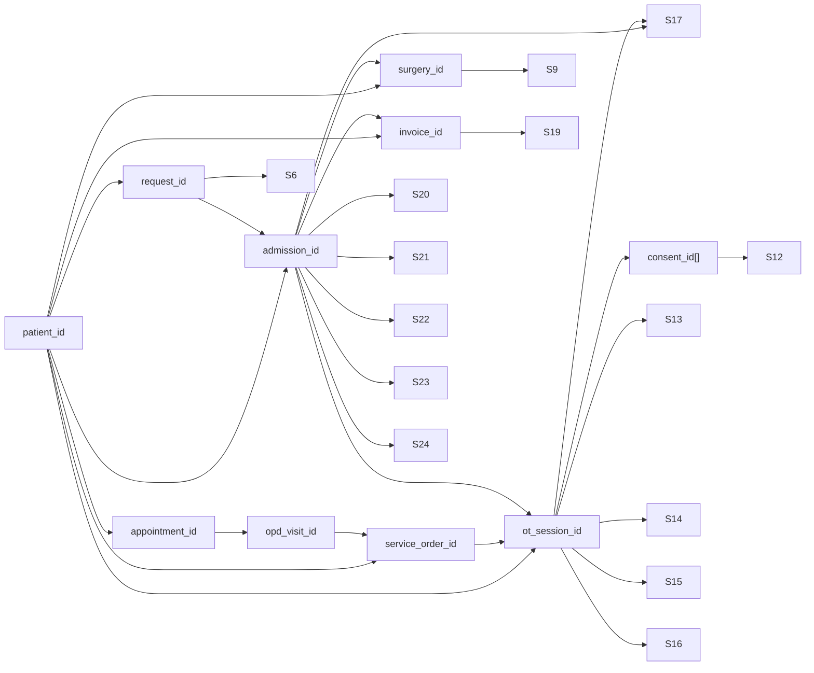

# OT / Surgery Lifecycle — Complete Sequential API Contract

> **Source of Truth**: Derived exclusively from source code analysis of `ops-hms-ljb`
> **Services Involved**: `patient`, `opd`, `ipd`, `billing`
> **Generated**: 2026-07-03

---

## Workflow Overview

```mermaid
graph TD
    subgraph "Phase 1: Patient & OPD"
        S1["Step 1: Register Patient"] -->|patient_id| S2["Step 2: Book Appointment"]
        S2 -->|appointment_id| S3["Step 3: Start OPD Consultation"]
        S3 -->|opd_visit_id| S4["Step 4: Create Surgery Order"]
    end

    subgraph "Phase 2: IPD Admission"
        S4 -->|service_order_id| S5["Step 5: Create Admission Request"]
        S5 -->|request_id| S6["Step 6: Approve Admission Request"]
        S6 --> S7["Step 7: Create IPD Admission"]
    end

    subgraph "Phase 3: Surgery Request & OT Scheduling"
        S7 -->|admission_id| S8["Step 8: Create Surgery Request"]
        S8 -->|surgery_id| S9["Step 9: Schedule Surgery"]
        S9 --> S10["Step 10: Create OT Session"]
    end

    subgraph "Phase 4: Consent & PAC"
        S10 -->|ot_session_id| S11["Step 11: Create OT Consents"]
        S11 -->|consent_ids| S12["Step 12: Sign Consents"]
        S12 --> S13["Step 13: Clear PAC"]
    end

    subgraph "Phase 5: OT Lifecycle"
        S13 --> S14["Step 14: Complete Pre-Op Checklist"]
        S14 --> S15["Step 15: Start OT Session"]
        S15 --> S16["Step 16: Complete OT Session"]
        S16 --> S17["Step 17: Transfer Out from OT"]
    end

    subgraph "Phase 6: Discharge & Billing"
        S17 --> S18["Step 18: Generate Invoice"]
        S18 -->|invoice_id| S19["Step 19: Collect Payment"]
        S19 --> S20["Step 20: Get Billing Clearance"]
        S20 --> S21["Step 21: Initiate Discharge"]
        S21 --> S22["Step 22: Update Discharge Clearance"]
        S22 --> S23["Step 23: Complete Discharge"]
        S23 --> S24["Step 24: Close Case"]
    end
```



---

## Enum Reference (Global)

| Enum Name | Values | Description |
|-----------|--------|-------------|
| `Gender` | `MALE`, `FEMALE`, `OTHER`, `UNKNOWN` | Patient gender |
| `BloodGroup` | `A+`, `A-`, `B+`, `B-`, `AB+`, `AB-`, `O+`, `O-`, `UNKNOWN` | Blood group |
| `AdmissionSourceType` | `OPD`, `EMERGENCY`, `TELECONSULTATION`, `REFERRAL`, `WALK_IN`, `DIALYSIS`, `ONCOLOGY`, `DAY_CARE` | Source of admission request |
| `AdmissionType` | `ELECTIVE`, `EMERGENCY`, `TRANSFER` | Type of admission |
| `AdmissionPriority` | `ROUTINE`, `URGENT`, `EMERGENCY` | Priority level |
| `AdmissionRequestStatus` | `REQUESTED`, `UNDER_REVIEW`, `READY`, `CANCELLED`, `EXPIRED`, `CONVERTED` | Request lifecycle status |
| `IPDLifecycle` | `ADMITTED` → `UNDER_TREATMENT` → `READY_FOR_DISCHARGE` → `DISCHARGED` | Clinical care plan stages |
| `IPDRecordStatus` | `ADMITTED`, `DISCHARGED`, `ABSCONDED`, `DECEASED`, `TRANSFERRED_OUT`, `DAMA_DISCHARGED` | Record-level closure types |
| `SurgeryRequestStatus` | `REQUESTED`, `OT_SCHEDULED`, `IN_OT`, `COMPLETED` | Surgery request lifecycle |
| `OTSessionStatus` | `SCHEDULED`, `PRE_OP`, `IN_PROGRESS`, `POST_OP`, `COMPLETED` | OT session lifecycle |
| `ConsentCode` | `SURGICAL`, `ANAESTHESIA`, `PROCEDURE`, `BLOOD_TRANSFUSION`, `HIGH_RISK`, `IMPLANT_DEVICE`, `RESEARCH`, `PHOTOGRAPHY_VIDEO`, `BLOOD_TISSUE_SAMPLE`, `HIV_INFECTIOUS`, `PHYSICIAN_FITNESS` | Consent type codes |
| `MandatoryConsentCodes` | `SURGICAL`, `ANAESTHESIA`, `PROCEDURE` | Must be SIGNED before PAC clearance |
| `ConsentStatus` | `PENDING`, `SIGNED` | Consent signature status |
| `SignatureType` | `DIGITAL` (default) | How consent was signed |
| `SurgeryOrderType` | `SURGERY`, `PROCEDURE` | Service order type |
| `SurgeryPriority` | `ROUTINE`, `URGENT`, `EMERGENCY` | Surgery priority |
| `SurgeryOrderStatus` | `ORDERED`, `SCHEDULED`, `IN_PROGRESS`, `COMPLETED`, `CANCELLED` | Service order status |
| `BedStatus` | `AVAILABLE`, `RESERVED`, `OCCUPIED`, `MAINTENANCE` | Bed availability |
| `WardType` | `GENERAL`, `SEMI_PRIVATE`, `PRIVATE`, `ICU`, `NICU`, `PICU`, `OBSERVATION`, `DAY_CARE`, `ISOLATION`, `HDU`, `OTHER` | Ward category |
| `BillStatus` | `OPEN`, `PARTIALLY_PAID`, `PAID`, `CANCELLED`, `REFUNDED` | Invoice status |
| `PaymentMode` | `CASH`, `CARD`, `UPI`, `BANK_TRANSFER`, `CHEQUE`, `INSURANCE` | Payment method |
| `VisitType` | `OPD`, `IPD`, `EMERGENCY` | Visit context for billing |
| `ClearanceType` | `CREDIT_GUARANTEE`, `CHARITY`, `EMPLOYEE_BENEFIT`, `FORCE_MAJEURE`, `SETTLED` | Override reason for billing clearance |
| `DischargeGateName` | `BILLING`, `PHARMACY`, `NURSING`, `DOCTOR` | Clearance gate identifiers |
| `DischargeGateStatus` | `PENDING`, `CLEARED`, `BLOCKED` | Clearance gate state |
| `EscalationType` | `ADMISSION`, `SURGERY`, `PROCEDURE` | Clinical escalation category |
| `EscalationStatus` | `REQUESTED`, `APPROVED`, `IN_PROGRESS`, `COMPLETED` | Clinical escalation lifecycle |
| `NoteType` | `DOCTOR`, `NURSE` | Daily note author type |
| `NursingShift` | `MORNING`, `AFTERNOON`, `NIGHT` | Nursing shift period |

---

## Step 1: Register Patient

**Purpose**: Register a new patient in the system. This is the very first step to create a patient identity that all subsequent APIs reference.

**Endpoint**: `POST /patients/register`

**Method**: `POST`

**Module**: `patient`

**Permission**: `patients:create`

**Prerequisites**: None

**Next API**: Step 2 (Book Appointment) or Step 5 (Create Admission Request for emergencies)

### Request Fields

| Field | Type | Required | Enum | Validation | Default | Description |
|-------|------|----------|------|------------|---------|-------------|
| `full_name` | string | ✅ | — | min 2, max 100 chars | — | Patient's full name |
| `phone` | string | ✅ | — | min 10 digits | — | Phone number |
| `dob` | string (date) | ❌ | — | ISO 8601 date | `null` | Date of birth |
| `age` | integer | ✅ | — | 0–150 | — | Patient age |
| `gender` | string | ❌ | `MALE`, `FEMALE`, `OTHER`, `UNKNOWN` | — | `UNKNOWN` | Gender |
| `blood_group` | string | ❌ | `A+`, `A-`, `B+`, `B-`, `AB+`, `AB-`, `O+`, `O-`, `UNKNOWN` | — | `null` | Blood group |
| `address` | object | ❌ | — | — | `null` | Address object |
| `address.line1` | string | ❌ | — | max 255 | `null` | Address line 1 |
| `address.city` | string | ❌ | — | max 100 | `null` | City |
| `address.state` | string | ❌ | — | max 100 | `null` | State |
| `address.pincode` | string | ❌ | — | max 20 | `null` | PIN code |
| `abha_number` | string | ❌ | — | max 100 | `null` | ABHA health ID |
| `abha_address` | string | ❌ | — | max 255 | `null` | ABHA address |

### Example Request

```json
{
  "full_name": "Rajesh Kumar",
  "phone": "+919876543210",
  "dob": "1985-06-15",
  "age": 41,
  "gender": "MALE",
  "blood_group": "O+",
  "address": {
    "line1": "42 MG Road",
    "city": "Bangalore",
    "state": "Karnataka",
    "pincode": "560001"
  }
}
```

### Example Response

```json
{
  "success": true,
  "code": 201,
  "message": "Patient registered successfully",
  "data": {
    "id": "a1b2c3d4-e5f6-7890-abcd-ef1234567890",
    "uhid": "PAT-2026-0071",
    "full_name": "Rajesh Kumar",
    "phone": "+919876543210",
    "dob": "1985-06-15",
    "age": 41,
    "gender": "MALE",
    "blood_group": "O+",
    "is_active": true,
    "created_at": "2026-07-03T09:00:00Z"
  }
}
```

### Dependencies

| Produced ID | Consumed By |
|-------------|-------------|
| `data.id` → `patient_id` | Steps 2, 4, 5, 7, 8, 10, 18 |
| `data.uhid` | Display only (UHID) |

### Error Responses

```json
// 400 Bad Request — Validation failure
{
  "success": false,
  "code": 400,
  "error": "Validation error: phone: Phone number must contain at least 10 digits"
}

// 401 Unauthorized — Missing or invalid JWT
{
  "success": false,
  "code": 401,
  "error": "Unauthorized — missing Authorization header"
}

// 409 Conflict — Duplicate phone
{
  "success": false,
  "code": 409,
  "error": "Patient with phone +919876543210 already exists"
}
```

---

## Step 2: Book OPD Appointment

**Purpose**: Create an OPD appointment for the patient with a doctor. This is the entry point for the elective surgery pathway.

**Endpoint**: `POST /opd/appointments`

**Method**: `POST`

**Module**: `opd`

**Permission**: `appointments:create`

**Prerequisites**: Step 1 (patient_id)

**Next API**: Step 3 (Start OPD Consultation)

### Request Fields

| Field | Type | Required | Enum | Description |
|-------|------|----------|------|-------------|
| `patient_id` | string (UUID) | ✅ | — | Patient UUID from Step 1 |
| `doctor_id` | string (UUID) | ✅ | — | Doctor to consult with |
| `department_id` | string (UUID) | ❌ | — | Department UUID |
| `appointment_date` | string (date) | ✅ | — | ISO 8601 date |
| `slot_time` | string | ❌ | — | Preferred time slot |
| `appointment_type` | string | ❌ | `NEW`, `FOLLOW_UP` | `NEW` |
| `priority` | string | ❌ | `ROUTINE`, `URGENT`, `EMERGENCY` | `ROUTINE` |
| `notes` | string | ❌ | — | Appointment notes |

### Example Request

```json
{
  "patient_id": "a1b2c3d4-e5f6-7890-abcd-ef1234567890",
  "doctor_id": "97d2a10d-1b8a-40b4-a37a-5daf4e35f630",
  "department_id": "d1234567-abcd-efgh-ijkl-123456789012",
  "appointment_date": "2026-07-03",
  "appointment_type": "NEW",
  "priority": "ROUTINE",
  "notes": "Patient requires surgical evaluation"
}
```

### Example Response

```json
{
  "success": true,
  "code": 201,
  "message": "Appointment created",
  "data": {
    "id": "b2c3d4e5-f6g7-8901-bcde-f12345678901",
    "patient_id": "a1b2c3d4-e5f6-7890-abcd-ef1234567890",
    "doctor_id": "97d2a10d-1b8a-40b4-a37a-5daf4e35f630",
    "department_id": "d1234567-abcd-efgh-ijkl-123456789012",
    "appointment_date": "2026-07-03",
    "token_number": "T-001",
    "status": "SCHEDULED",
    "created_at": "2026-07-03T09:05:00Z"
  }
}
```

### Dependencies

| Produced ID | Consumed By |
|-------------|-------------|
| `data.id` → `appointment_id` | Step 3 |

---

## Step 3: Start OPD Consultation

**Purpose**: Begin the doctor's consultation with the patient. Transitions the visit into an active state where clinical decisions (including surgery recommendation) can be made.

**Endpoint**: `POST /opd/visits/{id}/start`

**Method**: `POST`

**Module**: `opd`

**Permission**: `consultations:create`

**Prerequisites**: Step 2 (appointment confirmed)

**Next API**: Step 4 (Create Surgery Order)

### Request Fields

| Field | Type | Required | Description |
|-------|------|----------|-------------|
| `id` (path) | string (UUID) | ✅ | Appointment/visit ID |

### Example Request

```json
{}
```

*(Body is optional; visit is identified by path parameter)*

### Example Response

```json
{
  "success": true,
  "code": 200,
  "data": {
    "id": "b2c3d4e5-f6g7-8901-bcde-f12345678901",
    "patient_id": "a1b2c3d4-e5f6-7890-abcd-ef1234567890",
    "doctor_id": "97d2a10d-1b8a-40b4-a37a-5daf4e35f630",
    "status": "IN_PROGRESS",
    "consultation_started_at": "2026-07-03T09:15:00Z"
  }
}
```

### Dependencies

| Produced ID | Consumed By |
|-------------|-------------|
| `data.id` → `opd_visit_id` | Step 4 |

---

## Step 4: Create Surgery / Procedure Order

**Purpose**: Doctor recommends a surgery or procedure during the OPD consultation. Creates a `service_order` record in the `clinical.service_orders` table with `order_type = SURGERY` or `PROCEDURE`. This is the clinical decision point that initiates the surgical pathway.

**Endpoint**: `POST /opd/surgery`

**Method**: `POST`

**Module**: `opd`

**Permission**: `surgery:create`

**Prerequisites**: Step 1 (patient_id), Step 3 (opd_visit_id — optional)

**Next API**: Step 5 (Create Admission Request) or Step 10 (Create OT Session for day-surgery)

### Request Fields

| Field | Type | Required | Enum | Validation | Default | Description |
|-------|------|----------|------|------------|---------|-------------|
| `patient_id` | string (UUID) | ✅ | — | Valid UUID | — | Patient from Step 1 |
| `opd_visit_id` | string (UUID) | ❌ | — | — | `null` | OPD visit from Step 3 |
| `admission_id` | string (UUID) | ❌ | — | — | `null` | Set later if patient is being admitted |
| `consultation_id` | string (UUID) | ❌ | — | — | `null` | Clinical consultation ID |
| `order_type` | string | ❌ | `SURGERY`, `PROCEDURE` | — | `SURGERY` | Type of clinical order |
| `service_name` | string | ✅ | — | min 2, max 300 chars | — | Name of the surgery/procedure |
| `service_code` | string | ❌ | — | max 50 chars | `null` | Internal service code |
| `department_id` | string (UUID) | ❌ | — | — | `null` | Department UUID |
| `assigned_doctor_id` | string (UUID) | ❌ | — | — | `null` | Surgeon UUID |
| `anaesthetist_id` | string (UUID) | ❌ | — | — | `null` | Anaesthetist UUID |
| `ot_number` | string | ❌ | — | — | `null` | OT room number |
| `scheduled_at` | string (datetime) | ❌ | — | ISO 8601 | `null` | Planned surgery datetime |
| `priority` | string | ❌ | `ROUTINE`, `URGENT`, `EMERGENCY` | — | `ROUTINE` | Priority level |
| `notes` | string | ❌ | — | max 2000 chars | `null` | Clinical notes |
| `pre_op_instructions` | string | ❌ | — | max 2000 chars | `null` | Pre-operative instructions |
| `estimated_cost` | number | ❌ | — | ≥ 0 | `null` | Estimated cost |

### Example Request

```json
{
  "patient_id": "a1b2c3d4-e5f6-7890-abcd-ef1234567890",
  "opd_visit_id": "b2c3d4e5-f6g7-8901-bcde-f12345678901",
  "order_type": "SURGERY",
  "service_name": "Laparoscopic Appendectomy",
  "assigned_doctor_id": "97d2a10d-1b8a-40b4-a37a-5daf4e35f630",
  "priority": "URGENT",
  "notes": "Acute appendicitis confirmed by USG",
  "pre_op_instructions": "NPO from midnight. IV fluids to be started.",
  "estimated_cost": 85000.00
}
```

### Example Response

```json
{
  "success": true,
  "code": 201,
  "message": "Surgery order created",
  "data": {
    "id": "c3d4e5f6-g7h8-9012-cdef-123456789012",
    "tenant_id": "t1234567-abcd-efgh-ijkl-123456789012",
    "patient_id": "a1b2c3d4-e5f6-7890-abcd-ef1234567890",
    "opd_visit_id": "b2c3d4e5-f6g7-8901-bcde-f12345678901",
    "admission_id": null,
    "order_type": "SURGERY",
    "service_name": "Laparoscopic Appendectomy",
    "assigned_doctor_id": "97d2a10d-1b8a-40b4-a37a-5daf4e35f630",
    "priority": "URGENT",
    "status": "ORDERED",
    "notes": "Acute appendicitis confirmed by USG",
    "pre_op_instructions": "NPO from midnight. IV fluids to be started.",
    "estimated_cost": 85000.00,
    "created_at": "2026-07-03T09:30:00Z"
  }
}
```

### Dependencies

| Produced ID | Consumed By |
|-------------|-------------|
| `data.id` → `service_order_id` | Step 10 (Create OT Session) |
| `data.id` → `source_reference` | Step 5 (optional link) |

---

## Step 5: Create Admission Request

**Purpose**: Raise a formal request to admit the patient for the surgery. This begins the IPD admission workflow, and may originate from OPD, Emergency, or other sources.

**Endpoint**: `POST /ipd/admission-requests`

**Method**: `POST`

**Module**: `ipd`

**Prerequisites**: Step 1 (patient_id)

**Next API**: Step 6 (Approve Admission Request)

### Request Fields

| Field | Type | Required | Enum | Default | Description |
|-------|------|----------|------|---------|-------------|
| `patient_id` | string (UUID) | ✅ | — | — | Patient UUID |
| `request_reason` | string | ✅ | — | — | Why admission is needed |
| `source_type` | string | ❌ | `OPD`, `EMERGENCY`, `TELECONSULTATION`, `REFERRAL`, `WALK_IN`, `DIALYSIS`, `ONCOLOGY`, `DAY_CARE` | `OPD` | Where request originates |
| `source_reference` | string | ❌ | — | `null` | OPD visit or service order ID |
| `admission_type` | string | ❌ | `ELECTIVE`, `EMERGENCY`, `TRANSFER` | `ELECTIVE` | Type of admission |
| `priority` | string | ❌ | `ROUTINE`, `URGENT`, `EMERGENCY` | `ROUTINE` | Priority |
| `preferred_ward_id` | string (UUID) | ❌ | — | `null` | Preferred ward |
| `preferred_bed_type` | string | ❌ | — | `null` | Preferred bed type |
| `notes` | string | ❌ | — | `null` | Additional notes |

### Example Request

```json
{
  "patient_id": "a1b2c3d4-e5f6-7890-abcd-ef1234567890",
  "request_reason": "Laparoscopic Appendectomy - Acute appendicitis",
  "source_type": "OPD",
  "source_reference": "b2c3d4e5-f6g7-8901-bcde-f12345678901",
  "admission_type": "ELECTIVE",
  "priority": "URGENT",
  "preferred_ward_id": "w1234567-abcd-efgh-ijkl-123456789012",
  "preferred_bed_type": "SEMI_PRIVATE"
}
```

### Example Response

```json
{
  "success": true,
  "code": 201,
  "data": {
    "id": "d4e5f6g7-h8i9-0123-defg-234567890123",
    "tenant_id": "t1234567-abcd-efgh-ijkl-123456789012",
    "patient_id": "a1b2c3d4-e5f6-7890-abcd-ef1234567890",
    "source_type": "OPD",
    "source_reference": "b2c3d4e5-f6g7-8901-bcde-f12345678901",
    "request_reason": "Laparoscopic Appendectomy - Acute appendicitis",
    "admission_type": "ELECTIVE",
    "priority": "URGENT",
    "status": "REQUESTED",
    "preferred_ward_id": "w1234567-abcd-efgh-ijkl-123456789012",
    "preferred_bed_type": "SEMI_PRIVATE",
    "created_at": "2026-07-03T09:35:00Z"
  }
}
```

### Dependencies

| Produced ID | Consumed By |
|-------------|-------------|
| `data.id` → `request_id` | Step 6 |
| `data.id` → `admission_request_id` | Step 7 |

---

## Step 6: Approve Admission Request

**Purpose**: Update the admission request status to `READY`, signaling that the bed allocation and pre-admission checks are complete and the patient can be formally admitted.

**Endpoint**: `PATCH /ipd/admission-requests/{request_id}/status`

**Method**: `PATCH`

**Module**: `ipd`

**Prerequisites**: Step 5 (request_id)

**Next API**: Step 7 (Create Admission)

### Request Fields

| Field | Type | Required | Enum | Description |
|-------|------|----------|------|-------------|
| `request_id` (path) | string (UUID) | ✅ | — | Admission request ID from Step 5 |
| `status` | string | ✅ | `UNDER_REVIEW`, `READY`, `CANCELLED`, `EXPIRED` | Target status |
| `reason` | string | ❌ | — | Reason for status change |

### Example Request

```json
{
  "status": "READY",
  "reason": "Bed confirmed in Ward 3, insurance verified"
}
```

### Example Response

```json
{
  "success": true,
  "code": 200,
  "data": {
    "id": "d4e5f6g7-h8i9-0123-defg-234567890123",
    "status": "READY",
    "updated_at": "2026-07-03T10:00:00Z"
  }
}
```

---

## Step 7: Create IPD Admission

**Purpose**: Formally admit the patient into the hospital, assigning them a ward and bed. This transitions the patient from OPD/pre-admission to an active inpatient. The `admission_id` produced here is the central reference for the entire IPD and OT lifecycle.

**Endpoint**: `POST /ipd/admissions`

**Method**: `POST`

**Module**: `ipd`

**Prerequisites**: Step 1 (patient_id), Step 6 (approved request), bed/ward availability

**Next API**: Step 8 (Create Surgery Request)

### Request Fields

| Field | Type | Required | Enum | Default | Description |
|-------|------|----------|------|---------|-------------|
| `patient_id` | string (UUID) | ✅ | — | — | Patient UUID |
| `ward_id` | string (UUID) | ✅ | — | — | Assigned ward |
| `bed_id` | string (UUID) | ✅ | — | — | Assigned bed |
| `attending_doctor_id` | string (UUID) | ✅ | — | — | Primary doctor |
| `admission_reason` | string | ✅ | — | — | Reason for admission |
| `admission_request_id` | string (UUID) | ❌ | — | `null` | Link to admission request from Step 5 |
| `opd_visit_id` | string (UUID) | ❌ | — | `null` | Link to OPD visit from Step 3 |
| `emergency_visit_id` | string (UUID) | ❌ | — | `null` | Link to emergency visit |
| `admission_type` | string | ❌ | `ELECTIVE`, `EMERGENCY`, `TRANSFER` | `ELECTIVE` | Admission type |
| `expected_discharge` | string (date) | ❌ | — | `null` | Expected discharge date |
| `notes` | string | ❌ | — | `null` | Notes |

### Example Request

```json
{
  "patient_id": "a1b2c3d4-e5f6-7890-abcd-ef1234567890",
  "ward_id": "w1234567-abcd-efgh-ijkl-123456789012",
  "bed_id": "bed12345-abcd-efgh-ijkl-123456789012",
  "attending_doctor_id": "97d2a10d-1b8a-40b4-a37a-5daf4e35f630",
  "admission_reason": "Laparoscopic Appendectomy",
  "admission_request_id": "d4e5f6g7-h8i9-0123-defg-234567890123",
  "opd_visit_id": "b2c3d4e5-f6g7-8901-bcde-f12345678901",
  "admission_type": "ELECTIVE",
  "expected_discharge": "2026-07-06"
}
```

### Example Response

```json
{
  "success": true,
  "code": 201,
  "data": {
    "id": "e5f6g7h8-i9j0-1234-efgh-345678901234",
    "patient_id": "a1b2c3d4-e5f6-7890-abcd-ef1234567890",
    "ward_id": "w1234567-abcd-efgh-ijkl-123456789012",
    "bed_id": "bed12345-abcd-efgh-ijkl-123456789012",
    "attending_doctor_id": "97d2a10d-1b8a-40b4-a37a-5daf4e35f630",
    "admission_reason": "Laparoscopic Appendectomy",
    "admission_type": "ELECTIVE",
    "status": "ADMITTED",
    "ipd_status": "ADMITTED",
    "admission_number": "IPD-2026-0042",
    "admitted_at": "2026-07-03T10:30:00Z",
    "expected_discharge": "2026-07-06",
    "created_at": "2026-07-03T10:30:00Z"
  }
}
```

### Dependencies

| Produced ID | Consumed By |
|-------------|-------------|
| `data.id` → `admission_id` | Steps 8, 10, 11, 17, 18, 21–24 |

> [!IMPORTANT]
> The bed is automatically marked `OCCUPIED` and the admission request status changes to `CONVERTED`.

---

## Step 8: Create Surgery Request (IPD)

**Purpose**: Raise a formal surgery request from within the IPD context. This is the internal surgical planning system that tracks surgeon assignment, urgency, and OT scheduling separately from the OPD service order. Links back to the admission.

**Endpoint**: `POST /ipd/surgeries`

**Method**: `POST`

**Module**: `ipd`

**Prerequisites**: Step 7 (admission_id, patient_id)

**Next API**: Step 9 (Schedule Surgery)

### Request Fields

| Field | Type | Required | Enum | Description |
|-------|------|----------|------|-------------|
| `admission_id` | string (UUID) | ✅ | — | IPD admission from Step 7 |
| `patient_id` | string (UUID) | ✅ | — | Patient UUID |
| `doctor_id` | string (UUID) | ✅ | — | Surgeon UUID |
| `procedure_name` | string | ✅* | — | Name of surgery (*required if `procedure_id` not provided) |
| `procedure_id` | string (UUID) | ✅* | — | Catalogue ID (*required if `procedure_name` not provided) |
| `urgency` | string | ❌ | `ELECTIVE`, `URGENT`, `EMERGENCY` | Urgency level |
| `notes` | string | ❌ | — | Clinical notes |

### Example Request

```json
{
  "admission_id": "e5f6g7h8-i9j0-1234-efgh-345678901234",
  "patient_id": "a1b2c3d4-e5f6-7890-abcd-ef1234567890",
  "doctor_id": "97d2a10d-1b8a-40b4-a37a-5daf4e35f630",
  "procedure_name": "Laparoscopic Appendectomy",
  "urgency": "ELECTIVE",
  "notes": "Standard laparoscopic approach planned"
}
```

### Example Response

```json
{
  "success": true,
  "code": 201,
  "data": {
    "id": "f6g7h8i9-j0k1-2345-fghi-456789012345",
    "branch_id": "t1234567-abcd-efgh-ijkl-123456789012",
    "admission_id": "e5f6g7h8-i9j0-1234-efgh-345678901234",
    "patient_id": "a1b2c3d4-e5f6-7890-abcd-ef1234567890",
    "doctor_id": "97d2a10d-1b8a-40b4-a37a-5daf4e35f630",
    "procedure_name": "Laparoscopic Appendectomy",
    "status": "REQUESTED",
    "urgency": "ELECTIVE",
    "created_at": "2026-07-03T11:00:00Z"
  }
}
```

### Dependencies

| Produced ID | Consumed By |
|-------------|-------------|
| `data.id` → `surgery_id` | Step 9 |

---

## Step 9: Schedule Surgery

**Purpose**: Assign an OT room and a scheduled datetime to the surgery request. This transitions the surgery request status from `REQUESTED` → `OT_SCHEDULED`.

**Endpoint**: `POST /ipd/surgeries/{id}/schedule`

**Method**: `POST`

**Module**: `ipd`

**Prerequisites**: Step 8 (surgery_id)

**Next API**: Step 10 (Create OT Session)

### Request Fields

| Field | Type | Required | Description |
|-------|------|----------|-------------|
| `id` (path) | string (UUID) | ✅ | Surgery request ID from Step 8 |
| `ot_room_id` | string (UUID) | ✅ | OT room UUID |
| `scheduled_at` | string (datetime) | ✅ | ISO 8601 datetime for surgery |

### Example Request

```json
{
  "ot_room_id": "ot-room-01-abcd-1234-efgh-567890123456",
  "scheduled_at": "2026-07-04T09:00:00+05:30"
}
```

### Example Response

```json
{
  "success": true,
  "code": 200,
  "data": {
    "id": "f6g7h8i9-j0k1-2345-fghi-456789012345",
    "status": "OT_SCHEDULED",
    "ot_room_id": "ot-room-01-abcd-1234-efgh-567890123456",
    "scheduled_at": "2026-07-04T09:00:00+05:30",
    "updated_at": "2026-07-03T11:30:00Z"
  }
}
```

---

## Step 10: Create OT Session

**Purpose**: Create the actual Operating Theatre session. This is the central OT record that tracks the entire surgical episode from scheduling through recovery. It links back to the clinical service order from Step 4. The OT session status begins at `SCHEDULED`.

**Endpoint**: `POST /ipd/ot-sessions`

**Method**: `POST`

**Module**: `ipd`

**Prerequisites**: Step 4 (service_order_id), Step 1 (patient_id), surgeon exists

**Next API**: Step 11 (Create OT Consents)

### Request Fields

| Field | Type | Required | Description |
|-------|------|----------|-------------|
| `service_order_id` | string (UUID) | ✅ | Service order from Step 4 |
| `patient_id` | string (UUID) | ✅ | Patient UUID |
| `surgeon_id` | string (UUID) | ✅ | Primary surgeon UUID |
| `admission_id` | string (UUID) | ❌ | IPD admission from Step 7 |
| `anaesthetist_id` | string (UUID) | ❌ | Anaesthetist UUID |
| `scrub_nurse_id` | string (UUID) | ❌ | Scrub nurse UUID |
| `ot_number` | string | ❌ | OT room identifier |
| `ot_room_id` | string (UUID) | ❌ | OT room UUID |
| `scheduled_start` | string (datetime) | ❌ | Planned start time |
| `scheduled_end` | string (datetime) | ❌ | Planned end time |

### Example Request

```json
{
  "service_order_id": "c3d4e5f6-g7h8-9012-cdef-123456789012",
  "patient_id": "a1b2c3d4-e5f6-7890-abcd-ef1234567890",
  "surgeon_id": "97d2a10d-1b8a-40b4-a37a-5daf4e35f630",
  "admission_id": "e5f6g7h8-i9j0-1234-efgh-345678901234",
  "anaesthetist_id": "anaes-001-abcd-1234-efgh-567890123456",
  "ot_number": "OT-3",
  "ot_room_id": "ot-room-01-abcd-1234-efgh-567890123456",
  "scheduled_start": "2026-07-04T09:00:00+05:30",
  "scheduled_end": "2026-07-04T12:00:00+05:30"
}
```

### Example Response

```json
{
  "success": true,
  "code": 201,
  "data": {
    "id": "g7h8i9j0-k1l2-3456-ghij-567890123456",
    "branch_id": "t1234567-abcd-efgh-ijkl-123456789012",
    "service_order_id": "c3d4e5f6-g7h8-9012-cdef-123456789012",
    "admission_id": "e5f6g7h8-i9j0-1234-efgh-345678901234",
    "patient_id": "a1b2c3d4-e5f6-7890-abcd-ef1234567890",
    "surgeon_id": "97d2a10d-1b8a-40b4-a37a-5daf4e35f630",
    "anaesthetist_id": "anaes-001-abcd-1234-efgh-567890123456",
    "ot_number": "OT-3",
    "ot_room_id": "ot-room-01-abcd-1234-efgh-567890123456",
    "scheduled_start": "2026-07-04T09:00:00+05:30",
    "scheduled_end": "2026-07-04T12:00:00+05:30",
    "status": "SCHEDULED",
    "pac_cleared": false,
    "created_at": "2026-07-03T12:00:00Z"
  }
}
```

### Dependencies

| Produced ID | Consumed By |
|-------------|-------------|
| `data.id` → `ot_session_id` (also used as `ot_case_id`) | Steps 11, 12, 13, 14, 15, 16, 17 |

> [!NOTE]
> Creating the OT session also updates the linked service order status to `SCHEDULED`.

---

## Step 11: Create OT Case Consents

**Purpose**: Initialize consent records for the OT case. Mandatory consents (`SURGICAL`, `ANAESTHESIA`, `PROCEDURE`) must be signed before PAC clearance can proceed. Additional consent types can be added as needed.

**Endpoint**: `POST /ipd/ot-cases/{ot_case_id}/consents`

**Method**: `POST`

**Module**: `ipd`

**Permission**: `consent:create`

**Prerequisites**: Step 10 (ot_session_id used as ot_case_id)

**Next API**: Step 12 (Sign Consent)

### Request Fields

| Field | Type | Required | Description |
|-------|------|----------|-------------|
| `ot_case_id` (path) | string (UUID) | ✅ | OT session ID from Step 10 |
| `consent_codes` | string[] | ✅* | List of consent type codes (*required if `consents` not provided) |
| `consents` | object[] | ✅* | Detailed consent items (*required if `consent_codes` not provided) |
| `consents[].consent_code` | string | ✅ | One of the valid consent codes |
| `consents[].mandatory` | boolean | ❌ | Override mandatory flag (auto-detected if omitted) |

**Valid Consent Codes**: `SURGICAL`, `ANAESTHESIA`, `PROCEDURE`, `BLOOD_TRANSFUSION`, `HIGH_RISK`, `IMPLANT_DEVICE`, `RESEARCH`, `PHOTOGRAPHY_VIDEO`, `BLOOD_TISSUE_SAMPLE`, `HIV_INFECTIOUS`, `PHYSICIAN_FITNESS`

### Example Request

```json
{
  "consent_codes": [
    "SURGICAL",
    "ANAESTHESIA",
    "PROCEDURE",
    "BLOOD_TRANSFUSION"
  ]
}
```

### Example Response

```json
{
  "success": true,
  "code": 201,
  "data": [
    {
      "id": "con-surg-0001-abcd-efgh-ijklmnopqrst",
      "branch_id": "t1234567-abcd-efgh-ijkl-123456789012",
      "ot_case_id": "g7h8i9j0-k1l2-3456-ghij-567890123456",
      "admission_id": "e5f6g7h8-i9j0-1234-efgh-345678901234",
      "patient_id": "a1b2c3d4-e5f6-7890-abcd-ef1234567890",
      "consent_code": "SURGICAL",
      "mandatory": true,
      "status": "PENDING",
      "language": "en",
      "version": 1,
      "created_at": "2026-07-03T12:15:00Z"
    },
    {
      "id": "con-anes-0002-abcd-efgh-ijklmnopqrst",
      "consent_code": "ANAESTHESIA",
      "mandatory": true,
      "status": "PENDING"
    },
    {
      "id": "con-proc-0003-abcd-efgh-ijklmnopqrst",
      "consent_code": "PROCEDURE",
      "mandatory": true,
      "status": "PENDING"
    },
    {
      "id": "con-bt-0004-abcd-efgh-ijklmnopqrst",
      "consent_code": "BLOOD_TRANSFUSION",
      "mandatory": false,
      "status": "PENDING"
    }
  ]
}
```

### Dependencies

| Produced ID | Consumed By |
|-------------|-------------|
| `data[].id` → `consent_id` | Step 12 (Sign Consent) |

> [!IMPORTANT]
> All mandatory consents (`SURGICAL`, `ANAESTHESIA`, `PROCEDURE`) must be signed before Step 13 (PAC Clearance) can succeed. Duplicate consent codes for the same OT case are silently skipped.

---

## Step 12: Sign Consent

**Purpose**: Record the patient's (or guardian's) signature on a consent form. Transitions consent status from `PENDING` → `SIGNED`. Generates a consent document with a SHA-256 hash for tamper-proof audit trail. **Repeat this for each mandatory consent.**

**Endpoint**: `POST /ipd/consents/{consent_id}/sign`

**Method**: `POST`

**Module**: `ipd`

**Permission**: `consent:sign`

**Prerequisites**: Step 11 (consent_id)

**Next API**: Repeat for all mandatory consents, then Step 13 (Clear PAC)

### Request Fields

| Field | Type | Required | Default | Description |
|-------|------|----------|---------|-------------|
| `consent_id` (path) | string (UUID) | ✅ | — | Consent record ID from Step 11 |
| `signature_type` | string | ❌ | `DIGITAL` | Signature method |
| `signed_by` | string (UUID) | ❌ | `null` | Staff user or patient ID who signed |
| `guardian_name` | string | ❌ | `null` | Guardian name (if minor/incapacitated) |
| `guardian_relation` | string | ❌ | `null` | Relation to patient |
| `doctor_id` | string (UUID) | ❌ | `null` | Witnessing doctor |
| `witness_id` | string (UUID) | ❌ | `null` | Witness staff ID |
| `remarks` | string | ❌ | `null` | Additional remarks |
| `ip_address` | string | ❌ | `127.0.0.1` | Client IP for audit |
| `device` | string | ❌ | `API Client` | Device description for audit |

### Example Request

```json
{
  "signature_type": "DIGITAL",
  "signed_by": "a1b2c3d4-e5f6-7890-abcd-ef1234567890",
  "doctor_id": "97d2a10d-1b8a-40b4-a37a-5daf4e35f630",
  "witness_id": "nurse-001-abcd-1234-efgh-567890123456",
  "remarks": "Patient understood risks and consented"
}
```

### Example Response

```json
{
  "success": true,
  "code": 200,
  "data": {
    "id": "con-surg-0001-abcd-efgh-ijklmnopqrst",
    "ot_case_id": "g7h8i9j0-k1l2-3456-ghij-567890123456",
    "consent_code": "SURGICAL",
    "mandatory": true,
    "status": "SIGNED",
    "signature_type": "DIGITAL",
    "signed_by": "a1b2c3d4-e5f6-7890-abcd-ef1234567890",
    "doctor_id": "97d2a10d-1b8a-40b4-a37a-5daf4e35f630",
    "witness_id": "nurse-001-abcd-1234-efgh-567890123456",
    "signed_at": "2026-07-03T14:00:00Z",
    "updated_at": "2026-07-03T14:00:00Z"
  }
}
```

### Error Responses

```json
// 409 Conflict — Already signed
{
  "success": false,
  "code": 409,
  "error": "Consent con-surg-0001-abcd-efgh-ijklmnopqrst is already signed"
}
```

---

## Step 13: Clear Pre-Anaesthetic Checkup (PAC)

**Purpose**: Record the PAC clearance for the OT session. This validates that all mandatory consents are signed. For emergency admissions with pending consents, a two-doctor emergency override mechanism is available.

**Endpoint**: `POST /ipd/ot-sessions/{id}/pac`

**Method**: `POST`

**Module**: `ipd`

**Prerequisites**: Step 10 (ot_session_id), Step 12 (all mandatory consents signed)

**Next API**: Step 14 (Complete Pre-Op Checklist)

### Request Fields

| Field | Type | Required | Description |
|-------|------|----------|-------------|
| `id` (path) | string (UUID) | ✅ | OT session ID from Step 10 |
| `notes` | string | ❌ | PAC clearance notes |
| `emergency_override` | boolean | ❌ | `false` — Set `true` to bypass unsigned mandatory consents (emergency admissions only) |
| `override_reason` | string | Conditional | Required if `emergency_override = true` |
| `primary_doctor_id` | string (UUID) | Conditional | Required if `emergency_override = true`. Must be active, distinct from second doctor |
| `second_doctor_id` | string (UUID) | Conditional | Required if `emergency_override = true`. Must be active, distinct from primary doctor |

### Example Request (Normal)

```json
{
  "notes": "Patient cleared for surgery. ASA grade 2. NPO confirmed."
}
```

### Example Request (Emergency Override)

```json
{
  "notes": "Emergency case — life threatening. Override approved by two senior consultants.",
  "emergency_override": true,
  "override_reason": "Immediate surgical intervention required — ruptured appendix with peritonitis",
  "primary_doctor_id": "97d2a10d-1b8a-40b4-a37a-5daf4e35f630",
  "second_doctor_id": "doc2-5678-abcd-1234-efgh-567890123456"
}
```

### Example Response

```json
{
  "success": true,
  "code": 200,
  "data": {
    "id": "g7h8i9j0-k1l2-3456-ghij-567890123456",
    "status": "SCHEDULED",
    "pac_cleared": true,
    "pac_cleared_by": "user-1234-abcd-efgh-ijkl-567890123456",
    "pac_cleared_at": "2026-07-04T07:00:00Z",
    "updated_at": "2026-07-04T07:00:00Z"
  }
}
```

### Error Responses

```json
// 409 Conflict — Mandatory consents pending (non-emergency)
{
  "success": false,
  "code": 409,
  "error": "PAC cannot be initiated.\n\nPending mandatory consents:\n\n- Surgical Consent\n- Anaesthesia Consent"
}

// 400 Validation — Override fields missing
{
  "success": false,
  "code": 400,
  "error": "Primary doctor and second doctor must be distinct individuals"
}
```

---

## Step 14: Complete Pre-Op Checklist

**Purpose**: Record the pre-operative checklist completion. This must be done after PAC clearance. The checklist is a free-form JSON object capturing all pre-op verification items. Transitions OT session status to `PRE_OP`.

**Endpoint**: `POST /ipd/ot-sessions/{id}/pre-op`

**Method**: `POST`

**Module**: `ipd`

**Prerequisites**: Step 13 (PAC cleared — `pac_cleared = true`)

**Next API**: Step 15 (Start OT Session)

### Request Fields

| Field | Type | Required | Description |
|-------|------|----------|-------------|
| `id` (path) | string (UUID) | ✅ | OT session ID |
| `pre_op_checklist` | object | ✅ | Free-form JSON checklist |

### Example Request

```json
{
  "pre_op_checklist": {
    "identity_verified": true,
    "consent_signed": true,
    "site_marked": true,
    "npo_status": "confirmed_8hrs",
    "iv_access": true,
    "blood_type_confirmed": "O+",
    "allergies_reviewed": true,
    "implants_removed": "N/A",
    "pre_medications_given": true,
    "antibiotics_administered": true,
    "catheter_placed": false,
    "notes": "Patient prepared. Vitals stable."
  }
}
```

### Example Response

```json
{
  "success": true,
  "code": 200,
  "data": {
    "id": "g7h8i9j0-k1l2-3456-ghij-567890123456",
    "status": "PRE_OP",
    "pac_cleared": true,
    "pre_op_completed_at": "2026-07-04T08:30:00Z",
    "pre_op_completed_by": "user-1234-abcd-efgh-ijkl-567890123456",
    "updated_at": "2026-07-04T08:30:00Z"
  }
}
```

### Error Responses

```json
// 400 Validation — PAC not cleared
{
  "success": false,
  "code": 400,
  "error": "Pre-Anesthetic Checkup (PAC) must be cleared first"
}
```

---

## Step 15: Start OT Session (Surgery Begins)

**Purpose**: Record the start of the actual surgical procedure. Transitions OT session from `SCHEDULED` or `PRE_OP` → `IN_PROGRESS`. Also updates the linked service order status to `IN_PROGRESS`.

**Endpoint**: `POST /ipd/ot-sessions/{id}/start`

**Method**: `POST`

**Module**: `ipd`

**Prerequisites**: Step 14 (Pre-op completed) or Step 13 (PAC cleared — status must be `SCHEDULED` or `PRE_OP`)

**Next API**: Step 16 (Complete OT Session)

### Request Fields

| Field | Type | Required | Description |
|-------|------|----------|-------------|
| `id` (path) | string (UUID) | ✅ | OT session ID |

### Example Request

```json
{}
```

*(No body required)*

### Example Response

```json
{
  "success": true,
  "code": 200,
  "data": {
    "id": "g7h8i9j0-k1l2-3456-ghij-567890123456",
    "status": "IN_PROGRESS",
    "surgery_start_at": "2026-07-04T09:00:00Z",
    "updated_at": "2026-07-04T09:00:00Z"
  }
}
```

### Error Responses

```json
// 400 Validation — Wrong status
{
  "success": false,
  "code": 400,
  "error": "Cannot start OT session in status POST_OP"
}
```

---

## Step 16: Complete OT Session (Surgery Ends)

**Purpose**: Record the completion of the surgical procedure. Captures intra-operative notes and anaesthesia type. Transitions OT session from `IN_PROGRESS` → `POST_OP`. Recovery period begins.

**Endpoint**: `POST /ipd/ot-sessions/{id}/complete`

**Method**: `POST`

**Module**: `ipd`

**Prerequisites**: Step 15 (OT session status = `IN_PROGRESS`)

**Next API**: Step 17 (Transfer Out from OT)

### Request Fields

| Field | Type | Required | Description |
|-------|------|----------|-------------|
| `id` (path) | string (UUID) | ✅ | OT session ID |
| `anaesthesia_type` | string | ✅ | Type of anaesthesia used (e.g. `GENERAL`, `SPINAL`, `LOCAL`, `REGIONAL`, `SEDATION`) |
| `intra_op_notes` | string | ❌ | Intra-operative notes and findings |

### Example Request

```json
{
  "anaesthesia_type": "GENERAL",
  "intra_op_notes": "Appendix removed laparoscopically. No complications. Blood loss minimal (~50ml). Duration: 45 mins. Specimen sent to pathology."
}
```

### Example Response

```json
{
  "success": true,
  "code": 200,
  "data": {
    "id": "g7h8i9j0-k1l2-3456-ghij-567890123456",
    "status": "POST_OP",
    "surgery_start_at": "2026-07-04T09:00:00Z",
    "surgery_end_at": "2026-07-04T09:45:00Z",
    "recovery_start_at": "2026-07-04T09:45:00Z",
    "anaesthesia_type": "GENERAL",
    "intra_op_notes": "Appendix removed laparoscopically...",
    "updated_at": "2026-07-04T09:45:00Z"
  }
}
```

### Error Responses

```json
// 400 Validation — Wrong status
{
  "success": false,
  "code": 400,
  "error": "Cannot complete OT session in status SCHEDULED"
}
```

---

## Step 17: Transfer Out from OT (Recovery → Ward)

**Purpose**: Transfer the patient from the OT/recovery area back to an inpatient bed in a ward. This completes the OT session lifecycle (`POST_OP` → `COMPLETED`), allocates the new bed, releases the old bed, updates the admission's ward/bed assignment, and marks the service order as `COMPLETED`.

**Endpoint**: `POST /ipd/ot-sessions/{id}/transfer-out`

**Method**: `POST`

**Module**: `ipd`

**Prerequisites**: Step 16 (OT session status = `POST_OP`)

**Next API**: Step 18 (Generate Invoice) or Step 21 (Initiate Discharge)

### Request Fields

| Field | Type | Required | Description |
|-------|------|----------|-------------|
| `id` (path) | string (UUID) | ✅ | OT session ID |
| `transferred_to_ward_id` | string (UUID) | ✅ | Target ward UUID |
| `transferred_to_bed_id` | string (UUID) | ✅ | Target bed UUID (must be `AVAILABLE` and belong to the specified ward) |
| `recovery_notes` | string | ❌ | Post-op recovery notes |

### Example Request

```json
{
  "transferred_to_ward_id": "w1234567-abcd-efgh-ijkl-123456789012",
  "transferred_to_bed_id": "bed-post-op-001-abcd-efgh-567890123456",
  "recovery_notes": "Patient stable. Vitals normal. Pain managed with IV analgesics. Shifted to ward bed."
}
```

### Example Response

```json
{
  "success": true,
  "code": 200,
  "data": {
    "id": "g7h8i9j0-k1l2-3456-ghij-567890123456",
    "status": "COMPLETED",
    "recovery_end_at": "2026-07-04T12:00:00Z",
    "transfer_at": "2026-07-04T12:00:00Z",
    "transferred_to_ward_id": "w1234567-abcd-efgh-ijkl-123456789012",
    "transferred_to_bed_id": "bed-post-op-001-abcd-efgh-567890123456",
    "recovery_notes": "Patient stable...",
    "updated_at": "2026-07-04T12:00:00Z"
  }
}
```

### Error Responses

```json
// 400 Validation — Wrong status
{
  "success": false,
  "code": 400,
  "error": "Cannot transfer out OT session in status IN_PROGRESS"
}

// 404 Not Found — Bed not found
{
  "success": false,
  "code": 404,
  "error": "Target bed bed-post-op-001-abcd-efgh-567890123456 not found"
}

// 409 Conflict — Bed not available
{
  "success": false,
  "code": 409,
  "error": "Target bed is not available (status: OCCUPIED)"
}
```

> [!NOTE]
> This API atomically: (1) releases the old bed → `MAINTENANCE`, (2) allocates the new bed → `OCCUPIED`, (3) updates the IPD admission's `ward_id` and `bed_id`, (4) updates the service order to `COMPLETED`.

---

## Step 18: Generate Invoice

**Purpose**: Generate a billing invoice for the IPD admission, aggregating all chargeable items (bed, OT, surgery, pharmacy, labs, etc.) into a single invoice.

**Endpoint**: `POST /billing/invoices`

**Method**: `POST`

**Module**: `billing`

**Permission**: `billing:create`

**Prerequisites**: Step 7 (admission_id), Step 1 (patient_id)

**Next API**: Step 19 (Collect Payment)

### Request Fields

| Field | Type | Required | Enum | Description |
|-------|------|----------|------|-------------|
| `patient_id` | string (UUID) | ✅ | — | Patient UUID |
| `visit_type` | string | ✅ | `OPD`, `IPD`, `EMERGENCY` | `IPD` for surgery cases |
| `visit_id` | string (UUID) | ✅ | — | IPD admission ID from Step 7 |

### Example Request

```json
{
  "patient_id": "a1b2c3d4-e5f6-7890-abcd-ef1234567890",
  "visit_type": "IPD",
  "visit_id": "e5f6g7h8-i9j0-1234-efgh-345678901234"
}
```

### Example Response

```json
{
  "success": true,
  "code": 201,
  "message": "Invoice generated successfully",
  "data": {
    "invoice_id": "inv-0001-abcd-efgh-ijkl-567890123456",
    "invoice_number": "INV-2026-00123",
    "status": "OPEN",
    "visit_type": "IPD",
    "bill_date": "2026-07-05",
    "patient": {
      "id": "a1b2c3d4-e5f6-7890-abcd-ef1234567890",
      "mrn": "PAT-2026-0071",
      "full_name": "Rajesh Kumar",
      "phone": "+919876543210"
    },
    "by_source": {
      "BED": {
        "items": [{ "description": "Semi-Private Bed (3 days)", "quantity": 3, "unit_price": 2500.00, "amount": 7500.00 }],
        "subtotal": 7500.00
      },
      "OT": {
        "items": [{ "description": "OT Charges — OT-3", "quantity": 1, "unit_price": 15000.00, "amount": 15000.00 }],
        "subtotal": 15000.00
      },
      "SURGERY": {
        "items": [{ "description": "Laparoscopic Appendectomy", "quantity": 1, "unit_price": 45000.00, "amount": 45000.00 }],
        "subtotal": 45000.00
      }
    },
    "totals": {
      "total_amount": 67500.00,
      "paid_amount": 0.00,
      "outstanding": 67500.00
    }
  }
}
```

### Dependencies

| Produced ID | Consumed By |
|-------------|-------------|
| `data.invoice_id` → `invoice_id` | Step 19 (Collect Payment) |

---

## Step 19: Collect Payment

**Purpose**: Record a payment against the generated invoice. Supports partial payments. Updates invoice status accordingly.

**Endpoint**: `POST /billing/collect`

**Method**: `POST`

**Module**: `billing`

**Permission**: `billing:payment:collect`

**Prerequisites**: Step 18 (invoice exists)

**Next API**: Step 20 (Get Billing Clearance)

### Request Fields

| Field | Type | Required | Enum | Validation | Description |
|-------|------|----------|------|------------|-------------|
| `amount` | number | ✅ | — | > 0 | Amount being paid |
| `payment_mode` | string | ✅ | `CASH`, `CARD`, `UPI`, `BANK_TRANSFER`, `CHEQUE`, `INSURANCE` | — | Payment method |
| `reference_no` | string | ❌ | — | max 100 chars | Transaction reference |

### Example Request

```json
{
  "amount": 67500.00,
  "payment_mode": "CARD",
  "reference_no": "TXN-20260705-98765"
}
```

### Example Response

```json
{
  "success": true,
  "code": 201,
  "message": "Payment collected successfully",
  "data": {
    "invoice_id": "inv-0001-abcd-efgh-ijkl-567890123456",
    "transaction_id": "txn-0001-abcd-efgh-ijkl-567890123456",
    "amount_paid": 67500.00,
    "payment_mode": "CARD",
    "invoice_status": "PAID",
    "outstanding": 0.00,
    "paid_at": "2026-07-05T10:00:00Z"
  }
}
```

---

## Step 20: Get Billing Clearance (NOC)

**Purpose**: Check whether the patient has billing clearance (No Objection Certificate) for discharge. Returns `cleared = true` when there is no outstanding balance, or `cleared = false` with blocking reasons.

**Endpoint**: `GET /billing/clearance/{admission_id}`

**Method**: `GET`

**Module**: `billing`

**Permission**: `billing:clearance:view`

**Prerequisites**: Step 7 (admission_id)

**Next API**: Step 21 (Initiate Discharge) — if cleared

### Request Fields

| Field | Type | Required | Description |
|-------|------|----------|-------------|
| `admission_id` (path) | string (UUID) | ✅ | IPD admission ID |

### Example Response (Cleared)

```json
{
  "success": true,
  "code": 200,
  "data": {
    "admission_id": "e5f6g7h8-i9j0-1234-efgh-345678901234",
    "cleared": true,
    "invoice_id": "inv-0001-abcd-efgh-ijkl-567890123456",
    "invoice_status": "PAID",
    "outstanding": 0.00,
    "blocking": [],
    "noc_message": "Billing clearance confirmed for admission e5f6g7h8-i9j0-1234-efgh-345678901234. Patient may be discharged."
  }
}
```

### Example Response (Blocked)

```json
{
  "success": true,
  "code": 200,
  "data": {
    "admission_id": "e5f6g7h8-i9j0-1234-efgh-345678901234",
    "cleared": false,
    "invoice_id": "inv-0001-abcd-efgh-ijkl-567890123456",
    "invoice_status": "OPEN",
    "outstanding": 25000.00,
    "blocking": [
      { "reason": "Outstanding balance", "details": "₹25,000 pending" }
    ],
    "noc_message": "Discharge blocked — Outstanding balance"
  }
}
```

> [!TIP]
> **Optional**: If billing clearance is blocked but override is authorized, use `POST /billing/clearance/{admission_id}/clear` with a `ClearanceOverrideRequest` to force clearance.

### Billing Clearance Override (Optional)

**Endpoint**: `POST /billing/clearance/{admission_id}/clear`

| Field | Type | Required | Enum | Description |
|-------|------|----------|------|-------------|
| `clearance_type` | string | ✅ | `CREDIT_GUARANTEE`, `CHARITY`, `EMPLOYEE_BENEFIT`, `FORCE_MAJEURE`, `SETTLED` | Override reason |
| `approved_by` | string (UUID) | ✅ | — | Admin staff authorizing |
| `notes` | string | ❌ | — | Additional notes |

---

## Step 21: Initiate Discharge

**Purpose**: Begin the discharge process for the patient. Creates the discharge summary and sets follow-up instructions. This does not immediately discharge the patient — clearance gates must be passed first.

**Endpoint**: `POST /ipd/admissions/{id}/discharge/initiate`

**Method**: `POST`

**Module**: `ipd`

**Prerequisites**: Step 7 (admission_id), billing cleared or override

**Next API**: Step 22 (Update Discharge Clearance)

### Request Fields

| Field | Type | Required | Description |
|-------|------|----------|-------------|
| `id` (path) | string (UUID) | ✅ | IPD admission ID |
| `discharge_summary` | string | ❌ | Clinical discharge summary |
| `follow_up_date` | string (date) | ❌ | Follow-up appointment date |
| `follow_up_instructions` | string | ❌ | Post-discharge instructions |
| `notes` | string | ❌ | Additional notes |

### Example Request

```json
{
  "discharge_summary": "Patient underwent successful laparoscopic appendectomy on 04-Jul-2026. Post-op recovery uneventful. Wound healing well. Tolerating oral feeds.",
  "follow_up_date": "2026-07-12",
  "follow_up_instructions": "Suture removal in 7 days. Avoid heavy lifting for 2 weeks. Resume normal diet.",
  "notes": "Discharge medications prescribed: Tab Paracetamol 500mg TDS x 5 days"
}
```

### Example Response

```json
{
  "success": true,
  "code": 200,
  "data": {
    "id": "e5f6g7h8-i9j0-1234-efgh-345678901234",
    "ipd_status": "READY_FOR_DISCHARGE",
    "discharge_summary": "Patient underwent successful laparoscopic appendectomy...",
    "follow_up_date": "2026-07-12",
    "updated_at": "2026-07-05T14:00:00Z"
  }
}
```

---

## Step 22: Update Discharge Clearance Gates

**Purpose**: Record clearance from each department (BILLING, PHARMACY, NURSING, DOCTOR) before final discharge. Each gate must be individually cleared.

**Endpoint**: `POST /ipd/admissions/{id}/discharge/clearance`

**Method**: `POST`

**Module**: `ipd`

**Prerequisites**: Step 21 (discharge initiated)

**Next API**: Step 23 (Complete Discharge) — once all gates cleared

### Request Fields

| Field | Type | Required | Enum | Description |
|-------|------|----------|------|-------------|
| `id` (path) | string (UUID) | ✅ | — | IPD admission ID |
| `gate_name` | string | ✅ | `BILLING`, `PHARMACY`, `NURSING`, `DOCTOR` | Department gate |
| `gate_status` | string | ✅ | `PENDING`, `CLEARED`, `BLOCKED` | Gate status |
| `blocking_reason` | string | ❌ | — | Reason if `BLOCKED` |

### Example Request

```json
{
  "gate_name": "BILLING",
  "gate_status": "CLEARED"
}
```

### Example Response

```json
{
  "success": true,
  "code": 200,
  "data": {
    "id": "e5f6g7h8-i9j0-1234-efgh-345678901234",
    "gates": {
      "BILLING": "CLEARED",
      "PHARMACY": "PENDING",
      "NURSING": "PENDING",
      "DOCTOR": "PENDING"
    },
    "updated_at": "2026-07-05T14:15:00Z"
  }
}
```

> [!NOTE]
> Repeat this call for each gate: `PHARMACY`, `NURSING`, `DOCTOR`, each set to `CLEARED`.

---

## Step 23: Complete Discharge

**Purpose**: Finalize the patient's discharge. Records the complete discharge summary, medications, dietary instructions. Transitions IPD status to `DISCHARGED`, releases the bed, and closes the admission record.

**Endpoint**: `POST /ipd/admissions/{id}/discharge/complete`

**Method**: `POST`

**Module**: `ipd`

**Prerequisites**: Step 22 (all discharge gates cleared)

**Next API**: Step 24 (Close Case)

### Request Fields

| Field | Type | Required | Description |
|-------|------|----------|-------------|
| `id` (path) | string (UUID) | ✅ | IPD admission ID |
| `discharge_summary` | string | ✅ | Final clinical discharge summary |
| `follow_up_date` | string (date) | ❌ | Follow-up date |
| `follow_up_instructions` | string | ❌ | Follow-up care instructions |
| `medications_on_discharge` | object | ❌ | Prescribed medications on discharge |
| `diet_instructions` | string | ❌ | Dietary instructions |

### Example Request

```json
{
  "discharge_summary": "Patient Rajesh Kumar (41M) underwent successful laparoscopic appendectomy on 04-Jul-2026 for acute appendicitis. Post-operative recovery was uneventful. Vitals stable at discharge. Wound clean, no signs of infection.",
  "follow_up_date": "2026-07-12",
  "follow_up_instructions": "1. Suture removal after 7 days\n2. Avoid heavy lifting for 2 weeks\n3. Resume normal activities gradually\n4. Return immediately if fever, wound redness, or severe pain",
  "medications_on_discharge": {
    "items": [
      { "name": "Tab Paracetamol 500mg", "dosage": "TDS", "duration": "5 days" },
      { "name": "Tab Amoxicillin 500mg", "dosage": "BD", "duration": "5 days" },
      { "name": "Cap Pantoprazole 40mg", "dosage": "OD before breakfast", "duration": "7 days" }
    ]
  },
  "diet_instructions": "Normal diet. Increase protein intake for wound healing. Adequate hydration."
}
```

### Example Response

```json
{
  "success": true,
  "code": 200,
  "data": {
    "id": "e5f6g7h8-i9j0-1234-efgh-345678901234",
    "status": "DISCHARGED",
    "ipd_status": "DISCHARGED",
    "discharged_at": "2026-07-05T16:00:00Z",
    "discharge_summary": "Patient Rajesh Kumar (41M) underwent successful laparoscopic appendectomy...",
    "follow_up_date": "2026-07-12",
    "updated_at": "2026-07-05T16:00:00Z"
  }
}
```

---

## Step 24: Close Case

**Purpose**: Final administrative closure of the IPD case. Confirms that all billing is settled and records any final notes. This is the terminal action in the surgical episode.

**Endpoint**: `POST /ipd/admissions/{id}/close`

**Method**: `POST`

**Module**: `ipd`

**Prerequisites**: Step 23 (patient discharged)

**Next API**: None (terminal)

### Request Fields

| Field | Type | Required | Description |
|-------|------|----------|-------------|
| `id` (path) | string (UUID) | ✅ | IPD admission ID |
| `billing_cleared` | boolean | ✅ | Confirmation that billing is settled |
| `closure_notes` | string | ❌ | Final closure notes |

### Example Request

```json
{
  "billing_cleared": true,
  "closure_notes": "All billing settled. Patient discharged in stable condition. Case closed."
}
```

### Example Response

```json
{
  "success": true,
  "code": 201,
  "data": {
    "id": "e5f6g7h8-i9j0-1234-efgh-345678901234",
    "case_closed": true,
    "case_closed_at": "2026-07-05T16:30:00Z",
    "closure_notes": "All billing settled. Patient discharged in stable condition. Case closed."
  }
}
```

---

## Common Error Responses

All APIs in this workflow return errors in the standard HMS format:

### 400 Bad Request

```json
{
  "success": false,
  "code": 400,
  "error": "patient_id is required"
}
```

### 401 Unauthorized

```json
{
  "success": false,
  "code": 401,
  "error": "Unauthorized — missing Authorization header"
}
```

### 403 Forbidden

```json
{
  "success": false,
  "code": 403,
  "error": "Forbidden — 'consent:sign' permission required"
}
```

### 404 Not Found

```json
{
  "success": false,
  "code": 404,
  "error": "Admission 'e5f6g7h8-i9j0-1234-efgh-345678901234' not found"
}
```

### 409 Conflict

```json
{
  "success": false,
  "code": 409,
  "error": "Target bed is not available (status: OCCUPIED)"
}
```

### 422 Validation Error

```json
{
  "success": false,
  "code": 400,
  "error": "Validation error: phone: Phone number must contain at least 10 digits"
}
```

### 500 Internal Server Error

```json
{
  "success": false,
  "code": 500,
  "error": "Internal server error"
}
```

---

## ID Dependency Chain (End-to-End)



---

## Alternative / Optional Flows

### Bedside Procedure (Non-OT) Flow

For minor bedside procedures that don't require the OT, a simplified path is available:

| Step | Endpoint | Description |
|------|----------|-------------|
| 1 | `POST /ipd/procedures` | Create a procedure request (requires `admission_id`, `patient_id`, `doctor_id`, `procedure_name` or `procedure_id`) |
| 2 | `POST /ipd/procedures/{id}/start` | Start the bedside procedure → status `IN_PROGRESS` |
| 3 | `POST /ipd/procedures/{id}/complete` | Complete the procedure (requires `outcome`) → status `COMPLETED` |

### Clinical Escalation Flow

Doctors can raise clinical escalations to request approvals for surgeries/procedures:

| Step | Endpoint | Description |
|------|----------|-------------|
| 1 | `POST /ipd/escalations` | Create escalation (requires `patient_id`, `admission_id`, `doctor_id`, `escalation_type`, `clinical_reason`) |
| 2 | `POST /ipd/escalations/{id}/approve` | Approve the escalation |
| 3 | `POST /ipd/escalations/{id}/complete` | Mark as completed |

### Additional Consent Management APIs

| Endpoint | Method | Description |
|----------|--------|-------------|
| `GET /ipd/ot-cases/{ot_case_id}/consents` | GET | List all consents for an OT case |
| `PUT /ipd/consents/{consent_id}` | PUT | Update consent metadata (language, guardian info, doctor, witness) |
| `GET /ipd/consents/{consent_id}/document` | GET | Download/preview consent document PDF |
| `GET /ipd/consents/{consent_id}/audit` | GET | Get consent audit trail |

### Surgery Status Updates from OPD Module

| Endpoint | Method | Description |
|----------|--------|-------------|
| `PATCH /opd/surgery/{id}/status` | PATCH | Update surgery order status |
| `PATCH /opd/surgery/{id}/schedule` | PATCH | Reschedule surgery (requires `scheduled_at`, `reason`) |
| `GET /opd/surgery/catalogue` | GET | Get surgery/procedure catalogue for autocomplete |

---

## Authentication

All APIs require a JWT `Authorization: Bearer <token>` header. The token is validated against AWS Cognito and the user is resolved from `identity.users` table. The decoded JWT must contain:

- `sub` — Cognito subject (maps to `users.cognito_sub`)
- User must be `is_active = TRUE`
- Role-based permissions are checked per endpoint
