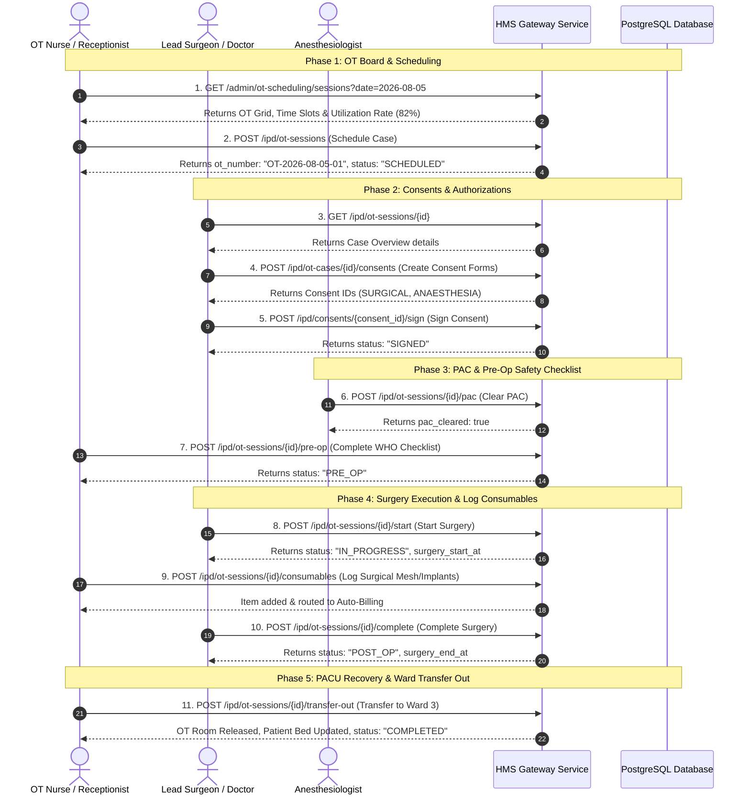

# Exhaustive Backend API Specification: OT / Surgery Workflow

This document provides a senior backend engineering inventory of all APIs required across every screen of the **Surgery / Operation Theatre (OT) Workflow**.

---

## 1. ⚙️ Global Master Data, Navigation & Context APIs

These APIs power top bar navigation, active branch switching, notifications, and dropdowns across all OT screens.

| HTTP Method | Suggested Endpoint | Purpose | Request Parameters / Headers | Expected Response Data |
|---|---|---|---|---|
| `GET` | `/organization/active-tenant` | Fetch current active facility/branch context | `Authorization: Bearer <token>` | `{ "branch_id": "UUID", "facility_name": "Sai LJB - Branch 1", "code": "SLJB-001" }` |
| `GET` | `/organization/user-tenants` | Fetch all facilities assigned to the user for branch switching | `Authorization: Bearer <token>` | `[{ "id": "UUID", "name": "Branch 1" }, { "id": "UUID", "name": "Branch 2" }]` |
| `PATCH` | `/auth/staff/me/active-branch` | Switch active working branch | Body: `{ "branch_id": "UUID" }` | `{ "success": true, "active_branch_id": "UUID" }` |
| `GET` | `/notifications/unread-count` | Unread alert badge counts | `Authorization: Bearer <token>` | `{ "unread_count": 5 }` |
| `GET` | `/admin/staff?role=DOCTOR` | Master list of surgeons & doctors for filters/dropdowns | Query: `role=DOCTOR`, `is_active=true` | `[{ "user_id": "UUID", "full_name": "Dr. Arvind Mishra", "department": "Surgery" }]` |

---

## 2. 🗓️ Screen 1: OT Overview Board, Utilization & Pre-Op Checklist Card

### UI Components Identified:
* **Top Filters**: Status Tabs (`Scheduled`, `In Progress`, `Completed`), Date Picker (`date`), OT Room Filter (`ot_room_id`), Search Input (`q`).
* **OT Schedule Grid**: Operating rooms (OT-1, OT-2, OT-3), time slots (09:00 AM - 05:00 PM), surgery cards with patient name, procedure, surgeon.
* **Pre-Op Checklist Card (Right Panel)**: Selected patient summary, WHO checklist item checkboxes, PAC status badge, `PENDING APPROVAL` action button.
* **Quick Insights Card**: OT utilization rate gauge (82%), room allocation metrics, procedure workload summary.

### Identified APIs:

#### 2.1 Fetch OT Sessions Grid & Utilization Board
* **HTTP Method**: `GET`
* **Endpoint**: `/admin/ot-scheduling/sessions`
* **Purpose**: Fetches scheduled procedures per OT room, time slot allocations, pre-op checklist completion state, and cost breakdown/insights.
* **Query Parameters**: `date` (`2026-08-05`), `status` (`SCHEDULED`), `ot_room_id` (`OT-1`)
* **Response Body (`200 OK`)**:
```json
{
  "success": true,
  "code": 200,
  "data": [
    {
      "id": "d3bb860b-c2f4-4c56-8a64-fc4051ceeb90",
      "ot_number": "OT-2026-08-05-01",
      "ot_room_id": "46fc39d8-7c4e-4704-9430-f82d6dcfa34c",
      "scheduled_start": "2026-08-05T09:00:00+05:30",
      "scheduled_end": "2026-08-05T11:30:00+05:30",
      "patient_id": "343d61ea-5708-49d4-9d37-f6b0f788c0b1",
      "patient_name": "Ramesh Gupta",
      "procedure_name": "Hemorrhoidoplasty",
      "surgeon_name": "Dr. Arvind Mehta",
      "status": "SCHEDULED",
      "checklist": {
        "consent_form_signed": true,
        "blood_reserve_complete": true,
        "pre_op_diagnostics": true,
        "anaesthesia_clearance": false,
        "scrub_nurse_equipment": true,
        "pac_clearance": "PENDING"
      },
      "cost_breakdown": {
        "ot_room_charges": 50000.0,
        "surgeon_fee": 120000.0,
        "anaesthesia_fee": 45000.0,
        "subtotal": 300000.0
      }
    }
  ]
}
```

#### 2.2 Update Pre-Op Checklist Items
* **HTTP Method**: `PATCH`
* **Endpoint**: `/admin/ot-scheduling/sessions/{session_id}/checklist`
* **Purpose**: Toggle verification checkboxes on the Pre-Op Checklist panel (Patient ID Verified, Consent Signed, Lab Reports Reviewed, Anesthesia Clearance).
* **Request Body**:
```json
{
  "consent_form_signed": true,
  "blood_reserve_complete": true,
  "pre_op_diagnostics": true,
  "anaesthesia_clearance": true
}
```
* **Response Body (`200 OK`)**:
```json
{
  "success": true,
  "code": 200,
  "data": { "id": "d3bb860b-c2f4-4c56-8a64-fc4051ceeb90", "status": "PRE_OP" }
}
```

---

## 3. 📝 Screen 8: Schedule OT Session Dialog (Booking Modal)

### UI Components Identified:
* **Patient Search Autocomplete**: Search patient by Name / UHID / Phone.
* **Admission ID Selector**: Linked IPD admission record dropdown.
* **Service Order Selector**: Approved surgical service order from OPD/IPD.
* **Team Dropdowns**: Lead Surgeon, Anaesthesiologist, Scrub Nurse.
* **Room & Slot Picker**: OT Room selector (`OT-1`, `OT-2`), Scheduled Start & End Datetime pickers.

### Identified APIs:

#### 3.1 Search Patient & Active Admissions Autocomplete
* **HTTP Method**: `GET`
* **Endpoint**: `/ipd/admissions`
* **Query Parameters**: `q=PAT-2026-4326`, `status=ADMITTED`
* **Response Body (`200 OK`)**:
```json
{
  "success": true,
  "data": {
    "items": [
      {
        "admission_id": "a45f20b1-3c5c-46a5-ae8a-2982e229d93c",
        "patient_id": "343d61ea-5708-49d4-9d37-f6b0f788c0b1",
        "patient_name": "Final Test",
        "uhid": "PAT-2026-4326",
        "ward_name": "Ward 2",
        "bed_number": "B-14"
      }
    ]
  }
}
```

#### 3.2 Book / Schedule OT Session
* **HTTP Method**: `POST`
* **Endpoint**: `/ipd/ot-sessions` *(or `POST /admin/ot-scheduling/sessions`)*
* **Purpose**: Creates the OT Session, auto-generates `ot_number` (`OT-2026-08-05-01`), locks room slot, and assigns surgical team.
* **Request Body**:
```json
{
  "service_order_id": "9f17b9ab-3205-4ab4-903b-3ad0a5f2061d",
  "admission_id": "a45f20b1-3c5c-46a5-ae8a-2982e229d93c",
  "patient_id": "343d61ea-5708-49d4-9d37-f6b0f788c0b1",
  "surgeon_id": "f8bb5a02-0eb1-4366-814c-0763ba4f2b74",
  "anaesthetist_id": "anaes-001-uuid",
  "ot_room_id": "ot-room-01-uuid",
  "scheduled_start": "2026-08-05T09:00:00+05:30",
  "scheduled_end": "2026-08-05T11:30:00+05:30"
}
```
* **Response Body (`201 Created`)**:
```json
{
  "success": true,
  "code": 201,
  "data": {
    "id": "d3bb860b-c2f4-4c56-8a64-fc4051ceeb90",
    "ot_number": "OT-2026-08-05-01",
    "status": "SCHEDULED",
    "created_at": "2026-08-05T08:30:00+05:30"
  }
}
```

---

## 4. 🩺 Screen 2: OT Case Stepper — Step 1: Patient & Case Overview

### UI Components Identified:
* **Stepper Progress Header**: 6-stage clinical tracker (`Case Overview` → `Consents` → `PAC` → `Pre-Op` → `Surgery` → `Recovery`).
* **Patient Header Banner**: Name, UHID, Gender/Age, Admission ID, Current Ward/Bed.
* **Case Details Card**: Assigned Lead Surgeon, Anaesthesiologist, Scrub Nurse, Procedure Name, Surgery Priority (`URGENT`), Scheduled Time Window, OT Room.
* **Primary Action**: `Proceed to Consents` button.

### Identified APIs:

#### 4.1 Get Single OT Session Detail
* **HTTP Method**: `GET`
* **Endpoint**: `/ipd/ot-sessions/{id}`
* **Purpose**: Fetches full OT session state, patient demographics, clinical team assignments, consent status, and current progress stage.
* **Response Body (`200 OK`)**:
```json
{
  "success": true,
  "code": 200,
  "data": {
    "id": "d3bb860b-c2f4-4c56-8a64-fc4051ceeb90",
    "patient_name": "Final Test",
    "patient_uhid": "PAT-2026-4326",
    "admission_id": "a45f20b1-3c5c-46a5-ae8a-2982e229d93c",
    "service_name": "Appendectomy",
    "surgeon_name": "Dr. Arvind Mishra",
    "anaesthetist_name": "Dr. Meera Mishra",
    "ot_number": "OT-2026-08-05-01",
    "scheduled_start": "2026-08-05 09:00:00+05:30",
    "scheduled_end": "2026-08-05 11:30:00+05:30",
    "status": "SCHEDULED"
  }
}
```

---

## 5. 📑 Screen 3: OT Case Stepper — Step 2: Consents & Authorizations

### UI Components Identified:
* **Required Consents Table**: List of mandatory consents (`SURGICAL`, `ANAESTHESIA`, `PROCEDURE`, `PHYSICIAN_FITNESS`).
* **Consent Actions**: `Generate Consent Forms` button, `View/Sign Consent` button, `Upload Signed Consent File` (S3 attachment upload).
* **Emergency Consent Bypass Modal**: Form to bypass unsigned consents (`emergency_override=true`, `override_reason`, 2-doctor approval signatures).
* **Primary Action**: `Proceed to PAC` button.

### Identified APIs:

#### 5.1 Generate / Create Case Consent Documents
* **HTTP Method**: `POST`
* **Endpoint**: `/ipd/ot-cases/{ot_case_id}/consents`
* **Request Body**:
```json
{
  "consent_codes": ["SURGICAL", "ANAESTHESIA", "PROCEDURE", "BLOOD_TRANSFUSION", "PHYSICIAN_FITNESS"]
}
```
* **Response Body (`201 Created`)**:
```json
{
  "success": true,
  "data": [
    { "id": "consent-uuid-1", "consent_code": "SURGICAL", "mandatory": true, "status": "PENDING" },
    { "id": "consent-uuid-2", "consent_code": "ANAESTHESIA", "mandatory": true, "status": "PENDING" }
  ]
}
```

#### 5.2 Sign / Upload Digital Consent Form
* **HTTP Method**: `POST`
* **Endpoint**: `/ipd/consents/{consent_id}/sign`
* **Request Body**:
```json
{
  "signed_by": "Patient Spouse (John Doe)",
  "relationship": "SPOUSE",
  "signature_type": "DIGITAL",
  "file_url": "https://s3.ap-south-1.amazonaws.com/ljb/signed_surgical_consent.pdf"
}
```

---

## 6. 💉 Screen 4: OT Case Stepper — Step 3: PAC (Pre-Anesthetic Checkup)

### UI Components Identified:
* **PAC Form Inputs**: Clearance Decision (`APPROVED`, `REJECTED`), Anaesthesia Type (`GENERAL`, `SPINAL`, `EPIDURAL`, `LOCAL`, `REGIONAL`, `SEDATION`), PAC Clinical Notes.
* **Emergency PAC Clearance Override**: Checkbox to bypass unsigned consents with 2-Doctor signatures (`primary_doctor_id`, `second_doctor_id`).
* **Primary Action**: `Clear PAC & Proceed to Pre-Op` button.

### Identified APIs:

#### 6.1 Submit Pre-Anesthetic Clearance (PAC Sign-off)
* **HTTP Method**: `POST`
* **Endpoint**: `/ipd/ot-sessions/{id}/pac`
* **Request Body (Standard)**:
```json
{
  "notes": "PAC cleared. Patient fit for general anesthesia."
}
```
* **Request Body (Emergency Override)**:
```json
{
  "notes": "Emergency override PAC clearance without all consents signed.",
  "emergency_override": true,
  "override_reason": "Acute abdominal hemorrhage requiring immediate surgery",
  "primary_doctor_id": "f8bb5a02-0eb1-4366-814c-0763ba4f2b74",
  "second_doctor_id": "374a54f2-bd7d-46ee-8c4f-13b873252ccf"
}
```
* **Response Body (`200 OK`)**:
```json
{
  "success": true,
  "code": 200,
  "data": { "id": "d3bb860b-c2f4-4c56-8a64-fc4051ceeb90", "pac_cleared": true }
}
```

---

## 7. 📋 Screen 5: OT Case Stepper — Step 4: Pre-Op Safety Checklist (WHO Checklist)

### UI Components Identified:
* **Checklist Items**: `identity_verified`, `site_marked`, `consent_signed`, `npo_confirmed` (Fasting), `iv_access`, `allergies_reviewed`, `antibiotics_given`.
* **Equipment & Reserve Verification**: Scrub nurse equipment check, blood reserve verification.
* **Primary Action**: `Complete Pre-Op & Send to OT` button.

### Identified APIs:

#### 7.1 Complete Pre-Op Safety Checklist
* **HTTP Method**: `POST`
* **Endpoint**: `/ipd/ot-sessions/{id}/pre-op`
* **Request Body**:
```json
{
  "pre_op_checklist": {
    "identity_verified": true,
    "site_marked": true,
    "consent_signed": true,
    "npo_confirmed": true,
    "iv_access": true,
    "allergies_reviewed": true,
    "antibiotics_given": true
  }
}
```
* **Response Body (`200 OK`)**:
```json
{
  "success": true,
  "data": { "id": "d3bb860b-c2f4-4c56-8a64-fc4051ceeb90", "status": "PRE_OP" }
}
```

---

## 8. 🔪 Screen 6: OT Case Stepper — Step 5: Surgery Execution (Intra-Op)

### UI Components Identified:
* **Start Surgery Action**: `Start Surgery` button (triggers active timer, sets status to `IN_PROGRESS`).
* **Intra-Op Form**: Anaesthesia Type selection, Intra-Op Clinical Notes textarea.
* **Consumables & Implants Logging Table**: `Add Item` modal (item name, quantity, batch no, implant serial number for auto-billing).
* **Primary Action**: `Complete Surgery` button (sets status to `POST_OP`).

### Identified APIs:

#### 8.1 Start Surgery
* **HTTP Method**: `POST`
* **Endpoint**: `/ipd/ot-sessions/{id}/start`
* **Request Body**: `{}`
* **Response Body (`200 OK`)**:
```json
{
  "success": true,
  "data": { "id": "d3bb860b-c2f4-4c56-8a64-fc4051ceeb90", "status": "IN_PROGRESS", "surgery_start_at": "2026-08-05T09:15:00+05:30" }
}
```

#### 8.2 Log Surgical Consumables & Implants (Auto-Billing Entry)
* **HTTP Method**: `POST`
* **Endpoint**: `/ipd/ot-sessions/{id}/consumables`
* **Request Body**:
```json
{
  "item_name": "Surgical Mesh / Suture Pack 3-0",
  "quantity": 2,
  "batch_no": "BATCH-2026-881",
  "implant_serial": "IMP-9921-X"
}
```

#### 8.3 Complete Surgery (Intra-Op Notes Submission)
* **HTTP Method**: `POST`
* **Endpoint**: `/ipd/ot-sessions/{id}/complete`
* **Request Body**:
```json
{
  "anaesthesia_type": "GENERAL",
  "intra_op_notes": "Appendectomy completed cleanly. Hemostasis achieved. No drain placed."
}
```
* **Response Body (`200 OK`)**:
```json
{
  "success": true,
  "data": { "id": "d3bb860b-c2f4-4c56-8a64-fc4051ceeb90", "status": "POST_OP", "surgery_end_at": "2026-08-05T11:20:00+05:30" }
}
```

---

## 9. 🛌 Screen 7: OT Case Stepper — Step 6: Recovery & Transfer Out (PACU)

### UI Components Identified:
* **Recovery Log**: Recovery start/end timestamps, Recovery Notes textarea.
* **Target Destination Selector**: Destination Ward dropdown (`transferred_to_ward_id`), Destination Bed dropdown (`transferred_to_bed_id`).
* **Primary Action**: `Transfer Out & Complete OT Session` button (releases OT room, updates patient bed, marks session `COMPLETED`).

### Identified APIs:

#### 9.1 Transfer Out Patient & Complete OT Session
* **HTTP Method**: `POST`
* **Endpoint**: `/ipd/ot-sessions/{id}/transfer-out`
* **Request Body**:
```json
{
  "transferred_to_ward_id": "dc525fff-8b31-4dcb-903d-6817c696a9e7",
  "transferred_to_bed_id": "9d07fc1e-f716-4b47-b028-3d8e99e9afe6",
  "recovery_notes": "Patient fully awake, alert, hemodynamically stable. Transferred to Surgical Ward Bed 12."
}
```
* **Response Body (`200 OK`)**:
```json
{
  "success": true,
  "code": 200,
  "data": {
    "id": "d3bb860b-c2f4-4c56-8a64-fc4051ceeb90",
    "status": "COMPLETED",
    "recovery_end_at": "2026-08-05T12:30:00+05:30",
    "transfer_at": "2026-08-05T12:30:00+05:30",
    "transferred_to_ward_id": "dc525fff-8b31-4dcb-903d-6817c696a9e7",
    "transferred_to_bed_id": "9d07fc1e-f716-4b47-b028-3d8e99e9afe6"
  }
}
```

---

## 10. 🔄 Complete Sequential API Call Execution Diagram

Below is the exact execution sequence of API calls when a patient progresses through the entire Surgery / OT workflow:


