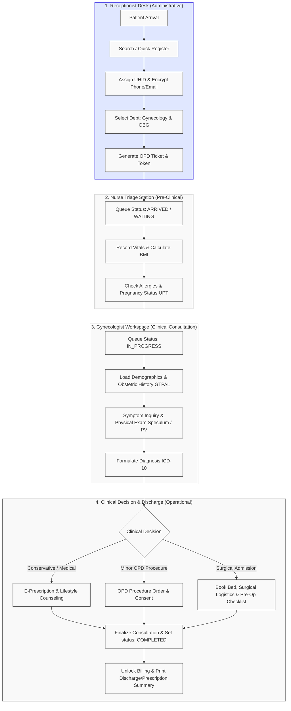

# Patient Journey: From Registration to Gynecology OPD Decision

This document details the complete end-to-end operational and clinical journey of an outpatient (OPD) patient within the Healthcare Management System (HMS), tracing the lifecycle from initial front-desk arrival to the final clinical decision in the Gynecology & Obstetrics department.

---

## 🗺️ Patient Lifecycle Flowchart

The following diagram illustrates the patient's touchpoints, status transitions, and data flow across the administrative, nursing, and clinical domains.



---

## ── PHASE 1: PATIENT REGISTRATION & LOBBY CHECK-IN ──

### 1. Receptionist Actions (UI Workflow)
When a new patient arrives at the hospital lobby:
1. **Lobby Search:** The receptionist searches for the patient using their Phone Number or Name.
2. **Quick Register:** If no record exists, the receptionist fills in the **Demographics Form** (`Full Name`, `Phone`, `Age`, `Gender`, `Blood Group`, and `Address`).
3. **Submission:** Upon clicking **Submit**, the form inputs are locked (soft gray overlay) and the system displays a success banner with the patient's newly generated **UHID** (Unique Health Identifier).

### 2. Backend API & Database Executions
* **Endpoint:** `POST /patients/register`
* **Data Validations:**
  * Checks if the phone number already exists in `patient.patients`. If duplicate, aborts and returns `400 ValidationError`.
  * Age must be a positive integer between `0` and `125`.
* **UHID Generation Logic:**
  * The system queries the database for the last registered patient of the current year:
    ```sql
    SELECT uhid FROM patient.patients WHERE uhid LIKE 'PAT-YYYY-%' ORDER BY uhid DESC LIMIT 1
    ```
  * Generates the next sequential ID: e.g., `PAT-2026-1048`.
* **Encryption Policy:**
  * To protect patient privacy, sensitive demographic fields (phone number and email) are encrypted using the database function `public.fn_encrypt_field` before insertion.
  * Writes to the `patient.patients` table under tenant-isolated policies checking the `branch_id`.

---

## ── PHASE 2: OPD TICKET BOOKING & QUEUE ASSIGNMENT ──

### 1. Appointment Scheduling (UI Workflow)
Immediately following registration, the receptionist triggers the **⚡ Create OPD Ticket** action directly from the patient’s profile:
1. **Department Selection:** Selects **Gynecology & Obstetrics** department.
2. **Doctor Selection:** Selects the consulting gynecologist. The UI displays the doctor's name, specialization (e.g., *Dr. Priya Vasudevan — Reproductive Endocrinologist*), current waiting count (e.g., *4 waiting*), and standard consultation fee.
3. **Ticket Generation:** Clicks **Book & Print Ticket**. The system prints a physical ticket with a token number (e.g., `OPD-042`).

### 2. Backend API & Database Executions
* **Endpoint:** `POST /ops/appointments` followed by `POST /ops/appointments/{id}/check-in`
* **Database Updates:**
  1. Creates a record in `scheduling.appointments` with `status = 'SCHEDULED'`.
  2. Upon check-in, transitions `scheduling.appointments.status` to `'ARRIVED'`.
  3. Inserts a row into `clinical.opd_visits` with state `'SCHEDULED'` and assigns a sequential `visit_number`.
  4. The patient is added to the live Gynecology queue board, and their status badge changes to a **pulsing blue indicator** labeled `Arrived / Waiting`.

---

## ── PHASE 3: NURSE TRIAGE & VITALS CAPTURE ──

### 1. Triage Nurse Actions (UI Workflow)
Before seeing the gynecologist, the patient is called to the nursing station:
1. **Vitals Recording:** The nurse records the clinical vitals:
   * **Blood Pressure (BP):** mmHg (e.g., `110/70`)
   * **Pulse Rate:** bpm (e.g., `78`)
   * **Temperature:** °F (e.g., `98.4`)
   * **Weight & Height:** kg & cm (e.g., `68.0 kg`, `160.0 cm`)
2. **BMI Calculation:** The system auto-calculates the BMI and displays the category based on Indian cutoffs (e.g., `26.56 - Overweight`).
3. **UPT Screening:** For patients of childbearing age presenting with pelvic complaints, the nurse conducts a **Urine Pregnancy Test (UPT)** and logs the result (`Positive`, `Negative`, or `Not Performed`).

### 2. Backend API & Database Executions
* **Endpoint:** `PUT /clinical/consultations/{consultation_id}/forms/EXAMINATION_FINDINGS` (part of the partial vitals payload).
* **Database Storage:**
  * Stores vital signs in the `vitals_panel` JSON block within the active consultation record.
  * Logs general physical signs (e.g., *Pallor*) or chronic conditions, and triggers high-visibility alert badges in the doctor's workspace if active drug allergies are identified.

---

## ── PHASE 4: DOCTOR CONSULTATION & CLINICAL INTAKE ──

### 1. Gynecologist Workspace (UI Workflow)
When the doctor summons the patient (updating queue status to `In Consultation` / `IN_PROGRESS`):
1. **Split-Screen Workspace:**
   * **Left Panel:** Displays patient demographics, obstetric history score (**GTPAL**), chronic systemic medical conditions, and nurse triage charts.
   * **Right Panel:** Interactive clinical forms split into:
     * **S1: Current Symptoms & History:** Primary complaint, menstrual cycle stats (LMP, flow amount, cycle duration), lactation status, and contraceptive history.
     * **S2: Physical & Speculum Exams:** External inspection, speculum results (cervical health, vaginal discharge), and bimanual vaginal examination findings.

### 2. Clinical Data Validation Guards
* **LMP Computation:** The system validates the Last Menstrual Period date (LMP must be in the past) and auto-computes gestational age.
* **Lactation Status Guard:** Restricts the clinical drug prescribing catalog to ensure lactation-safe medications are highlighted.
* **Sexual Activity Toggle:** If set to `Not Sexually Active` or `Not Disclosed`, the UI disables the vaginal speculum and PV examination controls as a clinical safety guard.

---

## ── PHASE 5: THE OUTPATIENT (OPD) CLINICAL DECISION ──

At the conclusion of the evaluation, the gynecologist formalizes their diagnostic assessment and selects the clinical management path:

```
                      +-------------------------------------------------+
                      |            GYNAECOLOGY OPD DECISION             |
                      +-------------------------------------------------+
                                               |
         +-------------------------------------+-------------------------------------+
         |                                     |                                     |
         v                                     v                                     v
 💊 CONSERVATIVE / MEDICAL              🔬 MINOR OPD PROCEDURE               🏨 SURGICAL ADMISSION (IPD)
  - E-Prescription                       - Select procedure (e.g., Pap)       - Select surgical procedure
  - Diet & Lifestyle advice              - Local/No Anaesthesia               - Pre-op checklist
  - Follow-up booking                    - Consent form & equipment           - Bed allocation & GA/Spinal
```

### 1. Option A: Conservative / Medical Management
* **Indication:** Used for conditions like PCOS, mild endometriosis, or early-stage menstrual regularizations.
* **Prescription Builder:**
  * The doctor uses the typeahead search to add therapeutics.
  * Aligned with NMC/NABH standards, drugs are selected from the **Common Gynecology Prescribing Reference** (e.g., *Tranexamic Acid*, *Mefenamic Acid*, *Iron supplements*, *Hormonal pills*).
  * Specifies dosage form, route, frequency, and duration.
* **Diet & Lifestyle Counseling:**
  * Selects checkboxes for specific protocols (e.g., *Low-Glycaemic Index Dietary Pattern for PCOS*, *Iron-Rich Dietary Optimization for Anaemia*).
* **Outcome:** Patient is discharged with an e-prescription printout and scheduled for a follow-up review (e.g., *in 2 weeks*).

### 2. Option B: Minor OPD Procedure (No General Anaesthesia)
* **Indication:** Used for rapid diagnostic screenings or minor interventions (e.g., *Pap Smear Screening*, *Colposcopy*, *IUD Insertion/Removal*, *Cervical Biopsy*).
* **Consent:** Requires verbal and written consent logged into the system.
* **Outcome:** Performed inside the outpatient clinic treatment room. Patient is observed briefly, given home-care instructions, and discharged.

### 3. Option C: Elective or Emergency Surgical Management (IPD Admission)
* **Indication:** Used for major gynecological pathologies requiring operating theatre access (e.g., *Laparoscopic Myomectomy*, *Total Laparoscopic Hysterectomy*, *Ovarian Cystectomy*).
* **Surgical Logistics Form (S4):**
  * **Procedure & Scheduling:** Selects final procedure, estimating duration (e.g., *Laparoscopic Myomectomy [90 min]*), and schedules the surgery date.
  * **Anaesthesia Modality:** Selects anesthetic choice (e.g., *General Anaesthesia* or *Spinal Anaesthesia*).
  * **Pre-Anaesthetic Check (PAC):** Captures fitness status and logs ASA Physical Status Score (e.g., *ASA Class II*).
  * **Pre-Surgical Haemoglobin Cutoff Check:** Checks if haemoglobin is safe for elective surgery (cutoff >= 10 g/dL).
  * **Surgical Safety Checklist:** Confirms completion of vital safeguards (NPO status, blood booking, vernacular consent, antibiotic prophylaxis, cervical priming).
  * **Inventory Sync:** Coordinates surgical tools (e.g., *Uterine manipulator*, *Morcellator*) and suture selections (e.g., *Vicryl 1-0*, *Barbed Suture V-Loc*).
* **Outcome:** Triggers an automatic bed reservation request in the target IPD ward, moving the patient from the outpatient portal into the pre-operative admissions queue.

---

## ── PHASE 6: CONSULTATION COMPLETION & BILLING UNLOCK ──

### 1. Doctor's Workspace Completion Action
Once the decision is finalized, the doctor clicks **Complete Consultation**:
* **Endpoint:** `POST /opd/visits/{visit_id}/complete`
* **Workflow Transition Gates:**
  1. The consultation record transitions from `DRAFT` status to `FINALIZED`.
  2. The system checks state transition guards to verify that all necessary fields (e.g., primary diagnosis, clinical decision) are populated.
  3. Updates `clinical.opd_visits.status` and `scheduling.appointments.status` to `'COMPLETED'`.
  4. Writes an auditable row into `audit.events` tracking the doctor actor ID.

### 2. Billing Verification & Patient Discharge
* **Decoupled Billing Lock Release:**
  * To prevent financial and medical discrepancies, invoices are locked while a patient is `IN_PROGRESS` (due to possible procedural additions or diagnostic alterations).
  * Once the visit status updates to `COMPLETED`, the system unlocks the billing registry, allowing the front-desk clerk to generate the final receipt.
* **Discharge Packet:**
  * The patient receives a printed folder containing:
    * **OPD Case Summary / Consultation Record**
    * **Digitally Signed E-Prescription** (with diet/lifestyle annexures)
    * **Laboratory / Radiology Referral Slips** (if applicable)
    * **Surgical Pre-Admission Guide** (if scheduled for IPD)
