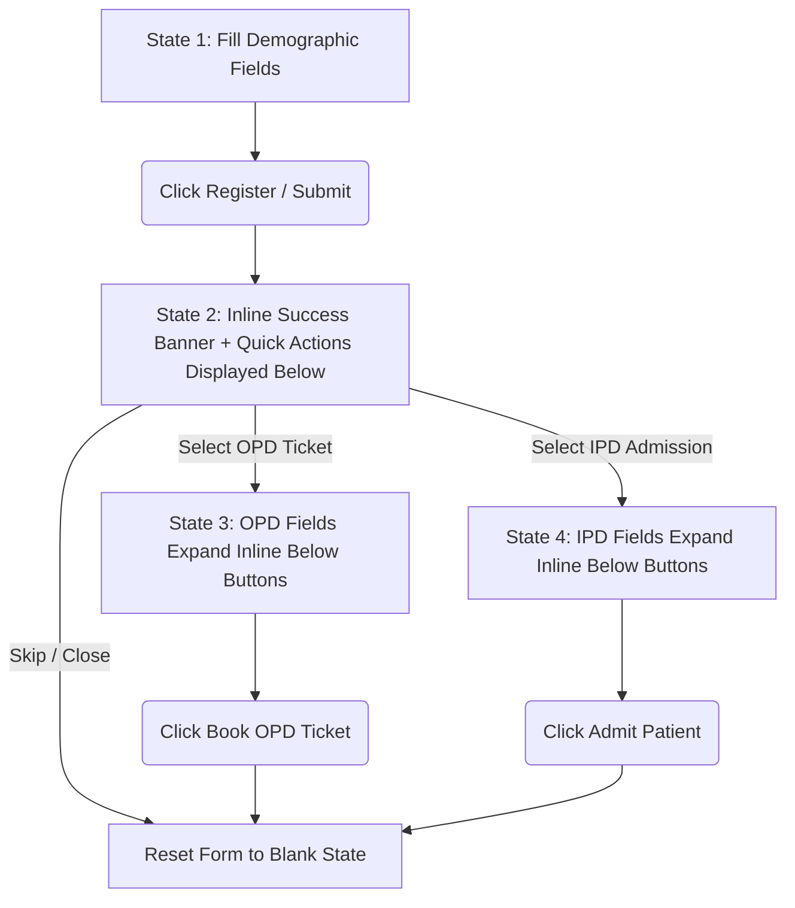

# HMS Patient Registration Flow — Designer Specification
**Version:** 1.0 (Production UI Spec)  
**User Persona:** `RECEPTIONIST` / `REGISTRATION_CLERK`  

---

## 🎯 Design Objectives

* **Zero Page-Refreshes:** Complete the entire patient lifecycle (Registration ➡️ Appointment/Admission Booking) on a single screen without losing context.
* **Inline Step Expansion:** Demographics, action selection, and secondary booking fields unfold vertically on the same page, keeping cognitive load low.
* **Keyboard-Friendly:** Focus moves logically through fields using `Tab` and `Enter` keys.
* **Premium Aesthetics:** Clean typography, soft transitions, distinct colored badges, and interactive step markers.

---

## 🗺️ User Flow & State Machine



---

## 🎴 UI Wireframes & Layout Transition

### State 1: Basic Demographics Entry
The receptionist enters primary patient details.

```
+---------------------------------------------------------------------------------+
| ➕ REGISTER NEW PATIENT                                                          |
+---------------------------------------------------------------------------------+
|  [ Full Name ] *                    [ Phone Number ] *                          |
|  John Doe                           +91 99999 99999                             |
|                                                                                 |
|  [ Age ] *        [ Gender ] *       [ Blood Group ]                            |
|  32               Male (v)           O+ (v)                                     |
|                                                                                 |
|  [ Address Line 1 ]                                                             |
|  Flat 204, Green Glen Layout                                                    |
|                                                                                 |
|  [ City ]         [ State ]          [ Pincode ]                                |
|  Bengaluru        Karnataka          560103                                     |
|                                                                                 |
|                                                              [ Submit Register ]|
+---------------------------------------------------------------------------------+
```

---

### State 2: Successful Registration & Quick Actions
Once submitted, the demographics fields are locked (read-only/disabled with a soft gray overlay), and a **Quick Actions Panel** slides open directly beneath the submit button.

```
+---------------------------------------------------------------------------------+
| 🔓 Demographics Fields (Locked / Disabled Gray State)                           |
+---------------------------------------------------------------------------------+
|  ✅ Patient registered successfully! Assigned UHID: UHID-2026-09283             |
+---------------------------------------------------------------------------------+
|  What would you like to do next for John Doe?                                   |
|                                                                                 |
|   +--------------------------+    +--------------------------+    +----------+  |
|   | ⚡ Create OPD Ticket      |    | 🛏️ Admit to IPD (Ward)   |    | (x) Skip |  |
|   +--------------------------+    +--------------------------+    +----------+  |
|                                                                                 |
+---------------------------------------------------------------------------------+
```

---

### State 3: OPD Ticket Fields (Expanded Inline)
If the receptionist clicks **⚡ Create OPD Ticket**, the button highlights in indigo, and the OPD booking form opens smoothly *below the buttons* without changing the page.

```
+---------------------------------------------------------------------------------+
|  What would you like to do next for John Doe?                                   |
|                                                                                 |
|   [⚡ Create OPD Ticket] *Active*  |  [🛏️ Admit to IPD]  |  [Skip]              |
+---------------------------------------------------------------------------------+
|  ▼ OPD BOOKING DETAILS                                                          |
|                                                                                 |
|  [ Select Department ] *             [ Select Doctor ] *                        |
|  Cardiology (v)                      Dr. Jenkins (Specialist) (v)               |
|                                                                                 |
|  [ Appointment Type ]                [ Urgency ]                                |
|  NEW (v)                             URGENT (v)                                 |
|                                                                                 |
|  [ Consultation Fee ]                [ Notes / Chief Complaint ]                |
|  INR 500.00 (Read Only)              Chest discomfort after running             |
|                                                                                 |
|                                                            [ Book & Print Ticket ]|
+---------------------------------------------------------------------------------+
```

---

### State 4: IPD Admission Fields (Expanded Inline)
If the receptionist clicks **🛏️ Admit to IPD (Ward)** instead, the IPD button highlights in teal, and the admission/bed booking form slides open *below the buttons*.

```
+---------------------------------------------------------------------------------+
|  What would you like to do next for John Doe?                                   |
|                                                                                 |
|   [⚡ Create OPD Ticket]  |  [🛏️ Admit to IPD] *Active*  |  [Skip]              |
+---------------------------------------------------------------------------------+
|  ▼ IPD ADMISSION & BED BOOKING                                                  |
|                                                                                 |
|  [ Attending Doctor ] *              [ Admission Type ]                         |
|  Dr. Jenkins (v)                     ELECTIVE (v)                               |
|                                                                                 |
|  [ Target Ward ] *                   [ Select Bed ] * (Filtered by Ward)        |
|  General Medical Ward (v)            B-GEN-04 [Available] (v)                   |
|                                                                                 |
|  [ Expected Discharge Date ]         [ Admission Reason ] *                     |
|  2026-06-25                          Severe respiratory distress, needs IV line  |
|                                                                                 |
|                                                            [ Confirm Admission ]|
+---------------------------------------------------------------------------------+
```

---

## 📋 Field Requirements Checklist (For Frontend/Designers)

### 1. Patient Demographics Fields (State 1)
* **Full Name** (Input Text, Required): Min 3 chars.
* **Phone Number** (Input Tel, Required): Validated E.164 phone format.
* **Age** (Number Input, Required): Positive integer between 0 and 125.
* **Gender** (Dropdown, Required): `MALE`, `FEMALE`, `OTHER`, `UNKNOWN`.
* **Blood Group** (Dropdown, Optional): `A+`, `A-`, `B+`, `B-`, `AB+`, `AB-`, `O+`, `O-`, `UNKNOWN`.
* **Address** (Address Line, City, State, Pincode - Optional).

### 2. OPD Booking Fields (State 3)
* **Department** (Searchable Dropdown, Required): Loads active branch departments.
* **Doctor** (Searchable Dropdown, Required): Dynamically filtered by selected Department. Shows doctor status and consulting fees.
* **Appointment Type** (Segmented Control, Default `NEW`): Choices: `NEW`, `FOLLOW_UP`, `EMERGENCY`.
* **Urgency** (Segmented Control, Default `ROUTINE`): Choices: `ROUTINE`, `URGENT`, `EMERGENCY`.
* **Notes** (Text Area, Optional): Max 1000 characters.

### 3. IPD Booking Fields (State 4)
* **Attending Doctor** (Searchable Dropdown, Required): Select admitting physician.
* **Admission Type** (Segmented Control, Default `ELECTIVE`): Choices: `ELECTIVE`, `EMERGENCY`.
* **Target Ward** (Dropdown, Required): List of active wards showing available beds count (e.g., `General Ward (10 Available)`).
* **Target Bed** (Dropdown, Required): Lists beds belonging to the selected Ward with status `AVAILABLE` only.
* **Expected Discharge Date** (Datepicker, Optional): Date must be in the future.
* **Admission Reason** (Text Area, Required): Reason for hospitalisation (min 5 characters).

---

## 🎨 Design & Aesthetic Guidelines

### Colors & Accents
* **Backgrounds:** Pure white card surfaces (`#FFFFFF`) with thin borders (`#E2E8F0`) on slate gray page canvas (`#F8FAFC`).
* **Success State Indicator:** Light green alert banner (`#EFFAF1`) with darker text (`#1E5A2A`).
* **OPD Button Active:** Soft Indigo gradient (`#6366F1`) with white text.
* **IPD Button Active:** Premium Teal gradient (`#14B8A6`) with white text.
* **Skip/Close Button:** Light gray border (`#D1D5DB`) with soft black text.

### Typography
* **Primary Fonts:** Use **Outfit** (Google Fonts) for titles, cards, and section headers; **Inter** for form labels, descriptions, and dropdown lists.

### Animations
* **Form Locking (State 1 ➡️ State 2):** Demographic inputs display a smooth `0.3s` background opacity transition to `#F3F4F6` (read-only state) once submitted.
* **Action Drawer (State 2 ➡️ State 3/4):** The expanded sections should use CSS `max-height` transitions with a `cubic-bezier(0.4, 0, 0.2, 1)` easing curve for a fluid, physical "drawer slide-out" feel. Avoid jarring instant pop-ins.
