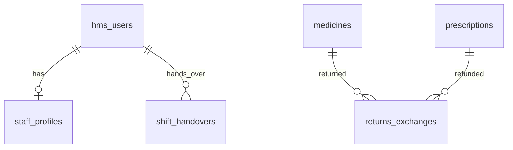

# Backend API & Schema Specification: Pharmacy Staff Dashboard

This document details the database schemas, API endpoints, request/response models, validation rules, and business logic required by the backend development team to support the **Pharmacy Staff Dashboard** features:
1. **Inventory Access**
2. **Return & Exchange**
3. **Patient Assistance**
4. **Daily Operations**

---

## 1. Database Schema Changes (PostgreSQL)

We will introduce and modify tables in the `pharmacy` and `identity` schemas. All schema changes must follow multi-tenant design patterns using `tenant_id` partitions.



### Table: `pharmacy.medicines` (Existing - Audit of Fields)
Ensure the following fields exist to support barcode scanning and stock alerts:
```sql
CREATE TABLE IF NOT EXISTS pharmacy.medicines (
    id UUID PRIMARY KEY DEFAULT gen_random_uuid(),
    tenant_id UUID NOT NULL REFERENCES public.hms_tenants(id),
    name VARCHAR(255) NOT NULL,
    brand VARCHAR(100),
    category VARCHAR(100), -- 'TABLET', 'SYRUP', 'INJECTION', etc.
    batch_number VARCHAR(50) NOT NULL,
    barcode VARCHAR(100) UNIQUE, -- Used for scanner integration
    price NUMERIC(10, 2) NOT NULL DEFAULT 0.00,
    stock_quantity INTEGER NOT NULL DEFAULT 0,
    min_stock_level INTEGER NOT NULL DEFAULT 10, -- Alerts triggered when stock falls below this
    expiry_date DATE NOT NULL,
    is_active BOOLEAN NOT NULL DEFAULT TRUE,
    created_at TIMESTAMP WITH TIME ZONE DEFAULT NOW(),
    updated_at TIMESTAMP WITH TIME ZONE DEFAULT NOW()
);
CREATE INDEX idx_medicines_barcode ON pharmacy.medicines(barcode) WHERE is_active = TRUE;
CREATE INDEX idx_medicines_search ON pharmacy.medicines(tenant_id, name, batch_number);
```

### Table: `pharmacy.returns_exchanges` (New)
Tracks returned and exchanged medicines.
```sql
CREATE TYPE pharmacy.return_type AS ENUM ('RETURN', 'EXCHANGE');
CREATE TYPE pharmacy.return_status AS ENUM ('PENDING_APPROVAL', 'APPROVED', 'REJECTED');

CREATE TABLE pharmacy.returns_exchanges (
    id UUID PRIMARY KEY DEFAULT gen_random_uuid(),
    tenant_id UUID NOT NULL REFERENCES public.hms_tenants(id),
    invoice_id VARCHAR(100) NOT NULL, -- Reference to billing receipt
    patient_id UUID NOT NULL REFERENCES identity.hms_users(id),
    medicine_id UUID NOT NULL REFERENCES pharmacy.medicines(id),
    batch_number VARCHAR(50) NOT NULL,
    quantity INTEGER NOT NULL CHECK (quantity > 0),
    type pharmacy.return_type NOT NULL,
    reason VARCHAR(255) NOT NULL, -- 'Damaged', 'Wrong Dosage', 'Excess', 'Expired'
    status pharmacy.return_status NOT NULL DEFAULT 'PENDING_APPROVAL',
    total_refund_amount NUMERIC(10, 2) NOT NULL DEFAULT 0.00,
    processed_by UUID NOT NULL REFERENCES identity.hms_users(id), -- Pharmacist
    approved_by UUID REFERENCES identity.hms_users(id),      -- Admin override
    created_at TIMESTAMP WITH TIME ZONE DEFAULT NOW(),
    updated_at TIMESTAMP WITH TIME ZONE DEFAULT NOW()
);
```

### Table: `pharmacy.shift_handovers` (New)
Audits shift logs, handovers, and cash collections.
```sql
CREATE TYPE public.shift_type AS ENUM ('MORNING', 'AFTERNOON', 'NIGHT');

CREATE TABLE pharmacy.shift_handovers (
    id UUID PRIMARY KEY DEFAULT gen_random_uuid(),
    tenant_id UUID NOT NULL REFERENCES public.hms_tenants(id),
    shift_date DATE NOT NULL DEFAULT CURRENT_DATE,
    shift_type public.shift_type NOT NULL,
    outgoing_pharmacist_id UUID NOT NULL REFERENCES identity.hms_users(id),
    incoming_pharmacist_id UUID NOT NULL REFERENCES identity.hms_users(id),
    cash_drawer_counted NUMERIC(10, 2) NOT NULL DEFAULT 0.00,
    cash_drawer_expected NUMERIC(10, 2) NOT NULL DEFAULT 0.00,
    status VARCHAR(30) NOT NULL, -- 'MATCHED', 'MISMATCHED'
    notes TEXT,
    created_at TIMESTAMP WITH TIME ZONE DEFAULT NOW()
);
```

---

## 2. API Endpoints & Spec (FastAPI/Pydantic)

### 1. Dashboard Overview APIs

#### `GET /pharmacy/dashboard/summary`
* **Purpose**: Fetches dashboard quick stats.
* **Auth**: Pharmacist, Pharmacist Manager
* **Response `200 OK`**:
```json
{
  "success": true,
  "data": {
    "pending_prescriptions": 18,
    "pending_dispensing": 12,
    "bills_generated_today": 36,
    "todays_sales": 48650.00,
    "cash_collected": 12320.00,
    "cash_breakdown": {
      "cash": 12320.00,
      "card": 20330.00,
      "upi": 16000.00
    }
  }
}
```

#### `GET /pharmacy/dashboard/alerts`
* **Purpose**: Fetches critical inventory warnings (Out of Stock, Expiry Warning, Low Stock).
* **Response `200 OK`**:
```json
{
  "success": true,
  "data": [
    {
      "id": "alert-uuid-1",
      "type": "OUT_OF_STOCK",
      "medicine_name": "Amoxicillin 500mg",
      "batch_number": "AMX-129",
      "current_stock": 0,
      "timestamp": "2026-06-04T10:20:00Z"
    },
    {
      "id": "alert-uuid-2",
      "type": "EXPIRY_WARNING",
      "medicine_name": "Cetirizine 10mg",
      "batch_number": "CTZ1023",
      "expiry_date": "2026-06-15",
      "timestamp": "2026-06-04T09:45:00Z"
    }
  ]
}
```

### 2. Inventory Access APIs

#### `GET /pharmacy/medicines` (Modified)
* **Parameters**: `q` (string, optional: search term for name, batch, or barcode), `category` (string, optional).
* **Response `200 OK`**:
```json
{
  "success": true,
  "data": {
    "items": [
      {
        "id": "med-uuid-123",
        "name": "Paracetamol 650mg",
        "category": "TABLET",
        "batch_number": "BAT-2026-99",
        "barcode": "890104300122",
        "price": 15.50,
        "stock_quantity": 450,
        "min_stock_level": 50,
        "expiry_date": "2027-12-31",
        "status": "IN_STOCK"
      }
    ],
    "total": 1,
    "page": 1,
    "page_size": 20
  }
}
```

### 3. Return & Exchange APIs

#### `POST /pharmacy/returns`
* **Request Body**:
```json
{
  "invoice_id": "INV-2026-9981",
  "patient_id": "a1737d0a-8091-701a-4fa7-1a9fef5825e8",
  "items": [
    {
      "medicine_id": "med-uuid-123",
      "quantity": 2,
      "type": "RETURN",
      "reason": "Excess"
    }
  ]
}
```
* **Validation**:
  * Verify `invoice_id` exists in billing system.
  * Verify `quantity` returned does not exceed quantity originally invoiced.
* **Response `201 Created`**:
```json
{
  "success": true,
  "message": "Return request submitted. Pending manager approval.",
  "data": {
    "return_id": "return-uuid-444",
    "status": "PENDING_APPROVAL",
    "total_refund_amount": 31.00
  }
}
```

#### `POST /pharmacy/returns/{id}/approve`
* **Auth**: Hospital Admin, Pharmacist Manager
* **Request Body**:
```json
{
  "admin_pin": "1234"
}
```
* **Logic (Critical Transaction)**:
  * Check admin privilege.
  * Update return status to `APPROVED`.
  * Update `pharmacy.medicines.stock_quantity` -> increment by returned quantity.
  * Log return in audit trail.
* **Response `200 OK`**:
```json
{
  "success": true,
  "message": "Return approved. Stock updated successfully."
}
```

### 4. Patient Assistance APIs

#### `POST /pharmacy/patients/{id}/timeline/reminders`
* **Purpose**: Schedule automated refill SMS reminder.
* **Request Body**:
```json
{
  "reminder_date": "2026-06-15",
  "frequency_days": 30,
  "medicine_name": "Metformin 500mg",
  "message_template": "Refill Reminder: Your prescription for Metformin expires soon. Press reply to confirm refill."
}
```
* **Response `201 Created`**:
```json
{
  "success": true,
  "message": "Refill reminder scheduled successfully."
}
```

### 5. Daily Operations APIs

#### `POST /pharmacy/shifts/handover`
* **Request Body**:
```json
{
  "shift_type": "MORNING",
  "incoming_pharmacist_id": "user-uuid-999",
  "cash_drawer_counted": 12320.00,
  "notes": "Handed over keys and cash matching register. Reordered Paracetamol."
}
```
* **Logic**:
  * Query sales totals from the billing system for the current date up to now to compute `cash_drawer_expected`.
  * If `cash_drawer_counted` != `cash_drawer_expected`, status is set to `MISMATCHED`, else `MATCHED`.
* **Response `201 Created`**:
```json
{
  "success": true,
  "data": {
    "handover_id": "handover-uuid-777",
    "cash_drawer_expected": 12320.00,
    "status": "MATCHED"
  }
}
```

---

## 3. Core Validation & Concurrency Rules

### 1. Stock Allocation Lock (Dispensing)
To prevent race conditions where two pharmacists attempt to dispense the same physical stock:
* Use PostgreSQL `SELECT FOR UPDATE` on the target row of `pharmacy.medicines` inside the dispensing transaction:
  ```sql
  -- Step 1: Start Transaction
  BEGIN;
  -- Step 2: Lock the stock row
  SELECT stock_quantity FROM pharmacy.medicines 
  WHERE id = $1 AND tenant_id = $2 FOR UPDATE;
  -- Step 3: Validate quantity and Update
  UPDATE pharmacy.medicines SET stock_quantity = stock_quantity - $3 
  WHERE id = $1;
  -- Step 4: Commit
  COMMIT;
  ```

### 2. Expiry Gate
* During `POST /pharmacy/prescriptions/{id}/dispense` validation, check the `expiry_date` of the chosen batch.
* **Rule**: If `expiry_date < CURRENT_DATE`, the API must raise `ValidationError(400, "Cannot dispense expired batch.")`.

### 3. Return Invoice Validation
* Ensure that the invoice referenced has not already been returned. Keep track of returned quantities per invoice line item to block refund/return volumes greater than purchase totals.
