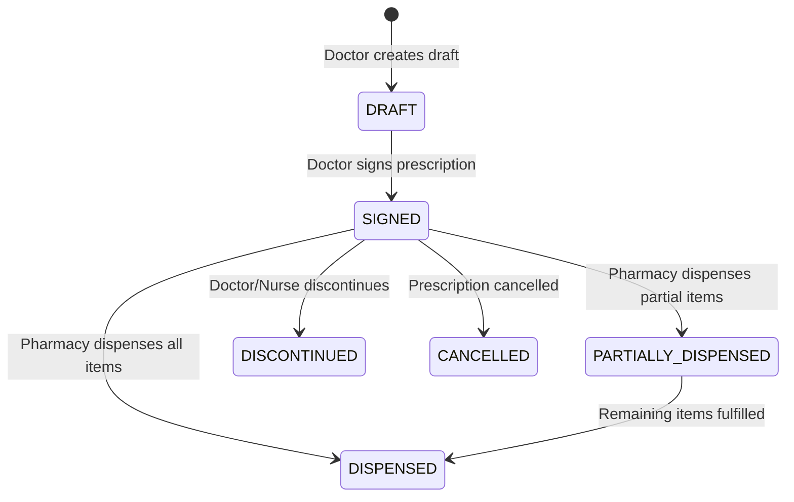

# HMS Prescription API Specification & Integration Guide

## 1. Overview & Architecture

The HMS Prescription Management System handles medication lifecycle tracking across all care settings (**OPD, IPD, OT, and Discharge**). 

Prescriptions are stored in PostgreSQL (`pharmacy.prescriptions` and `pharmacy.prescribed_medicines`) and exposed via unified endpoints across the **Doctor Service**, **Pharmacy Service**, **IPD Service**, and **Patient Service**.

---

## 2. Prescription Context Types & Relationships

A prescription is linked to a patient and optionally mapped to an encounter context:

| Care Setting | `prescription_type` | Context Foreign Key | Description |
| :--- | :--- | :--- | :--- |
| **OPD** | `OPD` | `opd_visit_id` / `context_id` | Prescribed during outpatient consultation |
| **IPD** | `IPD` | `ipd_admission_id` | Prescribed during inpatient ward stay |
| **OT** | `OT` | `context_id` (`ot_session_id`) | Post-operative / Intra-operative medication order |
| **Discharge**| `DISCHARGE` | `ipd_admission_id` | Home medications assigned on inpatient discharge |

---

## 3. Prescription Lifecycle & Statuses



### Status Definitions:
- `DRAFT`: Draft state before signing.
- `SIGNED`: Signed by doctor, ready for fulfillment by pharmacy.
- `PARTIALLY_DISPENSED`: Some medicine items fulfilled by pharmacy.
- `DISPENSED`: Fully fulfilled by pharmacy.
- `DISCONTINUED`: Discontinued by clinician before completion.
- `CANCELLED`: Cancelled due to error or duplicate entry.

---

## 4. Standard Frequency Codes

| Code | Frequency Description | Default Dose Timing Split |
| :--- | :--- | :--- |
| **OD** | Once Daily | 1-0-0-0 (Morning) |
| **BD** | Twice Daily | 1-0-0-1 (Morning & Night) |
| **TDS** | Three Times Daily | 1-1-1-0 (Morning, Afternoon, Evening) |
| **QDS** | Four Times Daily | 1-1-1-1 (Morning, Afternoon, Evening, Night) |
| **SOS** | As Needed (Emergency/Pain) | On Demand |
| **STAT** | Immediately (Single Dose) | Immediate |
| **HS** | At Bedtime | 0-0-0-1 (Night) |

---

## 5. API Endpoints Reference

### 5.1 Create / Issue Prescription (Doctor Portal)

- **Endpoint**: `POST /doctors/prescriptions` *(or `POST /pharmacy/prescriptions`)*
- **Headers**:
  - `Authorization`: `Bearer <token>`
  - `X-Tenant-Id`: `<branch_uuid>`

#### **Request Body**:
```json
{
  "patient_id": "183111c4-8ebc-44d8-b882-e3c5a979ad52",
  "opd_visit_id": "ff9fcf22-e5e6-41a0-9dc3-3d1d7e406fa0",
  "consultation_id": "880c33b2-5647-407b-967a-1dfc8e66acf9",
  "ipd_admission_id": null,
  "prescription_type": "OPD",
  "valid_till": "2026-09-14",
  "notes": "Take after meals. Drink plenty of water.",
  "items": [
    {
      "medicine_id": "86a4c51b-c04d-4665-81ee-58eb4303488f",
      "medicine_name": "Paracetamol 500mg",
      "generic_name": "Paracetamol",
      "dosage": "500mg",
      "frequency": "TDS",
      "route": "ORAL",
      "duration_days": 5,
      "morning_dose": true,
      "afternoon_dose": true,
      "evening_dose": true,
      "night_dose": false,
      "with_food": true,
      "instructions": "Take after food"
    },
    {
      "medicine_id": "a3223816-3ba1-4636-bb7e-8bbcf43b9fab",
      "medicine_name": "Atorvastatin 10mg",
      "generic_name": "Atorvastatin",
      "dosage": "10mg",
      "frequency": "HS",
      "route": "ORAL",
      "duration_days": 30,
      "morning_dose": false,
      "afternoon_dose": false,
      "evening_dose": false,
      "night_dose": true,
      "with_food": false,
      "instructions": "Take at night before sleep"
    }
  ]
}
```

#### **Response (200 OK)**:
```json
{
  "success": true,
  "code": 200,
  "data": {
    "id": "9121908b-0354-466b-bade-fad49097cab6",
    "prescription_number": "RX-20260814-0012",
    "patient_id": "183111c4-8ebc-44d8-b882-e3c5a979ad52",
    "doctor_id": "1d5a7ebe-fe54-4f30-94d3-699809c45670",
    "doctor_name": "Dr. kartik",
    "status": "SIGNED",
    "prescription_type": "OPD",
    "created_at": "2026-08-14T12:44:00+05:30",
    "items_count": 2
  }
}
```

---

### 5.2 Retrieve Prescriptions for an OPD Visit

- **Endpoint**: `GET /patients/{id_or_uhid}/opd/consultations/{visit_id_or_consultation_id}/prescriptions`

#### **Response (200 OK)**:
```json
{
  "success": true,
  "code": 200,
  "data": [
    {
      "id": "64ff8b09-bca9-41aa-b4f8-d37a456b8f69",
      "prescription_type": "OPD",
      "status": "SIGNED",
      "valid_till": "2026-09-09",
      "notes": null,
      "created_at": "2026-08-10 11:12:29+05:30",
      "medicines": [
        {
          "id": "2cd90fa3-cbb3-4440-a963-b059d5ab4fe6",
          "medicine_id": "c89b2575-5fe9-4989-8c63-656419ccc41a",
          "medicine_name": "Amoxicillin 500mg",
          "generic_name": "Amoxicillin",
          "dosage": "500mg",
          "frequency": "BD",
          "frequency_description": "Twice daily",
          "route": "ORAL",
          "duration_days": 5,
          "morning_dose": true,
          "afternoon_dose": false,
          "evening_dose": false,
          "night_dose": true,
          "with_food": true,
          "instructions": "Take after meals",
          "is_discontinued": false
        }
      ]
    }
  ]
}
```

---

### 5.3 Retrieve Prescriptions for IPD Admission & Discharge

- **Endpoint**: `GET /ipd/admissions/{admission_id}/discharge-summary`

Returns all active inpatient & discharge prescriptions under `data.prescriptions`:

```json
{
  "success": true,
  "code": 200,
  "data": {
    "id": "4b88744c-0024-4035-b579-f0e65b113a46",
    "patient_name": "arpita arovita",
    "prescriptions": [
      {
        "id": "9121908b-0354-466b-bade-fad49097cab6",
        "status": "SIGNED",
        "prescription_date": "2026-08-08",
        "items": [
          {
            "id": "e1e4c3c4-1028-487d-8e90-327107afc0d6",
            "medicine_name": "Paracetamol 500mg",
            "dosage": "500mg",
            "route": "IM",
            "frequency": "TDS",
            "duration_days": 10
          }
        ]
      }
    ]
  }
}
```

---

### 5.4 Pharmacy Dispense API

- **Endpoint**: `POST /pharmacy/prescriptions/{prescription_id}/dispense`
- **Request Payload**:
```json
{
  "dispensed_by": "pharmacy-staff-user-uuid",
  "dispensed_items": [
    {
      "item_id": "2cd90fa3-cbb3-4440-a963-b059d5ab4fe6",
      "quantity_dispensed": 10,
      "batch_number": "BAT-2026-0801"
    }
  ]
}
```

---

### 5.5 Discontinue Prescription Item

- **Endpoint**: `POST /pharmacy/prescriptions/{prescription_id}/items/{item_id}/discontinue`
- **Request Payload**:
```json
{
  "discontinued_by": "doctor-user-uuid",
  "reason": "Patient reported adverse allergic reaction (skin rash)"
}
```

---

## 6. Database Schema Reference

### `pharmacy.prescriptions` Table
- `id` (UUID, Primary Key)
- `branch_id` (UUID, Foreign Key)
- `patient_id` (UUID, Foreign Key)
- `doctor_id` (UUID, Foreign Key)
- `opd_visit_id` (UUID, Optional Foreign Key)
- `ipd_admission_id` (UUID, Optional Foreign Key)
- `context_id` (UUID, Optional context reference)
- `prescription_type` (Enum: `OPD`, `IPD`, `OT`, `DISCHARGE`)
- `status` (Enum: `DRAFT`, `SIGNED`, `PARTIALLY_DISPENSED`, `DISPENSED`, `CANCELLED`)
- `valid_till` (Date)
- `notes` (Text)
- `created_at` (Timestamp)

### `pharmacy.prescribed_medicines` Table
- `id` (UUID, Primary Key)
- `prescription_id` (UUID, Foreign Key)
- `medicine_id` (UUID, Foreign Key)
- `dosage` (Varchar)
- `frequency` (Varchar: `OD`, `BD`, `TDS`, `QDS`, `SOS`, `STAT`, `HS`)
- `route` (Varchar: `ORAL`, `IV`, `IM`, `TOPICAL`, `INHALATION`)
- `duration_days` (Integer)
- `morning_dose` (Boolean)
- `afternoon_dose` (Boolean)
- `evening_dose` (Boolean)
- `night_dose` (Boolean)
- `with_food` (Boolean)
- `instructions` (Text)
- `is_discontinued` (Boolean)
- `discontinued_reason` (Text)
