# 🏥 HMS — End-to-End Business & Presentation Flow

This document outlines the real-world, scenario-based flows of the Hospital Management System (HMS). It maps out how patients, clinicians, and administrative staff interact with the system across different modules, focusing on business logic, roles, and responsibilities.

---

## ── Module Roles & Responsibilities ──────────────────────────────────

The system is split into seven core modules. Each module owns a specific domain of the hospital lifecycle:

| Module | Core Responsibility | Key Users |
| :--- | :--- | :--- |
| **Auth** | Multi-factor authentication (MFA), role-based access control (RBAC), and session management. | All Staff |
| **Admin** | Hospital master data setup (departments, wards, beds, staff profiles, HRMS, and leaves). | System Admin, HR |
| **Ops** | Front-desk operations (patient search, registration, OPD booking, queue status, and OT scheduling). | Receptionist, Operations Manager |
| **Doctor** | Consultation queue management, patient clinical history review, IPD rounds, and surgery ordering. | Doctors / Consultants |
| **Nurse** | Ward dashboards, Vitals recording, NEWS tracking, Medication Administration Records (MAR), and discharge prep. | Nurses, Ward Staff |
| **Clinical** | Patient notes, diagnostic orders (lab/radiology), e-prescriptions, and surgery catalogues. | Doctors, Nurses, Lab Techs |
| **Billing** | Service pricing catalogues, invoice generation, discount approvals, insurance tracking, and receipts. | Billing Executive, Accountant |

---

## ── Scenario 1: System Admin  ────────────────────────

**Objective**: Initialize a new hospital branch, configure resources, and provision staff accounts to prepare the hospital for operations.

### Workflow Diagram
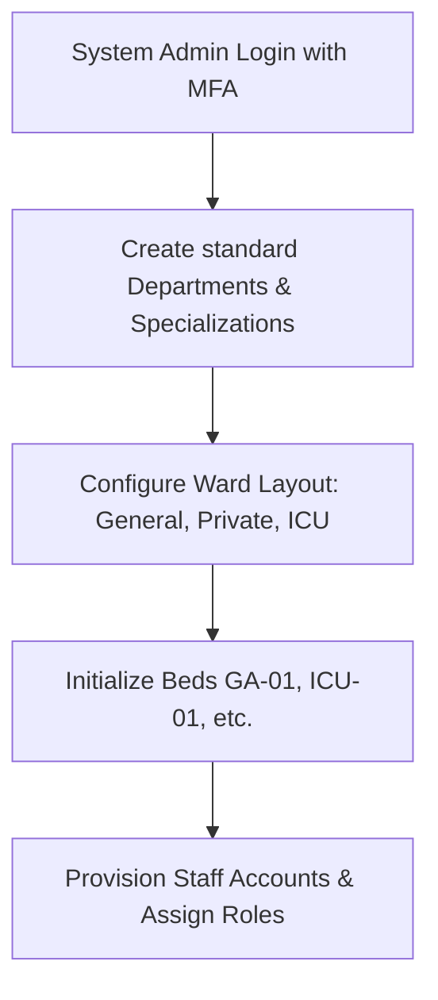

### Real-World Actions
1. **System Administrator Login**:
   * The Admin initiates login.
   * On first-time login, the system prompts for a secure password reset.
   * Due to the sensitive nature of admin access, a 6-digit SMS Multi-Factor Authentication (MFA) OTP code is verified.
2. **Departmental Configuration**:
   * Admin sets up core departments: *Emergency, Gastroenterology, Gynecology, Surgery, Proctology, Nursing, Pharmacy, Billing, and Medical Records*.
3. **Specialization Setup**:
   * Global specializations are defined (e.g. *Colorectal Surgeon, Anesthesiologist, Scrub Nurse, Triage Nurse, Lab Technician*) and linked to their respective departments.
4. **Ward and Bed Layout Setup**:
   * Admin defines physical inpatient wards, floors, and capacities.
   * Individual beds are created and assigned attributes (e.g., General Ward A, Bed GA-01, standard or ICU type).
5. **Staff Provisioning**:
   * Admin creates employee accounts, enters personal details, maps them to database roles (`DOCTOR`, `NURSE`, `RECEPTIONIST`), and links them to their department and specialization.

---

## ── Scenario 2: Receptionist — Outpatient (OPD) Journey ─────────────

**Objective**: Manage patient arrival, search/register patient, book appointments, collect consultations fees, and guide the patient to the queue.

### Workflow Diagram
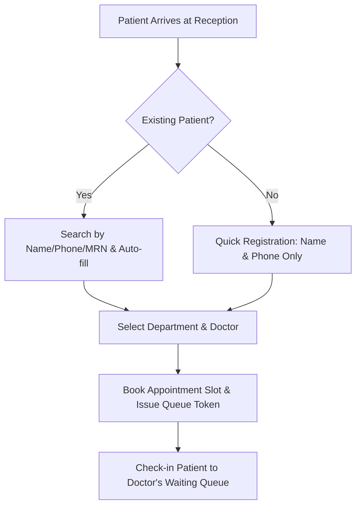

### Real-World Actions
1. **Patient Search / Verification**:
   * The receptionist searches for the patient using Name, Phone Number, or Medical Record Number (MRN).
   * **Existing Patient**: Details are auto-filled, and previous consultation history is linked.
   * **New Patient (Quick Registration)**: Receptionist performs a quick registration requiring minimal details (Full Name and Phone Number) to prevent front-desk congestion. Full profile registration can be completed later.
2. **Doctor and Time Slot Selection**:
   * Receptionist filters doctors based on the selected Department and checks their real-time availability calendar.
   * Optional details like Appointment Type (e.g., OPD consultation, Follow-up review) and Priority (Normal, High) are set.
3. **Booking and Token Assignment**:
   * The appointment is saved, generating an active Queue Token (e.g., `OPD-042`) and estimating wait time.
4. **Queue Check-In**:
   * When the patient is physically present, the receptionist confirms check-in. The patient's status changes from `BOOKED` to `WAITING` on the doctor's queue monitor.

---

## ── Scenario 3: Doctor — Outpatient Consultation ───────────────────

**Objective**: Assess patients in the queue, review clinical history, perform examinations, write prescriptions, and finalize outcomes.

### Workflow Diagram
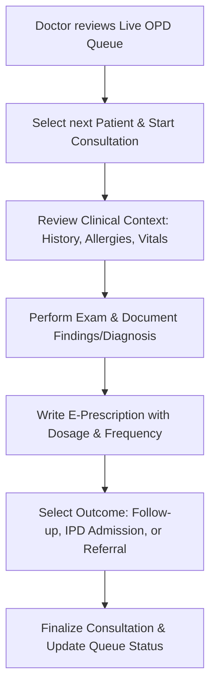

### Real-World Actions
1. **Queue Review**:
   * The doctor views a live dashboard of checked-in patients, sorted by check-in time and priority.
2. **Start Consultation**:
   * The doctor clicks "Start Consultation" on the next patient. This updates the patient's state to `IN_CONSULTATION` on both the doctor's and receptionist's monitors.
3. **Clinical Context Review**:
   * The doctor reviews the patient’s history, active medications, chronic conditions, drug allergies, and current vitals (pulse, blood pressure, temperature, SpO2) entered by the nurse.
4. **Examination & Notes**:
   * Doctor documents chief complaints, physical findings, and maps diagnosis codes.
5. **E-Prescribing**:
   * Doctor selects medications from the pharmacy catalogue.
   * Doctor configures dosage, route of administration (e.g. ORAL, IV), frequency code (e.g. OD, BD, TDS, SOS), and duration.
6. **Consultation Finalization**:
   * Doctor selects the next step: *Complete, Schedule Follow-up, Refer to another specialist, or Order Inpatient (IPD) Admission*.
   * Finalizing frees up the doctor's queue and notifies the next patient.

---

## ── Scenario 4: Receptionist & Nurse — Emergency Walk-In ───────────

**Objective**: Immediate registration, fast-track triage, and priority queue override for critical cases.

### Workflow Diagram
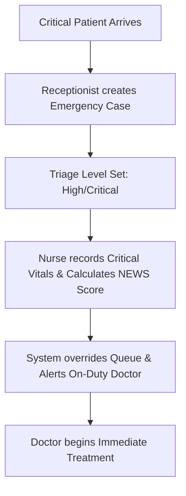

### Real-World Actions
1. **Emergency Registration**:
   * Receptionist creates an emergency record immediately. Detailed demographic checks are skipped.
   * Triage priority is flagged (e.g., `CRITICAL` or `HIGH`).
2. **Clinical Triage**:
   * The nurse records initial vitals (Pulse, SpO2, Temperature, Blood Pressure) and calculates the **National Early Warning Score (NEWS)**.
   * If the score indicates critical instability, a notification is sent to the on-duty emergency physician.
3. **Queue Override**:
   * The system places the patient at the top of the assigned doctor's queue, overriding standard outpatient appointments.
4. **Status Tracking**:
   * Staff monitor the patient's progress through states: `Triage` → `In Treatment` → `Stabilized` → `Admitted/Discharged`.

---

## ── Scenario 5: Receptionist & Nurse — Inpatient (IPD) Admission ──────

**Objective**: Admit outpatient or emergency patients into the hospital wards, select ward type, allocate an available bed, and assign a nursing team.

### Workflow Diagram
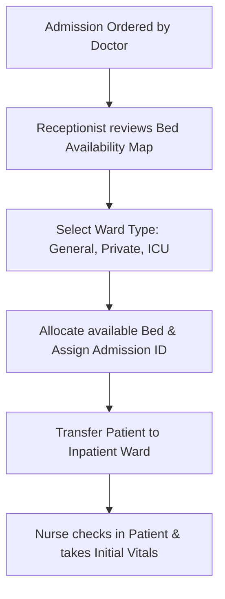

### Real-World Actions
1. **Admission Request**:
   * When a doctor recommends admitting a patient, an admission order is routed to the reception desk.
2. **Bed Availability Review**:
   * The receptionist opens the live bed map, filtered by Ward Type (General, Semi-Private, Private, ICU) and Gender requirements.
3. **Bed Allocation**:
   * Receptionist selects an available bed (status: `AVAILABLE`).
   * The bed status changes to `OCCUPIED`.
   * An admission record is generated with a unique Admission ID.
4. **Ward Check-In**:
   * The patient is moved to the physical ward.
   * The ward nurse checks in the patient, confirms bed placement, updates the patient's ward status to `ADMITTED`, and takes initial baseline vitals.

---

## ── Scenario 6: Nurse — Ward Management & Patient Care ────────────────

**Objective**: Ongoing monitoring, vitals tracking, medication administration, and patient safety checks.

### Workflow Diagram
```mermaid
graph TD
    A[Nurse views Ward Dashboard] --> B[Perform Scheduled Vitals Check]
    B --> C[Log Vitals & System auto-calculates NEWS Score]
    C --> D{Is NEWS Score Critical?}
    D -- Yes --> E[Trigger Escalation Alert to Doctor]
    D -- No --> F[Open Medication Administration Record (MAR)]
    F --> G[Administer Prescribed Dose & Sign Off in MAR]
```

### Real-World Actions
1. **Ward Dashboard Monitoring**:
   * The nurse monitors their assigned ward, viewing patient names, room/bed assignments, current IPD workflow status (e.g. `UNDER_TREATMENT`, `READY_FOR_DISCHARGE`), and upcoming tasks.
2. **Vitals Recording & NEWS Calculations**:
   * The nurse records patient vitals.
   * The system automatically calculates the National Early Warning Score (NEWS).
   * **Escalation**: If the score exceeds safety thresholds, the system flags the patient on the doctor's portal and prompts the nurse to alert the doctor.
3. **Medication Administration Record (MAR)**:
   * The nurse opens the patient's MAR, which shows all active medication orders (drug name, dose, route, scheduled times).
   * After administering the medication, the nurse records the time, dose, and signs off. This updates the status in the pharmacy and doctor portals.
4. **Discharge Preparation**:
   * The nurse completes the pre-discharge checklist once the doctor flags the patient as `READY_FOR_DISCHARGE`.

---

## ── Scenario 7: Doctor — IPD Rounds & Ward Actions ────────────────────

**Objective**: Assess admitted inpatients, review chart notes/nursing logs, adjust clinical plans, and order diagnostics.

### Workflow Diagram
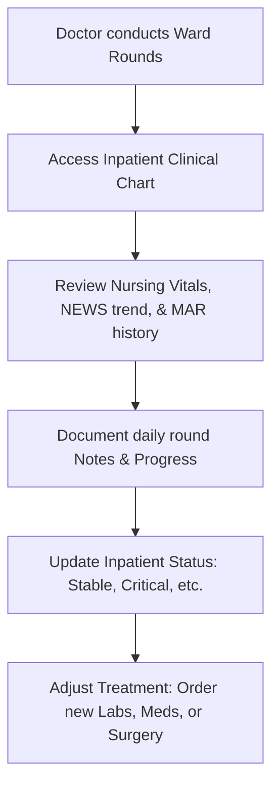

### Real-World Actions
1. **Inpatient Round Charts**:
   * During daily rounds, the doctor accesses each inpatient's record, reviewing vitals trends, nursing notes, and medication history.
2. **Daily Progress Notes**:
   * The doctor records progress notes, detailing clinical changes and physical findings.
3. **Treatment Adjustment**:
   * Doctor modifies orders: adds new medications, stops existing ones, or requests diagnostic lab tests or imaging.
4. **Inpatient Status Updates**:
   * Doctor updates the patient's clinical status (e.g., from `STABLE` to `CRITICAL` or `UNDER_OBSERVATION`) to coordinate care with the nursing team.

---

## ── Scenario 8: Doctor & Nurse — Surgery & OT Lifecycle ───────────────

**Objective**: Plan surgical procedures, schedule Operation Theatre (OT) resources, coordinate pre-op, intra-op, and post-op care.

### Workflow Diagram
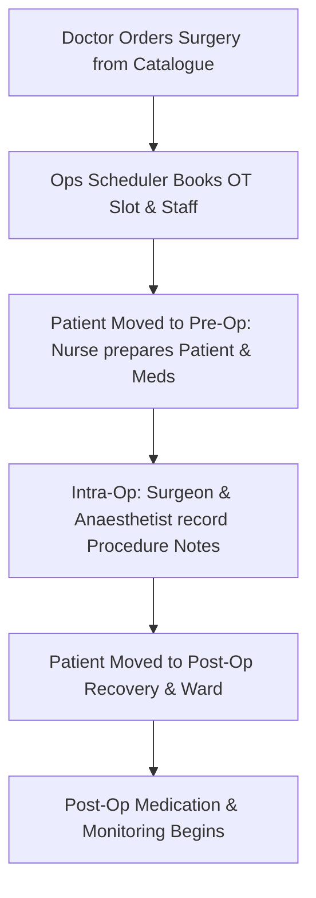

### Real-World Actions
1. **Surgery Order Placement**:
   * The doctor selects a procedure (e.g., Hemorrhoidectomy, Sphincterotomy) from the surgery catalogue and submits a surgical order.
2. **OT Scheduling**:
   * The scheduler reserves an Operation Theatre, schedules the primary surgeon, assistant doctor, anaesthetist, scrub nurse, and sets the surgery date/time.
3. **Pre-Operative Preparation**:
   * The ward nurse prepares the patient (consent verification, skin prep) and administers pre-op medications (e.g., local anaesthetics, prophylactic antibiotics).
4. **Intra-Operative Documentation**:
   * The surgical team records surgical findings, implants used, anaesthesia dosage, and logs any intra-operative events.
5. **Post-Operative Recovery**:
   * The patient is moved to the recovery unit. Post-op orders (pain management, venous support) are sent to the ward nursing team.

---

## ── Scenario 9: Doctor & Billing Executive — Discharge & Settlement ──

**Objective**: Finalize discharge summary, compile medical charges, process discounts/insurance, receive payments, and free up bed resources.

### Workflow Diagram
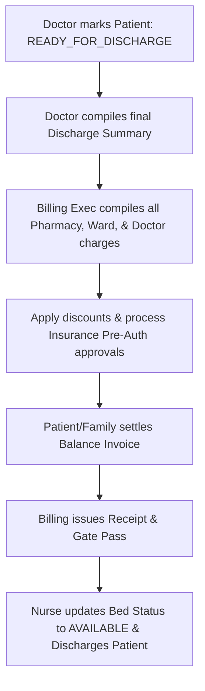

### Real-World Actions
1. **Discharge Ordering**:
   * The doctor flags the patient's status as `READY_FOR_DISCHARGE` and writes the final discharge summary (discharge notes, home care instructions, follow-up date).
2. **Billing Consolidation**:
   * The billing executive consolidates all charges incurred during the stay, including ward bed days, doctor consultation fees, surgical procedures, pharmacy items dispensed, and diagnostic lab tests.
3. **Insurance & Discounts**:
   * The billing executive applies eligible institutional discounts and coordinates with the insurance coordinator to submit final approval documents to third-party payers.
4. **Invoice Settlement**:
   * The patient or family pays the remaining balance. A receipt and a digital gate pass are generated.
5. **Bed Clearance**:
   * Once payment is confirmed, the nurse changes the patient's status to `DISCHARGED`, clears the bed, and marks it as `AVAILABLE` (or `MAINTENANCE` for cleaning) in the system.

---

## ── Scenario 10: Nurse — Shift Handover (SBAR Method) ────────────────

**Objective**: Ensure safe, complete, and structured transfer of patient care responsibilities between incoming and outgoing nursing shifts.

### Workflow Diagram
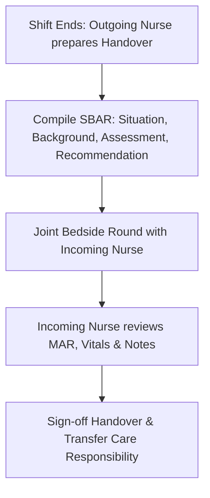

### Real-World Actions
1. **Handover Compilation**:
   * At the end of a shift, the outgoing nurse prepares patient summaries using the structured **SBAR** framework:
     * **S (Situation)**: Current diagnosis, doctor, and patient stability.
     * **B (Background)**: Admission reason, clinical history, and allergies.
     * **A (Assessment)**: Latest vitals, NEWS trends, and medications administered.
     * **R (Recommendation)**: Pending lab results, scheduled dressings, or specific monitoring requests.
2. **Bedside Validation**:
   * Both nurses perform a bedside verification, checking the patient's physical state and bed placement.
3. **Care Transfer Confirmation**:
   * The incoming nurse signs off on the shift log, confirming transfer of care.

---

## ── Scenario 11: System Admin & HR — Workforce & Leaves ───────────────

**Objective**: Configure workforce availability, assign weekly schedules, and manage staff leave requests.

### Workflow Diagram
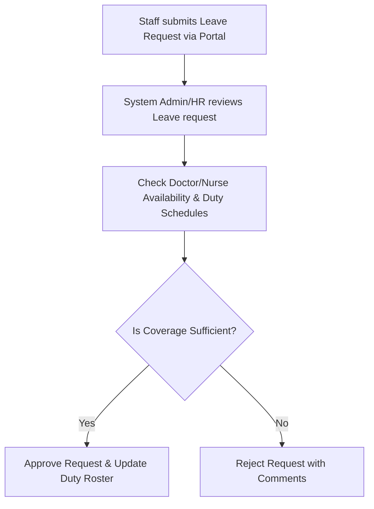

### Real-World Actions
1. **Duty Roster Configuration**:
   * HR sets up weekly work shifts, on-call schedules, and department assignments for clinical staff.
2. **Leave Submission**:
   * Clinical staff submit leave requests through their portals, specifying dates and coverage notes.
3. **Approval and Coverage Checking**:
   * System Admin or HR reviews the leave request against scheduled operations, department rosters, and coverage requirements.
   * **Approval**: The leave is approved, staff calendar status changes to `ON_LEAVE`, and the system prompts the admin to assign backup coverage for active appointments or OT shifts.

---

## ── Scenario 12: System Admin — Security, Auditing & Logs ────────────

**Objective**: Monitor system security, enforce single-session rules, track data changes, and ensure compliance.

### Workflow Diagram
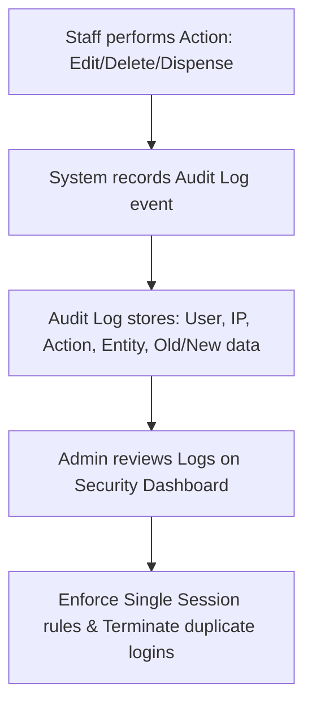

### Real-World Actions
1. **Automated Audit Logging**:
   * Every critical operation (patient record creation, medication dispensing, invoice adjustment, profile deletion) triggers an automated audit log entry.
   * Logs capture: User ID, Role, Action type, target record, IP address, and timestamp.
2. **Database Change Auditing**:
   * Database triggers capture exact snapshots of modified records, storing "before" and "after" state to track data changes.
3. **Session Enforcement**:
   * The system monitors active sessions.
   * If a user logs in from a new device, the system automatically terminates the old active session to prevent credential sharing.
4. **Security Audits**:
   * Admin reviews the security log to trace access history, investigate unauthorized access attempts, and verify compliance with health data standards.
