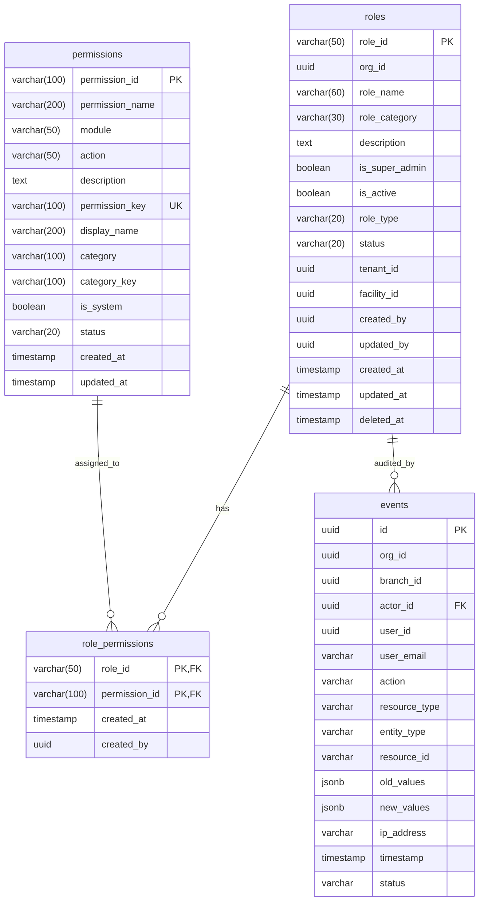

# Security & RBAC (Role-Based Access Control) API Documentation

This document describes the design, database integration, validation rules, and REST APIs for the enterprise-grade Security & Role-Based Access Control (RBAC) module.

---

## 1. Database Architecture & Schema

The Security & RBAC tables reside in the `identity` database schema. Views are exposed in the `public` schema for backwards compatibility with the authentication middleware.



### Views in `public` Schema
1. **`public.hms_roles`**: Exposes active, soft-deleted, system, and custom roles.
2. **`public.hms_permissions`**: Maps `permission_key` to `permission_name` to allow the token auth middleware to verify authorization checks seamlessly.
3. **`public.hms_role_permissions`**: Maps role to permission associations.

---

## 2. Business Rules & Guardrails

To protect security configurations, the service layer enforces the following validation checks:

* **Role Name Normalization**: 
  * Trims leading, trailing, and multi-spaces.
  * Capitalizes first letter of each word (`billing executive` -> `Billing Executive`).
  * Rejects duplicate role names (case-insensitive and whitespace-insensitive) per tenant.
  * Permits only standard alphanumeric characters, spaces, hyphens, and underscores.
* **Platform Protection**:
  * Blocks any write (`PUT`) or delete (`DELETE`) operations on roles with `role_type = 'SYSTEM'`.
  * Protects default system roles from modifications.
* **Deletion Safeguards**:
  * Roles assigned to active users (`user_count > 0`) cannot be deleted.
  * Deletions perform a **soft delete** setting `status = 'DELETED'` and populating `deleted_at = NOW()`.
* **Permissions Checklist Validation**:
  * Removes duplicate permission IDs automatically.
  * Rejects empty permission lists (each role must possess at least one active permission).
* **HIPAA Audit Trail**:
  * Every role creation, modification, or soft deletion logs a corresponding row in the `audit.events` table recording:
    * Action (`CREATE_ROLE`, `UPDATE_ROLE`, `DELETE_ROLE`)
    * Actor ID and user email
    * Old vs new values JSON dictionary
    * IP address and caller device info

---

## 3. API Route Reference

### 3.1 GET List Grouped Permissions
Returns all active system permissions grouped dynamically by category/module.

* **Method**: `GET`
* **URL**: `/admin/permissions`
* **Headers**: `Authorization: Bearer <JWT>`

#### Response (`200 OK`)
```json
{
  "success": true,
  "code": 200,
  "data": [
    {
      "category": "Patient Management",
      "category_key": "PATIENT_MANAGEMENT",
      "permissions": [
        {
          "permission_id": "PAT-001",
          "permission_key": "patients:create",
          "display_name": "Create Patients",
          "description": "Register new patients"
        },
        {
          "permission_id": "PAT-002",
          "permission_key": "patients:view",
          "display_name": "View Patients",
          "description": "View patient records"
        }
      ]
    }
  ]
}
```

---

### 3.2 GET List Roles
Retrieve all roles (system platform roles and custom tenant roles) with active user assignment counts.

* **Method**: `GET`
* **URL**: `/admin/roles`
* **Headers**: `Authorization: Bearer <JWT>`

#### Response (`200 OK`)
```json
{
  "success": true,
  "code": 200,
  "data": [
    {
      "role_id": "role_829fa8d8ab7d",
      "role_name": "Billing Executive",
      "role_type": "CUSTOM",
      "description": "Responsible for billing operations",
      "status": "ACTIVE",
      "user_count": 0,
      "permission_count": 3,
      "created_by": "902d2bc4-f5ee-45df-98bd-674cd7bb0eef",
      "created_at": "2026-07-27 15:45:00+05:30",
      "updated_at": "2026-07-27 15:45:00+05:30"
    }
  ]
}
```

---

### 3.3 POST Create Custom Role
Creates a new custom role and associates selected permissions.

* **Method**: `POST`
* **URL**: `/admin/roles`
* **Headers**: `Authorization: Bearer <JWT>`
* **Request Body**:
```json
{
  "role_name": "  billing executive  ",
  "description": "Responsible for billing operations",
  "permission_ids": [
    "PAT-001",
    "PAT-002",
    "BIL-001"
  ]
}
```

#### Response (`201 Created`)
```json
{
  "success": true,
  "code": 201,
  "message": "Created successfully",
  "data": {
    "role_id": "role_829fa8d8ab7d",
    "role_name": "Billing Executive",
    "role_type": "CUSTOM",
    "description": "Responsible for billing operations",
    "status": "ACTIVE",
    "user_count": 0,
    "permission_count": 3,
    "created_by": "902d2bc4-f5ee-45df-98bd-674cd7bb0eef",
    "created_at": "2026-07-27 15:45:00+05:30",
    "updated_at": "2026-07-27 15:45:00+05:30"
  }
}
```

---

### 3.4 GET Role Details
Fetch detailed attributes of a single role including category-grouped permissions.

* **Method**: `GET`
* **URL**: `/admin/roles/{role_id}`
* **Headers**: `Authorization: Bearer <JWT>`

#### Response (`200 OK`)
```json
{
  "success": true,
  "code": 200,
  "data": {
    "role": {
      "role_id": "role_829fa8d8ab7d",
      "role_name": "Billing Executive",
      "role_type": "CUSTOM",
      "description": "Responsible for billing operations",
      "status": "ACTIVE",
      "user_count": 0,
      "permission_count": 3,
      "created_by": "902d2bc4-f5ee-45df-98bd-674cd7bb0eef",
      "created_at": "2026-07-27 15:45:00+05:30",
      "updated_at": "2026-07-27 15:45:00+05:30"
    },
    "permissions": [
      {
        "category": "Patient Management",
        "category_key": "PATIENT_MANAGEMENT",
        "permissions": [
          {
            "permission_id": "PAT-001",
            "permission_key": "patients:create",
            "display_name": "Create Patients",
            "description": "Register new patients"
          }
        ]
      }
    ]
  }
}
```

---

### 3.5 GET Role Permissions Copy Helper
Exposes a flat string array of permission IDs assigned to a role, serving as a helper to copy configuration settings from one role to another in the frontend.

* **Method**: `GET`
* **URL**: `/admin/roles/{role_id}/permissions`
* **Headers**: `Authorization: Bearer <JWT>`

#### Response (`200 OK`)
```json
{
  "success": true,
  "code": 200,
  "data": [
    "PAT-001",
    "PAT-002",
    "BIL-001"
  ]
}
```

---

### 3.6 PUT Update Custom Role
Modifies role properties or updates permissions checklist.

* **Method**: `PUT`
* **URL**: `/admin/roles/{role_id}`
* **Headers**: `Authorization: Bearer <JWT>`
* **Request Body**:
```json
{
  "role_name": "Billing Senior Coordinator",
  "description": "Supervisor level billing coordinator",
  "permission_ids": [
    "PAT-001",
    "PAT-002",
    "BIL-001",
    "BIL-002"
  ]
}
```

#### Response (`200 OK`)
*Returns updated detailed role card.*

---

### 3.7 DELETE Custom Role (Soft Delete)
Marks a role as soft-deleted (`status = 'DELETED'`). Blocks if assigned to active users or if role is SYSTEM type.

* **Method**: `DELETE`
* **URL**: `/admin/roles/{role_id}`
* **Headers**: `Authorization: Bearer <JWT>`

#### Response (`200 OK`)
```json
{
  "success": true,
  "code": 200,
  "data": {
    "message": "Role soft-deleted successfully"
  }
}
```
