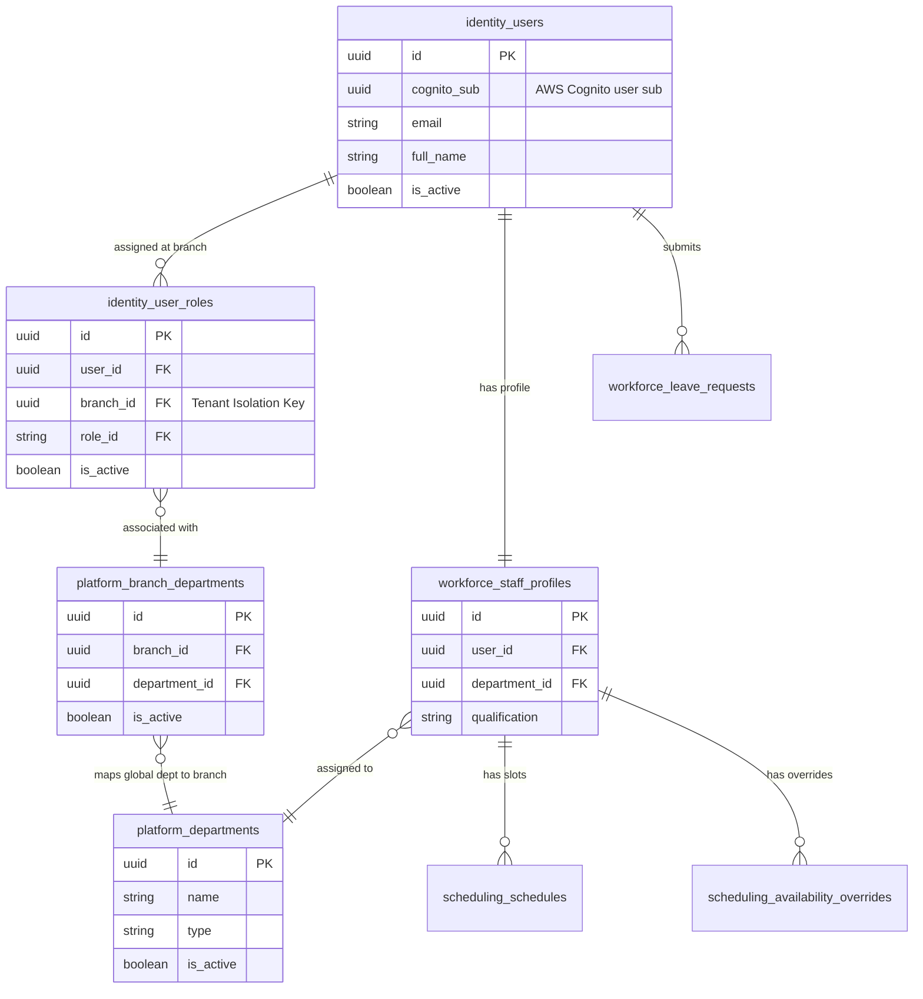
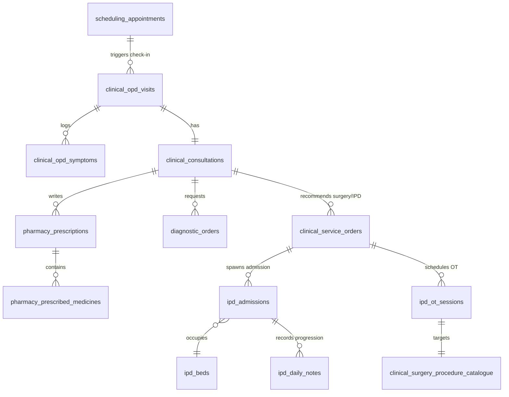
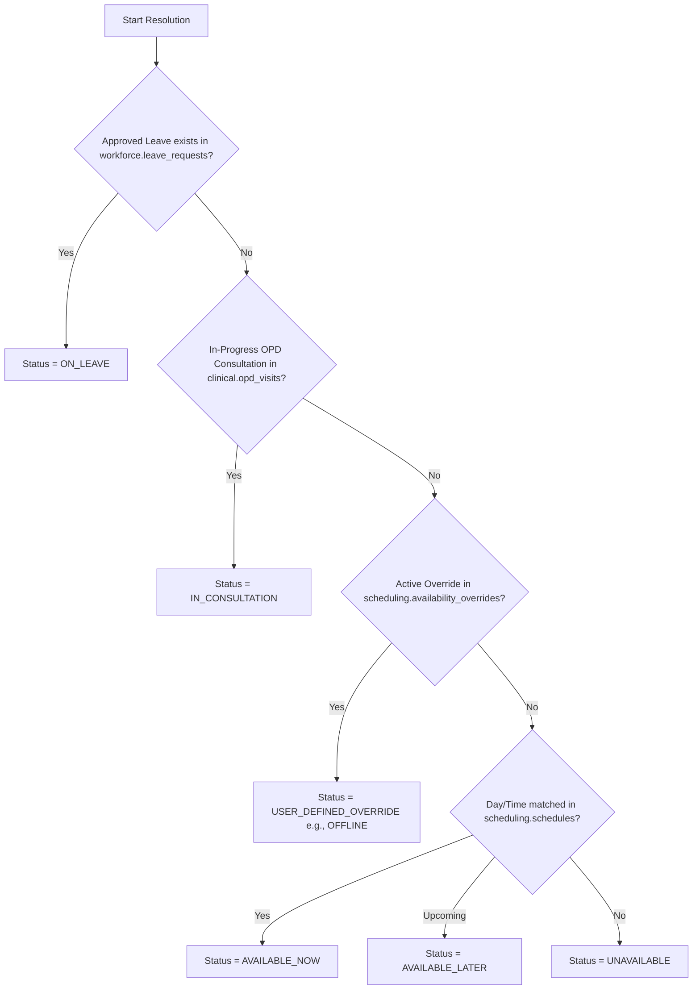

# 🏥 Arovita HMS — Definitive Database Schema Documentation

This document serves as the master guide for the database architecture of the Arovita Hospital Management System (HMS). It covers structural design rationale, logical namespaces, relationship workflows, dynamic queries, and contains a complete, column-by-column specifications dictionary for all **115 tables** inside the database.

---

## 🗺️ 1. Architectural Philosophy & Rationale

The database architecture for the Arovita HMS transitioned from a **Branch-Centric Model** (schema-per-branch) to a **Domain-Centric Multi-Tenant Architecture** to support seamless scaling as a SaaS platform (the "Shopify for Hospitals" model).

### 1.1 The Problems with the Legacy Branch-Centric Model
* **Table Explosion**: Previously, a separate database schema was created dynamically for each new branch facility, cloning all 77 operational tables. For 50 branches, this resulted in **3,850 tables** in a single database, causing heavy catalog performance bottlenecks in PostgreSQL.
* **Maintenance Overhead**: Schema updates, index creations, and DDL migrations had to be run dynamically and sequentially across all branch schemas. This was highly error-prone and slow.
* **Complex Cross-Branch Queries**: Querying or aggregating data across multiple locations (e.g., patient histories or staff allocations) required complex dynamic cross-schema queries.

### 1.2 The Domain-Centric Multi-Tenant Solution
To scale the system, we migrated to a static set of **Domain-Centric Schemas** utilizing **Row-Level Security (RLS)**:
* **Static Schema Footprint**: Regardless of how many branches or tenants are onboarded, the database footprint remains at a static **~115 tables** spread across logical service domains.
* **Row-Level Tenant Isolation**: All operational tables contain a `branch_id UUID NOT NULL` column. PostgreSQL Row-Level Security (RLS) is enabled on all tables, automatically filtering queries based on the database transaction session's active branch:
  ```sql
  CREATE POLICY tenant_isolation ON <domain>.<table_name>
      USING (branch_id = current_setting('app.branch_id', true)::uuid);
  ```
  This guarantees that data is isolated securely without adding manual `WHERE branch_id = ...` clauses to every query in Python.
* **Decoupled Roles & Permissions**: User profiles (`identity.users`) are decoupled from branch-specific roles (`identity.user_roles`). A user can belong to multiple branch facilities, holding distinct roles (e.g., Chief Doctor at Branch A, Visiting Consultant at Branch B), isolated by role-specific states per branch.
* **Type-Based Department Capability Synthesis**: Flags like `is_clinical`, `allows_appointments`, and `allows_admissions` are resolved programmatically based on the department `type` (e.g. `CLINICAL`, `SUPPORT`). This removes redundant columns from tables and ensures business logic remains in code.

---

## 🗂️ 2. Logical Domain Schemas

The database structure is organized into logical domain schemas that align directly with the backend microservices.

| Domain Schema | Purpose / Responsibilities |
| :--- | :--- |
| **`platform`** | Core configurations: organizations, branch facilities, global departments, and settings. |
| **`identity`** | Auth & RBAC: users, roles, permissions, branch user roles, and login sessions. |
| **`workforce`** | Staff administration: staff profiles, shift schedules, leave requests, and balances. |
| **`scheduling`**| Appointment booking: patient appointments, timeslots, doctor schedules, and queue tokens. |
| **`patient`** | Patient demographics: patients, medical histories, emergency details, wards, and bed allocations. |
| **`clinical`** | Electronic Medical Records (EMR): encounters, OPD consultations, prescriptions, and OT surgery procedures. |
| **`ipd` / `nursing`** | Inpatient operations: admissions, daily progress notes, medication charts (MAR), and vitals tracking. |
| **`diagnostic`**| Diagnostics: laboratory tests, pathology/radiology order items, and blood bank inventory. |
| **`pharmacy`** | Inventory & Pharmacy: medicine master catalogue, purchase orders, vendors, and dispensing. |
| **`revenue`** | Financial revenue: insurance policies, patient billing packages, invoices, and claims. |
| **`audit`** | Security auditing: tracking system access, sensitive database updates, and event logs. |

---

## 🕸️ 3. Core Database Relationships

### 3.1 Identity, Platform, & Workforce Management

This domain handles user management, branch facilities, global departments, and staff profiling.



### 3.2 Clinical Operations (OPD ➔ IPD ➔ OT Flow)

Clinical records flow seamlessly across outpatient consultations, inpatient admissions, and operating theatre procedures.



---

## 🕒 4. Dynamic Availability Calculation (Doctor Status)

A doctor's current status (`availability_status`) is computed dynamically in real-time by analyzing schedules, leaves, consultations, and overrides in the following priority:



---

## 🔄 5. Backward Compatibility View Layer

To prevent breaking existing Python backend services that were built when tables existed in legacy schemas (`public`, `catalogue`, `billing`, `admin`), the database exposes a **100% backward-compatible view layer**.

### 5.1 Legacy-to-Domain View Map

These views exist within legacy schemas but map directly to the unified domain tables:

* `public.sys_users` ➔ `SELECT * FROM identity.users;`
* `public.staff_profiles` ➔ `SELECT * FROM workforce.staff_profiles;`
* `public.hms_roles` ➔ `SELECT * FROM identity.roles;`
* `public.hms_permissions` ➔ `SELECT * FROM identity.permissions;`
* `public.user_custom_permissions` ➔ `SELECT * FROM identity.user_custom_permissions;`
* `public.branches` ➔ `SELECT id, name, org_id, code, ... FROM platform.facilities;`
* `catalogue.medicines` ➔ `SELECT * FROM pharmacy.medicine_master;`
* `billing.insurance_claims` ➔ `SELECT * FROM revenue.insurance_claims;`

### 5.2 How the View Layer Works
1. **Unmodified Code Queries**: The Python database repositories run queries against the legacy schemas (e.g. `SELECT * FROM public.sys_users`). PostgreSQL transparently routes these queries to the backend domain tables (e.g. `identity.users`).
2. **Updatable Views**: In PostgreSQL, 1-to-1 views are naturally updatable. Therefore, database writes (`INSERT`, `UPDATE`, `DELETE`) executed by the Python services on the view layers successfully modify the underlying domain tables.
3. **Implicit Tenancy Injection**: When database clients open a connection transaction, the backend sets the session tenant variables (`SET LOCAL app.branch_id = '...'`). The Row-Level Security (RLS) policies on the base tables automatically capture this variable and isolate the data, ensuring the Python queries require no manual branch filters.

---

# 📖 6. Complete Table & Column Dictionary

This section details all tables, columns, constraints, and relationships for the Arovita HMS schema definitions.

## 📁 Namespace Schema: `audit`
Contains tables representing the logical `audit` domain.

### 📊 Table: `audit.events`
Columns for table `events`:

| Column Name | Data Type & Modifiers | RLS / Constraints | Column Description |
| :--- | :--- | :--- | :--- |
| `id` | `UUID  DEFAULT gen_random_uuid()` | Scoped by Tenant <br> `PRIMARY KEY` | Primary Key: Unique identifier for each event record. |
| `org_id` | `VARCHAR(255)` | Scoped by Tenant <br> `None` | Foreign Key: References the associated org record identifier. |
| `branch_id` | `VARCHAR(255)` | **RLS ISOLATED** <br> `None` | Tenant Branch ID: Enforces multi-tenant row-level security isolation. |
| `actor_id` | `UUID  identity.users(id),          -- admin actions` | Scoped by Tenant <br> `FK -> identity.users` | Foreign Key: References identity.users(id). |
| `user_id` | `UUID,                                            -- nullable: app-context user` | Scoped by Tenant <br> `None` | Foreign Key: References the associated user record identifier. |
| `user_email` | `VARCHAR(255)` | Scoped by Tenant <br> `None` | Primary email address. |
| `action` | `VARCHAR(100)` | Scoped by Tenant <br> `NOT NULL` | Authorized action name (e.g. READ, WRITE). |
| `resource_type` | `VARCHAR(100)` | Scoped by Tenant <br> `None` | Text field containing resource type details. |
| `entity_type` | `VARCHAR(100)` | Scoped by Tenant <br> `None` | Text field containing entity type details. |
| `resource_id` | `VARCHAR(255)` | Scoped by Tenant <br> `None` | Foreign Key: References the associated resource record identifier. |
| `entity_id` | `UUID` | Scoped by Tenant <br> `None` | Foreign Key: References the associated entity record identifier. |
| `old_values` | `JSONB` | Scoped by Tenant <br> `None` | Structured JSON document storing dynamic parameters for old values. |
| `old_data` | `JSONB` | Scoped by Tenant <br> `None` | Structured JSON document storing dynamic parameters for old data. |
| `new_values` | `JSONB` | Scoped by Tenant <br> `None` | Structured JSON document storing dynamic parameters for new values. |
| `new_data` | `JSONB` | Scoped by Tenant <br> `None` | Structured JSON document storing dynamic parameters for new data. |
| `ip_address` | `VARCHAR(45)` | Scoped by Tenant <br> `None` | Physical contact address. |
| `timestamp` | `TIMESTAMPTZ DEFAULT NOW()` | Scoped by Tenant <br> `None` | Timestamp recording the timestamp datetime. |
| `status` | `VARCHAR(50) DEFAULT 'success'` | Scoped by Tenant <br> `None` | Current operational status of this record. |


---

### 📊 Table: `audit.login_audit`
Columns for table `login_audit`:

| Column Name | Data Type & Modifiers | RLS / Constraints | Column Description |
| :--- | :--- | :--- | :--- |
| `id` | `UUID  DEFAULT gen_random_uuid()` | Scoped by Tenant <br> `PRIMARY KEY` | Primary Key: Unique identifier for each login_audit record. |
| `tenant_id` | `UUID` | Scoped by Tenant <br> `NOT NULL` | Tenant Organization or Facility ID. |
| `event_type` | `VARCHAR(60)` | Scoped by Tenant <br> `NOT NULL` | Text field containing event type details. |
| `severity` | `VARCHAR(20)` | Scoped by Tenant <br> `NOT NULL` | Text field containing severity details. |
| `user_id` | `UUID  identity.users(id)` | Scoped by Tenant <br> `FK -> identity.users` | Foreign Key: References identity.users(id). |
| `description` | `TEXT` | Scoped by Tenant <br> `NOT NULL` | Text field containing description details. |
| `ip_address` | `TEXT` | Scoped by Tenant <br> `None` | Physical contact address. |
| `metadata` | `JSONB` | Scoped by Tenant <br> `None` | Structured JSON document storing dynamic parameters for metadata. |
| `created_at` | `TIMESTAMPTZ DEFAULT NOW()` | Scoped by Tenant <br> `None` | Timestamp when the record was created. |


---

## 📁 Namespace Schema: `clinical`
Contains tables representing the logical `clinical` domain.

### 📊 Table: `clinical.consultations`
Columns for table `consultations`:

| Column Name | Data Type & Modifiers | RLS / Constraints | Column Description |
| :--- | :--- | :--- | :--- |
| `id` | `UUID  DEFAULT public.uuid_v7()` | Scoped by Tenant <br> `PRIMARY KEY` | Primary Key: Unique identifier for each consultation record. |
| `branch_id` | `UUID` | **RLS ISOLATED** <br> `NOT NULL` | Tenant Branch ID: Enforces multi-tenant row-level security isolation. |
| `encounter_id` | `UUID  clinical.encounters(id)` | Scoped by Tenant <br> `FK -> clinical.encounters` | Foreign Key: References clinical.encounters(id). |
| `patient_id` | `UUID  patient.patients(id)` | Scoped by Tenant <br> `FK -> patient.patients` | Foreign Key: References patient.patients(id). |
| `doctor_id` | `UUID  public.sys_users(id)` | Scoped by Tenant <br> `FK -> public.sys_users` | Foreign Key: References public.sys_users(id). |
| `opd_visit_id` | `UUID  clinical.opd_visits(id)` | Scoped by Tenant <br> `FK -> clinical.opd_visits` | Foreign Key: References clinical.opd_visits(id). |
| `ipd_admission_id` | `UUID  ipd.ipd_admissions(id)` | Scoped by Tenant <br> `FK -> ipd.ipd_admissions` | Foreign Key: References ipd.ipd_admissions(id). |
| `chief_complaint` | `TEXT` | Scoped by Tenant <br> `None` | Text field containing chief complaint details. |
| `diagnosis` | `TEXT` | Scoped by Tenant <br> `None` | Text field containing diagnosis details. |
| `icd_code` | `VARCHAR(100)` | Scoped by Tenant <br> `None` | Text field containing icd code details. |
| `notes` | `TEXT` | Scoped by Tenant <br> `None` | Optional free-text physician/administrative notes. |
| `status` | `VARCHAR(50)` | Scoped by Tenant <br> `None` | Current operational status of this record. |
| `follow_up_date` | `DATE` | Scoped by Tenant <br> `None` | Database field storing follow up date. |
| `signed_at` | `TIMESTAMPTZ` | Scoped by Tenant <br> `None` | Timestamp recording the signed at datetime. |
| `signed_by` | `UUID  public.sys_users(id)` | Scoped by Tenant <br> `FK -> public.sys_users` | Foreign Key: References public.sys_users(id). |
| `created_at` | `TIMESTAMPTZ DEFAULT NOW()` | Scoped by Tenant <br> `None` | Timestamp when the record was created. |
| `updated_at` | `TIMESTAMPTZ DEFAULT NOW()` | Scoped by Tenant <br> `None` | Timestamp when the record was last updated. |


---

### 📊 Table: `clinical.dept_consultation_forms`
Columns for table `dept_consultation_forms`:

| Column Name | Data Type & Modifiers | RLS / Constraints | Column Description |
| :--- | :--- | :--- | :--- |
| `id` | `UUID  DEFAULT gen_random_uuid()` | Scoped by Tenant <br> `PRIMARY KEY` | Primary Key: Unique identifier for each dept_consultation_form record. |
| `branch_id` | `UUID` | **RLS ISOLATED** <br> `NOT NULL` | Tenant Branch ID: Enforces multi-tenant row-level security isolation. |
| `consultation_id` | `UUID   clinical.consultations(id)` | Scoped by Tenant <br> `NOT NULL, FK -> clinical.consultations` | Foreign Key: References clinical.consultations(id). |
| `opd_visit_id` | `UUID  clinical.opd_visits(id)` | Scoped by Tenant <br> `FK -> clinical.opd_visits` | Foreign Key: References clinical.opd_visits(id). |
| `ipd_admission_id` | `UUID  ipd.ipd_admissions(id)` | Scoped by Tenant <br> `FK -> ipd.ipd_admissions` | Foreign Key: References ipd.ipd_admissions(id). |
| `department_id` | `UUID   catalogue.departments(id)` | Scoped by Tenant <br> `NOT NULL, FK -> catalogue.departments` | Foreign Key: References catalogue.departments(id). |
| `form_type` | `VARCHAR(50)` | Scoped by Tenant <br> `NOT NULL` | Text field containing form type details. |
| `form_data` | `JSONB DEFAULT '{}'::jsonb` | Scoped by Tenant <br> `NOT NULL` | Structured JSON document storing dynamic parameters for form data. |
| `created_by` | `UUID  public.sys_users(id)` | Scoped by Tenant <br> `FK -> public.sys_users` | Foreign Key: References public.sys_users(id). |
| `created_at` | `TIMESTAMPTZ DEFAULT NOW()` | Scoped by Tenant <br> `None` | Timestamp when the record was created. |
| `updated_at` | `TIMESTAMPTZ DEFAULT NOW()` | Scoped by Tenant <br> `None` | Timestamp when the record was last updated. |


**Table-Level Constraints / Indices:**
* `CONSTRAINT uq_dcf_consultation_form_type UNIQUE (consultation_id, form_type)`


---

### 📊 Table: `clinical.encounters`
Columns for table `encounters`:

| Column Name | Data Type & Modifiers | RLS / Constraints | Column Description |
| :--- | :--- | :--- | :--- |
| `id` | `UUID  DEFAULT public.uuid_v7()` | Scoped by Tenant <br> `PRIMARY KEY` | Primary Key: Unique identifier for each encounter record. |
| `branch_id` | `UUID` | **RLS ISOLATED** <br> `NOT NULL` | Tenant Branch ID: Enforces multi-tenant row-level security isolation. |
| `patient_id` | `UUID  patient.patients(id)` | Scoped by Tenant <br> `FK -> patient.patients` | Foreign Key: References patient.patients(id). |
| `appointment_id` | `UUID  scheduling.appointments(id)` | Scoped by Tenant <br> `FK -> scheduling.appointments` | Foreign Key: References scheduling.appointments(id). |
| `type` | `VARCHAR(50)` | Scoped by Tenant <br> `None` | Text field containing type details. |
| `status` | `VARCHAR(50)` | Scoped by Tenant <br> `None` | Current operational status of this record. |
| `created_at` | `TIMESTAMPTZ DEFAULT NOW()` | Scoped by Tenant <br> `None` | Timestamp when the record was created. |


---

### 📊 Table: `clinical.observations`
Columns for table `observations`:

| Column Name | Data Type & Modifiers | RLS / Constraints | Column Description |
| :--- | :--- | :--- | :--- |
| `id` | `UUID  DEFAULT gen_random_uuid()` | Scoped by Tenant <br> `PRIMARY KEY` | Primary Key: Unique identifier for each observation record. |
| `branch_id` | `UUID` | **RLS ISOLATED** <br> `NOT NULL` | Tenant Branch ID: Enforces multi-tenant row-level security isolation. |
| `patient_id` | `UUID  patient.patients(id)` | Scoped by Tenant <br> `FK -> patient.patients` | Foreign Key: References patient.patients(id). |
| `encounter_id` | `UUID  clinical.encounters(id)` | Scoped by Tenant <br> `FK -> clinical.encounters` | Foreign Key: References clinical.encounters(id). |
| `code` | `VARCHAR(100)` | Scoped by Tenant <br> `None` | Text field containing code details. |
| `value` | `NUMERIC` | Scoped by Tenant <br> `None` | Numeric or monetary value representing value. |
| `unit` | `VARCHAR(50)` | Scoped by Tenant <br> `None` | Measurement unit (e.g., pcs, ml). |
| `effective_at` | `TIMESTAMPTZ` | Scoped by Tenant <br> `None` | Timestamp recording the effective at datetime. |
| `created_at` | `TIMESTAMPTZ DEFAULT NOW()` | Scoped by Tenant <br> `None` | Timestamp when the record was created. |


---

### 📊 Table: `clinical.opd_symptoms`
Columns for table `opd_symptoms`:

| Column Name | Data Type & Modifiers | RLS / Constraints | Column Description |
| :--- | :--- | :--- | :--- |
| `id` | `UUID  DEFAULT gen_random_uuid()` | Scoped by Tenant <br> `PRIMARY KEY` | Primary Key: Unique identifier for each opd_symptom record. |
| `branch_id` | `UUID` | **RLS ISOLATED** <br> `NOT NULL` | Tenant Branch ID: Enforces multi-tenant row-level security isolation. |
| `opd_visit_id` | `UUID   clinical.opd_visits(id)` | Scoped by Tenant <br> `NOT NULL, FK -> clinical.opd_visits` | Foreign Key: References clinical.opd_visits(id). |
| `symptom` | `TEXT` | Scoped by Tenant <br> `NOT NULL` | Text field containing symptom details. |
| `duration` | `VARCHAR(50)` | Scoped by Tenant <br> `None` | Text field containing duration details. |
| `severity` | `catalogue.severity_level` | Scoped by Tenant <br> `None` | Database field storing severity. |
| `created_at` | `TIMESTAMPTZ DEFAULT NOW()` | Scoped by Tenant <br> `NOT NULL` | Timestamp when the record was created. |


---

### 📊 Table: `clinical.opd_visits`
Columns for table `opd_visits`:

| Column Name | Data Type & Modifiers | RLS / Constraints | Column Description |
| :--- | :--- | :--- | :--- |
| `id` | `UUID  DEFAULT gen_random_uuid()` | Scoped by Tenant <br> `PRIMARY KEY` | Primary Key: Unique identifier for each opd_visit record. |
| `branch_id` | `UUID` | **RLS ISOLATED** <br> `NOT NULL` | Tenant Branch ID: Enforces multi-tenant row-level security isolation. |
| `patient_id` | `UUID   patient.patients(id)` | Scoped by Tenant <br> `NOT NULL, FK -> patient.patients` | Foreign Key: References patient.patients(id). |
| `appointment_id` | `UUID  scheduling.appointments(id)` | Scoped by Tenant <br> `FK -> scheduling.appointments` | Foreign Key: References scheduling.appointments(id). |
| `visit_number` | `VARCHAR(30)` | Scoped by Tenant <br> `NOT NULL` | Text field containing visit number details. |
| `visit_date` | `DATE DEFAULT CURRENT_DATE` | Scoped by Tenant <br> `NOT NULL` | Database field storing visit date. |
| `department_id` | `UUID  catalogue.departments(id)` | Scoped by Tenant <br> `FK -> catalogue.departments` | Foreign Key: References catalogue.departments(id). |
| `doctor_id` | `UUID  public.sys_users(id)` | Scoped by Tenant <br> `FK -> public.sys_users` | Foreign Key: References public.sys_users(id). |
| `chief_complaint` | `TEXT` | Scoped by Tenant <br> `None` | Text field containing chief complaint details. |
| `follow_up_date` | `DATE` | Scoped by Tenant <br> `None` | Database field storing follow up date. |
| `follow_up_notes` | `TEXT` | Scoped by Tenant <br> `None` | Optional free-text physician/administrative notes. |
| `status` | `catalogue.opd_visit_status DEFAULT 'SCHEDULED'` | Scoped by Tenant <br> `NOT NULL` | Current operational status of this record. |
| `registered_by` | `UUID  public.sys_users(id)` | Scoped by Tenant <br> `FK -> public.sys_users` | Foreign Key: References public.sys_users(id). |
| `decision` | `VARCHAR(50)` | Scoped by Tenant <br> `None` | Text field containing decision details. |
| `diagnosis` | `TEXT` | Scoped by Tenant <br> `None` | Text field containing diagnosis details. |
| `created_at` | `TIMESTAMPTZ DEFAULT NOW()` | Scoped by Tenant <br> `NOT NULL` | Timestamp when the record was created. |
| `updated_at` | `TIMESTAMPTZ DEFAULT NOW()` | Scoped by Tenant <br> `NOT NULL` | Timestamp when the record was last updated. |


---

### 📊 Table: `clinical.patient_notes`
Columns for table `patient_notes`:

| Column Name | Data Type & Modifiers | RLS / Constraints | Column Description |
| :--- | :--- | :--- | :--- |
| `id` | `UUID  DEFAULT gen_random_uuid()` | Scoped by Tenant <br> `PRIMARY KEY` | Primary Key: Unique identifier for each patient_note record. |
| `branch_id` | `UUID` | **RLS ISOLATED** <br> `NOT NULL` | Tenant Branch ID: Enforces multi-tenant row-level security isolation. |
| `patient_id` | `UUID   patient.patients(id)` | Scoped by Tenant <br> `NOT NULL, FK -> patient.patients` | Foreign Key: References patient.patients(id). |
| `consultation_id` | `UUID  clinical.consultations(id)` | Scoped by Tenant <br> `FK -> clinical.consultations` | Foreign Key: References clinical.consultations(id). |
| `ipd_admission_id` | `UUID  ipd.ipd_admissions(id)` | Scoped by Tenant <br> `FK -> ipd.ipd_admissions` | Foreign Key: References ipd.ipd_admissions(id). |
| `doctor_id` | `UUID   public.sys_users(id)` | Scoped by Tenant <br> `NOT NULL, FK -> public.sys_users` | Foreign Key: References public.sys_users(id). |
| `note_type` | `catalogue.note_type` | Scoped by Tenant <br> `NOT NULL` | Database field storing note type. |
| `priority` | `catalogue.note_priority DEFAULT 'ROUTINE'` | Scoped by Tenant <br> `NOT NULL` | Database field storing priority. |
| `title` | `VARCHAR(500)` | Scoped by Tenant <br> `None` | Text field containing title details. |
| `note_text` | `TEXT` | Scoped by Tenant <br> `None` | Text field containing note text details. |
| `soap_subjective` | `JSONB` | Scoped by Tenant <br> `None` | Structured JSON document storing dynamic parameters for soap subjective. |
| `soap_objective` | `JSONB` | Scoped by Tenant <br> `None` | Structured JSON document storing dynamic parameters for soap objective. |
| `soap_assessment` | `JSONB` | Scoped by Tenant <br> `None` | Structured JSON document storing dynamic parameters for soap assessment. |
| `soap_plan` | `JSONB` | Scoped by Tenant <br> `None` | Structured JSON document storing dynamic parameters for soap plan. |
| `tags` | `JSONB DEFAULT '[]'::jsonb` | Scoped by Tenant <br> `NOT NULL` | Structured JSON document storing dynamic parameters for tags. |
| `attachments` | `JSONB DEFAULT '[]'::jsonb` | Scoped by Tenant <br> `NOT NULL` | Structured JSON document storing dynamic parameters for attachments. |
| `status` | `catalogue.note_status DEFAULT 'ACTIVE'` | Scoped by Tenant <br> `NOT NULL` | Current operational status of this record. |
| `created_at` | `TIMESTAMPTZ DEFAULT NOW()` | Scoped by Tenant <br> `NOT NULL` | Timestamp when the record was created. |
| `updated_at` | `TIMESTAMPTZ DEFAULT NOW()` | Scoped by Tenant <br> `NOT NULL` | Timestamp when the record was last updated. |


---

### 📊 Table: `clinical.referrals`
Columns for table `referrals`:

| Column Name | Data Type & Modifiers | RLS / Constraints | Column Description |
| :--- | :--- | :--- | :--- |
| `id` | `UUID  DEFAULT gen_random_uuid()` | Scoped by Tenant <br> `PRIMARY KEY` | Primary Key: Unique identifier for each referral record. |
| `branch_id` | `UUID` | **RLS ISOLATED** <br> `NOT NULL` | Tenant Branch ID: Enforces multi-tenant row-level security isolation. |
| `patient_id` | `UUID   patient.patients(id)` | Scoped by Tenant <br> `NOT NULL, FK -> patient.patients` | Foreign Key: References patient.patients(id). |
| `referring_doctor_id` | `UUID   public.sys_users(id)` | Scoped by Tenant <br> `NOT NULL, FK -> public.sys_users` | Foreign Key: References public.sys_users(id). |
| `referred_to_doctor_id` | `UUID  public.sys_users(id)` | Scoped by Tenant <br> `FK -> public.sys_users` | Foreign Key: References public.sys_users(id). |
| `referred_to_dept_id` | `UUID  catalogue.departments(id)` | Scoped by Tenant <br> `FK -> catalogue.departments` | Foreign Key: References catalogue.departments(id). |
| `opd_visit_id` | `UUID  clinical.opd_visits(id)` | Scoped by Tenant <br> `FK -> clinical.opd_visits` | Foreign Key: References clinical.opd_visits(id). |
| `encounter_id` | `UUID  clinical.encounters(id)` | Scoped by Tenant <br> `FK -> clinical.encounters` | Foreign Key: References clinical.encounters(id). |
| `referral_reason` | `TEXT` | Scoped by Tenant <br> `NOT NULL` | Text field containing referral reason details. |
| `clinical_summary` | `TEXT` | Scoped by Tenant <br> `None` | Text field containing clinical summary details. |
| `urgency` | `catalogue.referral_urgency DEFAULT 'ROUTINE'` | Scoped by Tenant <br> `NOT NULL` | Database field storing urgency. |
| `status` | `catalogue.referral_status DEFAULT 'PENDING'` | Scoped by Tenant <br> `NOT NULL` | Current operational status of this record. |
| `response_notes` | `TEXT` | Scoped by Tenant <br> `None` | Optional free-text physician/administrative notes. |
| `responded_at` | `TIMESTAMPTZ` | Scoped by Tenant <br> `None` | Timestamp recording the responded at datetime. |
| `created_at` | `TIMESTAMPTZ DEFAULT NOW()` | Scoped by Tenant <br> `NOT NULL` | Timestamp when the record was created. |
| `updated_at` | `TIMESTAMPTZ DEFAULT NOW()` | Scoped by Tenant <br> `NOT NULL` | Timestamp when the record was last updated. |


---

### 📊 Table: `clinical.rounds_checklist`
Columns for table `rounds_checklist`:

| Column Name | Data Type & Modifiers | RLS / Constraints | Column Description |
| :--- | :--- | :--- | :--- |
| `id` | `UUID  DEFAULT gen_random_uuid()` | Scoped by Tenant <br> `PRIMARY KEY` | Primary Key: Unique identifier for each rounds_checklist record. |
| `branch_id` | `UUID` | **RLS ISOLATED** <br> `NOT NULL` | Tenant Branch ID: Enforces multi-tenant row-level security isolation. |
| `doctor_id` | `UUID   public.sys_users(id)` | Scoped by Tenant <br> `NOT NULL, FK -> public.sys_users` | Foreign Key: References public.sys_users(id). |
| `admission_id` | `UUID   ipd.ipd_admissions(id)` | Scoped by Tenant <br> `NOT NULL, FK -> ipd.ipd_admissions` | Foreign Key: References ipd.ipd_admissions(id). |
| `patient_id` | `UUID   patient.patients(id)` | Scoped by Tenant <br> `NOT NULL, FK -> patient.patients` | Foreign Key: References patient.patients(id). |
| `round_date` | `DATE DEFAULT CURRENT_DATE` | Scoped by Tenant <br> `NOT NULL` | Database field storing round date. |
| `vitals_reviewed` | `BOOLEAN DEFAULT FALSE` | Scoped by Tenant <br> `NOT NULL` | Flag indicating whether vitals reviewed is active or enabled. |
| `labs_reviewed` | `BOOLEAN DEFAULT FALSE` | Scoped by Tenant <br> `NOT NULL` | Flag indicating whether labs reviewed is active or enabled. |
| `imaging_reviewed` | `BOOLEAN DEFAULT FALSE` | Scoped by Tenant <br> `NOT NULL` | Flag indicating whether imaging reviewed is active or enabled. |
| `meds_reviewed` | `BOOLEAN DEFAULT FALSE` | Scoped by Tenant <br> `NOT NULL` | Flag indicating whether meds reviewed is active or enabled. |
| `nursing_notes_reviewed` | `BOOLEAN DEFAULT FALSE` | Scoped by Tenant <br> `NOT NULL` | Optional free-text physician/administrative notes. |
| `plan_updated` | `BOOLEAN DEFAULT FALSE` | Scoped by Tenant <br> `NOT NULL` | Flag indicating whether plan updated is active or enabled. |
| `family_informed` | `BOOLEAN DEFAULT FALSE` | Scoped by Tenant <br> `NOT NULL` | Flag indicating whether family informed is active or enabled. |
| `round_notes` | `TEXT` | Scoped by Tenant <br> `None` | Optional free-text physician/administrative notes. |
| `completed_at` | `TIMESTAMPTZ` | Scoped by Tenant <br> `None` | Timestamp recording the completed at datetime. |
| `created_at` | `TIMESTAMPTZ DEFAULT NOW()` | Scoped by Tenant <br> `NOT NULL` | Timestamp when the record was created. |


---

### 📊 Table: `clinical.service_orders`
Columns for table `service_orders`:

| Column Name | Data Type & Modifiers | RLS / Constraints | Column Description |
| :--- | :--- | :--- | :--- |
| `id` | `UUID  DEFAULT gen_random_uuid()` | Scoped by Tenant <br> `PRIMARY KEY` | Primary Key: Unique identifier for each service_order record. |
| `branch_id` | `UUID` | **RLS ISOLATED** <br> `NOT NULL` | Tenant Branch ID: Enforces multi-tenant row-level security isolation. |
| `patient_id` | `UUID   patient.patients(id)` | Scoped by Tenant <br> `NOT NULL, FK -> patient.patients` | Foreign Key: References patient.patients(id). |
| `consultation_id` | `UUID  clinical.consultations(id)` | Scoped by Tenant <br> `FK -> clinical.consultations` | Foreign Key: References clinical.consultations(id). |
| `opd_visit_id` | `UUID  clinical.opd_visits(id)` | Scoped by Tenant <br> `FK -> clinical.opd_visits` | Foreign Key: References clinical.opd_visits(id). |
| `ipd_admission_id` | `UUID  ipd.ipd_admissions(id)` | Scoped by Tenant <br> `FK -> ipd.ipd_admissions` | Foreign Key: References ipd.ipd_admissions(id). |
| `order_type` | `catalogue.service_order_type` | Scoped by Tenant <br> `NOT NULL` | Database field storing order type. |
| `service_name` | `TEXT` | Scoped by Tenant <br> `NOT NULL` | Text field containing service name details. |
| `service_code` | `VARCHAR(100)` | Scoped by Tenant <br> `None` | Text field containing service code details. |
| `department_id` | `UUID  catalogue.departments(id)` | Scoped by Tenant <br> `FK -> catalogue.departments` | Foreign Key: References catalogue.departments(id). |
| `assigned_doctor_id` | `UUID  public.sys_users(id)` | Scoped by Tenant <br> `FK -> public.sys_users` | Foreign Key: References public.sys_users(id). |
| `scheduled_at` | `TIMESTAMPTZ` | Scoped by Tenant <br> `None` | Timestamp recording the scheduled at datetime. |
| `priority` | `catalogue.service_order_priority DEFAULT 'ROUTINE'` | Scoped by Tenant <br> `None` | Database field storing priority. |
| `status` | `catalogue.service_order_status DEFAULT 'ORDERED'` | Scoped by Tenant <br> `None` | Current operational status of this record. |
| `notes` | `TEXT` | Scoped by Tenant <br> `None` | Optional free-text physician/administrative notes. |
| `pre_op_instructions` | `TEXT` | Scoped by Tenant <br> `None` | Text field containing pre op instructions details. |
| `post_op_notes` | `TEXT` | Scoped by Tenant <br> `None` | Optional free-text physician/administrative notes. |
| `estimated_cost` | `NUMERIC(10,2)` | Scoped by Tenant <br> `None` | Numeric or monetary value representing estimated cost. |
| `created_by` | `UUID  public.sys_users(id)` | Scoped by Tenant <br> `FK -> public.sys_users` | Foreign Key: References public.sys_users(id). |
| `created_at` | `TIMESTAMPTZ DEFAULT NOW()` | Scoped by Tenant <br> `None` | Timestamp when the record was created. |
| `updated_at` | `TIMESTAMPTZ DEFAULT NOW()` | Scoped by Tenant <br> `None` | Timestamp when the record was last updated. |


---

### 📊 Table: `clinical.surgery_procedure_catalogue`
Columns for table `surgery_procedure_catalogue`:

| Column Name | Data Type & Modifiers | RLS / Constraints | Column Description |
| :--- | :--- | :--- | :--- |
| `id` | `UUID  DEFAULT gen_random_uuid()` | Scoped by Tenant <br> `PRIMARY KEY` | Primary Key: Unique identifier for each surgery_procedure_catalogue record. |
| `service_code` | `VARCHAR(50)` | Scoped by Tenant <br> `NOT NULL` | Text field containing service code details. |
| `service_name` | `VARCHAR(255)` | Scoped by Tenant <br> `NOT NULL` | Text field containing service name details. |
| `order_type` | `catalogue.service_order_type` | Scoped by Tenant <br> `NOT NULL` | Database field storing order type. |
| `department_id` | `UUID  platform.departments(id)` | Scoped by Tenant <br> `FK -> platform.departments` | Foreign Key: References platform.departments(id). |
| `estimated_cost` | `NUMERIC(10,2) DEFAULT 0.00` | Scoped by Tenant <br> `NOT NULL` | Numeric or monetary value representing estimated cost. |
| `is_active` | `BOOLEAN DEFAULT TRUE` | Scoped by Tenant <br> `NOT NULL` | Boolean flag to enable/disable this record (soft deletion indicator). |
| `created_at` | `TIMESTAMPTZ DEFAULT NOW()` | Scoped by Tenant <br> `None` | Timestamp when the record was created. |
| `updated_at` | `TIMESTAMPTZ DEFAULT NOW()` | Scoped by Tenant <br> `None` | Timestamp when the record was last updated. |


---

### 📊 Table: `clinical.vitals`
Columns for table `vitals`:

| Column Name | Data Type & Modifiers | RLS / Constraints | Column Description |
| :--- | :--- | :--- | :--- |
| `id` | `UUID  DEFAULT public.uuid_v7()` | Scoped by Tenant <br> `PRIMARY KEY` | Primary Key: Unique identifier for each vital record. |
| `branch_id` | `UUID` | **RLS ISOLATED** <br> `NOT NULL` | Tenant Branch ID: Enforces multi-tenant row-level security isolation. |
| `patient_id` | `UUID  patient.patients(id)` | Scoped by Tenant <br> `FK -> patient.patients` | Foreign Key: References patient.patients(id). |
| `consultation_id` | `UUID  clinical.consultations(id)` | Scoped by Tenant <br> `FK -> clinical.consultations` | Foreign Key: References clinical.consultations(id). |
| `bp_systolic` | `INT CHECK (bp_systolic > 50 AND bp_systolic < 250)` | Scoped by Tenant <br> `None` | Integer counter representing bp systolic. |
| `bp_diastolic` | `INT CHECK (bp_diastolic > 30 AND bp_diastolic < 150)` | Scoped by Tenant <br> `None` | Integer counter representing bp diastolic. |
| `pulse` | `INT CHECK (pulse > 30 AND pulse < 250)` | Scoped by Tenant <br> `None` | Integer counter representing pulse. |
| `weight` | `NUMERIC` | Scoped by Tenant <br> `None` | Numeric or monetary value representing weight. |
| `temperature` | `NUMERIC(4,2) CHECK (temperature > 30 AND temperature < 45)` | Scoped by Tenant <br> `None` | Numeric or monetary value representing temperature. |
| `spo2` | `SMALLINT CHECK (spo2 >= 0 AND spo2 <= 100)` | Scoped by Tenant <br> `None` | Integer counter representing spo2. |
| `respiratory_rate` | `SMALLINT CHECK (respiratory_rate > 5 AND respiratory_rate < 50)` | Scoped by Tenant <br> `None` | Integer counter representing respiratory rate. |
| `recorded_by` | `UUID  public.sys_users(id)` | Scoped by Tenant <br> `FK -> public.sys_users` | Foreign Key: References public.sys_users(id). |
| `recorded_at` | `TIMESTAMPTZ DEFAULT NOW()` | Scoped by Tenant <br> `None` | Timestamp recording the recorded at datetime. |
| `updated_at` | `TIMESTAMPTZ DEFAULT NOW()` | Scoped by Tenant <br> `None` | Timestamp when the record was last updated. |


---

## 📁 Namespace Schema: `compliance`
Contains tables representing the logical `compliance` domain.

### 📊 Table: `compliance.role_compliance_requirements`
Columns for table `role_compliance_requirements`:

| Column Name | Data Type & Modifiers | RLS / Constraints | Column Description |
| :--- | :--- | :--- | :--- |
| `id` | `UUID  DEFAULT gen_random_uuid()` | Global <br> `PRIMARY KEY` | Primary Key: Unique identifier for each role_compliance_requirement record. |
| `role_id` | `VARCHAR(20)   identity.roles(role_id)` | Global <br> `NOT NULL, FK -> identity.roles` | Foreign Key: References identity.roles(id). |
| `required_document_type` | `VARCHAR(100)` | Global <br> `NOT NULL` | Text field containing required document type details. |
| `display_name` | `VARCHAR(255)` | Global <br> `NOT NULL` | Text field containing display name details. |
| `description` | `TEXT` | Global <br> `None` | Text field containing description details. |
| `mandatory` | `BOOLEAN DEFAULT TRUE` | Global <br> `NOT NULL` | Flag indicating whether mandatory is active or enabled. |
| `expiry_required` | `BOOLEAN DEFAULT FALSE` | Global <br> `NOT NULL` | Flag indicating whether expiry required is active or enabled. |
| `created_at` | `TIMESTAMPTZ DEFAULT NOW()` | Global <br> `NOT NULL` | Timestamp when the record was created. |


---

### 📊 Table: `compliance.staff_documents`
Columns for table `staff_documents`:

| Column Name | Data Type & Modifiers | RLS / Constraints | Column Description |
| :--- | :--- | :--- | :--- |
| `id` | `UUID  DEFAULT gen_random_uuid()` | Global <br> `PRIMARY KEY` | Primary Key: Unique identifier for each staff_document record. |
| `user_id` | `UUID   identity.users(id)` | Global <br> `NOT NULL, FK -> identity.users` | Foreign Key: References identity.users(id). |
| `document_type` | `VARCHAR(100)` | Global <br> `NOT NULL` | Text field containing document type details. |
| `document_name` | `VARCHAR(255)` | Global <br> `NOT NULL` | Text field containing document name details. |
| `document_id_number` | `VARCHAR(100)` | Global <br> `NOT NULL` | Text field containing document id number details. |
| `file_url` | `TEXT` | Global <br> `NOT NULL` | Text field containing file url details. |
| `status` | `public.document_status DEFAULT 'PENDING'` | Global <br> `NOT NULL` | Current operational status of this record. |
| `expiry_date` | `DATE` | Global <br> `None` | Database field storing expiry date. |
| `uploaded_by` | `UUID  identity.users(id)` | Global <br> `FK -> identity.users` | Foreign Key: References identity.users(id). |
| `verified_by` | `UUID  identity.users(id)` | Global <br> `FK -> identity.users` | Foreign Key: References identity.users(id). |
| `verified_at` | `TIMESTAMPTZ` | Global <br> `None` | Timestamp recording the verified at datetime. |
| `rejection_reason` | `TEXT` | Global <br> `None` | Text field containing rejection reason details. |
| `uploaded_at` | `TIMESTAMPTZ DEFAULT NOW()` | Global <br> `None` | Timestamp recording the uploaded at datetime. |
| `updated_at` | `TIMESTAMPTZ DEFAULT NOW()` | Global <br> `None` | Timestamp when the record was last updated. |


---

### 📊 Table: `compliance.staff_training`
Columns for table `staff_training`:

| Column Name | Data Type & Modifiers | RLS / Constraints | Column Description |
| :--- | :--- | :--- | :--- |
| `id` | `UUID  DEFAULT gen_random_uuid()` | Global <br> `PRIMARY KEY` | Primary Key: Unique identifier for each staff_training record. |
| `user_id` | `UUID   identity.users(id)` | Global <br> `NOT NULL, FK -> identity.users` | Foreign Key: References identity.users(id). |
| `training_type` | `VARCHAR(100)` | Global <br> `NOT NULL` | Text field containing training type details. |
| `training_name` | `VARCHAR(255)` | Global <br> `NOT NULL` | Text field containing training name details. |
| `completion_status` | `public.training_status DEFAULT 'NOT_STARTED'` | Global <br> `NOT NULL` | Current operational status of this record. |
| `completion_percentage` | `SMALLINT DEFAULT 0  CHECK (completion_percentage >= 0 AND completion_percentage <= 100)` | Global <br> `NOT NULL` | Age of the individual. |
| `completed_at` | `TIMESTAMPTZ` | Global <br> `None` | Timestamp recording the completed at datetime. |
| `expiry_date` | `DATE` | Global <br> `None` | Database field storing expiry date. |
| `assigned_by` | `UUID  identity.users(id)` | Global <br> `FK -> identity.users` | Foreign Key: References identity.users(id). |
| `created_at` | `TIMESTAMPTZ DEFAULT NOW()` | Global <br> `NOT NULL` | Timestamp when the record was created. |
| `updated_at` | `TIMESTAMPTZ DEFAULT NOW()` | Global <br> `NOT NULL` | Timestamp when the record was last updated. |


---

## 📁 Namespace Schema: `diagnostic`
Contains tables representing the logical `diagnostic` domain.

### 📊 Table: `diagnostic.diagnostic_orders`
Columns for table `diagnostic_orders`:

| Column Name | Data Type & Modifiers | RLS / Constraints | Column Description |
| :--- | :--- | :--- | :--- |
| `id` | `UUID  DEFAULT gen_random_uuid()` | Scoped by Tenant <br> `PRIMARY KEY` | Primary Key: Unique identifier for each diagnostic_order record. |
| `branch_id` | `UUID` | **RLS ISOLATED** <br> `NOT NULL` | Tenant Branch ID: Enforces multi-tenant row-level security isolation. |
| `consultation_id` | `UUID  clinical.consultations(id)` | Scoped by Tenant <br> `FK -> clinical.consultations` | Foreign Key: References clinical.consultations(id). |
| `patient_id` | `UUID   patient.patients(id)` | Scoped by Tenant <br> `NOT NULL, FK -> patient.patients` | Foreign Key: References patient.patients(id). |
| `doctor_id` | `UUID   public.sys_users(id)` | Scoped by Tenant <br> `NOT NULL, FK -> public.sys_users` | Foreign Key: References public.sys_users(id). |
| `department_id` | `UUID  catalogue.departments(id)` | Scoped by Tenant <br> `FK -> catalogue.departments` | Foreign Key: References catalogue.departments(id). |
| `order_type` | `catalogue.order_type` | Scoped by Tenant <br> `NOT NULL` | Database field storing order type. |
| `status` | `catalogue.order_status DEFAULT 'PENDING'` | Scoped by Tenant <br> `NOT NULL` | Current operational status of this record. |
| `priority` | `catalogue.order_priority DEFAULT 'ROUTINE'` | Scoped by Tenant <br> `NOT NULL` | Database field storing priority. |
| `clinical_notes` | `TEXT` | Scoped by Tenant <br> `None` | Optional free-text physician/administrative notes. |
| `created_at` | `TIMESTAMPTZ DEFAULT NOW()` | Scoped by Tenant <br> `NOT NULL` | Timestamp when the record was created. |
| `updated_at` | `TIMESTAMPTZ DEFAULT NOW()` | Scoped by Tenant <br> `NOT NULL` | Timestamp when the record was last updated. |


---

### 📊 Table: `diagnostic.imaging_order_items`
Columns for table `imaging_order_items`:

| Column Name | Data Type & Modifiers | RLS / Constraints | Column Description |
| :--- | :--- | :--- | :--- |
| `id` | `UUID  DEFAULT gen_random_uuid()` | Scoped by Tenant <br> `PRIMARY KEY` | Primary Key: Unique identifier for each imaging_order_item record. |
| `branch_id` | `UUID` | **RLS ISOLATED** <br> `NOT NULL` | Tenant Branch ID: Enforces multi-tenant row-level security isolation. |
| `diagnostic_order_id` | `UUID   diagnostic.diagnostic_orders(id)` | Scoped by Tenant <br> `NOT NULL, FK -> diagnostic.diagnostic_orders` | Foreign Key: References diagnostic.diagnostic_orders(id). |
| `scan_type` | `catalogue.scan_type` | Scoped by Tenant <br> `NOT NULL` | Database field storing scan type. |
| `body_part` | `VARCHAR(80)` | Scoped by Tenant <br> `NOT NULL` | Text field containing body part details. |
| `laterality` | `VARCHAR(10)` | Scoped by Tenant <br> `None` | Text field containing laterality details. |
| `contrast_required` | `BOOLEAN DEFAULT FALSE` | Scoped by Tenant <br> `None` | Flag indicating whether contrast required is active or enabled. |
| `status` | `catalogue.item_status DEFAULT 'PENDING'` | Scoped by Tenant <br> `NOT NULL` | Current operational status of this record. |
| `scheduled_at` | `TIMESTAMPTZ` | Scoped by Tenant <br> `None` | Timestamp recording the scheduled at datetime. |
| `scheduled_by` | `UUID  public.sys_users(id)` | Scoped by Tenant <br> `FK -> public.sys_users` | Foreign Key: References public.sys_users(id). |
| `performed_at` | `TIMESTAMPTZ` | Scoped by Tenant <br> `None` | Timestamp recording the performed at datetime. |
| `performed_by` | `UUID  public.sys_users(id)` | Scoped by Tenant <br> `FK -> public.sys_users` | Foreign Key: References public.sys_users(id). |
| `preparation_notes` | `TEXT` | Scoped by Tenant <br> `None` | Optional free-text physician/administrative notes. |
| `notes` | `TEXT` | Scoped by Tenant <br> `None` | Optional free-text physician/administrative notes. |
| `created_at` | `TIMESTAMPTZ DEFAULT NOW()` | Scoped by Tenant <br> `NOT NULL` | Timestamp when the record was created. |
| `updated_at` | `TIMESTAMPTZ DEFAULT NOW()` | Scoped by Tenant <br> `NOT NULL` | Timestamp when the record was last updated. |


---

### 📊 Table: `diagnostic.imaging_results`
Columns for table `imaging_results`:

| Column Name | Data Type & Modifiers | RLS / Constraints | Column Description |
| :--- | :--- | :--- | :--- |
| `id` | `UUID  DEFAULT gen_random_uuid()` | Scoped by Tenant <br> `PRIMARY KEY` | Primary Key: Unique identifier for each imaging_result record. |
| `branch_id` | `UUID` | **RLS ISOLATED** <br> `NOT NULL` | Tenant Branch ID: Enforces multi-tenant row-level security isolation. |
| `imaging_order_item_id` | `UUID   diagnostic.imaging_order_items(id)` | Scoped by Tenant <br> `NOT NULL, FK -> diagnostic.imaging_order_items` | Foreign Key: References diagnostic.imaging_order_items(id). |
| `report_text` | `TEXT` | Scoped by Tenant <br> `None` | Text field containing report text details. |
| `report_url` | `TEXT` | Scoped by Tenant <br> `None` | Text field containing report url details. |
| `image_urls` | `JSONB DEFAULT '[]'::jsonb` | Scoped by Tenant <br> `None` | Age of the individual. |
| `modality` | `VARCHAR(20)` | Scoped by Tenant <br> `None` | Text field containing modality details. |
| `radiation_dose` | `NUMERIC(8,4)` | Scoped by Tenant <br> `None` | Numeric or monetary value representing radiation dose. |
| `impression` | `TEXT` | Scoped by Tenant <br> `None` | Text field containing impression details. |
| `entered_by` | `UUID   public.sys_users(id)` | Scoped by Tenant <br> `NOT NULL, FK -> public.sys_users` | Foreign Key: References public.sys_users(id). |
| `validated_by` | `UUID  public.sys_users(id)` | Scoped by Tenant <br> `FK -> public.sys_users` | Foreign Key: References public.sys_users(id). |
| `validated_at` | `TIMESTAMPTZ` | Scoped by Tenant <br> `None` | Timestamp recording the validated at datetime. |
| `comments` | `TEXT` | Scoped by Tenant <br> `None` | Text field containing comments details. |
| `created_at` | `TIMESTAMPTZ DEFAULT NOW()` | Scoped by Tenant <br> `NOT NULL` | Timestamp when the record was created. |
| `updated_at` | `TIMESTAMPTZ DEFAULT NOW()` | Scoped by Tenant <br> `NOT NULL` | Timestamp when the record was last updated. |


---

### 📊 Table: `diagnostic.lab_order_items`
Columns for table `lab_order_items`:

| Column Name | Data Type & Modifiers | RLS / Constraints | Column Description |
| :--- | :--- | :--- | :--- |
| `id` | `UUID  DEFAULT gen_random_uuid()` | Scoped by Tenant <br> `PRIMARY KEY` | Primary Key: Unique identifier for each lab_order_item record. |
| `branch_id` | `UUID` | **RLS ISOLATED** <br> `NOT NULL` | Tenant Branch ID: Enforces multi-tenant row-level security isolation. |
| `diagnostic_order_id` | `UUID   diagnostic.diagnostic_orders(id)` | Scoped by Tenant <br> `NOT NULL, FK -> diagnostic.diagnostic_orders` | Foreign Key: References diagnostic.diagnostic_orders(id). |
| `test_id` | `UUID   catalogue.lab_tests(id)` | Scoped by Tenant <br> `NOT NULL, FK -> catalogue.lab_tests` | Foreign Key: References catalogue.lab_tests(id). |
| `status` | `catalogue.item_status DEFAULT 'PENDING'` | Scoped by Tenant <br> `NOT NULL` | Current operational status of this record. |
| `sample_collected_at` | `TIMESTAMPTZ` | Scoped by Tenant <br> `None` | Timestamp recording the sample collected at datetime. |
| `sample_collected_by` | `UUID  public.sys_users(id)` | Scoped by Tenant <br> `FK -> public.sys_users` | Foreign Key: References public.sys_users(id). |
| `processed_at` | `TIMESTAMPTZ` | Scoped by Tenant <br> `None` | Timestamp recording the processed at datetime. |
| `processed_by` | `UUID  public.sys_users(id)` | Scoped by Tenant <br> `FK -> public.sys_users` | Foreign Key: References public.sys_users(id). |
| `barcode` | `VARCHAR(60)` | Scoped by Tenant <br> `None` | Text field containing barcode details. |
| `notes` | `TEXT` | Scoped by Tenant <br> `None` | Optional free-text physician/administrative notes. |
| `created_at` | `TIMESTAMPTZ DEFAULT NOW()` | Scoped by Tenant <br> `NOT NULL` | Timestamp when the record was created. |
| `updated_at` | `TIMESTAMPTZ DEFAULT NOW()` | Scoped by Tenant <br> `NOT NULL` | Timestamp when the record was last updated. |


---

### 📊 Table: `diagnostic.lab_results`
Columns for table `lab_results`:

| Column Name | Data Type & Modifiers | RLS / Constraints | Column Description |
| :--- | :--- | :--- | :--- |
| `id` | `UUID  DEFAULT gen_random_uuid()` | Scoped by Tenant <br> `PRIMARY KEY` | Primary Key: Unique identifier for each lab_result record. |
| `branch_id` | `UUID` | **RLS ISOLATED** <br> `NOT NULL` | Tenant Branch ID: Enforces multi-tenant row-level security isolation. |
| `lab_order_item_id` | `UUID   diagnostic.lab_order_items(id)` | Scoped by Tenant <br> `NOT NULL, FK -> diagnostic.lab_order_items` | Foreign Key: References diagnostic.lab_order_items(id). |
| `result_value` | `TEXT` | Scoped by Tenant <br> `None` | Text field containing result value details. |
| `result_json` | `JSONB` | Scoped by Tenant <br> `None` | Structured JSON document storing dynamic parameters for result json. |
| `report_url` | `TEXT` | Scoped by Tenant <br> `None` | Text field containing report url details. |
| `abnormal_flag` | `BOOLEAN DEFAULT FALSE` | Scoped by Tenant <br> `NOT NULL` | Flag indicating whether abnormal flag is active or enabled. |
| `critical_flag` | `BOOLEAN DEFAULT FALSE` | Scoped by Tenant <br> `NOT NULL` | Flag indicating whether critical flag is active or enabled. |
| `entered_by` | `UUID   public.sys_users(id)` | Scoped by Tenant <br> `NOT NULL, FK -> public.sys_users` | Foreign Key: References public.sys_users(id). |
| `validated_by` | `UUID  public.sys_users(id)` | Scoped by Tenant <br> `FK -> public.sys_users` | Foreign Key: References public.sys_users(id). |
| `validated_at` | `TIMESTAMPTZ` | Scoped by Tenant <br> `None` | Timestamp recording the validated at datetime. |
| `comments` | `TEXT` | Scoped by Tenant <br> `None` | Text field containing comments details. |
| `created_at` | `TIMESTAMPTZ DEFAULT NOW()` | Scoped by Tenant <br> `NOT NULL` | Timestamp when the record was created. |
| `updated_at` | `TIMESTAMPTZ DEFAULT NOW()` | Scoped by Tenant <br> `NOT NULL` | Timestamp when the record was last updated. |


---

### 📊 Table: `diagnostic.lab_tests`
Columns for table `lab_tests`:

| Column Name | Data Type & Modifiers | RLS / Constraints | Column Description |
| :--- | :--- | :--- | :--- |
| `id` | `UUID  DEFAULT gen_random_uuid()` | Scoped by Tenant <br> `PRIMARY KEY` | Primary Key: Unique identifier for each lab_test record. |
| `test_name` | `VARCHAR(255)` | Scoped by Tenant <br> `NOT NULL` | Text field containing test name details. |
| `test_code` | `VARCHAR(30) UNIQUE` | Scoped by Tenant <br> `NOT NULL` | Text field containing test code details. |
| `department_id` | `UUID  platform.departments(id)` | Scoped by Tenant <br> `FK -> platform.departments` | Foreign Key: References platform.departments(id). |
| `category` | `VARCHAR(60)` | Scoped by Tenant <br> `None` | Text field containing category details. |
| `normal_range` | `TEXT` | Scoped by Tenant <br> `None` | Text field containing normal range details. |
| `normal_range_json` | `JSONB` | Scoped by Tenant <br> `None` | Structured JSON document storing dynamic parameters for normal range json. |
| `unit` | `VARCHAR(40)` | Scoped by Tenant <br> `None` | Measurement unit (e.g., pcs, ml). |
| `specimen_type` | `VARCHAR(60) DEFAULT 'BLOOD'` | Scoped by Tenant <br> `None` | Text field containing specimen type details. |
| `turnaround_hours` | `INT DEFAULT 24` | Scoped by Tenant <br> `None` | Integer counter representing turnaround hours. |
| `price` | `NUMERIC(10,2) DEFAULT 0` | Scoped by Tenant <br> `NOT NULL` | Unit base price or charge rate. |
| `is_active` | `BOOLEAN DEFAULT TRUE` | Scoped by Tenant <br> `NOT NULL` | Boolean flag to enable/disable this record (soft deletion indicator). |
| `created_at` | `TIMESTAMPTZ DEFAULT NOW()` | Scoped by Tenant <br> `None` | Timestamp when the record was created. |
| `updated_at` | `TIMESTAMPTZ DEFAULT NOW()` | Scoped by Tenant <br> `None` | Timestamp when the record was last updated. |


---

### 📊 Table: `diagnostic.processor_uploads`
Columns for table `processor_uploads`:

| Column Name | Data Type & Modifiers | RLS / Constraints | Column Description |
| :--- | :--- | :--- | :--- |
| `id` | `UUID  DEFAULT gen_random_uuid()` | Scoped by Tenant <br> `PRIMARY KEY` | Primary Key: Unique identifier for each processor_upload record. |
| `branch_id` | `UUID` | **RLS ISOLATED** <br> `NOT NULL` | Tenant Branch ID: Enforces multi-tenant row-level security isolation. |
| `uploaded_by` | `UUID   public.sys_users(id)` | Scoped by Tenant <br> `NOT NULL, FK -> public.sys_users` | Foreign Key: References public.sys_users(id). |
| `order_id` | `UUID` | Scoped by Tenant <br> `None` | Foreign Key: References the associated order record identifier. |
| `item_id` | `UUID` | Scoped by Tenant <br> `None` | Foreign Key: References the associated item record identifier. |
| `s3_key` | `TEXT` | Scoped by Tenant <br> `NOT NULL` | Text field containing s3 key details. |
| `file_type` | `VARCHAR(20)` | Scoped by Tenant <br> `NOT NULL` | Text field containing file type details. |
| `context` | `VARCHAR(20)` | Scoped by Tenant <br> `NOT NULL` | Text field containing context details. |
| `file_size_bytes` | `BIGINT` | Scoped by Tenant <br> `None` | Integer counter representing file size bytes. |
| `original_name` | `TEXT` | Scoped by Tenant <br> `None` | Text field containing original name details. |
| `is_deleted` | `BOOLEAN DEFAULT FALSE` | Scoped by Tenant <br> `None` | Flag indicating whether is deleted is active or enabled. |
| `created_at` | `TIMESTAMPTZ DEFAULT NOW()` | Scoped by Tenant <br> `None` | Timestamp when the record was created. |


---

## 📁 Namespace Schema: `finance`
Contains tables representing the logical `finance` domain.

### 📊 Table: `finance.staff_bank_accounts`
Columns for table `staff_bank_accounts`:

| Column Name | Data Type & Modifiers | RLS / Constraints | Column Description |
| :--- | :--- | :--- | :--- |
| `id` | `UUID  DEFAULT gen_random_uuid()` | Global <br> `PRIMARY KEY` | Primary Key: Unique identifier for each staff_bank_account record. |
| `user_id` | `UUID   identity.users(id)` | Global <br> `NOT NULL, FK -> identity.users` | Foreign Key: References identity.users(id). |
| `account_holder_name` | `VARCHAR(255)` | Global <br> `NOT NULL` | Text field containing account holder name details. |
| `bank_name` | `VARCHAR(255)` | Global <br> `NOT NULL` | Text field containing bank name details. |
| `branch_name` | `VARCHAR(255)` | Global <br> `NOT NULL` | Text field containing branch name details. |
| `account_number` | `VARCHAR(50)` | Global <br> `NOT NULL` | Text field containing account number details. |
| `ifsc_code` | `VARCHAR(20)  CHECK (ifsc_code ~ '^[A-Z]{4}0[A-Z0-9]{6}$')` | Global <br> `NOT NULL` | Text field containing ifsc code details. |
| `is_primary` | `BOOLEAN DEFAULT TRUE` | Global <br> `NOT NULL` | Flag indicating whether is primary is active or enabled. |
| `created_at` | `TIMESTAMPTZ DEFAULT NOW()` | Global <br> `NOT NULL` | Timestamp when the record was created. |
| `updated_at` | `TIMESTAMPTZ DEFAULT NOW()` | Global <br> `NOT NULL` | Timestamp when the record was last updated. |


---

### 📊 Table: `finance.staff_payroll_profiles`
Columns for table `staff_payroll_profiles`:

| Column Name | Data Type & Modifiers | RLS / Constraints | Column Description |
| :--- | :--- | :--- | :--- |
| `id` | `UUID  DEFAULT gen_random_uuid()` | Global <br> `PRIMARY KEY` | Primary Key: Unique identifier for each staff_payroll_profile record. |
| `user_id` | `UUID   identity.users(id)` | Global <br> `NOT NULL, FK -> identity.users` | Foreign Key: References identity.users(id). |
| `payment_cycle` | `public.payment_cycle DEFAULT 'MONTHLY'` | Global <br> `NOT NULL` | Database field storing payment cycle. |
| `currency` | `VARCHAR(3) DEFAULT 'INR'` | Global <br> `NOT NULL` | Text field containing currency details. |
| `annual_base_salary` | `NUMERIC(15,2) DEFAULT 0  CHECK (annual_base_salary >= 0)` | Global <br> `NOT NULL` | Numeric or monetary value representing annual base salary. |
| `annual_bonus` | `NUMERIC(15,2) DEFAULT 0  CHECK (annual_bonus >= 0)` | Global <br> `NOT NULL` | Numeric or monetary value representing annual bonus. |
| `estimated_monthly_payout` | `NUMERIC(15,2) GENERATED ALWAYS AS (` | Global <br> `None` | Numeric or monetary value representing estimated monthly payout. |
| `CASE` | `payment_cycle` | Global <br> `None` | Database field storing case. |
| `WHEN` | `'MONTHLY'::public.payment_cycle THEN ((annual_base_salary + annual_bonus) / 12::numeric)` | Global <br> `None` | Numeric or monetary value representing when. |
| `WHEN` | `'BIWEEKLY'::public.payment_cycle THEN ((annual_base_salary + annual_bonus) / 26::numeric)` | Global <br> `None` | Numeric or monetary value representing when. |
| `WHEN` | `'WEEKLY'::public.payment_cycle THEN ((annual_base_salary + annual_bonus) / 52::numeric)` | Global <br> `None` | Numeric or monetary value representing when. |
| `ELSE` | `NULL::numeric` | Global <br> `None` | Numeric or monetary value representing else. |
| `END` | `` | Global <br> `None` | Database field storing end. |
| `)` | `STORED` | Global <br> `None` | Database field storing ). |
| `effective_from` | `DATE DEFAULT CURRENT_DATE` | Global <br> `NOT NULL` | Database field storing effective from. |
| `created_at` | `TIMESTAMPTZ DEFAULT NOW()` | Global <br> `NOT NULL` | Timestamp when the record was created. |
| `updated_at` | `TIMESTAMPTZ DEFAULT NOW()` | Global <br> `NOT NULL` | Timestamp when the record was last updated. |


---

### 📊 Table: `finance.staff_tax_profiles`
Columns for table `staff_tax_profiles`:

| Column Name | Data Type & Modifiers | RLS / Constraints | Column Description |
| :--- | :--- | :--- | :--- |
| `id` | `UUID  DEFAULT gen_random_uuid()` | Global <br> `PRIMARY KEY` | Primary Key: Unique identifier for each staff_tax_profile record. |
| `user_id` | `UUID   identity.users(id)` | Global <br> `NOT NULL, FK -> identity.users` | Foreign Key: References identity.users(id). |
| `pan_number` | `VARCHAR(10)  CHECK (pan_number ~ '^[A-Z]{5}[0-9]{4}[A-Z]$')` | Global <br> `NOT NULL` | Text field containing pan number details. |
| `tax_regime` | `public.tax_regime DEFAULT 'NEW'` | Global <br> `NOT NULL` | Database field storing tax regime. |
| `pf_opted` | `BOOLEAN DEFAULT FALSE` | Global <br> `NOT NULL` | Flag indicating whether pf opted is active or enabled. |
| `created_at` | `TIMESTAMPTZ DEFAULT NOW()` | Global <br> `NOT NULL` | Timestamp when the record was created. |
| `updated_at` | `TIMESTAMPTZ DEFAULT NOW()` | Global <br> `NOT NULL` | Timestamp when the record was last updated. |


---

## 📁 Namespace Schema: `identity`
Contains tables representing the logical `identity` domain.

### 📊 Table: `identity.permissions`
Columns for table `permissions`:

| Column Name | Data Type & Modifiers | RLS / Constraints | Column Description |
| :--- | :--- | :--- | :--- |
| `permission_id` | `VARCHAR(100)` | Global <br> `PRIMARY KEY` | Foreign Key: References the associated permission record identifier. |
| `permission_name` | `VARCHAR(200)  UNIQUE` | Global <br> `NOT NULL` | Text field containing permission name details. |
| `module` | `VARCHAR(50)` | Global <br> `NOT NULL` | Logical system module code. |
| `action` | `VARCHAR(50)` | Global <br> `NOT NULL` | Authorized action name (e.g. READ, WRITE). |
| `description` | `TEXT` | Global <br> `None` | Text field containing description details. |
| `created_at` | `TIMESTAMPTZ DEFAULT NOW()` | Global <br> `NOT NULL` | Timestamp when the record was created. |


---

### 📊 Table: `identity.policy_permissions`
Columns for table `policy_permissions`:

| Column Name | Data Type & Modifiers | RLS / Constraints | Column Description |
| :--- | :--- | :--- | :--- |
| `id` | `UUID  DEFAULT gen_random_uuid()` | Global <br> `PRIMARY KEY` | Primary Key: Unique identifier for each policy_permission record. |
| `org_id` | `VARCHAR(255)` | Global <br> `NOT NULL` | Foreign Key: References the associated org record identifier. |
| `role` | `VARCHAR(100)` | Global <br> `NOT NULL` | Text field containing role details. |
| `resource` | `VARCHAR(100)` | Global <br> `NOT NULL` | Text field containing resource details. |
| `permission` | `VARCHAR(100)` | Global <br> `NOT NULL` | Text field containing permission details. |
| `created_at` | `TIMESTAMPTZ DEFAULT NOW()` | Global <br> `None` | Timestamp when the record was created. |


**Table-Level Constraints / Indices:**
* `UNIQUE(org_id, role, resource, permission)`


---

### 📊 Table: `identity.role_permissions`
Columns for table `role_permissions`:

| Column Name | Data Type & Modifiers | RLS / Constraints | Column Description |
| :--- | :--- | :--- | :--- |
| `role_id` | `VARCHAR(20)   identity.roles(role_id)` | Global <br> `NOT NULL, FK -> identity.roles` | Foreign Key: References identity.roles(id). |
| `permission_id` | `VARCHAR(100)   identity.permissions(permission_id)` | Global <br> `NOT NULL, FK -> identity.permissions` | Foreign Key: References identity.permissions(id). |
| `created_at` | `TIMESTAMPTZ DEFAULT NOW()` | Global <br> `NOT NULL` | Timestamp when the record was created. |


**Table-Level Constraints / Indices:**
* `PRIMARY KEY (role_id, permission_id)`


---

### 📊 Table: `identity.roles`
Columns for table `roles`:

| Column Name | Data Type & Modifiers | RLS / Constraints | Column Description |
| :--- | :--- | :--- | :--- |
| `role_id` | `VARCHAR(20)` | Global <br> `PRIMARY KEY` | Foreign Key: References the associated role record identifier. |
| `org_id` | `UUID  platform.organizations(id)` | Global <br> `FK -> platform.organizations` | Foreign Key: References platform.organizations(id). |
| `role_name` | `VARCHAR(60)` | Global <br> `NOT NULL` | Display name of the user role. |
| `role_category` | `VARCHAR(30)  CHECK (role_category IN ('MEDICAL', 'ADMIN', 'FINANCIAL', 'PHARMACY', 'LAB', 'IT', 'EMERGENCY', 'EXTERNAL'))` | Global <br> `NOT NULL` | Text field containing role category details. |
| `description` | `TEXT` | Global <br> `None` | Text field containing description details. |
| `is_super_admin` | `BOOLEAN DEFAULT FALSE` | Global <br> `NOT NULL` | Flag indicating whether is super admin is active or enabled. |
| `is_active` | `BOOLEAN DEFAULT TRUE` | Global <br> `NOT NULL` | Boolean flag to enable/disable this record (soft deletion indicator). |
| `created_at` | `TIMESTAMPTZ DEFAULT NOW()` | Global <br> `NOT NULL` | Timestamp when the record was created. |
| `updated_at` | `TIMESTAMPTZ DEFAULT NOW()` | Global <br> `NOT NULL` | Timestamp when the record was last updated. |


---

### 📊 Table: `identity.sessions`
Columns for table `sessions`:

| Column Name | Data Type & Modifiers | RLS / Constraints | Column Description |
| :--- | :--- | :--- | :--- |
| `session_id` | `UUID  DEFAULT gen_random_uuid()` | Global <br> `PRIMARY KEY` | Foreign Key: References the associated session record identifier. |
| `user_id` | `UUID   identity.users(id)` | Global <br> `NOT NULL, FK -> identity.users` | Foreign Key: References identity.users(id). |
| `access_token` | `TEXT` | Global <br> `NOT NULL` | Text field containing access token details. |
| `refresh_token` | `TEXT` | Global <br> `NOT NULL` | Text field containing refresh token details. |
| `ip_address` | `TEXT` | Global <br> `None` | Physical contact address. |
| `device_info` | `TEXT` | Global <br> `None` | Text field containing device info details. |
| `expires_at` | `TIMESTAMPTZ` | Global <br> `NOT NULL` | Timestamp recording the expires at datetime. |
| `created_at` | `TIMESTAMPTZ DEFAULT NOW()` | Global <br> `None` | Timestamp when the record was created. |


---

### 📊 Table: `identity.staff_onboarding_progress`
Columns for table `staff_onboarding_progress`:

| Column Name | Data Type & Modifiers | RLS / Constraints | Column Description |
| :--- | :--- | :--- | :--- |
| `id` | `UUID  DEFAULT gen_random_uuid()` | Global <br> `PRIMARY KEY` | Primary Key: Unique identifier for each staff_onboarding_progres record. |
| `user_id` | `UUID   identity.users(id)` | Global <br> `NOT NULL, FK -> identity.users` | Foreign Key: References identity.users(id). |
| `current_step` | `SMALLINT DEFAULT 5  CHECK (current_step >= 1 AND current_step <= 8)` | Global <br> `NOT NULL` | Integer counter representing current step. |
| `completion_percentage` | `SMALLINT DEFAULT 0  CHECK (completion_percentage >= 0 AND completion_percentage <= 100)` | Global <br> `NOT NULL` | Age of the individual. |
| `onboarding_status` | `public.onboarding_status DEFAULT 'DRAFT'` | Global <br> `NOT NULL` | Current operational status of this record. |
| `completed_steps` | `JSONB DEFAULT '[]'::jsonb` | Global <br> `NOT NULL` | Structured JSON document storing dynamic parameters for completed steps. |
| `next_action` | `VARCHAR(500)` | Global <br> `None` | Authorized action name (e.g. READ, WRITE). |
| `activation_blocked` | `BOOLEAN DEFAULT TRUE` | Global <br> `NOT NULL` | Flag indicating whether activation blocked is active or enabled. |
| `blocking_reasons` | `JSONB DEFAULT '[]'::jsonb` | Global <br> `NOT NULL` | Structured JSON document storing dynamic parameters for blocking reasons. |
| `onboarding_started_at` | `TIMESTAMPTZ` | Global <br> `None` | Timestamp recording the onboarding started at datetime. |
| `onboarding_completed_at` | `TIMESTAMPTZ` | Global <br> `None` | Timestamp recording the onboarding completed at datetime. |
| `onboarding_completion_pct` | `INT DEFAULT 0  CHECK (onboarding_completion_pct >= 0 AND onboarding_completion_pct <= 100)` | Global <br> `NOT NULL` | Integer counter representing onboarding completion pct. |
| `activation_state` | `public.activation_state_enum DEFAULT 'NOT_STARTED'` | Global <br> `NOT NULL` | Database field storing activation state. |
| `activation_requested_at` | `TIMESTAMPTZ` | Global <br> `None` | Timestamp recording the activation requested at datetime. |
| `activation_requested_by` | `UUID  identity.users(id)` | Global <br> `FK -> identity.users` | Foreign Key: References identity.users(id). |
| `activation_approved_at` | `TIMESTAMPTZ` | Global <br> `None` | Timestamp recording the activation approved at datetime. |
| `activation_approved_by` | `UUID  identity.users(id)` | Global <br> `FK -> identity.users` | Foreign Key: References identity.users(id). |
| `activation_rejected_at` | `TIMESTAMPTZ` | Global <br> `None` | Timestamp recording the activation rejected at datetime. |
| `activation_rejected_by` | `UUID  identity.users(id)` | Global <br> `FK -> identity.users` | Foreign Key: References identity.users(id). |
| `activation_rejection_note` | `TEXT` | Global <br> `None` | Text field containing activation rejection note details. |
| `last_readiness_check_at` | `TIMESTAMPTZ` | Global <br> `None` | Timestamp recording the last readiness check at datetime. |
| `created_at` | `TIMESTAMPTZ DEFAULT NOW()` | Global <br> `NOT NULL` | Timestamp when the record was created. |
| `updated_at` | `TIMESTAMPTZ DEFAULT NOW()` | Global <br> `NOT NULL` | Timestamp when the record was last updated. |


---

### 📊 Table: `identity.user_roles`
Columns for table `user_roles`:

| Column Name | Data Type & Modifiers | RLS / Constraints | Column Description |
| :--- | :--- | :--- | :--- |
| `id` | `UUID  DEFAULT gen_random_uuid()` | Global <br> `PRIMARY KEY` | Primary Key: Unique identifier for each user_role record. |
| `user_id` | `UUID   identity.users(id)` | Global <br> `NOT NULL, FK -> identity.users` | Foreign Key: References identity.users(id). |
| `branch_id` | `UUID   platform.facilities(id)` | **RLS ISOLATED** <br> `NOT NULL, FK -> platform.facilities` | Tenant Branch ID: Enforces multi-tenant row-level security isolation. |
| `role_id` | `VARCHAR(20)   identity.roles(role_id)` | Global <br> `NOT NULL, FK -> identity.roles` | Foreign Key: References identity.roles(id). |
| `is_active` | `BOOLEAN DEFAULT TRUE` | Global <br> `None` | Boolean flag to enable/disable this record (soft deletion indicator). |
| `created_at` | `TIMESTAMPTZ DEFAULT NOW()` | Global <br> `None` | Timestamp when the record was created. |


**Table-Level Constraints / Indices:**
* `UNIQUE(user_id, branch_id)`


---

### 📊 Table: `identity.users`
Columns for table `users`:

| Column Name | Data Type & Modifiers | RLS / Constraints | Column Description |
| :--- | :--- | :--- | :--- |
| `id` | `UUID  DEFAULT gen_random_uuid()` | Global <br> `PRIMARY KEY` | Primary Key: Unique identifier for each user record. |
| `cognito_sub` | `UUID UNIQUE` | Global <br> `NOT NULL` | AWS Cognito unique identity identifier string. |
| `email` | `VARCHAR(255) UNIQUE` | Global <br> `NOT NULL` | Primary email address. |
| `phone` | `VARCHAR(50)` | Global <br> `None` | Primary telephone contact number. |
| `full_name` | `VARCHAR(255)` | Global <br> `NOT NULL` | Full display name of the user, patient, or contact. |
| `is_sysadmin` | `BOOLEAN DEFAULT FALSE` | Global <br> `None` | Flag indicating whether is sysadmin is active or enabled. |
| `activation_state` | `public.activation_state_enum DEFAULT 'NOT_STARTED'` | Global <br> `None` | Database field storing activation state. |
| `onboarding_status` | `public.onboarding_status DEFAULT 'DRAFT'` | Global <br> `None` | Current operational status of this record. |
| `onboarding_started_at` | `TIMESTAMPTZ` | Global <br> `None` | Timestamp recording the onboarding started at datetime. |
| `onboarding_completed_at` | `TIMESTAMPTZ` | Global <br> `None` | Timestamp recording the onboarding completed at datetime. |
| `login_enabled` | `BOOLEAN DEFAULT TRUE` | Global <br> `None` | Flag indicating whether login enabled is active or enabled. |
| `is_active` | `BOOLEAN DEFAULT TRUE` | Global <br> `None` | Boolean flag to enable/disable this record (soft deletion indicator). |
| `created_by` | `UUID  identity.users(id)` | Global <br> `FK -> identity.users` | Foreign Key: References identity.users(id). |
| `created_at` | `TIMESTAMPTZ DEFAULT NOW()` | Global <br> `None` | Timestamp when the record was created. |
| `updated_at` | `TIMESTAMPTZ DEFAULT NOW()` | Global <br> `None` | Timestamp when the record was last updated. |


---

## 📁 Namespace Schema: `ipd`
Contains tables representing the logical `ipd` domain.

### 📊 Table: `ipd.bed_status_log`
Columns for table `bed_status_log`:

| Column Name | Data Type & Modifiers | RLS / Constraints | Column Description |
| :--- | :--- | :--- | :--- |
| `id` | `UUID  DEFAULT gen_random_uuid()` | Scoped by Tenant <br> `PRIMARY KEY` | Primary Key: Unique identifier for each bed_status_log record. |
| `branch_id` | `UUID` | **RLS ISOLATED** <br> `NOT NULL` | Tenant Branch ID: Enforces multi-tenant row-level security isolation. |
| `bed_id` | `UUID   ipd.beds(id)` | Scoped by Tenant <br> `NOT NULL, FK -> ipd.beds` | Foreign Key: References ipd.beds(id). |
| `ward_id` | `UUID   ipd.wards(id)` | Scoped by Tenant <br> `NOT NULL, FK -> ipd.wards` | Foreign Key: References ipd.wards(id). |
| `from_status` | `catalogue.bed_status` | Scoped by Tenant <br> `NOT NULL` | Current operational status of this record. |
| `to_status` | `catalogue.bed_status` | Scoped by Tenant <br> `NOT NULL` | Current operational status of this record. |
| `reason` | `VARCHAR(100)` | Scoped by Tenant <br> `None` | Text field containing reason details. |
| `changed_by` | `UUID   public.sys_users(id)` | Scoped by Tenant <br> `NOT NULL, FK -> public.sys_users` | Foreign Key: References public.sys_users(id). |
| `changed_at` | `TIMESTAMPTZ DEFAULT NOW()` | Scoped by Tenant <br> `NOT NULL` | Timestamp recording the changed at datetime. |


---

### 📊 Table: `ipd.beds`
Columns for table `beds`:

| Column Name | Data Type & Modifiers | RLS / Constraints | Column Description |
| :--- | :--- | :--- | :--- |
| `id` | `UUID  DEFAULT gen_random_uuid()` | Scoped by Tenant <br> `PRIMARY KEY` | Primary Key: Unique identifier for each bed record. |
| `branch_id` | `UUID` | **RLS ISOLATED** <br> `NOT NULL` | Tenant Branch ID: Enforces multi-tenant row-level security isolation. |
| `ward_id` | `UUID   ipd.wards(id)` | Scoped by Tenant <br> `NOT NULL, FK -> ipd.wards` | Foreign Key: References ipd.wards(id). |
| `unit_id` | `UUID  ipd.ward_units(id)` | Scoped by Tenant <br> `FK -> ipd.ward_units` | Foreign Key: References ipd.ward_units(id). |
| `bed_number` | `VARCHAR(20)` | Scoped by Tenant <br> `NOT NULL` | Text field containing bed number details. |
| `bed_type` | `catalogue.bed_type DEFAULT 'STANDARD'` | Scoped by Tenant <br> `NOT NULL` | Database field storing bed type. |
| `status` | `catalogue.bed_status DEFAULT 'AVAILABLE'` | Scoped by Tenant <br> `NOT NULL` | Current operational status of this record. |
| `is_active` | `BOOLEAN DEFAULT TRUE` | Scoped by Tenant <br> `NOT NULL` | Boolean flag to enable/disable this record (soft deletion indicator). |
| `created_at` | `TIMESTAMPTZ DEFAULT NOW()` | Scoped by Tenant <br> `None` | Timestamp when the record was created. |


---

### 📊 Table: `ipd.case_closures`
Columns for table `case_closures`:

| Column Name | Data Type & Modifiers | RLS / Constraints | Column Description |
| :--- | :--- | :--- | :--- |
| `id` | `UUID  DEFAULT gen_random_uuid()` | Scoped by Tenant <br> `PRIMARY KEY` | Primary Key: Unique identifier for each case_closure record. |
| `branch_id` | `UUID` | **RLS ISOLATED** <br> `NOT NULL` | Tenant Branch ID: Enforces multi-tenant row-level security isolation. |
| `admission_id` | `UUID   ipd.ipd_admissions(id)` | Scoped by Tenant <br> `NOT NULL, FK -> ipd.ipd_admissions` | Foreign Key: References ipd.ipd_admissions(id). |
| `patient_id` | `UUID   patient.patients(id)` | Scoped by Tenant <br> `NOT NULL, FK -> patient.patients` | Foreign Key: References patient.patients(id). |
| `closed_by` | `UUID   public.sys_users(id)` | Scoped by Tenant <br> `NOT NULL, FK -> public.sys_users` | Foreign Key: References public.sys_users(id). |
| `closed_at` | `TIMESTAMPTZ DEFAULT NOW()` | Scoped by Tenant <br> `NOT NULL` | Timestamp recording the closed at datetime. |
| `discharge_type` | `catalogue.discharge_type` | Scoped by Tenant <br> `NOT NULL` | Database field storing discharge type. |
| `billing_cleared` | `BOOLEAN DEFAULT FALSE` | Scoped by Tenant <br> `NOT NULL` | Flag indicating whether billing cleared is active or enabled. |
| `closure_notes` | `TEXT` | Scoped by Tenant <br> `None` | Optional free-text physician/administrative notes. |
| `metadata` | `JSONB DEFAULT '{}'::jsonb` | Scoped by Tenant <br> `NOT NULL` | Structured JSON document storing dynamic parameters for metadata. |


---

### 📊 Table: `ipd.dama_requests`
Columns for table `dama_requests`:

| Column Name | Data Type & Modifiers | RLS / Constraints | Column Description |
| :--- | :--- | :--- | :--- |
| `id` | `UUID  DEFAULT gen_random_uuid()` | Scoped by Tenant <br> `PRIMARY KEY` | Primary Key: Unique identifier for each dama_request record. |
| `branch_id` | `UUID` | **RLS ISOLATED** <br> `NOT NULL` | Tenant Branch ID: Enforces multi-tenant row-level security isolation. |
| `admission_id` | `UUID   ipd.ipd_admissions(id)` | Scoped by Tenant <br> `NOT NULL, FK -> ipd.ipd_admissions` | Foreign Key: References ipd.ipd_admissions(id). |
| `patient_id` | `UUID   patient.patients(id)` | Scoped by Tenant <br> `NOT NULL, FK -> patient.patients` | Foreign Key: References patient.patients(id). |
| `initiated_by` | `UUID   public.sys_users(id)` | Scoped by Tenant <br> `NOT NULL, FK -> public.sys_users` | Foreign Key: References public.sys_users(id). |
| `initiated_at` | `TIMESTAMPTZ DEFAULT NOW()` | Scoped by Tenant <br> `NOT NULL` | Timestamp recording the initiated at datetime. |
| `reason` | `TEXT` | Scoped by Tenant <br> `NOT NULL` | Text field containing reason details. |
| `clinical_summary` | `TEXT` | Scoped by Tenant <br> `None` | Text field containing clinical summary details. |
| `consent_obtained` | `BOOLEAN DEFAULT FALSE` | Scoped by Tenant <br> `NOT NULL` | Flag indicating whether consent obtained is active or enabled. |
| `consent_by` | `TEXT` | Scoped by Tenant <br> `None` | Text field containing consent by details. |
| `consent_relation` | `VARCHAR(30)` | Scoped by Tenant <br> `None` | Text field containing consent relation details. |
| `consent_obtained_at` | `TIMESTAMPTZ` | Scoped by Tenant <br> `None` | Timestamp recording the consent obtained at datetime. |
| `consent_document_key` | `TEXT` | Scoped by Tenant <br> `None` | Text field containing consent document key details. |
| `requires_approval` | `BOOLEAN DEFAULT FALSE` | Scoped by Tenant <br> `NOT NULL` | Flag indicating whether requires approval is active or enabled. |
| `approved_by` | `UUID  public.sys_users(id)` | Scoped by Tenant <br> `FK -> public.sys_users` | Foreign Key: References public.sys_users(id). |
| `approved_at` | `TIMESTAMPTZ` | Scoped by Tenant <br> `None` | Timestamp recording the approved at datetime. |
| `approval_notes` | `TEXT` | Scoped by Tenant <br> `None` | Optional free-text physician/administrative notes. |
| `completed_by` | `UUID  public.sys_users(id)` | Scoped by Tenant <br> `FK -> public.sys_users` | Foreign Key: References public.sys_users(id). |
| `completed_at` | `TIMESTAMPTZ` | Scoped by Tenant <br> `None` | Timestamp recording the completed at datetime. |
| `discharge_notes` | `TEXT` | Scoped by Tenant <br> `None` | Optional free-text physician/administrative notes. |
| `status` | `catalogue.dama_status DEFAULT 'INITIATED'` | Scoped by Tenant <br> `NOT NULL` | Current operational status of this record. |
| `cancellation_reason` | `TEXT` | Scoped by Tenant <br> `None` | Text field containing cancellation reason details. |
| `created_at` | `TIMESTAMPTZ DEFAULT NOW()` | Scoped by Tenant <br> `NOT NULL` | Timestamp when the record was created. |
| `updated_at` | `TIMESTAMPTZ DEFAULT NOW()` | Scoped by Tenant <br> `NOT NULL` | Timestamp when the record was last updated. |


---

### 📊 Table: `ipd.discharge_cases`
Columns for table `discharge_cases`:

| Column Name | Data Type & Modifiers | RLS / Constraints | Column Description |
| :--- | :--- | :--- | :--- |
| `id` | `UUID  DEFAULT gen_random_uuid()` | Scoped by Tenant <br> `PRIMARY KEY` | Primary Key: Unique identifier for each discharge_case record. |
| `branch_id` | `UUID` | **RLS ISOLATED** <br> `NOT NULL` | Tenant Branch ID: Enforces multi-tenant row-level security isolation. |
| `admission_id` | `UUID   ipd.ipd_admissions(id)` | Scoped by Tenant <br> `NOT NULL, FK -> ipd.ipd_admissions` | Foreign Key: References ipd.ipd_admissions(id). |
| `discharge_type` | `catalogue.discharge_type` | Scoped by Tenant <br> `NOT NULL` | Database field storing discharge type. |
| `initiated_by` | `UUID   public.sys_users(id)` | Scoped by Tenant <br> `NOT NULL, FK -> public.sys_users` | Foreign Key: References public.sys_users(id). |
| `initiated_at` | `TIMESTAMPTZ DEFAULT NOW()` | Scoped by Tenant <br> `NOT NULL` | Timestamp recording the initiated at datetime. |
| `current_stage` | `catalogue.discharge_stage DEFAULT 'GATES_PENDING'` | Scoped by Tenant <br> `NOT NULL` | Age of the individual. |
| `all_gates_cleared` | `BOOLEAN DEFAULT FALSE` | Scoped by Tenant <br> `NOT NULL` | Flag indicating whether all gates cleared is active or enabled. |
| `summary_submitted` | `BOOLEAN DEFAULT FALSE` | Scoped by Tenant <br> `NOT NULL` | Flag indicating whether summary submitted is active or enabled. |
| `finalized_at` | `TIMESTAMPTZ` | Scoped by Tenant <br> `None` | Timestamp recording the finalized at datetime. |
| `discharge_type_metadata` | `JSONB DEFAULT '{}'::jsonb` | Scoped by Tenant <br> `NOT NULL` | Structured JSON document storing dynamic parameters for discharge type metadata. |
| `created_at` | `TIMESTAMPTZ DEFAULT NOW()` | Scoped by Tenant <br> `NOT NULL` | Timestamp when the record was created. |
| `updated_at` | `TIMESTAMPTZ DEFAULT NOW()` | Scoped by Tenant <br> `NOT NULL` | Timestamp when the record was last updated. |


---

### 📊 Table: `ipd.discharge_checklists`
Columns for table `discharge_checklists`:

| Column Name | Data Type & Modifiers | RLS / Constraints | Column Description |
| :--- | :--- | :--- | :--- |
| `id` | `UUID  DEFAULT gen_random_uuid()` | Scoped by Tenant <br> `PRIMARY KEY` | Primary Key: Unique identifier for each discharge_checklist record. |
| `branch_id` | `UUID` | **RLS ISOLATED** <br> `NOT NULL` | Tenant Branch ID: Enforces multi-tenant row-level security isolation. |
| `admission_id` | `UUID   ipd.ipd_admissions(id)` | Scoped by Tenant <br> `NOT NULL, FK -> ipd.ipd_admissions` | Foreign Key: References ipd.ipd_admissions(id). |
| `patient_id` | `UUID   patient.patients(id)` | Scoped by Tenant <br> `NOT NULL, FK -> patient.patients` | Foreign Key: References patient.patients(id). |
| `nurse_id` | `UUID   public.sys_users(id)` | Scoped by Tenant <br> `NOT NULL, FK -> public.sys_users` | Foreign Key: References public.sys_users(id). |
| `vitals_stable` | `BOOLEAN DEFAULT FALSE` | Scoped by Tenant <br> `NOT NULL` | Flag indicating whether vitals stable is active or enabled. |
| `meds_explained` | `BOOLEAN DEFAULT FALSE` | Scoped by Tenant <br> `NOT NULL` | Flag indicating whether meds explained is active or enabled. |
| `discharge_education_done` | `BOOLEAN DEFAULT FALSE` | Scoped by Tenant <br> `NOT NULL` | Flag indicating whether discharge education done is active or enabled. |
| `wound_instructions_given` | `BOOLEAN DEFAULT FALSE` | Scoped by Tenant <br> `NOT NULL` | Flag indicating whether wound instructions given is active or enabled. |
| `belongings_handed` | `BOOLEAN DEFAULT FALSE` | Scoped by Tenant <br> `NOT NULL` | Flag indicating whether belongings handed is active or enabled. |
| `billing_ready` | `BOOLEAN DEFAULT FALSE` | Scoped by Tenant <br> `NOT NULL` | Flag indicating whether billing ready is active or enabled. |
| `pharmacy_ready` | `BOOLEAN DEFAULT FALSE` | Scoped by Tenant <br> `NOT NULL` | Flag indicating whether pharmacy ready is active or enabled. |
| `transport_arranged` | `BOOLEAN DEFAULT FALSE` | Scoped by Tenant <br> `NOT NULL` | Flag indicating whether transport arranged is active or enabled. |
| `all_complete` | `BOOLEAN DEFAULT FALSE` | Scoped by Tenant <br> `NOT NULL` | Flag indicating whether all complete is active or enabled. |
| `notes` | `TEXT` | Scoped by Tenant <br> `None` | Optional free-text physician/administrative notes. |
| `completed_at` | `TIMESTAMPTZ` | Scoped by Tenant <br> `None` | Timestamp recording the completed at datetime. |
| `created_at` | `TIMESTAMPTZ DEFAULT NOW()` | Scoped by Tenant <br> `NOT NULL` | Timestamp when the record was created. |
| `updated_at` | `TIMESTAMPTZ DEFAULT NOW()` | Scoped by Tenant <br> `NOT NULL` | Timestamp when the record was last updated. |


---

### 📊 Table: `ipd.discharge_clearances`
Columns for table `discharge_clearances`:

| Column Name | Data Type & Modifiers | RLS / Constraints | Column Description |
| :--- | :--- | :--- | :--- |
| `id` | `UUID  DEFAULT gen_random_uuid()` | Scoped by Tenant <br> `PRIMARY KEY` | Primary Key: Unique identifier for each discharge_clearance record. |
| `branch_id` | `UUID` | **RLS ISOLATED** <br> `NOT NULL` | Tenant Branch ID: Enforces multi-tenant row-level security isolation. |
| `discharge_case_id` | `UUID   ipd.discharge_cases(id)` | Scoped by Tenant <br> `NOT NULL, FK -> ipd.discharge_cases` | Foreign Key: References ipd.discharge_cases(id). |
| `gate_name` | `catalogue.clearance_gate` | Scoped by Tenant <br> `NOT NULL` | Database field storing gate name. |
| `gate_status` | `catalogue.clearance_status DEFAULT 'PENDING'` | Scoped by Tenant <br> `NOT NULL` | Current operational status of this record. |
| `cleared_by` | `UUID  public.sys_users(id)` | Scoped by Tenant <br> `FK -> public.sys_users` | Foreign Key: References public.sys_users(id). |
| `cleared_at` | `TIMESTAMPTZ` | Scoped by Tenant <br> `None` | Timestamp recording the cleared at datetime. |
| `blocking_reason` | `VARCHAR(500)` | Scoped by Tenant <br> `None` | Text field containing blocking reason details. |
| `created_at` | `TIMESTAMPTZ DEFAULT NOW()` | Scoped by Tenant <br> `NOT NULL` | Timestamp when the record was created. |
| `updated_at` | `TIMESTAMPTZ DEFAULT NOW()` | Scoped by Tenant <br> `NOT NULL` | Timestamp when the record was last updated. |


**Table-Level Constraints / Indices:**
* `UNIQUE(discharge_case_id, gate_name)`


---

### 📊 Table: `ipd.emergency_visits`
Columns for table `emergency_visits`:

| Column Name | Data Type & Modifiers | RLS / Constraints | Column Description |
| :--- | :--- | :--- | :--- |
| `id` | `UUID  DEFAULT gen_random_uuid()` | Scoped by Tenant <br> `PRIMARY KEY` | Primary Key: Unique identifier for each emergency_visit record. |
| `branch_id` | `UUID` | **RLS ISOLATED** <br> `NOT NULL` | Tenant Branch ID: Enforces multi-tenant row-level security isolation. |
| `patient_id` | `UUID  patient.patients(id)` | Scoped by Tenant <br> `FK -> patient.patients` | Foreign Key: References patient.patients(id). |
| `mrn` | `TEXT` | Scoped by Tenant <br> `None` | Text field containing mrn details. |
| `full_name` | `TEXT` | Scoped by Tenant <br> `None` | Full display name of the user, patient, or contact. |
| `phone` | `TEXT` | Scoped by Tenant <br> `None` | Primary telephone contact number. |
| `triage_level` | `catalogue.triage_level DEFAULT 'GREEN'` | Scoped by Tenant <br> `None` | Age of the individual. |
| `chief_complaint` | `TEXT` | Scoped by Tenant <br> `None` | Text field containing chief complaint details. |
| `arrival_mode` | `VARCHAR(20) DEFAULT 'WALK_IN'` | Scoped by Tenant <br> `None` | Text field containing arrival mode details. |
| `assigned_doctor_id` | `UUID  public.sys_users(id)` | Scoped by Tenant <br> `FK -> public.sys_users` | Foreign Key: References public.sys_users(id). |
| `assigned_bed_id` | `UUID  ipd.beds(id)` | Scoped by Tenant <br> `FK -> ipd.beds` | Foreign Key: References ipd.beds(id). |
| `status` | `catalogue.emergency_visit_status DEFAULT 'TRIAGED'` | Scoped by Tenant <br> `None` | Current operational status of this record. |
| `notes` | `TEXT` | Scoped by Tenant <br> `None` | Optional free-text physician/administrative notes. |
| `arrived_at` | `TIMESTAMPTZ DEFAULT NOW()` | Scoped by Tenant <br> `None` | Timestamp recording the arrived at datetime. |
| `discharged_at` | `TIMESTAMPTZ` | Scoped by Tenant <br> `None` | Timestamp recording the discharged at datetime. |
| `created_by` | `UUID  public.sys_users(id)` | Scoped by Tenant <br> `FK -> public.sys_users` | Foreign Key: References public.sys_users(id). |
| `created_at` | `TIMESTAMPTZ DEFAULT NOW()` | Scoped by Tenant <br> `None` | Timestamp when the record was created. |
| `updated_at` | `TIMESTAMPTZ DEFAULT NOW()` | Scoped by Tenant <br> `None` | Timestamp when the record was last updated. |


---

### 📊 Table: `ipd.ipd_admissions`
Columns for table `ipd_admissions`:

| Column Name | Data Type & Modifiers | RLS / Constraints | Column Description |
| :--- | :--- | :--- | :--- |
| `id` | `UUID  DEFAULT gen_random_uuid()` | Scoped by Tenant <br> `PRIMARY KEY` | Primary Key: Unique identifier for each ipd_admission record. |
| `branch_id` | `UUID` | **RLS ISOLATED** <br> `NOT NULL` | Tenant Branch ID: Enforces multi-tenant row-level security isolation. |
| `patient_id` | `UUID   patient.patients(id)` | Scoped by Tenant <br> `NOT NULL, FK -> patient.patients` | Foreign Key: References patient.patients(id). |
| `admission_number` | `VARCHAR(30)` | Scoped by Tenant <br> `NOT NULL` | Text field containing admission number details. |
| `bed_id` | `UUID  ipd.beds(id)` | Scoped by Tenant <br> `FK -> ipd.beds` | Foreign Key: References ipd.beds(id). |
| `ward_id` | `UUID  ipd.wards(id)` | Scoped by Tenant <br> `FK -> ipd.wards` | Foreign Key: References ipd.wards(id). |
| `admitting_doctor_id` | `UUID   public.sys_users(id)` | Scoped by Tenant <br> `NOT NULL, FK -> public.sys_users` | Foreign Key: References public.sys_users(id). |
| `admission_date` | `TIMESTAMPTZ  DEFAULT NOW()` | Scoped by Tenant <br> `NOT NULL` | Timestamp recording the admission date datetime. |
| `discharge_date` | `TIMESTAMPTZ` | Scoped by Tenant <br> `None` | Timestamp recording the discharge date datetime. |
| `admission_reason` | `TEXT` | Scoped by Tenant <br> `None` | Text field containing admission reason details. |
| `ward_bed_info` | `VARCHAR(255)` | Scoped by Tenant <br> `None` | Text field containing ward bed info details. |
| `status` | `VARCHAR(50) DEFAULT 'ADMITTED'` | Scoped by Tenant <br> `None` | Current operational status of this record. |
| `ipd_status` | `catalogue.ipd_status DEFAULT 'ADMITTED'` | Scoped by Tenant <br> `NOT NULL` | Current operational status of this record. |
| `discharge_type` | `catalogue.discharge_type` | Scoped by Tenant <br> `None` | Database field storing discharge type. |
| `case_closed_at` | `TIMESTAMPTZ` | Scoped by Tenant <br> `None` | Timestamp recording the case closed at datetime. |
| `case_closed_by` | `UUID  public.sys_users(id)` | Scoped by Tenant <br> `FK -> public.sys_users` | Foreign Key: References public.sys_users(id). |
| `billing_cleared` | `BOOLEAN DEFAULT FALSE` | Scoped by Tenant <br> `NOT NULL` | Flag indicating whether billing cleared is active or enabled. |
| `created_at` | `TIMESTAMPTZ DEFAULT NOW()` | Scoped by Tenant <br> `None` | Timestamp when the record was created. |
| `updated_at` | `TIMESTAMPTZ DEFAULT NOW()` | Scoped by Tenant <br> `None` | Timestamp when the record was last updated. |


---

### 📊 Table: `ipd.ipd_daily_notes`
Columns for table `ipd_daily_notes`:

| Column Name | Data Type & Modifiers | RLS / Constraints | Column Description |
| :--- | :--- | :--- | :--- |
| `id` | `UUID  DEFAULT gen_random_uuid()` | Scoped by Tenant <br> `PRIMARY KEY` | Primary Key: Unique identifier for each ipd_daily_note record. |
| `branch_id` | `UUID` | **RLS ISOLATED** <br> `NOT NULL` | Tenant Branch ID: Enforces multi-tenant row-level security isolation. |
| `admission_id` | `UUID   ipd.ipd_admissions(id)` | Scoped by Tenant <br> `NOT NULL, FK -> ipd.ipd_admissions` | Foreign Key: References ipd.ipd_admissions(id). |
| `note_date` | `DATE DEFAULT CURRENT_DATE` | Scoped by Tenant <br> `NOT NULL` | Database field storing note date. |
| `note_type` | `catalogue.ipd_daily_note_type` | Scoped by Tenant <br> `NOT NULL` | Database field storing note type. |
| `note_text` | `TEXT` | Scoped by Tenant <br> `NOT NULL` | Text field containing note text details. |
| `recorded_by` | `UUID  public.sys_users(id)` | Scoped by Tenant <br> `FK -> public.sys_users` | Foreign Key: References public.sys_users(id). |
| `created_at` | `TIMESTAMPTZ DEFAULT NOW()` | Scoped by Tenant <br> `NOT NULL` | Timestamp when the record was created. |


---

### 📊 Table: `ipd.ot_consumables`
Columns for table `ot_consumables`:

| Column Name | Data Type & Modifiers | RLS / Constraints | Column Description |
| :--- | :--- | :--- | :--- |
| `id` | `UUID  DEFAULT gen_random_uuid()` | Scoped by Tenant <br> `PRIMARY KEY` | Primary Key: Unique identifier for each ot_consumable record. |
| `branch_id` | `UUID` | **RLS ISOLATED** <br> `NOT NULL` | Tenant Branch ID: Enforces multi-tenant row-level security isolation. |
| `ot_session_id` | `UUID   ipd.ot_sessions(id)` | Scoped by Tenant <br> `NOT NULL, FK -> ipd.ot_sessions` | Foreign Key: References ipd.ot_sessions(id). |
| `item_name` | `TEXT` | Scoped by Tenant <br> `NOT NULL` | Text field containing item name details. |
| `item_code` | `TEXT` | Scoped by Tenant <br> `None` | Text field containing item code details. |
| `quantity` | `NUMERIC(10,3) DEFAULT 1` | Scoped by Tenant <br> `NOT NULL` | Physical count or volume of items. |
| `unit` | `VARCHAR(20) DEFAULT 'pcs'` | Scoped by Tenant <br> `NOT NULL` | Measurement unit (e.g., pcs, ml). |
| `recorded_by` | `UUID   public.sys_users(id)` | Scoped by Tenant <br> `NOT NULL, FK -> public.sys_users` | Foreign Key: References public.sys_users(id). |
| `created_at` | `TIMESTAMPTZ DEFAULT NOW()` | Scoped by Tenant <br> `NOT NULL` | Timestamp when the record was created. |


---

### 📊 Table: `ipd.ot_sessions`
Columns for table `ot_sessions`:

| Column Name | Data Type & Modifiers | RLS / Constraints | Column Description |
| :--- | :--- | :--- | :--- |
| `id` | `UUID  DEFAULT gen_random_uuid()` | Scoped by Tenant <br> `PRIMARY KEY` | Primary Key: Unique identifier for each ot_session record. |
| `branch_id` | `UUID` | **RLS ISOLATED** <br> `NOT NULL` | Tenant Branch ID: Enforces multi-tenant row-level security isolation. |
| `service_order_id` | `UUID   clinical.service_orders(id)` | Scoped by Tenant <br> `NOT NULL, FK -> clinical.service_orders` | Foreign Key: References clinical.service_orders(id). |
| `admission_id` | `UUID  ipd.ipd_admissions(id)` | Scoped by Tenant <br> `FK -> ipd.ipd_admissions` | Foreign Key: References ipd.ipd_admissions(id). |
| `patient_id` | `UUID   patient.patients(id)` | Scoped by Tenant <br> `NOT NULL, FK -> patient.patients` | Foreign Key: References patient.patients(id). |
| `surgeon_id` | `UUID   public.sys_users(id)` | Scoped by Tenant <br> `NOT NULL, FK -> public.sys_users` | Foreign Key: References public.sys_users(id). |
| `anaesthetist_id` | `UUID  public.sys_users(id)` | Scoped by Tenant <br> `FK -> public.sys_users` | Foreign Key: References public.sys_users(id). |
| `scrub_nurse_id` | `UUID  public.sys_users(id)` | Scoped by Tenant <br> `FK -> public.sys_users` | Foreign Key: References public.sys_users(id). |
| `pac_cleared` | `BOOLEAN DEFAULT FALSE` | Scoped by Tenant <br> `NOT NULL` | Flag indicating whether pac cleared is active or enabled. |
| `pac_cleared_by` | `UUID  public.sys_users(id)` | Scoped by Tenant <br> `FK -> public.sys_users` | Foreign Key: References public.sys_users(id). |
| `pac_cleared_at` | `TIMESTAMPTZ` | Scoped by Tenant <br> `None` | Timestamp recording the pac cleared at datetime. |
| `pre_op_checklist` | `JSONB DEFAULT '{}'::jsonb` | Scoped by Tenant <br> `NOT NULL` | Structured JSON document storing dynamic parameters for pre op checklist. |
| `pre_op_completed_at` | `TIMESTAMPTZ` | Scoped by Tenant <br> `None` | Timestamp recording the pre op completed at datetime. |
| `pre_op_completed_by` | `UUID  public.sys_users(id)` | Scoped by Tenant <br> `FK -> public.sys_users` | Foreign Key: References public.sys_users(id). |
| `ot_number` | `VARCHAR(20)` | Scoped by Tenant <br> `None` | Text field containing ot number details. |
| `ot_room_id` | `VARCHAR(50)` | Scoped by Tenant <br> `None` | Foreign Key: References the associated ot_room record identifier. |
| `scheduled_start` | `TIMESTAMPTZ` | Scoped by Tenant <br> `None` | Timestamp recording the scheduled start datetime. |
| `scheduled_end` | `TIMESTAMPTZ` | Scoped by Tenant <br> `None` | Timestamp recording the scheduled end datetime. |
| `surgery_start_at` | `TIMESTAMPTZ` | Scoped by Tenant <br> `None` | Timestamp recording the surgery start at datetime. |
| `surgery_end_at` | `TIMESTAMPTZ` | Scoped by Tenant <br> `None` | Timestamp recording the surgery end at datetime. |
| `anaesthesia_type` | `catalogue.anaesthesia_type` | Scoped by Tenant <br> `None` | Database field storing anaesthesia type. |
| `intra_op_notes` | `TEXT` | Scoped by Tenant <br> `None` | Optional free-text physician/administrative notes. |
| `recovery_start_at` | `TIMESTAMPTZ` | Scoped by Tenant <br> `None` | Timestamp recording the recovery start at datetime. |
| `recovery_end_at` | `TIMESTAMPTZ` | Scoped by Tenant <br> `None` | Timestamp recording the recovery end at datetime. |
| `recovery_notes` | `TEXT` | Scoped by Tenant <br> `None` | Optional free-text physician/administrative notes. |
| `transferred_to_ward_id` | `UUID  ipd.wards(id)` | Scoped by Tenant <br> `FK -> ipd.wards` | Foreign Key: References ipd.wards(id). |
| `transferred_to_bed_id` | `UUID  ipd.beds(id)` | Scoped by Tenant <br> `FK -> ipd.beds` | Foreign Key: References ipd.beds(id). |
| `transfer_at` | `TIMESTAMPTZ` | Scoped by Tenant <br> `None` | Timestamp recording the transfer at datetime. |
| `status` | `catalogue.ot_session_status DEFAULT 'SCHEDULED'` | Scoped by Tenant <br> `NOT NULL` | Current operational status of this record. |
| `cancellation_reason` | `TEXT` | Scoped by Tenant <br> `None` | Text field containing cancellation reason details. |
| `created_by` | `UUID   public.sys_users(id)` | Scoped by Tenant <br> `NOT NULL, FK -> public.sys_users` | Foreign Key: References public.sys_users(id). |
| `created_at` | `TIMESTAMPTZ DEFAULT NOW()` | Scoped by Tenant <br> `NOT NULL` | Timestamp when the record was created. |
| `updated_at` | `TIMESTAMPTZ DEFAULT NOW()` | Scoped by Tenant <br> `NOT NULL` | Timestamp when the record was last updated. |


---

### 📊 Table: `ipd.walkin_registrations`
Columns for table `walkin_registrations`:

| Column Name | Data Type & Modifiers | RLS / Constraints | Column Description |
| :--- | :--- | :--- | :--- |
| `id` | `UUID  DEFAULT gen_random_uuid()` | Scoped by Tenant <br> `PRIMARY KEY` | Primary Key: Unique identifier for each walkin_registration record. |
| `branch_id` | `UUID` | **RLS ISOLATED** <br> `NOT NULL` | Tenant Branch ID: Enforces multi-tenant row-level security isolation. |
| `patient_id` | `UUID  patient.patients(id)` | Scoped by Tenant <br> `FK -> patient.patients` | Foreign Key: References patient.patients(id). |
| `full_name` | `TEXT` | Scoped by Tenant <br> `None` | Full display name of the user, patient, or contact. |
| `phone` | `TEXT` | Scoped by Tenant <br> `NOT NULL` | Primary telephone contact number. |
| `email` | `TEXT` | Scoped by Tenant <br> `None` | Primary email address. |
| `department_id` | `UUID  catalogue.departments(id)` | Scoped by Tenant <br> `FK -> catalogue.departments` | Foreign Key: References catalogue.departments(id). |
| `doctor_id` | `UUID  public.sys_users(id)` | Scoped by Tenant <br> `FK -> public.sys_users` | Foreign Key: References public.sys_users(id). |
| `chief_complaint` | `TEXT` | Scoped by Tenant <br> `None` | Text field containing chief complaint details. |
| `appointment_type` | `catalogue.appointment_type DEFAULT 'NEW'` | Scoped by Tenant <br> `None` | Integer counter representing appointment type. |
| `payment_status` | `catalogue.payment_status DEFAULT 'PENDING'` | Scoped by Tenant <br> `None` | Current operational status of this record. |
| `payment_mode` | `catalogue.payment_mode` | Scoped by Tenant <br> `None` | Database field storing payment mode. |
| `amount_paid` | `NUMERIC(10,2)` | Scoped by Tenant <br> `None` | Monetary sum or transaction value. |
| `token_number` | `INT` | Scoped by Tenant <br> `None` | Integer counter representing token number. |
| `queue_position` | `INT` | Scoped by Tenant <br> `None` | Integer counter representing queue position. |
| `appointment_id` | `UUID  scheduling.appointments(id)` | Scoped by Tenant <br> `FK -> scheduling.appointments` | Foreign Key: References scheduling.appointments(id). |
| `status` | `catalogue.walkin_status DEFAULT 'WAITING'` | Scoped by Tenant <br> `None` | Current operational status of this record. |
| `created_at` | `TIMESTAMPTZ DEFAULT NOW()` | Scoped by Tenant <br> `None` | Timestamp when the record was created. |
| `updated_at` | `TIMESTAMPTZ DEFAULT NOW()` | Scoped by Tenant <br> `None` | Timestamp when the record was last updated. |


---

### 📊 Table: `ipd.ward_units`
Columns for table `ward_units`:

| Column Name | Data Type & Modifiers | RLS / Constraints | Column Description |
| :--- | :--- | :--- | :--- |
| `id` | `UUID  DEFAULT gen_random_uuid()` | Scoped by Tenant <br> `PRIMARY KEY` | Primary Key: Unique identifier for each ward_unit record. |
| `branch_id` | `UUID` | **RLS ISOLATED** <br> `NOT NULL` | Tenant Branch ID: Enforces multi-tenant row-level security isolation. |
| `ward_id` | `UUID   ipd.wards(id)` | Scoped by Tenant <br> `NOT NULL, FK -> ipd.wards` | Foreign Key: References ipd.wards(id). |
| `name` | `VARCHAR(150)` | Scoped by Tenant <br> `NOT NULL` | Text field containing name details. |
| `code` | `VARCHAR(50)` | Scoped by Tenant <br> `None` | Text field containing code details. |
| `description` | `TEXT` | Scoped by Tenant <br> `None` | Text field containing description details. |
| `capacity` | `INT DEFAULT 0` | Scoped by Tenant <br> `None` | Integer counter representing capacity. |
| `is_active` | `BOOLEAN DEFAULT TRUE` | Scoped by Tenant <br> `None` | Boolean flag to enable/disable this record (soft deletion indicator). |
| `created_at` | `TIMESTAMPTZ DEFAULT NOW()` | Scoped by Tenant <br> `None` | Timestamp when the record was created. |
| `updated_at` | `TIMESTAMPTZ DEFAULT NOW()` | Scoped by Tenant <br> `None` | Timestamp when the record was last updated. |


---

### 📊 Table: `ipd.wards`
Columns for table `wards`:

| Column Name | Data Type & Modifiers | RLS / Constraints | Column Description |
| :--- | :--- | :--- | :--- |
| `id` | `UUID  DEFAULT gen_random_uuid()` | Scoped by Tenant <br> `PRIMARY KEY` | Primary Key: Unique identifier for each ward record. |
| `branch_id` | `UUID` | **RLS ISOLATED** <br> `NOT NULL` | Tenant Branch ID: Enforces multi-tenant row-level security isolation. |
| `name` | `VARCHAR(100)` | Scoped by Tenant <br> `NOT NULL` | Text field containing name details. |
| `department_id` | `UUID  catalogue.departments(id)` | Scoped by Tenant <br> `FK -> catalogue.departments` | Foreign Key: References catalogue.departments(id). |
| `capacity` | `INT` | Scoped by Tenant <br> `NOT NULL` | Integer counter representing capacity. |
| `is_active` | `BOOLEAN DEFAULT TRUE` | Scoped by Tenant <br> `None` | Boolean flag to enable/disable this record (soft deletion indicator). |
| `created_at` | `TIMESTAMPTZ DEFAULT NOW()` | Scoped by Tenant <br> `None` | Timestamp when the record was created. |


---

## 📁 Namespace Schema: `notification`
Contains tables representing the logical `notification` domain.

### 📊 Table: `notification.appointment_alerts`
Columns for table `appointment_alerts`:

| Column Name | Data Type & Modifiers | RLS / Constraints | Column Description |
| :--- | :--- | :--- | :--- |
| `id` | `UUID  DEFAULT gen_random_uuid()` | Scoped by Tenant <br> `PRIMARY KEY` | Primary Key: Unique identifier for each appointment_alert record. |
| `branch_id` | `UUID` | **RLS ISOLATED** <br> `NOT NULL` | Tenant Branch ID: Enforces multi-tenant row-level security isolation. |
| `appointment_id` | `UUID  scheduling.appointments(id)` | Scoped by Tenant <br> `FK -> scheduling.appointments` | Foreign Key: References scheduling.appointments(id). |
| `alert_type` | `catalogue.appointment_alert_type` | Scoped by Tenant <br> `NOT NULL` | Integer counter representing alert type. |
| `old_status` | `VARCHAR(30)` | Scoped by Tenant <br> `None` | Current operational status of this record. |
| `new_status` | `VARCHAR(30)` | Scoped by Tenant <br> `None` | Current operational status of this record. |
| `old_priority` | `INT` | Scoped by Tenant <br> `None` | Integer counter representing old priority. |
| `new_priority` | `INT` | Scoped by Tenant <br> `None` | Integer counter representing new priority. |
| `message` | `TEXT` | Scoped by Tenant <br> `None` | Age of the individual. |
| `acknowledged` | `BOOLEAN DEFAULT FALSE` | Scoped by Tenant <br> `NOT NULL` | Flag indicating whether acknowledged is active or enabled. |
| `acknowledged_by` | `UUID  public.sys_users(id)` | Scoped by Tenant <br> `FK -> public.sys_users` | Foreign Key: References public.sys_users(id). |
| `acknowledged_at` | `TIMESTAMPTZ` | Scoped by Tenant <br> `None` | Timestamp recording the acknowledged at datetime. |
| `created_by` | `UUID  public.sys_users(id)` | Scoped by Tenant <br> `FK -> public.sys_users` | Foreign Key: References public.sys_users(id). |
| `target_roles` | `TEXT[]` | Scoped by Tenant <br> `None` | Text field containing target roles details. |
| `entity_type` | `TEXT` | Scoped by Tenant <br> `None` | Text field containing entity type details. |
| `entity_id` | `UUID` | Scoped by Tenant <br> `None` | Foreign Key: References the associated entity record identifier. |
| `priority` | `catalogue.notification_priority DEFAULT 'NORMAL'` | Scoped by Tenant <br> `None` | Database field storing priority. |
| `created_at` | `TIMESTAMPTZ DEFAULT NOW()` | Scoped by Tenant <br> `NOT NULL` | Timestamp when the record was created. |


---

### 📊 Table: `notification.doctor_notifications`
Columns for table `doctor_notifications`:

| Column Name | Data Type & Modifiers | RLS / Constraints | Column Description |
| :--- | :--- | :--- | :--- |
| `id` | `UUID  DEFAULT gen_random_uuid()` | Scoped by Tenant <br> `PRIMARY KEY` | Primary Key: Unique identifier for each doctor_notification record. |
| `branch_id` | `UUID` | **RLS ISOLATED** <br> `NOT NULL` | Tenant Branch ID: Enforces multi-tenant row-level security isolation. |
| `doctor_id` | `UUID   public.sys_users(id)` | Scoped by Tenant <br> `NOT NULL, FK -> public.sys_users` | Foreign Key: References public.sys_users(id). |
| `notification_type` | `catalogue.notification_type` | Scoped by Tenant <br> `NOT NULL` | Database field storing notification type. |
| `title` | `VARCHAR(200)` | Scoped by Tenant <br> `NOT NULL` | Text field containing title details. |
| `body` | `TEXT` | Scoped by Tenant <br> `NOT NULL` | Text field containing body details. |
| `reference_id` | `UUID` | Scoped by Tenant <br> `None` | Foreign Key: References the associated reference record identifier. |
| `reference_type` | `VARCHAR(40)` | Scoped by Tenant <br> `None` | Text field containing reference type details. |
| `is_read` | `BOOLEAN DEFAULT FALSE` | Scoped by Tenant <br> `NOT NULL` | Flag indicating whether is read is active or enabled. |
| `read_at` | `TIMESTAMPTZ` | Scoped by Tenant <br> `None` | Timestamp recording the read at datetime. |
| `priority` | `catalogue.notification_priority DEFAULT 'NORMAL'` | Scoped by Tenant <br> `NOT NULL` | Database field storing priority. |
| `created_at` | `TIMESTAMPTZ DEFAULT NOW()` | Scoped by Tenant <br> `NOT NULL` | Timestamp when the record was created. |


---

### 📊 Table: `notification.messages`
Columns for table `messages`:

| Column Name | Data Type & Modifiers | RLS / Constraints | Column Description |
| :--- | :--- | :--- | :--- |
| `id` | `UUID  DEFAULT gen_random_uuid()` | Scoped by Tenant <br> `PRIMARY KEY` | Primary Key: Unique identifier for each message record. |
| `org_id` | `VARCHAR(255)` | Scoped by Tenant <br> `NOT NULL` | Foreign Key: References the associated org record identifier. |
| `branch_id` | `VARCHAR(255)` | **RLS ISOLATED** <br> `None` | Tenant Branch ID: Enforces multi-tenant row-level security isolation. |
| `user_id` | `UUID   identity.users(id)` | Scoped by Tenant <br> `NOT NULL, FK -> identity.users` | Foreign Key: References identity.users(id). |
| `notification_type` | `VARCHAR(100)` | Scoped by Tenant <br> `None` | Text field containing notification type details. |
| `title` | `VARCHAR(255)` | Scoped by Tenant <br> `NOT NULL` | Text field containing title details. |
| `message` | `TEXT` | Scoped by Tenant <br> `NOT NULL` | Age of the individual. |
| `resource_id` | `VARCHAR(255)` | Scoped by Tenant <br> `None` | Foreign Key: References the associated resource record identifier. |
| `is_read` | `BOOLEAN DEFAULT FALSE` | Scoped by Tenant <br> `None` | Flag indicating whether is read is active or enabled. |
| `read_at` | `TIMESTAMPTZ` | Scoped by Tenant <br> `None` | Timestamp recording the read at datetime. |
| `created_at` | `TIMESTAMPTZ DEFAULT NOW()` | Scoped by Tenant <br> `None` | Timestamp when the record was created. |
| `notification_type` | `IN ('PRESCRIPTION_READY', 'LAB_RESULT', 'DISCHARGE'` | Scoped by Tenant <br> `None` | Database field storing notification type. |
| `'DOCTOR_ALERT',` | `'APPOINTMENT_REMINDER')` | Scoped by Tenant <br> `None` | Integer counter representing 'doctor alert',. |
| `)` | `` | Scoped by Tenant <br> `None` | Database field storing ). |


**Table-Level Constraints / Indices:**
* `CONSTRAINT chk_valid_notification CHECK (`


---

## 📁 Namespace Schema: `nursing`
Contains tables representing the logical `nursing` domain.

### 📊 Table: `nursing.medication_administration_records`
Columns for table `medication_administration_records`:

| Column Name | Data Type & Modifiers | RLS / Constraints | Column Description |
| :--- | :--- | :--- | :--- |
| `id` | `UUID  DEFAULT gen_random_uuid()` | Scoped by Tenant <br> `PRIMARY KEY` | Primary Key: Unique identifier for each medication_administration_record record. |
| `branch_id` | `UUID` | **RLS ISOLATED** <br> `NOT NULL` | Tenant Branch ID: Enforces multi-tenant row-level security isolation. |
| `admission_id` | `UUID   ipd.ipd_admissions(id)` | Scoped by Tenant <br> `NOT NULL, FK -> ipd.ipd_admissions` | Foreign Key: References ipd.ipd_admissions(id). |
| `patient_id` | `UUID   patient.patients(id)` | Scoped by Tenant <br> `NOT NULL, FK -> patient.patients` | Foreign Key: References patient.patients(id). |
| `nurse_id` | `UUID   public.sys_users(id)` | Scoped by Tenant <br> `NOT NULL, FK -> public.sys_users` | Foreign Key: References public.sys_users(id). |
| `prescription_id` | `UUID  pharmacy.prescriptions(id)` | Scoped by Tenant <br> `FK -> pharmacy.prescriptions` | Foreign Key: References pharmacy.prescriptions(id). |
| `medicine_name` | `TEXT` | Scoped by Tenant <br> `NOT NULL` | Text field containing medicine name details. |
| `prescribed_dose` | `VARCHAR(50)` | Scoped by Tenant <br> `None` | Text field containing prescribed dose details. |
| `administered_dose` | `VARCHAR(50)` | Scoped by Tenant <br> `None` | Text field containing administered dose details. |
| `route` | `catalogue.route_code` | Scoped by Tenant <br> `NOT NULL` | Database field storing route. |
| `scheduled_at` | `TIMESTAMPTZ` | Scoped by Tenant <br> `NOT NULL` | Timestamp recording the scheduled at datetime. |
| `administered_at` | `TIMESTAMPTZ` | Scoped by Tenant <br> `None` | Timestamp recording the administered at datetime. |
| `status` | `catalogue.mar_status DEFAULT 'PENDING'` | Scoped by Tenant <br> `NOT NULL` | Current operational status of this record. |
| `skip_reason` | `TEXT` | Scoped by Tenant <br> `None` | Text field containing skip reason details. |
| `doctor_acknowledged` | `BOOLEAN DEFAULT FALSE` | Scoped by Tenant <br> `NOT NULL` | Flag indicating whether doctor acknowledged is active or enabled. |
| `doctor_acknowledged_at` | `TIMESTAMPTZ` | Scoped by Tenant <br> `None` | Timestamp recording the doctor acknowledged at datetime. |
| `acknowledged_by` | `UUID  public.sys_users(id)` | Scoped by Tenant <br> `FK -> public.sys_users` | Foreign Key: References public.sys_users(id). |
| `notes` | `TEXT` | Scoped by Tenant <br> `None` | Optional free-text physician/administrative notes. |
| `created_at` | `TIMESTAMPTZ DEFAULT NOW()` | Scoped by Tenant <br> `NOT NULL` | Timestamp when the record was created. |


---

### 📊 Table: `nursing.news_scores`
Columns for table `news_scores`:

| Column Name | Data Type & Modifiers | RLS / Constraints | Column Description |
| :--- | :--- | :--- | :--- |
| `id` | `UUID  DEFAULT gen_random_uuid()` | Scoped by Tenant <br> `PRIMARY KEY` | Primary Key: Unique identifier for each news_score record. |
| `branch_id` | `UUID` | **RLS ISOLATED** <br> `NOT NULL` | Tenant Branch ID: Enforces multi-tenant row-level security isolation. |
| `admission_id` | `UUID   ipd.ipd_admissions(id)` | Scoped by Tenant <br> `NOT NULL, FK -> ipd.ipd_admissions` | Foreign Key: References ipd.ipd_admissions(id). |
| `patient_id` | `UUID   patient.patients(id)` | Scoped by Tenant <br> `NOT NULL, FK -> patient.patients` | Foreign Key: References patient.patients(id). |
| `nurse_id` | `UUID   public.sys_users(id)` | Scoped by Tenant <br> `NOT NULL, FK -> public.sys_users` | Foreign Key: References public.sys_users(id). |
| `bp_systolic` | `INT` | Scoped by Tenant <br> `None` | Integer counter representing bp systolic. |
| `bp_diastolic` | `INT` | Scoped by Tenant <br> `None` | Integer counter representing bp diastolic. |
| `pulse` | `INT` | Scoped by Tenant <br> `None` | Integer counter representing pulse. |
| `spo2` | `INT` | Scoped by Tenant <br> `None` | Integer counter representing spo2. |
| `rr` | `INT` | Scoped by Tenant <br> `None` | Integer counter representing rr. |
| `temperature` | `NUMERIC(4,1)` | Scoped by Tenant <br> `None` | Numeric or monetary value representing temperature. |
| `consciousness` | `catalogue.consciousness_type DEFAULT 'A'` | Scoped by Tenant <br> `None` | Database field storing consciousness. |
| `on_oxygen` | `BOOLEAN DEFAULT FALSE` | Scoped by Tenant <br> `NOT NULL` | Flag indicating whether on oxygen is active or enabled. |
| `news2_score` | `SMALLINT` | Scoped by Tenant <br> `None` | Integer counter representing news2 score. |
| `risk_level` | `catalogue.risk_level` | Scoped by Tenant <br> `None` | Database field storing risk level. |
| `alert_triggered` | `BOOLEAN DEFAULT FALSE` | Scoped by Tenant <br> `NOT NULL` | Flag indicating whether alert triggered is active or enabled. |
| `recorded_at` | `TIMESTAMPTZ DEFAULT NOW()` | Scoped by Tenant <br> `NOT NULL` | Timestamp recording the recorded at datetime. |


---

### 📊 Table: `nursing.nurse_assignments`
Columns for table `nurse_assignments`:

| Column Name | Data Type & Modifiers | RLS / Constraints | Column Description |
| :--- | :--- | :--- | :--- |
| `id` | `UUID  DEFAULT gen_random_uuid()` | Scoped by Tenant <br> `PRIMARY KEY` | Primary Key: Unique identifier for each nurse_assignment record. |
| `branch_id` | `UUID` | **RLS ISOLATED** <br> `NOT NULL` | Tenant Branch ID: Enforces multi-tenant row-level security isolation. |
| `nurse_user_id` | `UUID   public.sys_users(id)` | Scoped by Tenant <br> `NOT NULL, FK -> public.sys_users` | Foreign Key: References public.sys_users(id). |
| `work_area_id` | `UUID  nursing.work_areas(id)` | Scoped by Tenant <br> `FK -> nursing.work_areas` | Foreign Key: References nursing.work_areas(id). |
| `ward_id` | `UUID  ipd.wards(id)` | Scoped by Tenant <br> `FK -> ipd.wards` | Foreign Key: References ipd.wards(id). |
| `unit_id` | `UUID  ipd.ward_units(id)` | Scoped by Tenant <br> `FK -> ipd.ward_units` | Foreign Key: References ipd.ward_units(id). |
| `shift_type` | `VARCHAR(30)` | Scoped by Tenant <br> `NOT NULL` | Text field containing shift type details. |
| `start_date` | `DATE` | Scoped by Tenant <br> `NOT NULL` | Database field storing start date. |
| `end_date` | `DATE` | Scoped by Tenant <br> `NOT NULL` | Database field storing end date. |
| `assigned_by` | `UUID   public.sys_users(id)` | Scoped by Tenant <br> `NOT NULL, FK -> public.sys_users` | Foreign Key: References public.sys_users(id). |
| `notes` | `TEXT` | Scoped by Tenant <br> `None` | Optional free-text physician/administrative notes. |
| `is_active` | `BOOLEAN DEFAULT TRUE` | Scoped by Tenant <br> `None` | Boolean flag to enable/disable this record (soft deletion indicator). |
| `created_at` | `TIMESTAMPTZ DEFAULT NOW()` | Scoped by Tenant <br> `None` | Timestamp when the record was created. |
| `updated_at` | `TIMESTAMPTZ DEFAULT NOW()` | Scoped by Tenant <br> `None` | Timestamp when the record was last updated. |


---

### 📊 Table: `nursing.nursing_notes`
Columns for table `nursing_notes`:

| Column Name | Data Type & Modifiers | RLS / Constraints | Column Description |
| :--- | :--- | :--- | :--- |
| `id` | `UUID  DEFAULT gen_random_uuid()` | Scoped by Tenant <br> `PRIMARY KEY` | Primary Key: Unique identifier for each nursing_note record. |
| `branch_id` | `UUID` | **RLS ISOLATED** <br> `NOT NULL` | Tenant Branch ID: Enforces multi-tenant row-level security isolation. |
| `admission_id` | `UUID   ipd.ipd_admissions(id)` | Scoped by Tenant <br> `NOT NULL, FK -> ipd.ipd_admissions` | Foreign Key: References ipd.ipd_admissions(id). |
| `patient_id` | `UUID   patient.patients(id)` | Scoped by Tenant <br> `NOT NULL, FK -> patient.patients` | Foreign Key: References patient.patients(id). |
| `nurse_id` | `UUID   public.sys_users(id)` | Scoped by Tenant <br> `NOT NULL, FK -> public.sys_users` | Foreign Key: References public.sys_users(id). |
| `note_type` | `catalogue.nursing_note_type` | Scoped by Tenant <br> `NOT NULL` | Database field storing note type. |
| `content` | `TEXT` | Scoped by Tenant <br> `NOT NULL` | Text field containing content details. |
| `intake_ml` | `INT` | Scoped by Tenant <br> `None` | Integer counter representing intake ml. |
| `output_ml` | `INT` | Scoped by Tenant <br> `None` | Integer counter representing output ml. |
| `wound_location` | `VARCHAR(100)` | Scoped by Tenant <br> `None` | Text field containing wound location details. |
| `wound_size_cm` | `VARCHAR(20)` | Scoped by Tenant <br> `None` | Text field containing wound size cm details. |
| `wound_description` | `TEXT` | Scoped by Tenant <br> `None` | Text field containing wound description details. |
| `is_escalation` | `BOOLEAN DEFAULT FALSE` | Scoped by Tenant <br> `NOT NULL` | Flag indicating whether is escalation is active or enabled. |
| `escalated_to` | `UUID  public.sys_users(id)` | Scoped by Tenant <br> `FK -> public.sys_users` | Foreign Key: References public.sys_users(id). |
| `shift` | `catalogue.nursing_shift DEFAULT 'DAY'` | Scoped by Tenant <br> `NOT NULL` | Database field storing shift. |
| `created_at` | `TIMESTAMPTZ DEFAULT NOW()` | Scoped by Tenant <br> `NOT NULL` | Timestamp when the record was created. |
| `updated_at` | `TIMESTAMPTZ DEFAULT NOW()` | Scoped by Tenant <br> `NOT NULL` | Timestamp when the record was last updated. |


---

### 📊 Table: `nursing.patient_nurse_assignments`
Columns for table `patient_nurse_assignments`:

| Column Name | Data Type & Modifiers | RLS / Constraints | Column Description |
| :--- | :--- | :--- | :--- |
| `id` | `UUID  DEFAULT gen_random_uuid()` | Scoped by Tenant <br> `PRIMARY KEY` | Primary Key: Unique identifier for each patient_nurse_assignment record. |
| `branch_id` | `UUID` | **RLS ISOLATED** <br> `NOT NULL` | Tenant Branch ID: Enforces multi-tenant row-level security isolation. |
| `assignment_id` | `UUID   nursing.nurse_assignments(id)` | Scoped by Tenant <br> `NOT NULL, FK -> nursing.nurse_assignments` | Foreign Key: References nursing.nurse_assignments(id). |
| `patient_id` | `UUID   patient.patients(id)` | Scoped by Tenant <br> `NOT NULL, FK -> patient.patients` | Foreign Key: References patient.patients(id). |
| `assigned_at` | `TIMESTAMPTZ DEFAULT NOW()` | Scoped by Tenant <br> `None` | Timestamp recording the assigned at datetime. |
| `is_active` | `BOOLEAN DEFAULT TRUE` | Scoped by Tenant <br> `None` | Boolean flag to enable/disable this record (soft deletion indicator). |


---

### 📊 Table: `nursing.shift_handovers`
Columns for table `shift_handovers`:

| Column Name | Data Type & Modifiers | RLS / Constraints | Column Description |
| :--- | :--- | :--- | :--- |
| `id` | `UUID  DEFAULT gen_random_uuid()` | Scoped by Tenant <br> `PRIMARY KEY` | Primary Key: Unique identifier for each shift_handover record. |
| `branch_id` | `UUID` | **RLS ISOLATED** <br> `NOT NULL` | Tenant Branch ID: Enforces multi-tenant row-level security isolation. |
| `assignment_id` | `UUID   nursing.nurse_assignments(id)` | Scoped by Tenant <br> `NOT NULL, FK -> nursing.nurse_assignments` | Foreign Key: References nursing.nurse_assignments(id). |
| `from_nurse_id` | `UUID   public.sys_users(id)` | Scoped by Tenant <br> `NOT NULL, FK -> public.sys_users` | Foreign Key: References public.sys_users(id). |
| `to_nurse_id` | `UUID   public.sys_users(id)` | Scoped by Tenant <br> `NOT NULL, FK -> public.sys_users` | Foreign Key: References public.sys_users(id). |
| `work_area_id` | `UUID  nursing.work_areas(id)` | Scoped by Tenant <br> `FK -> nursing.work_areas` | Foreign Key: References nursing.work_areas(id). |
| `ward_id` | `UUID  ipd.wards(id)` | Scoped by Tenant <br> `FK -> ipd.wards` | Foreign Key: References ipd.wards(id). |
| `unit_id` | `UUID  ipd.ward_units(id)` | Scoped by Tenant <br> `FK -> ipd.ward_units` | Foreign Key: References ipd.ward_units(id). |
| `shift_type` | `VARCHAR(30)` | Scoped by Tenant <br> `NOT NULL` | Text field containing shift type details. |
| `notes` | `TEXT` | Scoped by Tenant <br> `NOT NULL` | Optional free-text physician/administrative notes. |
| `handover_time` | `TIMESTAMPTZ DEFAULT NOW()` | Scoped by Tenant <br> `NOT NULL` | Timestamp recording the handover time datetime. |
| `created_at` | `TIMESTAMPTZ DEFAULT NOW()` | Scoped by Tenant <br> `NOT NULL` | Timestamp when the record was created. |


---

### 📊 Table: `nursing.work_areas`
Columns for table `work_areas`:

| Column Name | Data Type & Modifiers | RLS / Constraints | Column Description |
| :--- | :--- | :--- | :--- |
| `id` | `UUID  DEFAULT gen_random_uuid()` | Scoped by Tenant <br> `PRIMARY KEY` | Primary Key: Unique identifier for each work_area record. |
| `branch_id` | `UUID` | **RLS ISOLATED** <br> `NOT NULL` | Tenant Branch ID: Enforces multi-tenant row-level security isolation. |
| `code` | `VARCHAR(50) UNIQUE` | Scoped by Tenant <br> `NOT NULL` | Text field containing code details. |
| `name` | `VARCHAR(100)` | Scoped by Tenant <br> `NOT NULL` | Text field containing name details. |
| `allows_patient_assignment` | `BOOLEAN DEFAULT TRUE` | Scoped by Tenant <br> `NOT NULL` | Flag indicating whether allows patient assignment is active or enabled. |
| `allowed_shifts` | `TEXT[] DEFAULT ARRAY['MORNING'::text, 'AFTERNOON'::text, 'EVENING'::text, 'NIGHT'::text]` | Scoped by Tenant <br> `NOT NULL` | Text field containing allowed shifts details. |
| `is_active` | `BOOLEAN DEFAULT TRUE` | Scoped by Tenant <br> `NOT NULL` | Boolean flag to enable/disable this record (soft deletion indicator). |
| `created_at` | `TIMESTAMPTZ DEFAULT NOW()` | Scoped by Tenant <br> `NOT NULL` | Timestamp when the record was created. |
| `updated_at` | `TIMESTAMPTZ DEFAULT NOW()` | Scoped by Tenant <br> `NOT NULL` | Timestamp when the record was last updated. |


---

## 📁 Namespace Schema: `patient`
Contains tables representing the logical `patient` domain.

### 📊 Table: `patient.abha_phr_addresses`
Columns for table `abha_phr_addresses`:

| Column Name | Data Type & Modifiers | RLS / Constraints | Column Description |
| :--- | :--- | :--- | :--- |
| `id` | `UUID  DEFAULT gen_random_uuid()` | Scoped by Tenant <br> `PRIMARY KEY` | Primary Key: Unique identifier for each abha_phr_addresse record. |
| `branch_id` | `UUID` | **RLS ISOLATED** <br> `NOT NULL` | Tenant Branch ID: Enforces multi-tenant row-level security isolation. |
| `patient_id` | `UUID   patient.patients(id)` | Scoped by Tenant <br> `NOT NULL, FK -> patient.patients` | Foreign Key: References patient.patients(id). |
| `phr_address` | `VARCHAR(255)` | Scoped by Tenant <br> `NOT NULL` | Physical contact address. |
| `is_preferred` | `BOOLEAN DEFAULT FALSE` | Scoped by Tenant <br> `None` | Flag indicating whether is preferred is active or enabled. |
| `status` | `VARCHAR(50) DEFAULT 'ACTIVE'` | Scoped by Tenant <br> `None` | Current operational status of this record. |
| `created_at` | `TIMESTAMPTZ DEFAULT NOW()` | Scoped by Tenant <br> `None` | Timestamp when the record was created. |


---

### 📊 Table: `patient.patient_attendants`
Columns for table `patient_attendants`:

| Column Name | Data Type & Modifiers | RLS / Constraints | Column Description |
| :--- | :--- | :--- | :--- |
| `id` | `UUID  DEFAULT gen_random_uuid()` | Scoped by Tenant <br> `PRIMARY KEY` | Primary Key: Unique identifier for each patient_attendant record. |
| `branch_id` | `UUID` | **RLS ISOLATED** <br> `NOT NULL` | Tenant Branch ID: Enforces multi-tenant row-level security isolation. |
| `patient_id` | `UUID   patient.patients(id)` | Scoped by Tenant <br> `NOT NULL, FK -> patient.patients` | Foreign Key: References patient.patients(id). |
| `full_name` | `VARCHAR(255)` | Scoped by Tenant <br> `NOT NULL` | Full display name of the user, patient, or contact. |
| `relationship` | `VARCHAR(50)` | Scoped by Tenant <br> `NOT NULL` | Text field containing relationship details. |
| `phone` | `VARCHAR(20)` | Scoped by Tenant <br> `NOT NULL` | Primary telephone contact number. |
| `alternate_phone` | `VARCHAR(20)` | Scoped by Tenant <br> `None` | Primary telephone contact number. |
| `created_at` | `TIMESTAMPTZ DEFAULT NOW()` | Scoped by Tenant <br> `NOT NULL` | Timestamp when the record was created. |
| `updated_at` | `TIMESTAMPTZ DEFAULT NOW()` | Scoped by Tenant <br> `NOT NULL` | Timestamp when the record was last updated. |


---

### 📊 Table: `patient.patient_history`
Columns for table `patient_history`:

| Column Name | Data Type & Modifiers | RLS / Constraints | Column Description |
| :--- | :--- | :--- | :--- |
| `id` | `UUID  DEFAULT gen_random_uuid()` | Scoped by Tenant <br> `PRIMARY KEY` | Primary Key: Unique identifier for each patient_history record. |
| `branch_id` | `UUID` | **RLS ISOLATED** <br> `NOT NULL` | Tenant Branch ID: Enforces multi-tenant row-level security isolation. |
| `patient_id` | `UUID   patient.patients(id)` | Scoped by Tenant <br> `NOT NULL, FK -> patient.patients` | Foreign Key: References patient.patients(id). |
| `history_type` | `catalogue.patient_history_type` | Scoped by Tenant <br> `NOT NULL` | Database field storing history type. |
| `condition` | `TEXT` | Scoped by Tenant <br> `NOT NULL` | Text field containing condition details. |
| `details` | `JSONB DEFAULT '{}'::jsonb` | Scoped by Tenant <br> `None` | Structured JSON document storing dynamic parameters for details. |
| `relation` | `TEXT` | Scoped by Tenant <br> `None` | Text field containing relation details. |
| `is_active` | `BOOLEAN DEFAULT TRUE` | Scoped by Tenant <br> `NOT NULL` | Boolean flag to enable/disable this record (soft deletion indicator). |
| `recorded_by` | `UUID  public.sys_users(id)` | Scoped by Tenant <br> `FK -> public.sys_users` | Foreign Key: References public.sys_users(id). |
| `is_chronic` | `BOOLEAN DEFAULT FALSE` | Scoped by Tenant <br> `None` | Flag indicating whether is chronic is active or enabled. |
| `diagnosed_date` | `DATE` | Scoped by Tenant <br> `None` | Database field storing diagnosed date. |
| `severity` | `catalogue.severity_level` | Scoped by Tenant <br> `None` | Database field storing severity. |
| `created_at` | `TIMESTAMPTZ DEFAULT NOW()` | Scoped by Tenant <br> `NOT NULL` | Timestamp when the record was created. |
| `updated_at` | `TIMESTAMPTZ DEFAULT NOW()` | Scoped by Tenant <br> `NOT NULL` | Timestamp when the record was last updated. |


---

### 📊 Table: `patient.patient_insurance`
Columns for table `patient_insurance`:

| Column Name | Data Type & Modifiers | RLS / Constraints | Column Description |
| :--- | :--- | :--- | :--- |
| `id` | `UUID  DEFAULT gen_random_uuid()` | Scoped by Tenant <br> `PRIMARY KEY` | Primary Key: Unique identifier for each patient_insurance record. |
| `branch_id` | `UUID` | **RLS ISOLATED** <br> `NOT NULL` | Tenant Branch ID: Enforces multi-tenant row-level security isolation. |
| `patient_id` | `UUID   patient.patients(id)` | Scoped by Tenant <br> `NOT NULL, FK -> patient.patients` | Foreign Key: References patient.patients(id). |
| `provider_name` | `TEXT` | Scoped by Tenant <br> `NOT NULL` | Text field containing provider name details. |
| `policy_number` | `TEXT` | Scoped by Tenant <br> `NOT NULL` | Text field containing policy number details. |
| `scheme_type` | `catalogue.insurance_scheme_type` | Scoped by Tenant <br> `None` | Database field storing scheme type. |
| `is_active` | `BOOLEAN DEFAULT TRUE` | Scoped by Tenant <br> `NOT NULL` | Boolean flag to enable/disable this record (soft deletion indicator). |
| `valid_from` | `DATE` | Scoped by Tenant <br> `None` | Database field storing valid from. |
| `valid_till` | `DATE` | Scoped by Tenant <br> `None` | Database field storing valid till. |
| `notes` | `TEXT` | Scoped by Tenant <br> `None` | Optional free-text physician/administrative notes. |
| `created_at` | `TIMESTAMPTZ DEFAULT NOW()` | Scoped by Tenant <br> `NOT NULL` | Timestamp when the record was created. |
| `updated_at` | `TIMESTAMPTZ DEFAULT NOW()` | Scoped by Tenant <br> `NOT NULL` | Timestamp when the record was last updated. |


---

### 📊 Table: `patient.patients`
Columns for table `patients`:

| Column Name | Data Type & Modifiers | RLS / Constraints | Column Description |
| :--- | :--- | :--- | :--- |
| `id` | `UUID  DEFAULT gen_random_uuid()` | Scoped by Tenant <br> `PRIMARY KEY` | Primary Key: Unique identifier for each patient record. |
| `branch_id` | `UUID` | **RLS ISOLATED** <br> `NOT NULL` | Tenant Branch ID: Enforces multi-tenant row-level security isolation. |
| `uhid` | `VARCHAR(100) UNIQUE` | Scoped by Tenant <br> `NOT NULL` | Unique Health Identification number assigned to the patient. |
| `full_name` | `VARCHAR(100)` | Scoped by Tenant <br> `NOT NULL` | Full display name of the user, patient, or contact. |
| `phone` | `VARCHAR(50)` | Scoped by Tenant <br> `None` | Primary telephone contact number. |
| `email_encrypted` | `BYTEA` | Scoped by Tenant <br> `None` | Primary email address. |
| `phone_encrypted` | `BYTEA` | Scoped by Tenant <br> `None` | Primary telephone contact number. |
| `address_encrypted` | `BYTEA` | Scoped by Tenant <br> `None` | Physical contact address. |
| `dob` | `DATE` | Scoped by Tenant <br> `None` | Date of birth. |
| `age` | `INT` | Scoped by Tenant <br> `None` | Age of the individual. |
| `gender` | `catalogue.gender` | Scoped by Tenant <br> `None` | Gender (e.g., MALE, FEMALE, OTHER). |
| `blood_group` | `catalogue.blood_group` | Scoped by Tenant <br> `None` | Blood group type (e.g., A+, O-). |
| `address` | `TEXT` | Scoped by Tenant <br> `None` | Physical contact address. |
| `abha_number` | `VARCHAR(100)` | Scoped by Tenant <br> `None` | Ayushman Bharat Health Account number (ABHA). |
| `abha_address` | `VARCHAR(255)` | Scoped by Tenant <br> `None` | Physical contact address. |
| `abha_type` | `VARCHAR(50)` | Scoped by Tenant <br> `None` | Text field containing abha type details. |
| `abha_status` | `VARCHAR(50)` | Scoped by Tenant <br> `None` | Current operational status of this record. |
| `kyc_status` | `VARCHAR(50)` | Scoped by Tenant <br> `None` | Current operational status of this record. |
| `state_name` | `VARCHAR(100)` | Scoped by Tenant <br> `None` | Text field containing state name details. |
| `district_name` | `VARCHAR(100)` | Scoped by Tenant <br> `None` | Text field containing district name details. |
| `is_active` | `BOOLEAN DEFAULT TRUE` | Scoped by Tenant <br> `None` | Boolean flag to enable/disable this record (soft deletion indicator). |
| `created_at` | `TIMESTAMPTZ DEFAULT NOW()` | Scoped by Tenant <br> `None` | Timestamp when the record was created. |
| `updated_at` | `TIMESTAMPTZ DEFAULT NOW()` | Scoped by Tenant <br> `None` | Timestamp when the record was last updated. |


---

## 📁 Namespace Schema: `pharmacy`
Contains tables representing the logical `pharmacy` domain.

### 📊 Table: `pharmacy.department_transfers`
Columns for table `department_transfers`:

| Column Name | Data Type & Modifiers | RLS / Constraints | Column Description |
| :--- | :--- | :--- | :--- |
| `id` | `UUID  DEFAULT gen_random_uuid()` | Scoped by Tenant <br> `PRIMARY KEY` | Primary Key: Unique identifier for each department_transfer record. |
| `tenant_id` | `UUID` | Scoped by Tenant <br> `NOT NULL` | Tenant Organization or Facility ID. |
| `item_id` | `UUID  pharmacy.inventory_items(id)` | Scoped by Tenant <br> `FK -> pharmacy.inventory_items` | Foreign Key: References pharmacy.inventory_items(id). |
| `quantity` | `INT` | Scoped by Tenant <br> `NOT NULL` | Physical count or volume of items. |
| `from_location` | `TEXT DEFAULT ''` | Scoped by Tenant <br> `None` | Text field containing from location details. |
| `to_location` | `TEXT DEFAULT ''` | Scoped by Tenant <br> `None` | Text field containing to location details. |
| `batch_id` | `UUID  pharmacy.inventory_batches(id)` | Scoped by Tenant <br> `FK -> pharmacy.inventory_batches` | Foreign Key: References pharmacy.inventory_batches(id). |
| `status` | `catalogue.transfer_status DEFAULT 'PENDING'` | Scoped by Tenant <br> `None` | Current operational status of this record. |
| `notes` | `TEXT` | Scoped by Tenant <br> `None` | Optional free-text physician/administrative notes. |
| `transferred_at` | `TIMESTAMPTZ` | Scoped by Tenant <br> `None` | Timestamp recording the transferred at datetime. |
| `created_at` | `TIMESTAMPTZ DEFAULT NOW()` | Scoped by Tenant <br> `None` | Timestamp when the record was created. |


---

### 📊 Table: `pharmacy.dispense_items`
Columns for table `dispense_items`:

| Column Name | Data Type & Modifiers | RLS / Constraints | Column Description |
| :--- | :--- | :--- | :--- |
| `id` | `UUID  DEFAULT gen_random_uuid()` | Scoped by Tenant <br> `PRIMARY KEY` | Primary Key: Unique identifier for each dispense_item record. |
| `tenant_id` | `UUID` | Scoped by Tenant <br> `NOT NULL` | Tenant Organization or Facility ID. |
| `dispense_id` | `UUID   pharmacy.dispense_records(id)` | Scoped by Tenant <br> `NOT NULL, FK -> pharmacy.dispense_records` | Foreign Key: References pharmacy.dispense_records(id). |
| `prescription_item_id` | `UUID  pharmacy.prescribed_medicines(id)` | Scoped by Tenant <br> `FK -> pharmacy.prescribed_medicines` | Foreign Key: References pharmacy.prescribed_medicines(id). |
| `medicine_id` | `UUID   catalogue.medicines(id)` | Scoped by Tenant <br> `NOT NULL, FK -> catalogue.medicines` | Foreign Key: References catalogue.medicines(id). |
| `medicine_name` | `TEXT` | Scoped by Tenant <br> `NOT NULL` | Text field containing medicine name details. |
| `quantity` | `INT  CHECK (quantity > 0)` | Scoped by Tenant <br> `NOT NULL` | Physical count or volume of items. |
| `unit_price` | `NUMERIC(10,2)` | Scoped by Tenant <br> `NOT NULL` | Unit base price or charge rate. |
| `gst_percent` | `NUMERIC(5,2)` | Scoped by Tenant <br> `NOT NULL` | Numeric or monetary value representing gst percent. |
| `line_subtotal` | `NUMERIC(10,2)` | Scoped by Tenant <br> `NOT NULL` | Numeric or monetary value representing line subtotal. |
| `line_gst` | `NUMERIC(10,2)` | Scoped by Tenant <br> `NOT NULL` | Numeric or monetary value representing line gst. |
| `line_total` | `NUMERIC(10,2)` | Scoped by Tenant <br> `NOT NULL` | Numeric or monetary value representing line total. |
| `created_at` | `TIMESTAMPTZ DEFAULT NOW()` | Scoped by Tenant <br> `NOT NULL` | Timestamp when the record was created. |


---

### 📊 Table: `pharmacy.dispense_records`
Columns for table `dispense_records`:

| Column Name | Data Type & Modifiers | RLS / Constraints | Column Description |
| :--- | :--- | :--- | :--- |
| `id` | `UUID  DEFAULT gen_random_uuid()` | Scoped by Tenant <br> `PRIMARY KEY` | Primary Key: Unique identifier for each dispense_record record. |
| `tenant_id` | `UUID` | Scoped by Tenant <br> `NOT NULL` | Tenant Organization or Facility ID. |
| `prescription_id` | `UUID   pharmacy.prescriptions(id)` | Scoped by Tenant <br> `NOT NULL, FK -> pharmacy.prescriptions` | Foreign Key: References pharmacy.prescriptions(id). |
| `patient_id` | `UUID   patient.patients(id)` | Scoped by Tenant <br> `NOT NULL, FK -> patient.patients` | Foreign Key: References patient.patients(id). |
| `dispensed_by` | `UUID  public.sys_users(id)` | Scoped by Tenant <br> `FK -> public.sys_users` | Foreign Key: References public.sys_users(id). |
| `dispensed_at` | `TIMESTAMPTZ DEFAULT NOW()` | Scoped by Tenant <br> `None` | Timestamp recording the dispensed at datetime. |
| `status` | `catalogue.prescription_status DEFAULT 'DISPENSED'` | Scoped by Tenant <br> `NOT NULL` | Current operational status of this record. |
| `notes` | `TEXT` | Scoped by Tenant <br> `None` | Optional free-text physician/administrative notes. |
| `created_at` | `TIMESTAMPTZ DEFAULT NOW()` | Scoped by Tenant <br> `NOT NULL` | Timestamp when the record was created. |


---

### 📊 Table: `pharmacy.dispensing_pauses`
Columns for table `dispensing_pauses`:

| Column Name | Data Type & Modifiers | RLS / Constraints | Column Description |
| :--- | :--- | :--- | :--- |
| `id` | `UUID  DEFAULT gen_random_uuid()` | Scoped by Tenant <br> `PRIMARY KEY` | Primary Key: Unique identifier for each dispensing_pause record. |
| `tenant_id` | `UUID` | Scoped by Tenant <br> `NOT NULL` | Tenant Organization or Facility ID. |
| `is_paused` | `BOOLEAN DEFAULT FALSE` | Scoped by Tenant <br> `None` | Flag indicating whether is paused is active or enabled. |
| `reason` | `TEXT` | Scoped by Tenant <br> `None` | Text field containing reason details. |


---

### 📊 Table: `pharmacy.grn_items`
Columns for table `grn_items`:

| Column Name | Data Type & Modifiers | RLS / Constraints | Column Description |
| :--- | :--- | :--- | :--- |
| `id` | `UUID  DEFAULT gen_random_uuid()` | Scoped by Tenant <br> `PRIMARY KEY` | Primary Key: Unique identifier for each grn_item record. |
| `tenant_id` | `UUID` | Scoped by Tenant <br> `NOT NULL` | Tenant Organization or Facility ID. |
| `grn_id` | `UUID  pharmacy.grn_receipts(id)` | Scoped by Tenant <br> `FK -> pharmacy.grn_receipts` | Foreign Key: References pharmacy.grn_receipts(id). |
| `received_qty` | `INT` | Scoped by Tenant <br> `NOT NULL` | Integer counter representing received qty. |
| `item_id` | `UUID  pharmacy.inventory_items(id)` | Scoped by Tenant <br> `FK -> pharmacy.inventory_items` | Foreign Key: References pharmacy.inventory_items(id). |
| `item_name` | `TEXT` | Scoped by Tenant <br> `NOT NULL` | Text field containing item name details. |
| `batch_number` | `TEXT` | Scoped by Tenant <br> `None` | Text field containing batch number details. |
| `expiry_date` | `DATE` | Scoped by Tenant <br> `None` | Database field storing expiry date. |
| `expected_qty` | `INT` | Scoped by Tenant <br> `None` | Integer counter representing expected qty. |
| `unit_price` | `NUMERIC(12,2)` | Scoped by Tenant <br> `None` | Unit base price or charge rate. |


---

### 📊 Table: `pharmacy.grn_receipts`
Columns for table `grn_receipts`:

| Column Name | Data Type & Modifiers | RLS / Constraints | Column Description |
| :--- | :--- | :--- | :--- |
| `id` | `UUID  DEFAULT gen_random_uuid()` | Scoped by Tenant <br> `PRIMARY KEY` | Primary Key: Unique identifier for each grn_receipt record. |
| `tenant_id` | `UUID` | Scoped by Tenant <br> `NOT NULL` | Tenant Organization or Facility ID. |
| `grn_number` | `TEXT` | Scoped by Tenant <br> `NOT NULL` | Text field containing grn number details. |
| `po_id` | `UUID  pharmacy.purchase_orders(id)` | Scoped by Tenant <br> `FK -> pharmacy.purchase_orders` | Foreign Key: References pharmacy.purchase_orders(id). |
| `vendor_id` | `UUID  catalogue.vendors(id)` | Scoped by Tenant <br> `FK -> catalogue.vendors` | Foreign Key: References catalogue.vendors(id). |
| `status` | `catalogue.grn_status DEFAULT 'PENDING'` | Scoped by Tenant <br> `None` | Current operational status of this record. |
| `received_at` | `TIMESTAMPTZ DEFAULT NOW()` | Scoped by Tenant <br> `None` | Timestamp recording the received at datetime. |
| `verified_at` | `TIMESTAMPTZ` | Scoped by Tenant <br> `None` | Timestamp recording the verified at datetime. |
| `notes` | `TEXT` | Scoped by Tenant <br> `None` | Optional free-text physician/administrative notes. |


---

### 📊 Table: `pharmacy.inventory_batches`
Columns for table `inventory_batches`:

| Column Name | Data Type & Modifiers | RLS / Constraints | Column Description |
| :--- | :--- | :--- | :--- |
| `id` | `UUID  DEFAULT gen_random_uuid()` | Scoped by Tenant <br> `PRIMARY KEY` | Primary Key: Unique identifier for each inventory_batche record. |
| `tenant_id` | `UUID` | Scoped by Tenant <br> `NOT NULL` | Tenant Organization or Facility ID. |
| `item_id` | `UUID   pharmacy.inventory_items(id)` | Scoped by Tenant <br> `NOT NULL, FK -> pharmacy.inventory_items` | Foreign Key: References pharmacy.inventory_items(id). |
| `expiry_date` | `DATE` | Scoped by Tenant <br> `NOT NULL` | Database field storing expiry date. |
| `quantity_remaining` | `INT` | Scoped by Tenant <br> `NOT NULL` | Physical count or volume of items. |
| `batch_number` | `TEXT DEFAULT ''` | Scoped by Tenant <br> `None` | Text field containing batch number details. |
| `quantity_received` | `INT DEFAULT 0` | Scoped by Tenant <br> `None` | Physical count or volume of items. |
| `manufacturing_date` | `DATE` | Scoped by Tenant <br> `None` | Database field storing manufacturing date. |
| `alert_before_days` | `INT DEFAULT 180` | Scoped by Tenant <br> `None` | Integer counter representing alert before days. |
| `created_at` | `TIMESTAMPTZ DEFAULT NOW()` | Scoped by Tenant <br> `None` | Timestamp when the record was created. |


---

### 📊 Table: `pharmacy.inventory_items`
Columns for table `inventory_items`:

| Column Name | Data Type & Modifiers | RLS / Constraints | Column Description |
| :--- | :--- | :--- | :--- |
| `id` | `UUID  DEFAULT gen_random_uuid()` | Scoped by Tenant <br> `PRIMARY KEY` | Primary Key: Unique identifier for each inventory_item record. |
| `tenant_id` | `UUID` | Scoped by Tenant <br> `NOT NULL` | Tenant Organization or Facility ID. |
| `item_type` | `catalogue.item_type DEFAULT 'MEDICAL'` | Scoped by Tenant <br> `None` | Database field storing item type. |
| `item_name` | `TEXT` | Scoped by Tenant <br> `NOT NULL` | Text field containing item name details. |
| `current_stock` | `INT DEFAULT 0` | Scoped by Tenant <br> `None` | Integer counter representing current stock. |
| `item_code` | `TEXT` | Scoped by Tenant <br> `None` | Text field containing item code details. |
| `category` | `TEXT` | Scoped by Tenant <br> `None` | Text field containing category details. |
| `sub_category` | `TEXT` | Scoped by Tenant <br> `None` | Text field containing sub category details. |
| `brand` | `TEXT` | Scoped by Tenant <br> `None` | Text field containing brand details. |
| `manufacturer` | `TEXT` | Scoped by Tenant <br> `None` | Text field containing manufacturer details. |
| `barcode` | `TEXT` | Scoped by Tenant <br> `None` | Text field containing barcode details. |
| `description` | `TEXT` | Scoped by Tenant <br> `None` | Text field containing description details. |
| `medicine_type` | `TEXT` | Scoped by Tenant <br> `None` | Text field containing medicine type details. |
| `generic_name` | `TEXT` | Scoped by Tenant <br> `None` | Text field containing generic name details. |
| `composition` | `TEXT` | Scoped by Tenant <br> `None` | Text field containing composition details. |
| `dosage_strength` | `TEXT` | Scoped by Tenant <br> `None` | Age of the individual. |
| `route_of_admin` | `TEXT` | Scoped by Tenant <br> `None` | Text field containing route of admin details. |
| `drug_schedule` | `TEXT` | Scoped by Tenant <br> `None` | Text field containing drug schedule details. |
| `requires_rx` | `BOOLEAN DEFAULT TRUE` | Scoped by Tenant <br> `None` | Flag indicating whether requires rx is active or enabled. |
| `is_lasa` | `BOOLEAN DEFAULT FALSE` | Scoped by Tenant <br> `None` | Flag indicating whether is lasa is active or enabled. |
| `cosco_reg_number` | `TEXT` | Scoped by Tenant <br> `None` | Text field containing cosco reg number details. |
| `drug_license_number` | `TEXT` | Scoped by Tenant <br> `None` | Text field containing drug license number details. |
| `recall_tracking` | `BOOLEAN DEFAULT FALSE` | Scoped by Tenant <br> `None` | Flag indicating whether recall tracking is active or enabled. |
| `assigned_department` | `UUID  catalogue.departments(id)` | Scoped by Tenant <br> `FK -> catalogue.departments` | Foreign Key: References catalogue.departments(id). |
| `assigned_user` | `UUID  public.sys_users(id)` | Scoped by Tenant <br> `FK -> public.sys_users` | Foreign Key: References public.sys_users(id). |
| `usage_priority` | `TEXT DEFAULT 'NORMAL'` | Scoped by Tenant <br> `None` | Age of the individual. |
| `reorder_level` | `INT DEFAULT 0` | Scoped by Tenant <br> `None` | Integer counter representing reorder level. |
| `minimum_stock` | `INT DEFAULT 0` | Scoped by Tenant <br> `None` | Integer counter representing minimum stock. |
| `maximum_stock` | `INT` | Scoped by Tenant <br> `None` | Integer counter representing maximum stock. |
| `reserved_quantity` | `INT DEFAULT 0` | Scoped by Tenant <br> `None` | Physical count or volume of items. |
| `warehouse_id` | `UUID  pharmacy.warehouses(id)` | Scoped by Tenant <br> `FK -> pharmacy.warehouses` | Foreign Key: References pharmacy.warehouses(id). |
| `warehouse_name` | `TEXT` | Scoped by Tenant <br> `None` | Text field containing warehouse name details. |
| `rack_shelf_bin` | `TEXT` | Scoped by Tenant <br> `None` | Text field containing rack shelf bin details. |
| `storage_condition` | `catalogue.storage_condition DEFAULT 'ROOM_TEMPERATURE'` | Scoped by Tenant <br> `None` | Age of the individual. |
| `preferred_vendor_id` | `UUID  catalogue.vendors(id)` | Scoped by Tenant <br> `FK -> catalogue.vendors` | Foreign Key: References catalogue.vendors(id). |
| `mrp` | `NUMERIC(12,2)` | Scoped by Tenant <br> `None` | Numeric or monetary value representing mrp. |
| `gst_percent` | `NUMERIC(5,2)` | Scoped by Tenant <br> `None` | Numeric or monetary value representing gst percent. |
| `status_level` | `catalogue.item_status_level DEFAULT 'HEALTHY'` | Scoped by Tenant <br> `None` | Current operational status of this record. |
| `is_active` | `BOOLEAN DEFAULT TRUE` | Scoped by Tenant <br> `None` | Boolean flag to enable/disable this record (soft deletion indicator). |
| `floor_wing` | `TEXT` | Scoped by Tenant <br> `None` | Text field containing floor wing details. |
| `room_number` | `TEXT` | Scoped by Tenant <br> `None` | Text field containing room number details. |
| `asset_location_code` | `TEXT` | Scoped by Tenant <br> `None` | Text field containing asset location code details. |
| `maintenance_required` | `BOOLEAN DEFAULT FALSE` | Scoped by Tenant <br> `None` | Flag indicating whether maintenance required is active or enabled. |
| `amc_available` | `BOOLEAN DEFAULT FALSE` | Scoped by Tenant <br> `None` | Flag indicating whether amc available is active or enabled. |
| `amc_vendor_id` | `UUID  catalogue.vendors(id)` | Scoped by Tenant <br> `FK -> catalogue.vendors` | Foreign Key: References catalogue.vendors(id). |
| `warranty_period` | `TEXT` | Scoped by Tenant <br> `None` | Text field containing warranty period details. |
| `last_maintenance_at` | `DATE` | Scoped by Tenant <br> `None` | Database field storing last maintenance at. |
| `next_service_due` | `DATE` | Scoped by Tenant <br> `None` | Database field storing next service due. |
| `service_contract_no` | `TEXT` | Scoped by Tenant <br> `None` | Text field containing service contract no details. |
| `purchase_cost` | `NUMERIC(12,2)` | Scoped by Tenant <br> `None` | Numeric or monetary value representing purchase cost. |
| `depreciation_category` | `TEXT` | Scoped by Tenant <br> `None` | Text field containing depreciation category details. |
| `budget_allocation` | `TEXT` | Scoped by Tenant <br> `None` | Text field containing budget allocation details. |
| `approval_authority` | `TEXT` | Scoped by Tenant <br> `None` | Text field containing approval authority details. |
| `created_at` | `TIMESTAMPTZ DEFAULT NOW()` | Scoped by Tenant <br> `None` | Timestamp when the record was created. |
| `updated_at` | `TIMESTAMPTZ DEFAULT NOW()` | Scoped by Tenant <br> `None` | Timestamp when the record was last updated. |


---

### 📊 Table: `pharmacy.medicine_master`
Columns for table `medicine_master`:

| Column Name | Data Type & Modifiers | RLS / Constraints | Column Description |
| :--- | :--- | :--- | :--- |
| `id` | `UUID  DEFAULT gen_random_uuid()` | Scoped by Tenant <br> `PRIMARY KEY` | Primary Key: Unique identifier for each medicine_master record. |
| `name` | `VARCHAR(255)` | Scoped by Tenant <br> `NOT NULL` | Text field containing name details. |
| `generic_name` | `VARCHAR(255)` | Scoped by Tenant <br> `None` | Text field containing generic name details. |
| `medicine_type` | `catalogue.medicine_type` | Scoped by Tenant <br> `None` | Database field storing medicine type. |
| `drug_schedule` | `catalogue.drug_schedule` | Scoped by Tenant <br> `None` | Database field storing drug schedule. |
| `route_code` | `catalogue.route_code` | Scoped by Tenant <br> `None` | Database field storing route code. |
| `storage_condition` | `catalogue.storage_condition` | Scoped by Tenant <br> `None` | Age of the individual. |
| `form` | `VARCHAR(100)` | Scoped by Tenant <br> `None` | Text field containing form details. |
| `strength` | `VARCHAR(100)` | Scoped by Tenant <br> `None` | Text field containing strength details. |
| `phase` | `catalogue.medication_phase DEFAULT 'GENERAL'` | Scoped by Tenant <br> `None` | Database field storing phase. |
| `default_dosage` | `TEXT` | Scoped by Tenant <br> `None` | Age of the individual. |
| `default_frequency` | `catalogue.frequency_code` | Scoped by Tenant <br> `None` | Database field storing default frequency. |
| `default_route` | `catalogue.route_code DEFAULT 'ORAL'` | Scoped by Tenant <br> `None` | Database field storing default route. |
| `default_duration_days` | `INT` | Scoped by Tenant <br> `None` | Integer counter representing default duration days. |
| `notes` | `TEXT` | Scoped by Tenant <br> `None` | Optional free-text physician/administrative notes. |
| `unit_price` | `NUMERIC(10,2) DEFAULT 0.00` | Scoped by Tenant <br> `NOT NULL` | Unit base price or charge rate. |
| `gst_percent` | `NUMERIC(5,2) DEFAULT 0.00` | Scoped by Tenant <br> `NOT NULL` | Numeric or monetary value representing gst percent. |
| `is_active` | `BOOLEAN DEFAULT TRUE` | Scoped by Tenant <br> `None` | Boolean flag to enable/disable this record (soft deletion indicator). |
| `created_at` | `TIMESTAMPTZ DEFAULT NOW()` | Scoped by Tenant <br> `None` | Timestamp when the record was created. |
| `updated_at` | `TIMESTAMPTZ DEFAULT NOW()` | Scoped by Tenant <br> `None` | Timestamp when the record was last updated. |


---

### 📊 Table: `pharmacy.pharmacy_billing_records`
Columns for table `pharmacy_billing_records`:

| Column Name | Data Type & Modifiers | RLS / Constraints | Column Description |
| :--- | :--- | :--- | :--- |
| `id` | `UUID  DEFAULT gen_random_uuid()` | Scoped by Tenant <br> `PRIMARY KEY` | Primary Key: Unique identifier for each pharmacy_billing_record record. |
| `tenant_id` | `UUID` | Scoped by Tenant <br> `NOT NULL` | Tenant Organization or Facility ID. |
| `bill_no` | `VARCHAR(50) UNIQUE` | Scoped by Tenant <br> `NOT NULL` | Text field containing bill no details. |
| `dispense_id` | `UUID   pharmacy.dispense_records(id)` | Scoped by Tenant <br> `NOT NULL, FK -> pharmacy.dispense_records` | Foreign Key: References pharmacy.dispense_records(id). |
| `patient_id` | `UUID   patient.patients(id)` | Scoped by Tenant <br> `NOT NULL, FK -> patient.patients` | Foreign Key: References patient.patients(id). |
| `prescription_id` | `UUID   pharmacy.prescriptions(id)` | Scoped by Tenant <br> `NOT NULL, FK -> pharmacy.prescriptions` | Foreign Key: References pharmacy.prescriptions(id). |
| `subtotal` | `NUMERIC(10,2)` | Scoped by Tenant <br> `NOT NULL` | Numeric or monetary value representing subtotal. |
| `gst_amount` | `NUMERIC(10,2)` | Scoped by Tenant <br> `NOT NULL` | Monetary sum or transaction value. |
| `discount_amount` | `NUMERIC(10,2) DEFAULT 0` | Scoped by Tenant <br> `NOT NULL` | Monetary sum or transaction value. |
| `total_amount` | `NUMERIC(10,2)` | Scoped by Tenant <br> `NOT NULL` | Monetary sum or transaction value. |
| `payment_status` | `catalogue.payment_status DEFAULT 'PENDING'` | Scoped by Tenant <br> `NOT NULL` | Current operational status of this record. |
| `payment_mode` | `catalogue.payment_mode` | Scoped by Tenant <br> `None` | Database field storing payment mode. |
| `paid_at` | `TIMESTAMPTZ` | Scoped by Tenant <br> `None` | Timestamp recording the paid at datetime. |
| `paid_by` | `UUID  public.sys_users(id)` | Scoped by Tenant <br> `FK -> public.sys_users` | Foreign Key: References public.sys_users(id). |
| `created_by` | `UUID   public.sys_users(id)` | Scoped by Tenant <br> `NOT NULL, FK -> public.sys_users` | Foreign Key: References public.sys_users(id). |
| `created_at` | `TIMESTAMPTZ DEFAULT NOW()` | Scoped by Tenant <br> `NOT NULL` | Timestamp when the record was created. |


---

### 📊 Table: `pharmacy.pharmacy_compliance_issues`
Columns for table `pharmacy_compliance_issues`:

| Column Name | Data Type & Modifiers | RLS / Constraints | Column Description |
| :--- | :--- | :--- | :--- |
| `id` | `UUID  DEFAULT gen_random_uuid()` | Scoped by Tenant <br> `PRIMARY KEY` | Primary Key: Unique identifier for each pharmacy_compliance_issue record. |
| `tenant_id` | `UUID` | Scoped by Tenant <br> `NOT NULL` | Tenant Organization or Facility ID. |
| `description` | `TEXT` | Scoped by Tenant <br> `None` | Text field containing description details. |
| `severity` | `catalogue.risk_level DEFAULT 'MEDIUM'` | Scoped by Tenant <br> `None` | Database field storing severity. |
| `logged_at` | `TIMESTAMPTZ DEFAULT NOW()` | Scoped by Tenant <br> `None` | Timestamp recording the logged at datetime. |


---

### 📊 Table: `pharmacy.po_line_items`
Columns for table `po_line_items`:

| Column Name | Data Type & Modifiers | RLS / Constraints | Column Description |
| :--- | :--- | :--- | :--- |
| `id` | `UUID  DEFAULT gen_random_uuid()` | Scoped by Tenant <br> `PRIMARY KEY` | Primary Key: Unique identifier for each po_line_item record. |
| `tenant_id` | `UUID` | Scoped by Tenant <br> `NOT NULL` | Tenant Organization or Facility ID. |
| `po_id` | `UUID   pharmacy.purchase_orders(id)` | Scoped by Tenant <br> `NOT NULL, FK -> pharmacy.purchase_orders` | Foreign Key: References pharmacy.purchase_orders(id). |
| `final_qty` | `INT` | Scoped by Tenant <br> `NOT NULL` | Integer counter representing final qty. |
| `item_id` | `UUID  pharmacy.inventory_items(id)` | Scoped by Tenant <br> `FK -> pharmacy.inventory_items` | Foreign Key: References pharmacy.inventory_items(id). |
| `item_name` | `TEXT` | Scoped by Tenant <br> `NOT NULL` | Text field containing item name details. |
| `category` | `TEXT` | Scoped by Tenant <br> `None` | Text field containing category details. |
| `current_stock` | `INT DEFAULT 0` | Scoped by Tenant <br> `None` | Integer counter representing current stock. |
| `reorder_level` | `INT DEFAULT 0` | Scoped by Tenant <br> `None` | Integer counter representing reorder level. |
| `suggested_qty` | `INT DEFAULT 0` | Scoped by Tenant <br> `None` | Integer counter representing suggested qty. |
| `unit_price` | `NUMERIC(12,2) DEFAULT 0` | Scoped by Tenant <br> `NOT NULL` | Unit base price or charge rate. |
| `gst_percent` | `NUMERIC(5,2) DEFAULT 0` | Scoped by Tenant <br> `None` | Numeric or monetary value representing gst percent. |
| `total` | `NUMERIC(12,2) DEFAULT 0` | Scoped by Tenant <br> `NOT NULL` | Numeric or monetary value representing total. |
| `received_qty` | `INT DEFAULT 0` | Scoped by Tenant <br> `None` | Integer counter representing received qty. |


---

### 📊 Table: `pharmacy.prescribed_medicines`
Columns for table `prescribed_medicines`:

| Column Name | Data Type & Modifiers | RLS / Constraints | Column Description |
| :--- | :--- | :--- | :--- |
| `id` | `UUID  DEFAULT gen_random_uuid()` | Scoped by Tenant <br> `PRIMARY KEY` | Primary Key: Unique identifier for each prescribed_medicine record. |
| `branch_id` | `UUID` | **RLS ISOLATED** <br> `NOT NULL` | Tenant Branch ID: Enforces multi-tenant row-level security isolation. |
| `prescription_id` | `UUID   pharmacy.prescriptions(id)` | Scoped by Tenant <br> `NOT NULL, FK -> pharmacy.prescriptions` | Foreign Key: References pharmacy.prescriptions(id). |
| `medicine_id` | `UUID   catalogue.medicines(id)` | Scoped by Tenant <br> `NOT NULL, FK -> catalogue.medicines` | Foreign Key: References catalogue.medicines(id). |
| `generic_name` | `TEXT` | Scoped by Tenant <br> `None` | Text field containing generic name details. |
| `dosage` | `VARCHAR(100)` | Scoped by Tenant <br> `NOT NULL` | Age of the individual. |
| `frequency` | `catalogue.frequency_code` | Scoped by Tenant <br> `NOT NULL` | Database field storing frequency. |
| `route` | `catalogue.route_code` | Scoped by Tenant <br> `None` | Database field storing route. |
| `duration_days` | `INT` | Scoped by Tenant <br> `None` | Integer counter representing duration days. |
| `duration_label` | `VARCHAR(40)` | Scoped by Tenant <br> `None` | Text field containing duration label details. |
| `morning_dose` | `BOOLEAN DEFAULT FALSE` | Scoped by Tenant <br> `NOT NULL` | Flag indicating whether morning dose is active or enabled. |
| `afternoon_dose` | `BOOLEAN DEFAULT FALSE` | Scoped by Tenant <br> `NOT NULL` | Flag indicating whether afternoon dose is active or enabled. |
| `evening_dose` | `BOOLEAN DEFAULT FALSE` | Scoped by Tenant <br> `NOT NULL` | Flag indicating whether evening dose is active or enabled. |
| `night_dose` | `BOOLEAN DEFAULT FALSE` | Scoped by Tenant <br> `NOT NULL` | Flag indicating whether night dose is active or enabled. |
| `with_food` | `BOOLEAN DEFAULT FALSE` | Scoped by Tenant <br> `NOT NULL` | Flag indicating whether with food is active or enabled. |
| `instructions` | `TEXT` | Scoped by Tenant <br> `None` | Text field containing instructions details. |
| `is_discontinued` | `BOOLEAN DEFAULT FALSE` | Scoped by Tenant <br> `NOT NULL` | Flag indicating whether is discontinued is active or enabled. |
| `discontinued_at` | `TIMESTAMPTZ` | Scoped by Tenant <br> `None` | Timestamp recording the discontinued at datetime. |
| `discontinued_reason` | `TEXT` | Scoped by Tenant <br> `None` | Text field containing discontinued reason details. |
| `created_at` | `TIMESTAMPTZ DEFAULT NOW()` | Scoped by Tenant <br> `None` | Timestamp when the record was created. |


---

### 📊 Table: `pharmacy.prescriptions`
Columns for table `prescriptions`:

| Column Name | Data Type & Modifiers | RLS / Constraints | Column Description |
| :--- | :--- | :--- | :--- |
| `id` | `UUID  DEFAULT gen_random_uuid()` | Scoped by Tenant <br> `PRIMARY KEY` | Primary Key: Unique identifier for each prescription record. |
| `branch_id` | `UUID` | **RLS ISOLATED** <br> `NOT NULL` | Tenant Branch ID: Enforces multi-tenant row-level security isolation. |
| `patient_id` | `UUID   patient.patients(id)` | Scoped by Tenant <br> `NOT NULL, FK -> patient.patients` | Foreign Key: References patient.patients(id). |
| `doctor_id` | `UUID   public.sys_users(id)` | Scoped by Tenant <br> `NOT NULL, FK -> public.sys_users` | Foreign Key: References public.sys_users(id). |
| `opd_visit_id` | `UUID  clinical.opd_visits(id)` | Scoped by Tenant <br> `FK -> clinical.opd_visits` | Foreign Key: References clinical.opd_visits(id). |
| `ipd_admission_id` | `UUID  ipd.ipd_admissions(id)` | Scoped by Tenant <br> `FK -> ipd.ipd_admissions` | Foreign Key: References ipd.ipd_admissions(id). |
| `prescription_type` | `catalogue.prescription_source` | Scoped by Tenant <br> `NOT NULL` | Database field storing prescription type. |
| `encounter_context` | `catalogue.encounter_context DEFAULT 'OPD'` | Scoped by Tenant <br> `None` | Text field containing encounter context details. |
| `status` | `catalogue.prescription_status DEFAULT 'DRAFT'` | Scoped by Tenant <br> `None` | Current operational status of this record. |
| `allergy_checked` | `BOOLEAN DEFAULT FALSE` | Scoped by Tenant <br> `NOT NULL` | Flag indicating whether allergy checked is active or enabled. |
| `interaction_checked` | `BOOLEAN DEFAULT FALSE` | Scoped by Tenant <br> `NOT NULL` | Authorized action name (e.g. READ, WRITE). |
| `generic_suggested` | `BOOLEAN DEFAULT FALSE` | Scoped by Tenant <br> `NOT NULL` | Flag indicating whether generic suggested is active or enabled. |
| `pdf_key` | `TEXT` | Scoped by Tenant <br> `None` | Text field containing pdf key details. |
| `valid_till` | `DATE` | Scoped by Tenant <br> `None` | Database field storing valid till. |
| `dispensed_at` | `TIMESTAMPTZ` | Scoped by Tenant <br> `None` | Timestamp recording the dispensed at datetime. |
| `notes` | `TEXT` | Scoped by Tenant <br> `None` | Optional free-text physician/administrative notes. |
| `is_active` | `BOOLEAN DEFAULT TRUE` | Scoped by Tenant <br> `None` | Boolean flag to enable/disable this record (soft deletion indicator). |
| `created_at` | `TIMESTAMPTZ DEFAULT NOW()` | Scoped by Tenant <br> `None` | Timestamp when the record was created. |
| `updated_at` | `TIMESTAMPTZ DEFAULT NOW()` | Scoped by Tenant <br> `None` | Timestamp when the record was last updated. |


---

### 📊 Table: `pharmacy.purchase_orders`
Columns for table `purchase_orders`:

| Column Name | Data Type & Modifiers | RLS / Constraints | Column Description |
| :--- | :--- | :--- | :--- |
| `id` | `UUID  DEFAULT gen_random_uuid()` | Scoped by Tenant <br> `PRIMARY KEY` | Primary Key: Unique identifier for each purchase_order record. |
| `tenant_id` | `UUID` | Scoped by Tenant <br> `NOT NULL` | Tenant Organization or Facility ID. |
| `po_number` | `TEXT` | Scoped by Tenant <br> `NOT NULL` | Text field containing po number details. |
| `vendor_id` | `UUID  catalogue.vendors(id)` | Scoped by Tenant <br> `FK -> catalogue.vendors` | Foreign Key: References catalogue.vendors(id). |
| `po_type` | `catalogue.po_type DEFAULT 'ROUTINE_REPLENISHMENT'` | Scoped by Tenant <br> `None` | Database field storing po type. |
| `priority` | `catalogue.po_priority DEFAULT 'MEDIUM'` | Scoped by Tenant <br> `None` | Database field storing priority. |
| `store_location` | `TEXT` | Scoped by Tenant <br> `None` | Text field containing store location details. |
| `delivery_address` | `TEXT` | Scoped by Tenant <br> `None` | Physical contact address. |
| `contact_person` | `UUID  public.sys_users(id)` | Scoped by Tenant <br> `FK -> public.sys_users` | Foreign Key: References public.sys_users(id). |
| `po_date` | `DATE DEFAULT CURRENT_DATE` | Scoped by Tenant <br> `None` | Database field storing po date. |
| `expected_delivery` | `DATE` | Scoped by Tenant <br> `None` | Database field storing expected delivery. |
| `actual_delivery` | `DATE` | Scoped by Tenant <br> `None` | Database field storing actual delivery. |
| `total_quantity` | `INT DEFAULT 0` | Scoped by Tenant <br> `None` | Physical count or volume of items. |
| `estimated_value` | `NUMERIC(12,2) DEFAULT 0` | Scoped by Tenant <br> `None` | Numeric or monetary value representing estimated value. |
| `gst_amount` | `NUMERIC(12,2) DEFAULT 0` | Scoped by Tenant <br> `None` | Monetary sum or transaction value. |
| `grand_total` | `NUMERIC(12,2) DEFAULT 0` | Scoped by Tenant <br> `None` | Numeric or monetary value representing grand total. |
| `payment_terms` | `TEXT` | Scoped by Tenant <br> `None` | Text field containing payment terms details. |
| `status` | `catalogue.po_status DEFAULT 'DRAFT'` | Scoped by Tenant <br> `None` | Current operational status of this record. |
| `approval_level` | `TEXT` | Scoped by Tenant <br> `None` | Text field containing approval level details. |
| `notes` | `TEXT` | Scoped by Tenant <br> `None` | Optional free-text physician/administrative notes. |
| `updated_at` | `TIMESTAMPTZ DEFAULT NOW()` | Scoped by Tenant <br> `None` | Timestamp when the record was last updated. |
| `created_at` | `TIMESTAMPTZ DEFAULT NOW()` | Scoped by Tenant <br> `None` | Timestamp when the record was created. |


---

### 📊 Table: `pharmacy.vendor_invoices`
Columns for table `vendor_invoices`:

| Column Name | Data Type & Modifiers | RLS / Constraints | Column Description |
| :--- | :--- | :--- | :--- |
| `id` | `UUID  DEFAULT gen_random_uuid()` | Scoped by Tenant <br> `PRIMARY KEY` | Primary Key: Unique identifier for each vendor_invoice record. |
| `tenant_id` | `UUID` | Scoped by Tenant <br> `NOT NULL` | Tenant Organization or Facility ID. |
| `invoice_number` | `TEXT` | Scoped by Tenant <br> `NOT NULL` | Text field containing invoice number details. |
| `vendor_id` | `UUID  catalogue.vendors(id)` | Scoped by Tenant <br> `FK -> catalogue.vendors` | Foreign Key: References catalogue.vendors(id). |
| `po_id` | `UUID  pharmacy.purchase_orders(id)` | Scoped by Tenant <br> `FK -> pharmacy.purchase_orders` | Foreign Key: References pharmacy.purchase_orders(id). |
| `grn_id` | `UUID  pharmacy.grn_receipts(id)` | Scoped by Tenant <br> `FK -> pharmacy.grn_receipts` | Foreign Key: References pharmacy.grn_receipts(id). |
| `invoice_amount` | `NUMERIC(12,2)` | Scoped by Tenant <br> `None` | Monetary sum or transaction value. |
| `match_status` | `catalogue.invoice_match_status DEFAULT 'PENDING'` | Scoped by Tenant <br> `None` | Current operational status of this record. |
| `mismatch_reason` | `TEXT` | Scoped by Tenant <br> `None` | Text field containing mismatch reason details. |
| `created_at` | `TIMESTAMPTZ DEFAULT NOW()` | Scoped by Tenant <br> `None` | Timestamp when the record was created. |


---

### 📊 Table: `pharmacy.vendors`
Columns for table `vendors`:

| Column Name | Data Type & Modifiers | RLS / Constraints | Column Description |
| :--- | :--- | :--- | :--- |
| `id` | `UUID  DEFAULT gen_random_uuid()` | Scoped by Tenant <br> `PRIMARY KEY` | Primary Key: Unique identifier for each vendor record. |
| `tenant_id` | `UUID` | Scoped by Tenant <br> `NOT NULL` | Tenant Organization or Facility ID. |
| `vendor_name` | `TEXT` | Scoped by Tenant <br> `NOT NULL` | Text field containing vendor name details. |
| `vendor_code` | `TEXT` | Scoped by Tenant <br> `None` | Text field containing vendor code details. |
| `vendor_type` | `catalogue.vendor_type` | Scoped by Tenant <br> `None` | Database field storing vendor type. |
| `vendor_category` | `VARCHAR(100)` | Scoped by Tenant <br> `None` | Text field containing vendor category details. |
| `business_type` | `VARCHAR(100)` | Scoped by Tenant <br> `None` | Text field containing business type details. |
| `year_established` | `INT` | Scoped by Tenant <br> `None` | Integer counter representing year established. |
| `website_url` | `TEXT` | Scoped by Tenant <br> `None` | Text field containing website url details. |
| `company_description` | `TEXT` | Scoped by Tenant <br> `None` | Text field containing company description details. |
| `primary_contact` | `TEXT` | Scoped by Tenant <br> `None` | Text field containing primary contact details. |
| `designation` | `VARCHAR(100)` | Scoped by Tenant <br> `None` | Text field containing designation details. |
| `mobile` | `VARCHAR(50)` | Scoped by Tenant <br> `None` | Text field containing mobile details. |
| `alternate_mobile` | `VARCHAR(50)` | Scoped by Tenant <br> `None` | Text field containing alternate mobile details. |
| `official_email` | `TEXT` | Scoped by Tenant <br> `None` | Primary email address. |
| `support_email` | `TEXT` | Scoped by Tenant <br> `None` | Primary email address. |
| `landline` | `VARCHAR(50)` | Scoped by Tenant <br> `None` | Text field containing landline details. |
| `whatsapp` | `VARCHAR(50)` | Scoped by Tenant <br> `None` | Text field containing whatsapp details. |
| `office_address` | `TEXT` | Scoped by Tenant <br> `None` | Physical contact address. |
| `city` | `VARCHAR(100)` | Scoped by Tenant <br> `None` | Text field containing city details. |
| `state` | `VARCHAR(100)` | Scoped by Tenant <br> `None` | Text field containing state details. |
| `pin_code` | `VARCHAR(20)` | Scoped by Tenant <br> `None` | Text field containing pin code details. |
| `gst_number` | `VARCHAR(50)` | Scoped by Tenant <br> `None` | Text field containing gst number details. |
| `pan_number` | `VARCHAR(50)` | Scoped by Tenant <br> `None` | Text field containing pan number details. |
| `cin_number` | `VARCHAR(50)` | Scoped by Tenant <br> `None` | Text field containing cin number details. |
| `drug_license_number` | `VARCHAR(100)` | Scoped by Tenant <br> `None` | Text field containing drug license number details. |
| `drug_license_expiry` | `DATE` | Scoped by Tenant <br> `None` | Database field storing drug license expiry. |
| `bank_name` | `TEXT` | Scoped by Tenant <br> `None` | Text field containing bank name details. |
| `account_holder` | `TEXT` | Scoped by Tenant <br> `None` | Text field containing account holder details. |
| `account_number` | `VARCHAR(100)` | Scoped by Tenant <br> `None` | Text field containing account number details. |
| `ifsc_code` | `VARCHAR(20)` | Scoped by Tenant <br> `None` | Text field containing ifsc code details. |
| `branch_name` | `TEXT` | Scoped by Tenant <br> `None` | Text field containing branch name details. |
| `upi_id` | `TEXT` | Scoped by Tenant <br> `None` | Foreign Key: References the associated upi record identifier. |
| `payment_terms` | `TEXT` | Scoped by Tenant <br> `None` | Text field containing payment terms details. |
| `credit_period_days` | `INT DEFAULT 30` | Scoped by Tenant <br> `None` | Integer counter representing credit period days. |
| `preferred_payment_mode` | `TEXT` | Scoped by Tenant <br> `None` | Text field containing preferred payment mode details. |
| `advance_payment_allowed` | `BOOLEAN DEFAULT FALSE` | Scoped by Tenant <br> `None` | Flag indicating whether advance payment allowed is active or enabled. |
| `delivery_coverage` | `TEXT` | Scoped by Tenant <br> `None` | Age of the individual. |
| `avg_delivery_hours` | `INT` | Scoped by Tenant <br> `None` | Integer counter representing avg delivery hours. |
| `min_order_value` | `NUMERIC(12,2)` | Scoped by Tenant <br> `None` | Numeric or monetary value representing min order value. |
| `emergency_supply` | `BOOLEAN DEFAULT FALSE` | Scoped by Tenant <br> `None` | Flag indicating whether emergency supply is active or enabled. |
| `cold_chain_supported` | `BOOLEAN DEFAULT FALSE` | Scoped by Tenant <br> `None` | Flag indicating whether cold chain supported is active or enabled. |
| `installation_support` | `BOOLEAN DEFAULT FALSE` | Scoped by Tenant <br> `None` | Flag indicating whether installation support is active or enabled. |
| `amc_support` | `BOOLEAN DEFAULT FALSE` | Scoped by Tenant <br> `None` | Flag indicating whether amc support is active or enabled. |
| `nabl_iso_certified` | `BOOLEAN DEFAULT FALSE` | Scoped by Tenant <br> `None` | Flag indicating whether nabl iso certified is active or enabled. |
| `gmp_certified` | `BOOLEAN DEFAULT FALSE` | Scoped by Tenant <br> `None` | Flag indicating whether gmp certified is active or enabled. |
| `fda_approved` | `BOOLEAN DEFAULT FALSE` | Scoped by Tenant <br> `None` | Flag indicating whether fda approved is active or enabled. |
| `biomedical_waste_compliance` | `BOOLEAN DEFAULT FALSE` | Scoped by Tenant <br> `None` | Flag indicating whether biomedical waste compliance is active or enabled. |
| `risk_level` | `catalogue.risk_level DEFAULT 'LOW'` | Scoped by Tenant <br> `None` | Database field storing risk level. |
| `approval_authority` | `VARCHAR(100)` | Scoped by Tenant <br> `None` | Text field containing approval authority details. |
| `procurement_notes` | `TEXT` | Scoped by Tenant <br> `None` | Optional free-text physician/administrative notes. |
| `vendor_status` | `catalogue.vendor_status DEFAULT 'ACTIVE'` | Scoped by Tenant <br> `None` | Current operational status of this record. |
| `total_orders` | `INT DEFAULT 0` | Scoped by Tenant <br> `None` | Integer counter representing total orders. |
| `on_time_delivery_pct` | `NUMERIC(5,2)` | Scoped by Tenant <br> `None` | Numeric or monetary value representing on time delivery pct. |
| `quality_rating` | `NUMERIC(3,2)` | Scoped by Tenant <br> `None` | Numeric or monetary value representing quality rating. |
| `is_active` | `BOOLEAN DEFAULT TRUE` | Scoped by Tenant <br> `None` | Boolean flag to enable/disable this record (soft deletion indicator). |
| `created_at` | `TIMESTAMPTZ DEFAULT NOW()` | Scoped by Tenant <br> `None` | Timestamp when the record was created. |
| `updated_at` | `TIMESTAMPTZ DEFAULT NOW()` | Scoped by Tenant <br> `None` | Timestamp when the record was last updated. |


---

### 📊 Table: `pharmacy.warehouses`
Columns for table `warehouses`:

| Column Name | Data Type & Modifiers | RLS / Constraints | Column Description |
| :--- | :--- | :--- | :--- |
| `id` | `UUID  DEFAULT gen_random_uuid()` | Scoped by Tenant <br> `PRIMARY KEY` | Primary Key: Unique identifier for each warehouse record. |
| `tenant_id` | `UUID` | Scoped by Tenant <br> `NOT NULL` | Tenant Organization or Facility ID. |
| `name` | `TEXT` | Scoped by Tenant <br> `NOT NULL` | Text field containing name details. |
| `is_active` | `BOOLEAN DEFAULT TRUE` | Scoped by Tenant <br> `None` | Boolean flag to enable/disable this record (soft deletion indicator). |
| `created_at` | `TIMESTAMPTZ DEFAULT NOW()` | Scoped by Tenant <br> `None` | Timestamp when the record was created. |


---

## 📁 Namespace Schema: `platform`
Contains tables representing the logical `platform` domain.

### 📊 Table: `platform.admin_alerts`
Columns for table `admin_alerts`:

| Column Name | Data Type & Modifiers | RLS / Constraints | Column Description |
| :--- | :--- | :--- | :--- |
| `id` | `UUID  DEFAULT gen_random_uuid()` | Global <br> `PRIMARY KEY` | Primary Key: Unique identifier for each admin_alert record. |
| `tenant_id` | `UUID` | Global <br> `NOT NULL` | Tenant Organization or Facility ID. |
| `alert_type` | `VARCHAR(50)` | Global <br> `NOT NULL` | Text field containing alert type details. |
| `severity` | `VARCHAR(20)` | Global <br> `NOT NULL` | Text field containing severity details. |
| `title` | `VARCHAR(200)` | Global <br> `NOT NULL` | Text field containing title details. |
| `message` | `VARCHAR(2000)` | Global <br> `NOT NULL` | Age of the individual. |
| `source_module` | `VARCHAR(50)` | Global <br> `NOT NULL` | Logical system module code. |
| `source_entity_id` | `TEXT` | Global <br> `None` | Foreign Key: References the associated source_entity record identifier. |
| `assigned_to` | `UUID  identity.users(id)` | Global <br> `FK -> identity.users` | Foreign Key: References identity.users(id). |
| `is_acknowledged` | `BOOLEAN DEFAULT FALSE` | Global <br> `NOT NULL` | Flag indicating whether is acknowledged is active or enabled. |
| `acknowledged_by` | `UUID  identity.users(id)` | Global <br> `FK -> identity.users` | Foreign Key: References identity.users(id). |
| `acknowledged_at` | `TIMESTAMPTZ` | Global <br> `None` | Timestamp recording the acknowledged at datetime. |
| `is_resolved` | `BOOLEAN DEFAULT FALSE` | Global <br> `NOT NULL` | Flag indicating whether is resolved is active or enabled. |
| `resolved_by` | `UUID  identity.users(id)` | Global <br> `FK -> identity.users` | Foreign Key: References identity.users(id). |
| `resolved_at` | `TIMESTAMPTZ` | Global <br> `None` | Timestamp recording the resolved at datetime. |
| `resolution_notes` | `TEXT` | Global <br> `None` | Optional free-text physician/administrative notes. |
| `metadata` | `JSONB` | Global <br> `None` | Structured JSON document storing dynamic parameters for metadata. |
| `created_at` | `TIMESTAMPTZ DEFAULT NOW()` | Global <br> `None` | Timestamp when the record was created. |
| `updated_at` | `TIMESTAMPTZ DEFAULT NOW()` | Global <br> `None` | Timestamp when the record was last updated. |


---

### 📊 Table: `platform.departments`
Columns for table `departments`:

| Column Name | Data Type & Modifiers | RLS / Constraints | Column Description |
| :--- | :--- | :--- | :--- |
| `id` | `UUID  DEFAULT gen_random_uuid()` | Global <br> `PRIMARY KEY` | Primary Key: Unique identifier for each department record. |
| `name` | `VARCHAR(100) UNIQUE` | Global <br> `NOT NULL` | Text field containing name details. |
| `description` | `TEXT` | Global <br> `None` | Text field containing description details. |
| `type` | `VARCHAR(50)` | Global <br> `None` | Text field containing type details. |
| `is_active` | `BOOLEAN DEFAULT TRUE` | Global <br> `None` | Boolean flag to enable/disable this record (soft deletion indicator). |
| `created_at` | `TIMESTAMPTZ DEFAULT NOW()` | Global <br> `None` | Timestamp when the record was created. |
| `updated_at` | `TIMESTAMPTZ DEFAULT NOW()` | Global <br> `None` | Timestamp when the record was last updated. |


---

### 📊 Table: `platform.facilities`
Columns for table `facilities`:

| Column Name | Data Type & Modifiers | RLS / Constraints | Column Description |
| :--- | :--- | :--- | :--- |
| `id` | `UUID  DEFAULT gen_random_uuid()` | Global <br> `PRIMARY KEY` | Primary Key: Unique identifier for each facilitie record. |
| `name` | `VARCHAR(255)` | Global <br> `NOT NULL` | Text field containing name details. |
| `org_id` | `UUID  platform.organizations(id)` | Global <br> `FK -> platform.organizations` | Foreign Key: References platform.organizations(id). |
| `code` | `VARCHAR(50) UNIQUE` | Global <br> `NOT NULL` | Text field containing code details. |
| `schema_name` | `VARCHAR(50) UNIQUE` | Global <br> `NOT NULL` | Text field containing schema name details. |
| `address` | `TEXT` | Global <br> `None` | Physical contact address. |
| `contact_number` | `VARCHAR(50)` | Global <br> `None` | Text field containing contact number details. |
| `is_active` | `BOOLEAN DEFAULT TRUE` | Global <br> `None` | Boolean flag to enable/disable this record (soft deletion indicator). |
| `created_at` | `TIMESTAMPTZ DEFAULT NOW()` | Global <br> `None` | Timestamp when the record was created. |
| `updated_at` | `TIMESTAMPTZ DEFAULT NOW()` | Global <br> `None` | Timestamp when the record was last updated. |


---

### 📊 Table: `platform.organizations`
Columns for table `organizations`:

| Column Name | Data Type & Modifiers | RLS / Constraints | Column Description |
| :--- | :--- | :--- | :--- |
| `id` | `UUID  DEFAULT gen_random_uuid()` | Global <br> `PRIMARY KEY` | Primary Key: Unique identifier for each organization record. |
| `org_code` | `VARCHAR(50) UNIQUE` | Global <br> `NOT NULL` | Text field containing org code details. |
| `org_name` | `VARCHAR(255)` | Global <br> `NOT NULL` | Text field containing org name details. |
| `is_active` | `BOOLEAN DEFAULT TRUE` | Global <br> `None` | Boolean flag to enable/disable this record (soft deletion indicator). |


---

### 📊 Table: `platform.settings`
Columns for table `settings`:

| Column Name | Data Type & Modifiers | RLS / Constraints | Column Description |
| :--- | :--- | :--- | :--- |
| `id` | `UUID  DEFAULT gen_random_uuid()` | Global <br> `PRIMARY KEY` | Primary Key: Unique identifier for each setting record. |
| `tenant_id` | `UUID` | Global <br> `NOT NULL` | Tenant Organization or Facility ID. |
| `category` | `VARCHAR(60)` | Global <br> `NOT NULL` | Text field containing category details. |
| `key` | `VARCHAR(100)` | Global <br> `NOT NULL` | Text field containing key details. |
| `value` | `TEXT` | Global <br> `NOT NULL` | Text field containing value details. |
| `description` | `VARCHAR(500)` | Global <br> `None` | Text field containing description details. |
| `is_encrypted` | `BOOLEAN DEFAULT FALSE` | Global <br> `None` | PII Encrypted field: Secured using symmetric AES encryption. |
| `updated_by` | `UUID  identity.users(id)` | Global <br> `FK -> identity.users` | Foreign Key: References identity.users(id). |
| `created_at` | `TIMESTAMPTZ DEFAULT NOW()` | Global <br> `None` | Timestamp when the record was created. |
| `updated_at` | `TIMESTAMPTZ DEFAULT NOW()` | Global <br> `None` | Timestamp when the record was last updated. |


**Table-Level Constraints / Indices:**
* `UNIQUE(tenant_id, category, key)`


---

## 📁 Namespace Schema: `revenue`
Contains tables representing the logical `revenue` domain.

### 📊 Table: `revenue.billing_items`
Columns for table `billing_items`:

| Column Name | Data Type & Modifiers | RLS / Constraints | Column Description |
| :--- | :--- | :--- | :--- |
| `id` | `UUID  DEFAULT gen_random_uuid()` | Scoped by Tenant <br> `PRIMARY KEY` | Primary Key: Unique identifier for each billing_item record. |
| `branch_id` | `UUID` | **RLS ISOLATED** <br> `NOT NULL` | Tenant Branch ID: Enforces multi-tenant row-level security isolation. |
| `bill_id` | `UUID  revenue.bills(id)` | Scoped by Tenant <br> `FK -> revenue.bills` | Foreign Key: References revenue.bills(id). |
| `rate_card_id` | `UUID  revenue.rate_cards(id)` | Scoped by Tenant <br> `FK -> revenue.rate_cards` | Foreign Key: References revenue.rate_cards(id). |
| `category` | `VARCHAR(100)` | Scoped by Tenant <br> `None` | Text field containing category details. |
| `source` | `VARCHAR(100)` | Scoped by Tenant <br> `None` | Text field containing source details. |
| `source_table` | `VARCHAR(100)` | Scoped by Tenant <br> `None` | Text field containing source table details. |
| `source_id` | `UUID` | Scoped by Tenant <br> `None` | Foreign Key: References the associated source record identifier. |
| `reference_id` | `UUID` | Scoped by Tenant <br> `None` | Foreign Key: References the associated reference record identifier. |
| `description` | `TEXT` | Scoped by Tenant <br> `None` | Text field containing description details. |
| `quantity` | `NUMERIC(10,2) DEFAULT 1` | Scoped by Tenant <br> `None` | Physical count or volume of items. |
| `unit_price` | `NUMERIC(12,2)` | Scoped by Tenant <br> `None` | Unit base price or charge rate. |
| `amount` | `NUMERIC(12,2)` | Scoped by Tenant <br> `None` | Monetary sum or transaction value. |
| `discount` | `NUMERIC(12,2) DEFAULT 0` | Scoped by Tenant <br> `None` | Numeric or monetary value representing discount. |
| `tax_rate` | `NUMERIC(5,2) DEFAULT 0` | Scoped by Tenant <br> `None` | Numeric or monetary value representing tax rate. |
| `tax_amount` | `NUMERIC(12,2) DEFAULT 0` | Scoped by Tenant <br> `None` | Monetary sum or transaction value. |
| `final_amount` | `NUMERIC(12,2)` | Scoped by Tenant <br> `None` | Monetary sum or transaction value. |
| `is_billable` | `BOOLEAN DEFAULT TRUE` | Scoped by Tenant <br> `None` | Flag indicating whether is billable is active or enabled. |
| `metadata` | `JSONB DEFAULT '{}'::jsonb` | Scoped by Tenant <br> `None` | Structured JSON document storing dynamic parameters for metadata. |
| `created_at` | `TIMESTAMPTZ DEFAULT NOW()` | Scoped by Tenant <br> `None` | Timestamp when the record was created. |


---

### 📊 Table: `revenue.bills`
Columns for table `bills`:

| Column Name | Data Type & Modifiers | RLS / Constraints | Column Description |
| :--- | :--- | :--- | :--- |
| `id` | `UUID  DEFAULT public.uuid_v7()` | Scoped by Tenant <br> `PRIMARY KEY` | Primary Key: Unique identifier for each bill record. |
| `branch_id` | `UUID` | **RLS ISOLATED** <br> `NOT NULL` | Tenant Branch ID: Enforces multi-tenant row-level security isolation. |
| `patient_id` | `UUID  patient.patients(id)` | Scoped by Tenant <br> `FK -> patient.patients` | Foreign Key: References patient.patients(id). |
| `appointment_id` | `UUID  scheduling.appointments(id)` | Scoped by Tenant <br> `FK -> scheduling.appointments` | Foreign Key: References scheduling.appointments(id). |
| `opd_visit_id` | `UUID  clinical.opd_visits(id)` | Scoped by Tenant <br> `FK -> clinical.opd_visits` | Foreign Key: References clinical.opd_visits(id). |
| `ipd_admission_id` | `UUID  ipd.ipd_admissions(id)` | Scoped by Tenant <br> `FK -> ipd.ipd_admissions` | Foreign Key: References ipd.ipd_admissions(id). |
| `invoice_number` | `VARCHAR(100) UNIQUE` | Scoped by Tenant <br> `None` | Text field containing invoice number details. |
| `visit_type` | `VARCHAR(50)` | Scoped by Tenant <br> `None` | Text field containing visit type details. |
| `status` | `catalogue.bill_status DEFAULT 'OPEN'` | Scoped by Tenant <br> `None` | Current operational status of this record. |
| `total_amount` | `NUMERIC(12,2)` | Scoped by Tenant <br> `None` | Monetary sum or transaction value. |
| `subtotal_amount` | `NUMERIC(12,2)` | Scoped by Tenant <br> `None` | Monetary sum or transaction value. |
| `discount_amount` | `NUMERIC(12,2) DEFAULT 0` | Scoped by Tenant <br> `None` | Monetary sum or transaction value. |
| `tax_amount` | `NUMERIC(12,2) DEFAULT 0` | Scoped by Tenant <br> `None` | Monetary sum or transaction value. |
| `paid_amount` | `NUMERIC(12,2) DEFAULT 0` | Scoped by Tenant <br> `None` | Monetary sum or transaction value. |
| `outstanding` | `NUMERIC(12,2)` | Scoped by Tenant <br> `None` | Numeric or monetary value representing outstanding. |
| `payment_mode` | `catalogue.payment_mode` | Scoped by Tenant <br> `None` | Database field storing payment mode. |
| `insurance_claim_id` | `UUID` | Scoped by Tenant <br> `None` | Foreign Key: References the associated insurance_claim record identifier. |
| `insurance_approved_amount` | `NUMERIC(12,2)` | Scoped by Tenant <br> `None` | Monetary sum or transaction value. |
| `bill_date` | `DATE DEFAULT CURRENT_DATE` | Scoped by Tenant <br> `None` | Database field storing bill date. |
| `notes` | `TEXT` | Scoped by Tenant <br> `None` | Optional free-text physician/administrative notes. |
| `generated_by` | `UUID  public.sys_users(id)` | Scoped by Tenant <br> `FK -> public.sys_users` | Foreign Key: References public.sys_users(id). |
| `generated_at` | `TIMESTAMPTZ DEFAULT NOW()` | Scoped by Tenant <br> `None` | Timestamp recording the generated at datetime. |
| `cancelled_by` | `UUID  public.sys_users(id)` | Scoped by Tenant <br> `FK -> public.sys_users` | Foreign Key: References public.sys_users(id). |
| `cancelled_at` | `TIMESTAMPTZ` | Scoped by Tenant <br> `None` | Timestamp recording the cancelled at datetime. |
| `cancellation_reason` | `TEXT` | Scoped by Tenant <br> `None` | Text field containing cancellation reason details. |
| `created_at` | `TIMESTAMPTZ DEFAULT NOW()` | Scoped by Tenant <br> `None` | Timestamp when the record was created. |
| `updated_at` | `TIMESTAMPTZ DEFAULT NOW()` | Scoped by Tenant <br> `None` | Timestamp when the record was last updated. |


---

### 📊 Table: `revenue.discount_rules`
Columns for table `discount_rules`:

| Column Name | Data Type & Modifiers | RLS / Constraints | Column Description |
| :--- | :--- | :--- | :--- |
| `id` | `UUID  DEFAULT gen_random_uuid()` | Scoped by Tenant <br> `PRIMARY KEY` | Primary Key: Unique identifier for each discount_rule record. |
| `branch_id` | `UUID` | **RLS ISOLATED** <br> `NOT NULL` | Tenant Branch ID: Enforces multi-tenant row-level security isolation. |
| `name` | `VARCHAR(255)` | Scoped by Tenant <br> `NOT NULL` | Text field containing name details. |
| `discount_type` | `catalogue.discount_type` | Scoped by Tenant <br> `NOT NULL` | Database field storing discount type. |
| `discount_value` | `NUMERIC(10,2)` | Scoped by Tenant <br> `NOT NULL` | Numeric or monetary value representing discount value. |
| `applies_to` | `VARCHAR(100)` | Scoped by Tenant <br> `None` | Text field containing applies to details. |
| `min_bill_amount` | `NUMERIC(12,2)` | Scoped by Tenant <br> `None` | Monetary sum or transaction value. |
| `max_discount` | `NUMERIC(12,2)` | Scoped by Tenant <br> `None` | Numeric or monetary value representing max discount. |
| `valid_from` | `DATE DEFAULT CURRENT_DATE` | Scoped by Tenant <br> `None` | Database field storing valid from. |
| `valid_till` | `DATE` | Scoped by Tenant <br> `None` | Database field storing valid till. |
| `requires_approval` | `BOOLEAN DEFAULT FALSE` | Scoped by Tenant <br> `NOT NULL` | Flag indicating whether requires approval is active or enabled. |
| `is_active` | `BOOLEAN DEFAULT TRUE` | Scoped by Tenant <br> `NOT NULL` | Boolean flag to enable/disable this record (soft deletion indicator). |
| `created_by` | `UUID  public.sys_users(id)` | Scoped by Tenant <br> `FK -> public.sys_users` | Foreign Key: References public.sys_users(id). |
| `created_at` | `TIMESTAMPTZ DEFAULT NOW()` | Scoped by Tenant <br> `None` | Timestamp when the record was created. |


---

### 📊 Table: `revenue.insurance_claims`
Columns for table `insurance_claims`:

| Column Name | Data Type & Modifiers | RLS / Constraints | Column Description |
| :--- | :--- | :--- | :--- |
| `id` | `UUID  DEFAULT gen_random_uuid()` | Scoped by Tenant <br> `PRIMARY KEY` | Primary Key: Unique identifier for each insurance_claim record. |
| `tenant_id` | `UUID` | Scoped by Tenant <br> `NOT NULL` | Tenant Organization or Facility ID. |
| `bill_id` | `UUID   revenue.bills(id)` | Scoped by Tenant <br> `NOT NULL, FK -> revenue.bills` | Foreign Key: References revenue.bills(id). |
| `patient_id` | `UUID   patient.patients(id)` | Scoped by Tenant <br> `NOT NULL, FK -> patient.patients` | Foreign Key: References patient.patients(id). |
| `patient_insurance_id` | `UUID` | Scoped by Tenant <br> `None` | Foreign Key: References the associated patient_insurance record identifier. |
| `provider_name` | `VARCHAR(255)` | Scoped by Tenant <br> `NOT NULL` | Text field containing provider name details. |
| `policy_number` | `VARCHAR(100)` | Scoped by Tenant <br> `NOT NULL` | Text field containing policy number details. |
| `scheme_type` | `VARCHAR(100)` | Scoped by Tenant <br> `None` | Text field containing scheme type details. |
| `claimed_amount` | `NUMERIC(12,2)` | Scoped by Tenant <br> `NOT NULL` | Monetary sum or transaction value. |
| `approved_amount` | `NUMERIC(12,2)` | Scoped by Tenant <br> `None` | Monetary sum or transaction value. |
| `rejected_amount` | `NUMERIC(12,2)` | Scoped by Tenant <br> `None` | Monetary sum or transaction value. |
| `status` | `catalogue.claim_status DEFAULT 'INITIATED'` | Scoped by Tenant <br> `NOT NULL` | Current operational status of this record. |
| `tpa_reference` | `VARCHAR(100)` | Scoped by Tenant <br> `None` | Text field containing tpa reference details. |
| `remarks` | `TEXT` | Scoped by Tenant <br> `None` | Text field containing remarks details. |
| `processed_by` | `UUID  public.sys_users(id)` | Scoped by Tenant <br> `FK -> public.sys_users` | Foreign Key: References public.sys_users(id). |
| `submitted_at` | `TIMESTAMPTZ DEFAULT NOW()` | Scoped by Tenant <br> `None` | Timestamp recording the submitted at datetime. |
| `responded_at` | `TIMESTAMPTZ` | Scoped by Tenant <br> `None` | Timestamp recording the responded at datetime. |
| `created_at` | `TIMESTAMPTZ DEFAULT NOW()` | Scoped by Tenant <br> `NOT NULL` | Timestamp when the record was created. |
| `updated_at` | `TIMESTAMPTZ DEFAULT NOW()` | Scoped by Tenant <br> `NOT NULL` | Timestamp when the record was last updated. |


---

### 📊 Table: `revenue.insurance_payers`
Columns for table `insurance_payers`:

| Column Name | Data Type & Modifiers | RLS / Constraints | Column Description |
| :--- | :--- | :--- | :--- |
| `id` | `UUID  DEFAULT gen_random_uuid()` | Scoped by Tenant <br> `PRIMARY KEY` | Primary Key: Unique identifier for each insurance_payer record. |
| `tenant_id` | `UUID` | Scoped by Tenant <br> `NOT NULL` | Tenant Organization or Facility ID. |
| `provider_name` | `VARCHAR(255)` | Scoped by Tenant <br> `NOT NULL` | Text field containing provider name details. |
| `short_name_code` | `VARCHAR(100)` | Scoped by Tenant <br> `NOT NULL` | Text field containing short name code details. |
| `tpa_type` | `VARCHAR(100)` | Scoped by Tenant <br> `None` | Text field containing tpa type details. |
| `status` | `VARCHAR(50) DEFAULT 'ACTIVE'` | Scoped by Tenant <br> `None` | Current operational status of this record. |
| `gst_number` | `VARCHAR(100)` | Scoped by Tenant <br> `None` | Text field containing gst number details. |
| `pan_number` | `VARCHAR(100)` | Scoped by Tenant <br> `None` | Text field containing pan number details. |
| `irdai_license_number` | `VARCHAR(100)` | Scoped by Tenant <br> `None` | Text field containing irdai license number details. |
| `website_url` | `VARCHAR(255)` | Scoped by Tenant <br> `None` | Text field containing website url details. |
| `supported_claim_types` | `JSONB DEFAULT '[]'::jsonb` | Scoped by Tenant <br> `None` | Structured JSON document storing dynamic parameters for supported claim types. |
| `coverage_categories` | `JSONB DEFAULT '[]'::jsonb` | Scoped by Tenant <br> `None` | Age of the individual. |
| `approval_sla_hours` | `INT DEFAULT 24` | Scoped by Tenant <br> `None` | Integer counter representing approval sla hours. |
| `resolution_sla_hours` | `INT DEFAULT 48` | Scoped by Tenant <br> `None` | Integer counter representing resolution sla hours. |
| `max_auto_approve_amount` | `NUMERIC(12,2) DEFAULT 0.00` | Scoped by Tenant <br> `None` | Monetary sum or transaction value. |
| `cashless_enabled` | `BOOLEAN DEFAULT TRUE` | Scoped by Tenant <br> `None` | Flag indicating whether cashless enabled is active or enabled. |
| `pre_auth_mandatory` | `BOOLEAN DEFAULT TRUE` | Scoped by Tenant <br> `None` | Flag indicating whether pre auth mandatory is active or enabled. |
| `api_auto_verification` | `BOOLEAN DEFAULT FALSE` | Scoped by Tenant <br> `None` | Flag indicating whether api auto verification is active or enabled. |
| `ai_fraud_detection` | `BOOLEAN DEFAULT FALSE` | Scoped by Tenant <br> `None` | Flag indicating whether ai fraud detection is active or enabled. |
| `contact_name` | `VARCHAR(255)` | Scoped by Tenant <br> `None` | Text field containing contact name details. |
| `contact_email` | `VARCHAR(255)` | Scoped by Tenant <br> `None` | Primary email address. |
| `contact_phone` | `VARCHAR(50)` | Scoped by Tenant <br> `None` | Primary telephone contact number. |
| `escalation_name` | `VARCHAR(255)` | Scoped by Tenant <br> `None` | Text field containing escalation name details. |
| `escalation_email` | `VARCHAR(255)` | Scoped by Tenant <br> `None` | Primary email address. |
| `emergency_helpline` | `VARCHAR(50)` | Scoped by Tenant <br> `None` | Text field containing emergency helpline details. |
| `documents` | `JSONB DEFAULT '{}'::jsonb` | Scoped by Tenant <br> `None` | Structured JSON document storing dynamic parameters for documents. |
| `assigned_manager_id` | `UUID` | Scoped by Tenant <br> `None` | Foreign Key: References the associated assigned_manager record identifier. |
| `assigned_reviewer_id` | `UUID` | Scoped by Tenant <br> `None` | Foreign Key: References the associated assigned_reviewer record identifier. |
| `internal_notes` | `TEXT` | Scoped by Tenant <br> `None` | Optional free-text physician/administrative notes. |
| `created_at` | `TIMESTAMPTZ DEFAULT NOW()` | Scoped by Tenant <br> `None` | Timestamp when the record was created. |
| `updated_at` | `TIMESTAMPTZ DEFAULT NOW()` | Scoped by Tenant <br> `None` | Timestamp when the record was last updated. |


**Table-Level Constraints / Indices:**
* `CONSTRAINT uq_tpa_providers_code UNIQUE (tenant_id, short_name_code)`


---

### 📊 Table: `revenue.insurance_policies`
Columns for table `insurance_policies`:

| Column Name | Data Type & Modifiers | RLS / Constraints | Column Description |
| :--- | :--- | :--- | :--- |
| `id` | `UUID  DEFAULT gen_random_uuid()` | Scoped by Tenant <br> `PRIMARY KEY` | Primary Key: Unique identifier for each insurance_policie record. |
| `tenant_id` | `UUID` | Scoped by Tenant <br> `NOT NULL` | Tenant Organization or Facility ID. |
| `scheme_name` | `VARCHAR(255)` | Scoped by Tenant <br> `NOT NULL` | Text field containing scheme name details. |
| `scheme_code` | `VARCHAR(100)` | Scoped by Tenant <br> `NOT NULL` | Text field containing scheme code details. |
| `scheme_type` | `VARCHAR(100)` | Scoped by Tenant <br> `None` | Text field containing scheme type details. |
| `description` | `TEXT` | Scoped by Tenant <br> `None` | Text field containing description details. |
| `logo_url` | `VARCHAR(255)` | Scoped by Tenant <br> `None` | Text field containing logo url details. |
| `tpa_provider_id` | `UUID  revenue.insurance_payers(id)` | Scoped by Tenant <br> `FK -> revenue.insurance_payers` | Foreign Key: References revenue.insurance_payers(id). |
| `tpa_contact_email` | `VARCHAR(255)` | Scoped by Tenant <br> `None` | Primary email address. |
| `tpa_portal_url` | `VARCHAR(255)` | Scoped by Tenant <br> `None` | Text field containing tpa portal url details. |
| `tpa_helpline` | `VARCHAR(50)` | Scoped by Tenant <br> `None` | Text field containing tpa helpline details. |
| `valid_from` | `DATE` | Scoped by Tenant <br> `None` | Database field storing valid from. |
| `valid_till` | `DATE` | Scoped by Tenant <br> `None` | Database field storing valid till. |
| `renewal_reminder_days` | `INT DEFAULT 30` | Scoped by Tenant <br> `None` | Integer counter representing renewal reminder days. |
| `annual_sum_insured` | `NUMERIC(12,2) DEFAULT 0.00` | Scoped by Tenant <br> `None` | Numeric or monetary value representing annual sum insured. |
| `per_claim_limit` | `NUMERIC(12,2) DEFAULT 0.00` | Scoped by Tenant <br> `None` | Numeric or monetary value representing per claim limit. |
| `room_rent_limit` | `NUMERIC(12,2) DEFAULT 0.00` | Scoped by Tenant <br> `None` | Numeric or monetary value representing room rent limit. |
| `icu_rent_limit` | `NUMERIC(12,2) DEFAULT 0.00` | Scoped by Tenant <br> `None` | Numeric or monetary value representing icu rent limit. |
| `co_payment_pct` | `NUMERIC(5,2) DEFAULT 0.00` | Scoped by Tenant <br> `None` | Numeric or monetary value representing co payment pct. |
| `deductible` | `NUMERIC(12,2) DEFAULT 0.00` | Scoped by Tenant <br> `None` | Numeric or monetary value representing deductible. |
| `ward_eligibility` | `JSONB DEFAULT '[]'::jsonb` | Scoped by Tenant <br> `None` | Structured JSON document storing dynamic parameters for ward eligibility. |
| `exclusions` | `JSONB DEFAULT '[]'::jsonb` | Scoped by Tenant <br> `None` | Structured JSON document storing dynamic parameters for exclusions. |
| `documents` | `JSONB DEFAULT '{}'::jsonb` | Scoped by Tenant <br> `None` | Structured JSON document storing dynamic parameters for documents. |
| `status` | `VARCHAR(50) DEFAULT 'ACTIVE'` | Scoped by Tenant <br> `None` | Current operational status of this record. |
| `created_at` | `TIMESTAMPTZ DEFAULT NOW()` | Scoped by Tenant <br> `None` | Timestamp when the record was created. |
| `updated_at` | `TIMESTAMPTZ DEFAULT NOW()` | Scoped by Tenant <br> `None` | Timestamp when the record was last updated. |


**Table-Level Constraints / Indices:**
* `CONSTRAINT uq_insurance_schemes_code UNIQUE (tenant_id, scheme_code)`


---

### 📊 Table: `revenue.packages`
Columns for table `packages`:

| Column Name | Data Type & Modifiers | RLS / Constraints | Column Description |
| :--- | :--- | :--- | :--- |
| `id` | `UUID  DEFAULT gen_random_uuid()` | Scoped by Tenant <br> `PRIMARY KEY` | Primary Key: Unique identifier for each package record. |
| `tenant_id` | `UUID` | Scoped by Tenant <br> `NOT NULL` | Tenant Organization or Facility ID. |
| `scheme_id` | `UUID   revenue.insurance_policies(id)` | Scoped by Tenant <br> `NOT NULL, FK -> revenue.insurance_policies` | Foreign Key: References revenue.insurance_policies(id). |
| `procedure_name` | `VARCHAR(255)` | Scoped by Tenant <br> `NOT NULL` | Text field containing procedure name details. |
| `category` | `VARCHAR(100)` | Scoped by Tenant <br> `None` | Text field containing category details. |
| `package_rate` | `NUMERIC(12,2)  DEFAULT 0.00` | Scoped by Tenant <br> `NOT NULL` | Age of the individual. |
| `pre_auth_required` | `BOOLEAN DEFAULT TRUE` | Scoped by Tenant <br> `None` | Flag indicating whether pre auth required is active or enabled. |
| `created_at` | `TIMESTAMPTZ DEFAULT NOW()` | Scoped by Tenant <br> `None` | Timestamp when the record was created. |
| `updated_at` | `TIMESTAMPTZ DEFAULT NOW()` | Scoped by Tenant <br> `None` | Timestamp when the record was last updated. |


**Table-Level Constraints / Indices:**
* `CONSTRAINT uq_scheme_procedure UNIQUE (scheme_id, procedure_name)`


---

### 📊 Table: `revenue.rate_cards`
Columns for table `rate_cards`:

| Column Name | Data Type & Modifiers | RLS / Constraints | Column Description |
| :--- | :--- | :--- | :--- |
| `id` | `UUID  DEFAULT gen_random_uuid()` | Scoped by Tenant <br> `PRIMARY KEY` | Primary Key: Unique identifier for each rate_card record. |
| `branch_id` | `UUID` | **RLS ISOLATED** <br> `NOT NULL` | Tenant Branch ID: Enforces multi-tenant row-level security isolation. |
| `category` | `VARCHAR(100)` | Scoped by Tenant <br> `NOT NULL` | Text field containing category details. |
| `sub_category` | `VARCHAR(100)` | Scoped by Tenant <br> `None` | Text field containing sub category details. |
| `service_code` | `VARCHAR(100)` | Scoped by Tenant <br> `None` | Text field containing service code details. |
| `description` | `TEXT` | Scoped by Tenant <br> `NOT NULL` | Text field containing description details. |
| `unit_price` | `NUMERIC(12,2)` | Scoped by Tenant <br> `NOT NULL` | Unit base price or charge rate. |
| `currency` | `CHAR(3) DEFAULT 'INR'` | Scoped by Tenant <br> `None` | Database field storing currency. |
| `price_type` | `catalogue.price_type DEFAULT 'STANDARD'` | Scoped by Tenant <br> `None` | Unit base price or charge rate. |
| `doctor_id` | `UUID  public.sys_users(id)` | Scoped by Tenant <br> `FK -> public.sys_users` | Foreign Key: References public.sys_users(id). |
| `department_id` | `UUID  catalogue.departments(id)` | Scoped by Tenant <br> `FK -> catalogue.departments` | Foreign Key: References catalogue.departments(id). |
| `insurance_provider` | `VARCHAR(255)` | Scoped by Tenant <br> `None` | Text field containing insurance provider details. |
| `valid_from` | `DATE DEFAULT CURRENT_DATE` | Scoped by Tenant <br> `None` | Database field storing valid from. |
| `valid_till` | `DATE` | Scoped by Tenant <br> `None` | Database field storing valid till. |
| `is_active` | `BOOLEAN DEFAULT TRUE` | Scoped by Tenant <br> `NOT NULL` | Boolean flag to enable/disable this record (soft deletion indicator). |
| `created_by` | `UUID  public.sys_users(id)` | Scoped by Tenant <br> `FK -> public.sys_users` | Foreign Key: References public.sys_users(id). |
| `created_at` | `TIMESTAMPTZ DEFAULT NOW()` | Scoped by Tenant <br> `None` | Timestamp when the record was created. |
| `updated_at` | `TIMESTAMPTZ DEFAULT NOW()` | Scoped by Tenant <br> `None` | Timestamp when the record was last updated. |


---

### 📊 Table: `revenue.refunds`
Columns for table `refunds`:

| Column Name | Data Type & Modifiers | RLS / Constraints | Column Description |
| :--- | :--- | :--- | :--- |
| `id` | `UUID  DEFAULT gen_random_uuid()` | Scoped by Tenant <br> `PRIMARY KEY` | Primary Key: Unique identifier for each refund record. |
| `branch_id` | `UUID` | **RLS ISOLATED** <br> `NOT NULL` | Tenant Branch ID: Enforces multi-tenant row-level security isolation. |
| `bill_id` | `UUID   revenue.bills(id)` | Scoped by Tenant <br> `NOT NULL, FK -> revenue.bills` | Foreign Key: References revenue.bills(id). |
| `transaction_id` | `UUID  revenue.transactions(id)` | Scoped by Tenant <br> `FK -> revenue.transactions` | Foreign Key: References revenue.transactions(id). |
| `patient_id` | `UUID   patient.patients(id)` | Scoped by Tenant <br> `NOT NULL, FK -> patient.patients` | Foreign Key: References patient.patients(id). |
| `amount` | `NUMERIC(12,2)  CHECK (amount > 0)` | Scoped by Tenant <br> `NOT NULL` | Monetary sum or transaction value. |
| `reason` | `TEXT` | Scoped by Tenant <br> `NOT NULL` | Text field containing reason details. |
| `refund_mode` | `catalogue.payment_mode` | Scoped by Tenant <br> `NOT NULL` | Database field storing refund mode. |
| `reference_no` | `VARCHAR(100)` | Scoped by Tenant <br> `None` | Text field containing reference no details. |
| `status` | `catalogue.refund_status DEFAULT 'INITIATED'` | Scoped by Tenant <br> `NOT NULL` | Current operational status of this record. |
| `initiated_by` | `UUID   public.sys_users(id)` | Scoped by Tenant <br> `NOT NULL, FK -> public.sys_users` | Foreign Key: References public.sys_users(id). |
| `approved_by` | `UUID  public.sys_users(id)` | Scoped by Tenant <br> `FK -> public.sys_users` | Foreign Key: References public.sys_users(id). |
| `processed_at` | `TIMESTAMPTZ` | Scoped by Tenant <br> `None` | Timestamp recording the processed at datetime. |
| `created_at` | `TIMESTAMPTZ DEFAULT NOW()` | Scoped by Tenant <br> `NOT NULL` | Timestamp when the record was created. |
| `updated_at` | `TIMESTAMPTZ DEFAULT NOW()` | Scoped by Tenant <br> `NOT NULL` | Timestamp when the record was last updated. |


---

### 📊 Table: `revenue.tax_config`
Columns for table `tax_config`:

| Column Name | Data Type & Modifiers | RLS / Constraints | Column Description |
| :--- | :--- | :--- | :--- |
| `id` | `UUID  DEFAULT gen_random_uuid()` | Scoped by Tenant <br> `PRIMARY KEY` | Primary Key: Unique identifier for each tax_config record. |
| `branch_id` | `UUID` | **RLS ISOLATED** <br> `NOT NULL` | Tenant Branch ID: Enforces multi-tenant row-level security isolation. |
| `tax_name` | `VARCHAR(100)` | Scoped by Tenant <br> `NOT NULL` | Text field containing tax name details. |
| `tax_rate` | `NUMERIC(5,2)` | Scoped by Tenant <br> `NOT NULL` | Numeric or monetary value representing tax rate. |
| `applies_to` | `VARCHAR(100) DEFAULT 'ALL'` | Scoped by Tenant <br> `None` | Text field containing applies to details. |
| `is_active` | `BOOLEAN DEFAULT TRUE` | Scoped by Tenant <br> `NOT NULL` | Boolean flag to enable/disable this record (soft deletion indicator). |
| `created_at` | `TIMESTAMPTZ DEFAULT NOW()` | Scoped by Tenant <br> `None` | Timestamp when the record was created. |


---

### 📊 Table: `revenue.transactions`
Columns for table `transactions`:

| Column Name | Data Type & Modifiers | RLS / Constraints | Column Description |
| :--- | :--- | :--- | :--- |
| `id` | `UUID  DEFAULT public.uuid_v7()` | Scoped by Tenant <br> `PRIMARY KEY` | Primary Key: Unique identifier for each transaction record. |
| `branch_id` | `UUID` | **RLS ISOLATED** <br> `NOT NULL` | Tenant Branch ID: Enforces multi-tenant row-level security isolation. |
| `bill_id` | `UUID  revenue.bills(id)` | Scoped by Tenant <br> `FK -> revenue.bills` | Foreign Key: References revenue.bills(id). |
| `amount` | `NUMERIC(12,2)` | Scoped by Tenant <br> `None` | Monetary sum or transaction value. |
| `payment_mode` | `catalogue.payment_mode` | Scoped by Tenant <br> `None` | Database field storing payment mode. |
| `reference_no` | `VARCHAR(100)` | Scoped by Tenant <br> `None` | Text field containing reference no details. |
| `status` | `catalogue.transaction_status DEFAULT 'SUCCESS'` | Scoped by Tenant <br> `None` | Current operational status of this record. |
| `notes` | `TEXT` | Scoped by Tenant <br> `None` | Optional free-text physician/administrative notes. |
| `collected_by` | `UUID  public.sys_users(id)` | Scoped by Tenant <br> `FK -> public.sys_users` | Foreign Key: References public.sys_users(id). |
| `collected_at` | `TIMESTAMPTZ DEFAULT NOW()` | Scoped by Tenant <br> `None` | Timestamp recording the collected at datetime. |
| `voided_by` | `UUID  public.sys_users(id)` | Scoped by Tenant <br> `FK -> public.sys_users` | Foreign Key: References public.sys_users(id). |
| `voided_at` | `TIMESTAMPTZ` | Scoped by Tenant <br> `None` | Timestamp recording the voided at datetime. |
| `created_at` | `TIMESTAMPTZ DEFAULT NOW()` | Scoped by Tenant <br> `None` | Timestamp when the record was created. |


---

## 📁 Namespace Schema: `scheduling`
Contains tables representing the logical `scheduling` domain.

### 📊 Table: `scheduling.appointments`
Columns for table `appointments`:

| Column Name | Data Type & Modifiers | RLS / Constraints | Column Description |
| :--- | :--- | :--- | :--- |
| `id` | `UUID  DEFAULT public.uuid_v7()` | Scoped by Tenant <br> `PRIMARY KEY` | Primary Key: Unique identifier for each appointment record. |
| `branch_id` | `UUID` | **RLS ISOLATED** <br> `NOT NULL` | Tenant Branch ID: Enforces multi-tenant row-level security isolation. |
| `patient_id` | `UUID  patient.patients(id)` | Scoped by Tenant <br> `FK -> patient.patients` | Foreign Key: References patient.patients(id). |
| `doctor_id` | `UUID   public.sys_users(id)` | Scoped by Tenant <br> `NOT NULL, FK -> public.sys_users` | Foreign Key: References public.sys_users(id). |
| `appointment_time` | `TIMESTAMPTZ` | Scoped by Tenant <br> `NOT NULL` | Timestamp recording the appointment time datetime. |
| `appointment_date` | `DATE GENERATED ALWAYS AS (` | Scoped by Tenant <br> `None` | Database field storing appointment date. |
| `(appointment_time` | `AT TIME ZONE 'Asia/Kolkata')::date) STORED` | Scoped by Tenant <br> `None` | Database field storing (appointment time. |
| `token_number` | `INT` | Scoped by Tenant <br> `None` | Integer counter representing token number. |
| `status` | `catalogue.appointment_status DEFAULT 'SCHEDULED'` | Scoped by Tenant <br> `None` | Current operational status of this record. |
| `appointment_type` | `catalogue.appointment_type DEFAULT 'NEW'` | Scoped by Tenant <br> `None` | Integer counter representing appointment type. |
| `department_id` | `UUID  catalogue.departments(id)` | Scoped by Tenant <br> `FK -> catalogue.departments` | Foreign Key: References catalogue.departments(id). |
| `notes` | `TEXT` | Scoped by Tenant <br> `None` | Optional free-text physician/administrative notes. |
| `cancelled_at` | `TIMESTAMPTZ` | Scoped by Tenant <br> `None` | Timestamp recording the cancelled at datetime. |
| `cancellation_reason` | `TEXT` | Scoped by Tenant <br> `None` | Text field containing cancellation reason details. |
| `is_emergency` | `BOOLEAN DEFAULT FALSE` | Scoped by Tenant <br> `NOT NULL` | Flag indicating whether is emergency is active or enabled. |
| `priority` | `INT DEFAULT 0  CHECK (priority >= 0 AND priority <= 10)` | Scoped by Tenant <br> `NOT NULL` | Integer counter representing priority. |
| `payment_status` | `catalogue.payment_status DEFAULT 'PENDING'` | Scoped by Tenant <br> `None` | Current operational status of this record. |
| `payment_mode` | `catalogue.payment_mode` | Scoped by Tenant <br> `None` | Database field storing payment mode. |
| `amount_paid` | `NUMERIC(10,2)` | Scoped by Tenant <br> `None` | Monetary sum or transaction value. |
| `payment_ref` | `TEXT` | Scoped by Tenant <br> `None` | Text field containing payment ref details. |
| `payment_confirmed_at` | `TIMESTAMPTZ` | Scoped by Tenant <br> `None` | Timestamp recording the payment confirmed at datetime. |
| `payment_confirmed_by` | `UUID  public.sys_users(id)` | Scoped by Tenant <br> `FK -> public.sys_users` | Foreign Key: References public.sys_users(id). |
| `created_at` | `TIMESTAMPTZ DEFAULT NOW()` | Scoped by Tenant <br> `None` | Timestamp when the record was created. |
| `updated_at` | `TIMESTAMPTZ DEFAULT NOW()` | Scoped by Tenant <br> `None` | Timestamp when the record was last updated. |


---

### 📊 Table: `scheduling.availability_overrides`
Columns for table `availability_overrides`:

| Column Name | Data Type & Modifiers | RLS / Constraints | Column Description |
| :--- | :--- | :--- | :--- |
| `id` | `UUID  DEFAULT gen_random_uuid()` | Scoped by Tenant <br> `PRIMARY KEY` | Primary Key: Unique identifier for each availability_override record. |
| `branch_id` | `UUID` | **RLS ISOLATED** <br> `NOT NULL` | Tenant Branch ID: Enforces multi-tenant row-level security isolation. |
| `doctor_id` | `UUID   public.sys_users(id)` | Scoped by Tenant <br> `NOT NULL, FK -> public.sys_users` | Foreign Key: References public.sys_users(id). |
| `override_date` | `DATE` | Scoped by Tenant <br> `NOT NULL` | Database field storing override date. |
| `override_type` | `catalogue.override_type` | Scoped by Tenant <br> `NOT NULL` | Database field storing override type. |
| `start_time` | `TIME` | Scoped by Tenant <br> `None` | Database field storing start time. |
| `end_time` | `TIME` | Scoped by Tenant <br> `None` | Database field storing end time. |
| `status` | `catalogue.doctor_status` | Scoped by Tenant <br> `None` | Current operational status of this record. |
| `reason` | `TEXT` | Scoped by Tenant <br> `None` | Text field containing reason details. |
| `created_by` | `UUID  public.sys_users(id)` | Scoped by Tenant <br> `FK -> public.sys_users` | Foreign Key: References public.sys_users(id). |
| `created_at` | `TIMESTAMPTZ DEFAULT NOW()` | Scoped by Tenant <br> `NOT NULL` | Timestamp when the record was created. |


---

### 📊 Table: `scheduling.department_specializations`
Columns for table `department_specializations`:

| Column Name | Data Type & Modifiers | RLS / Constraints | Column Description |
| :--- | :--- | :--- | :--- |
| `department_id` | `UUID   platform.departments(id)` | Scoped by Tenant <br> `NOT NULL, FK -> platform.departments` | Foreign Key: References platform.departments(id). |
| `specialization_id` | `UUID   scheduling.specializations(specialization_id)` | Scoped by Tenant <br> `NOT NULL, FK -> scheduling.specializations` | Foreign Key: References scheduling.specializations(id). |
| `created_at` | `TIMESTAMPTZ DEFAULT NOW()` | Scoped by Tenant <br> `NOT NULL` | Timestamp when the record was created. |


**Table-Level Constraints / Indices:**
* `PRIMARY KEY (department_id, specialization_id)`


---

### 📊 Table: `scheduling.opd_queue_overrides`
Columns for table `opd_queue_overrides`:

| Column Name | Data Type & Modifiers | RLS / Constraints | Column Description |
| :--- | :--- | :--- | :--- |
| `id` | `UUID  DEFAULT gen_random_uuid()` | Scoped by Tenant <br> `PRIMARY KEY` | Primary Key: Unique identifier for each opd_queue_override record. |
| `branch_id` | `UUID` | **RLS ISOLATED** <br> `NOT NULL` | Tenant Branch ID: Enforces multi-tenant row-level security isolation. |
| `appointment_id` | `UUID   scheduling.appointments(id)` | Scoped by Tenant <br> `NOT NULL, FK -> scheduling.appointments` | Foreign Key: References scheduling.appointments(id). |
| `doctor_id` | `UUID   public.sys_users(id)` | Scoped by Tenant <br> `NOT NULL, FK -> public.sys_users` | Foreign Key: References public.sys_users(id). |
| `override_type` | `catalogue.queue_override_type` | Scoped by Tenant <br> `NOT NULL` | Database field storing override type. |
| `original_token` | `INT` | Scoped by Tenant <br> `None` | Integer counter representing original token. |
| `new_token` | `INT` | Scoped by Tenant <br> `None` | Integer counter representing new token. |
| `new_slot` | `TIMESTAMPTZ` | Scoped by Tenant <br> `None` | Timestamp recording the new slot datetime. |
| `reason` | `TEXT` | Scoped by Tenant <br> `None` | Text field containing reason details. |
| `created_by` | `UUID   public.sys_users(id)` | Scoped by Tenant <br> `NOT NULL, FK -> public.sys_users` | Foreign Key: References public.sys_users(id). |
| `created_at` | `TIMESTAMPTZ DEFAULT NOW()` | Scoped by Tenant <br> `NOT NULL` | Timestamp when the record was created. |


---

### 📊 Table: `scheduling.schedules`
Columns for table `schedules`:

| Column Name | Data Type & Modifiers | RLS / Constraints | Column Description |
| :--- | :--- | :--- | :--- |
| `id` | `UUID  DEFAULT gen_random_uuid()` | Scoped by Tenant <br> `PRIMARY KEY` | Primary Key: Unique identifier for each schedule record. |
| `branch_id` | `UUID` | **RLS ISOLATED** <br> `NOT NULL` | Tenant Branch ID: Enforces multi-tenant row-level security isolation. |
| `doctor_id` | `UUID   public.sys_users(id)` | Scoped by Tenant <br> `NOT NULL, FK -> public.sys_users` | Foreign Key: References public.sys_users(id). |
| `department_id` | `UUID  catalogue.departments(id)` | Scoped by Tenant <br> `FK -> catalogue.departments` | Foreign Key: References catalogue.departments(id). |
| `day_of_week` | `SMALLINT  CHECK (day_of_week >= 0 AND day_of_week <= 6)` | Scoped by Tenant <br> `NOT NULL` | Integer counter representing day of week. |
| `start_time` | `TIME` | Scoped by Tenant <br> `NOT NULL` | Database field storing start time. |
| `end_time` | `TIME  CHECK (start_time <> end_time)` | Scoped by Tenant <br> `NOT NULL` | Database field storing end time. |
| `slot_duration` | `SMALLINT DEFAULT 15  CHECK (slot_duration > 0 AND slot_duration <= 240)` | Scoped by Tenant <br> `NOT NULL` | Integer counter representing slot duration. |
| `max_patients` | `SMALLINT DEFAULT 20  CHECK (max_patients > 0 AND max_patients <= 100)` | Scoped by Tenant <br> `NOT NULL` | Integer counter representing max patients. |
| `is_teleconsult` | `BOOLEAN DEFAULT FALSE` | Scoped by Tenant <br> `NOT NULL` | Flag indicating whether is teleconsult is active or enabled. |
| `is_active` | `BOOLEAN DEFAULT TRUE` | Scoped by Tenant <br> `NOT NULL` | Boolean flag to enable/disable this record (soft deletion indicator). |
| `created_at` | `TIMESTAMPTZ DEFAULT NOW()` | Scoped by Tenant <br> `NOT NULL` | Timestamp when the record was created. |
| `updated_at` | `TIMESTAMPTZ DEFAULT NOW()` | Scoped by Tenant <br> `NOT NULL` | Timestamp when the record was last updated. |


---

### 📊 Table: `scheduling.specializations`
Columns for table `specializations`:

| Column Name | Data Type & Modifiers | RLS / Constraints | Column Description |
| :--- | :--- | :--- | :--- |
| `specialization_id` | `UUID  DEFAULT gen_random_uuid()` | Scoped by Tenant <br> `PRIMARY KEY` | Foreign Key: References the associated specialization record identifier. |
| `specialization_name` | `VARCHAR(120)` | Scoped by Tenant <br> `NOT NULL` | Text field containing specialization name details. |
| `created_at` | `TIMESTAMPTZ DEFAULT NOW()` | Scoped by Tenant <br> `None` | Timestamp when the record was created. |


---

## 📁 Namespace Schema: `workflow`
Contains tables representing the logical `workflow` domain.

### 📊 Table: `workflow.doctor_tasks`
Columns for table `doctor_tasks`:

| Column Name | Data Type & Modifiers | RLS / Constraints | Column Description |
| :--- | :--- | :--- | :--- |
| `id` | `UUID  DEFAULT gen_random_uuid()` | Global <br> `PRIMARY KEY` | Primary Key: Unique identifier for each doctor_task record. |
| `branch_id` | `UUID` | **RLS ISOLATED** <br> `NOT NULL` | Tenant Branch ID: Enforces multi-tenant row-level security isolation. |
| `doctor_id` | `UUID   public.sys_users(id)` | Global <br> `NOT NULL, FK -> public.sys_users` | Foreign Key: References public.sys_users(id). |
| `patient_id` | `UUID  patient.patients(id)` | Global <br> `FK -> patient.patients` | Foreign Key: References patient.patients(id). |
| `admission_id` | `UUID  ipd.ipd_admissions(id)` | Global <br> `FK -> ipd.ipd_admissions` | Foreign Key: References ipd.ipd_admissions(id). |
| `opd_visit_id` | `UUID  clinical.opd_visits(id)` | Global <br> `FK -> clinical.opd_visits` | Foreign Key: References clinical.opd_visits(id). |
| `task_type` | `catalogue.task_type DEFAULT 'REMINDER'` | Global <br> `None` | Database field storing task type. |
| `title` | `TEXT` | Global <br> `NOT NULL` | Text field containing title details. |
| `description` | `TEXT` | Global <br> `None` | Text field containing description details. |
| `due_at` | `TIMESTAMPTZ` | Global <br> `None` | Timestamp recording the due at datetime. |
| `priority` | `catalogue.task_priority DEFAULT 'NORMAL'` | Global <br> `None` | Database field storing priority. |
| `status` | `catalogue.task_status DEFAULT 'PENDING'` | Global <br> `None` | Current operational status of this record. |
| `created_by` | `UUID  public.sys_users(id)` | Global <br> `FK -> public.sys_users` | Foreign Key: References public.sys_users(id). |
| `created_at` | `TIMESTAMPTZ DEFAULT NOW()` | Global <br> `None` | Timestamp when the record was created. |
| `updated_at` | `TIMESTAMPTZ DEFAULT NOW()` | Global <br> `None` | Timestamp when the record was last updated. |


---

## 📁 Namespace Schema: `workforce`
Contains tables representing the logical `workforce` domain.

### 📊 Table: `workforce.attendance`
Columns for table `attendance`:

| Column Name | Data Type & Modifiers | RLS / Constraints | Column Description |
| :--- | :--- | :--- | :--- |
| `id` | `UUID  DEFAULT gen_random_uuid()` | Global <br> `PRIMARY KEY` | Primary Key: Unique identifier for each attendance record. |
| `branch_id` | `UUID` | **RLS ISOLATED** <br> `NOT NULL` | Tenant Branch ID: Enforces multi-tenant row-level security isolation. |
| `user_id` | `UUID   public.sys_users(id)` | Global <br> `NOT NULL, FK -> public.sys_users` | Foreign Key: References public.sys_users(id). |
| `date` | `DATE` | Global <br> `NOT NULL` | Database field storing date. |
| `status` | `VARCHAR(20) DEFAULT 'PRESENT'` | Global <br> `NOT NULL` | Current operational status of this record. |
| `notes` | `TEXT` | Global <br> `None` | Optional free-text physician/administrative notes. |
| `created_at` | `TIMESTAMPTZ DEFAULT NOW()` | Global <br> `None` | Timestamp when the record was created. |


**Table-Level Constraints / Indices:**
* `check_in TIMESTAMPTZ`
* `check_out TIMESTAMPTZ`
* `CHECK (status IN ('PRESENT', 'ABSENT', 'HALF_DAY', 'ON_LEAVE', 'HOLIDAY'))`


---

### 📊 Table: `workforce.duty_rosters`
Columns for table `duty_rosters`:

| Column Name | Data Type & Modifiers | RLS / Constraints | Column Description |
| :--- | :--- | :--- | :--- |
| `id` | `UUID  DEFAULT gen_random_uuid()` | Global <br> `PRIMARY KEY` | Primary Key: Unique identifier for each duty_roster record. |
| `branch_id` | `UUID` | **RLS ISOLATED** <br> `NOT NULL` | Tenant Branch ID: Enforces multi-tenant row-level security isolation. |
| `staff_id` | `UUID   public.sys_users(id)` | Global <br> `NOT NULL, FK -> public.sys_users` | Foreign Key: References public.sys_users(id). |
| `department_id` | `UUID  catalogue.departments(id)` | Global <br> `FK -> catalogue.departments` | Foreign Key: References catalogue.departments(id). |
| `shift_type` | `public.shift_type` | Global <br> `NOT NULL` | Database field storing shift type. |
| `oncall_frequency` | `public.oncall_frequency` | Global <br> `None` | Database field storing oncall frequency. |
| `shift_date` | `DATE` | Global <br> `NOT NULL` | Database field storing shift date. |
| `start_time` | `TIME` | Global <br> `NOT NULL` | Database field storing start time. |
| `end_time` | `TIME` | Global <br> `NOT NULL` | Database field storing end time. |
| `notes` | `TEXT` | Global <br> `None` | Optional free-text physician/administrative notes. |
| `created_at` | `TIMESTAMPTZ DEFAULT NOW()` | Global <br> `None` | Timestamp when the record was created. |
| `updated_at` | `TIMESTAMPTZ DEFAULT NOW()` | Global <br> `None` | Timestamp when the record was last updated. |


---

### 📊 Table: `workforce.leave_balances`
Columns for table `leave_balances`:

| Column Name | Data Type & Modifiers | RLS / Constraints | Column Description |
| :--- | :--- | :--- | :--- |
| `id` | `UUID  DEFAULT gen_random_uuid()` | Global <br> `PRIMARY KEY` | Primary Key: Unique identifier for each leave_balance record. |
| `branch_id` | `UUID  platform.facilities(id)` | **RLS ISOLATED** <br> `FK -> platform.facilities` | Tenant Branch ID: Enforces multi-tenant row-level security isolation. |
| `user_id` | `UUID   identity.users(id)` | Global <br> `NOT NULL, FK -> identity.users` | Foreign Key: References identity.users(id). |
| `year` | `SMALLINT` | Global <br> `NOT NULL` | Integer counter representing year. |
| `leave_type` | `VARCHAR(30)` | Global <br> `NOT NULL` | Text field containing leave type details. |
| `total` | `SMALLINT DEFAULT 0` | Global <br> `NOT NULL` | Integer counter representing total. |
| `used` | `SMALLINT DEFAULT 0` | Global <br> `NOT NULL` | Integer counter representing used. |
| `pending` | `SMALLINT DEFAULT 0` | Global <br> `NOT NULL` | Integer counter representing pending. |
| `updated_at` | `TIMESTAMPTZ DEFAULT NOW()` | Global <br> `None` | Timestamp when the record was last updated. |


**Table-Level Constraints / Indices:**
* `UNIQUE(user_id, year, leave_type)`


---

### 📊 Table: `workforce.leave_requests`
Columns for table `leave_requests`:

| Column Name | Data Type & Modifiers | RLS / Constraints | Column Description |
| :--- | :--- | :--- | :--- |
| `id` | `UUID  DEFAULT gen_random_uuid()` | Global <br> `PRIMARY KEY` | Primary Key: Unique identifier for each leave_request record. |
| `branch_id` | `UUID  platform.facilities(id)` | **RLS ISOLATED** <br> `FK -> platform.facilities` | Tenant Branch ID: Enforces multi-tenant row-level security isolation. |
| `user_id` | `UUID   identity.users(id)` | Global <br> `NOT NULL, FK -> identity.users` | Foreign Key: References identity.users(id). |
| `leave_type` | `VARCHAR(50)` | Global <br> `NOT NULL` | Text field containing leave type details. |
| `from_date` | `DATE` | Global <br> `NOT NULL` | Database field storing from date. |
| `to_date` | `DATE` | Global <br> `NOT NULL` | Database field storing to date. |
| `days` | `INT  CHECK (days > 0)` | Global <br> `NOT NULL` | Integer counter representing days. |
| `reason` | `TEXT` | Global <br> `None` | Text field containing reason details. |
| `status` | `VARCHAR(20) DEFAULT 'PENDING'  CHECK (status IN ('PENDING', 'APPROVED', 'REJECTED', 'CANCELLED'))` | Global <br> `NOT NULL` | Current operational status of this record. |
| `cancel_reason` | `TEXT` | Global <br> `None` | Text field containing cancel reason details. |
| `rejection_reason` | `TEXT` | Global <br> `None` | Text field containing rejection reason details. |
| `approved_by` | `UUID  identity.users(id)` | Global <br> `FK -> identity.users` | Foreign Key: References identity.users(id). |
| `approved_at` | `TIMESTAMPTZ` | Global <br> `None` | Timestamp recording the approved at datetime. |
| `created_at` | `TIMESTAMPTZ DEFAULT NOW()` | Global <br> `NOT NULL` | Timestamp when the record was created. |
| `updated_at` | `TIMESTAMPTZ DEFAULT NOW()` | Global <br> `NOT NULL` | Timestamp when the record was last updated. |


---

### 📊 Table: `workforce.staff_attendance`
Columns for table `staff_attendance`:

| Column Name | Data Type & Modifiers | RLS / Constraints | Column Description |
| :--- | :--- | :--- | :--- |
| `id` | `UUID  DEFAULT gen_random_uuid()` | Global <br> `PRIMARY KEY` | Primary Key: Unique identifier for each staff_attendance record. |
| `branch_id` | `UUID   platform.facilities(id)` | **RLS ISOLATED** <br> `NOT NULL, FK -> platform.facilities` | Tenant Branch ID: Enforces multi-tenant row-level security isolation. |
| `user_id` | `UUID   identity.users(id)` | Global <br> `NOT NULL, FK -> identity.users` | Foreign Key: References identity.users(id). |
| `attendance_date` | `DATE` | Global <br> `NOT NULL` | Database field storing attendance date. |
| `shift_id` | `UUID` | Global <br> `None` | Foreign Key: References the associated shift record identifier. |
| `expected_start` | `TIMESTAMPTZ` | Global <br> `None` | Timestamp recording the expected start datetime. |
| `expected_end` | `TIMESTAMPTZ` | Global <br> `None` | Timestamp recording the expected end datetime. |
| `total_hours` | `NUMERIC(5,2)` | Global <br> `None` | Numeric or monetary value representing total hours. |
| `overtime_hours` | `NUMERIC(5,2)` | Global <br> `None` | Numeric or monetary value representing overtime hours. |
| `late_minutes` | `INT DEFAULT 0` | Global <br> `None` | Integer counter representing late minutes. |
| `early_logout_minutes` | `INT DEFAULT 0` | Global <br> `None` | Integer counter representing early logout minutes. |
| `attendance_status` | `VARCHAR(30)` | Global <br> `None` | Current operational status of this record. |
| `biometric_verified` | `BOOLEAN DEFAULT FALSE` | Global <br> `None` | Flag indicating whether biometric verified is active or enabled. |
| `device_id` | `VARCHAR(100)` | Global <br> `None` | Foreign Key: References the associated device record identifier. |
| `notes` | `TEXT` | Global <br> `None` | Optional free-text physician/administrative notes. |
| `created_at` | `TIMESTAMPTZ DEFAULT NOW()` | Global <br> `None` | Timestamp when the record was created. |


**Table-Level Constraints / Indices:**
* `check_in TIMESTAMPTZ`
* `check_out TIMESTAMPTZ`
* `UNIQUE(user_id, attendance_date)`


---

### 📊 Table: `workforce.staff_emergency_contacts`
Columns for table `staff_emergency_contacts`:

| Column Name | Data Type & Modifiers | RLS / Constraints | Column Description |
| :--- | :--- | :--- | :--- |
| `id` | `UUID  DEFAULT gen_random_uuid()` | Global <br> `PRIMARY KEY` | Primary Key: Unique identifier for each staff_emergency_contact record. |
| `user_id` | `UUID   identity.users(id)` | Global <br> `NOT NULL, FK -> identity.users` | Foreign Key: References identity.users(id). |
| `contact_name` | `VARCHAR(255)` | Global <br> `NOT NULL` | Text field containing contact name details. |
| `relationship` | `VARCHAR(100)` | Global <br> `NOT NULL` | Text field containing relationship details. |
| `primary_phone` | `VARCHAR(20)` | Global <br> `NOT NULL` | Primary telephone contact number. |
| `secondary_phone` | `VARCHAR(20)` | Global <br> `None` | Primary telephone contact number. |
| `address` | `TEXT` | Global <br> `None` | Physical contact address. |
| `is_primary` | `BOOLEAN DEFAULT TRUE` | Global <br> `None` | Flag indicating whether is primary is active or enabled. |
| `created_at` | `TIMESTAMPTZ DEFAULT NOW()` | Global <br> `None` | Timestamp when the record was created. |
| `updated_at` | `TIMESTAMPTZ DEFAULT NOW()` | Global <br> `None` | Timestamp when the record was last updated. |


---

### 📊 Table: `workforce.staff_oncall_preferences`
Columns for table `staff_oncall_preferences`:

| Column Name | Data Type & Modifiers | RLS / Constraints | Column Description |
| :--- | :--- | :--- | :--- |
| `id` | `UUID  DEFAULT gen_random_uuid()` | Global <br> `PRIMARY KEY` | Primary Key: Unique identifier for each staff_oncall_preference record. |
| `user_id` | `UUID   identity.users(id)` | Global <br> `NOT NULL, FK -> identity.users` | Foreign Key: References identity.users(id). |
| `on_call_enabled` | `BOOLEAN DEFAULT FALSE` | Global <br> `NOT NULL` | Flag indicating whether on call enabled is active or enabled. |
| `on_call_frequency` | `catalogue.oncall_frequency` | Global <br> `None` | Database field storing on call frequency. |
| `emergency_contact_number` | `VARCHAR(20)` | Global <br> `None` | Text field containing emergency contact number details. |
| `escalation_contact` | `VARCHAR(20)` | Global <br> `None` | Text field containing escalation contact details. |
| `notes` | `TEXT` | Global <br> `None` | Optional free-text physician/administrative notes. |
| `created_at` | `TIMESTAMPTZ DEFAULT NOW()` | Global <br> `NOT NULL` | Timestamp when the record was created. |
| `updated_at` | `TIMESTAMPTZ DEFAULT NOW()` | Global <br> `NOT NULL` | Timestamp when the record was last updated. |


---

### 📊 Table: `workforce.staff_profiles`
Columns for table `staff_profiles`:

| Column Name | Data Type & Modifiers | RLS / Constraints | Column Description |
| :--- | :--- | :--- | :--- |
| `id` | `UUID  DEFAULT gen_random_uuid()` | Global <br> `PRIMARY KEY` | Primary Key: Unique identifier for each staff_profile record. |
| `user_id` | `UUID UNIQUE   identity.users(id)` | Global <br> `NOT NULL, FK -> identity.users` | Foreign Key: References identity.users(id). |
| `employee_code` | `VARCHAR(50) UNIQUE` | Global <br> `None` | Text field containing employee code details. |
| `department_id` | `UUID  platform.departments(id)` | Global <br> `FK -> platform.departments` | Foreign Key: References platform.departments(id). |
| `designation` | `VARCHAR(100)` | Global <br> `None` | Text field containing designation details. |
| `qualifications` | `TEXT` | Global <br> `None` | Text field containing qualifications details. |
| `license_number` | `VARCHAR(100)` | Global <br> `None` | Text field containing license number details. |
| `joining_date` | `DATE` | Global <br> `None` | Database field storing joining date. |
| `emergency_contact` | `VARCHAR(50)` | Global <br> `None` | Text field containing emergency contact details. |
| `training_status` | `public.training_status DEFAULT 'NOT_STARTED'` | Global <br> `None` | Current operational status of this record. |
| `created_at` | `TIMESTAMPTZ DEFAULT NOW()` | Global <br> `None` | Timestamp when the record was created. |
| `updated_at` | `TIMESTAMPTZ DEFAULT NOW()` | Global <br> `None` | Timestamp when the record was last updated. |


---

### 📊 Table: `workforce.staff_schedules`
Columns for table `staff_schedules`:

| Column Name | Data Type & Modifiers | RLS / Constraints | Column Description |
| :--- | :--- | :--- | :--- |
| `id` | `UUID  DEFAULT gen_random_uuid()` | Global <br> `PRIMARY KEY` | Primary Key: Unique identifier for each staff_schedule record. |
| `user_id` | `UUID   identity.users(id)` | Global <br> `NOT NULL, FK -> identity.users` | Foreign Key: References identity.users(id). |
| `primary_shift_type` | `public.shift_type DEFAULT 'MORNING'::public.shift_type` | Global <br> `NOT NULL` | Database field storing primary shift type. |
| `duty_start_time` | `TIME DEFAULT '08:00:00'::TIME` | Global <br> `NOT NULL` | Database field storing duty start time. |
| `duty_end_time` | `TIME DEFAULT '16:00:00'::TIME` | Global <br> `NOT NULL` | Database field storing duty end time. |
| `weekly_hours` | `NUMERIC(5,2) DEFAULT 40  CHECK (weekly_hours > 0 AND weekly_hours <= 168)` | Global <br> `NOT NULL` | Numeric or monetary value representing weekly hours. |
| `active_days` | `JSONB DEFAULT '["MON", "TUE", "WED", "THU", "FRI"]'::jsonb` | Global <br> `NOT NULL` | Structured JSON document storing dynamic parameters for active days. |
| `is_rotating` | `BOOLEAN DEFAULT FALSE` | Global <br> `NOT NULL` | Flag indicating whether is rotating is active or enabled. |
| `rotation_cycle_days` | `INT CHECK (rotation_cycle_days IS NULL OR rotation_cycle_days > 0)` | Global <br> `None` | Integer counter representing rotation cycle days. |
| `notes` | `TEXT` | Global <br> `None` | Optional free-text physician/administrative notes. |
| `created_at` | `TIMESTAMPTZ DEFAULT NOW()` | Global <br> `NOT NULL` | Timestamp when the record was created. |
| `updated_at` | `TIMESTAMPTZ DEFAULT NOW()` | Global <br> `NOT NULL` | Timestamp when the record was last updated. |


---

