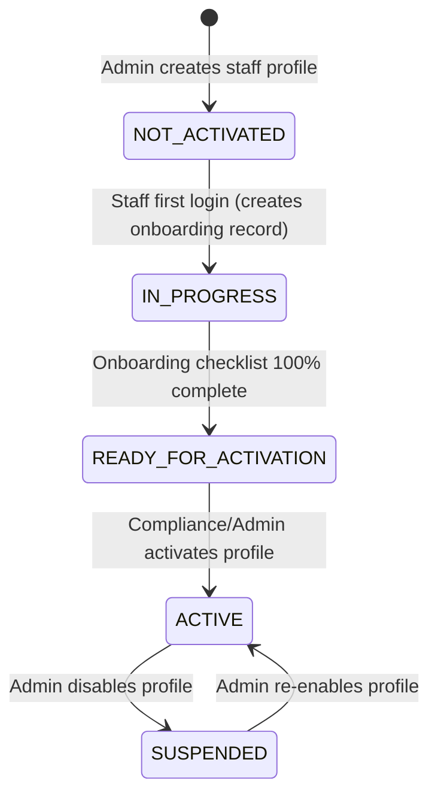

# HMS Staff Onboarding & Compliance — Integration & Testing Guide

This guide describes the complete, end-to-end flow for **Staff Self-Onboarding and Compliance** within the Auth/HRMS service, including testing steps for both the **Employee** and **Admin / Compliance Officer** roles.

A preconfigured Postman collection is available at [staff_onboarding_postman_collection.json](file:///c:/Users/saika/OneDrive/Desktop/Arovita/ops-hms-ljb/postman/staff_onboarding_postman_collection.json).

---

## 🔑 Onboarding States & Lifecycle

Staff accounts go through a sequential, state-restricted activation lifecycle:



### The 100% Completion Checklist
A staff member cannot be activated until the following **6 conditions** are satisfied:
1. **Schedule**: Working shift and weekly hours configured.
2. **Payroll**: Annual salary and currency established.
3. **Bank Account**: Primary bank details added.
4. **Tax Profile**: PAN card number and tax regime registered.
5. **Mandatory Documents**: Compliance documents uploaded and marked `VERIFIED` by an Admin.
6. **Mandatory Training**: Required compliance courses marked `COMPLETED` (100% progress).

### ⚠️ Resolving Role-Specific Document Blocks
If a role (such as `DOCTOR` or `NURSE`) has mandatory documents seeded in the `compliance.role_compliance_requirements` table (e.g., requiring a `MEDICAL_LICENSE`), the account **cannot be activated** unless these specific requirements are met:
1. **Dynamic Check**: Call `GET /hrms/staff/{user_id}/onboarding` to inspect the `blocking_documents` array. This lists the exact `document_type` strings blocking the account activation.
2. **Uploading the Match**: The employee must upload a matching document type using `POST /hrms/staff/{user_id}/documents` with the exact matching `document_type` string (e.g., `"document_type": "MEDICAL_LICENSE"`).
3. **Verification Priority**: Uploading is not enough. The compliance officer/admin must approve/verify it using `POST /hrms/documents/{doc_id}/verify` to change its status from `PENDING` to `VERIFIED`.
4. Only when all mandatory requirements have a status of `VERIFIED` will `activation_blocked` change to `false`, allowing the admin to successfully call the `/activate` endpoint.

### 📋 Mandatory Document Requirements by Role

The database has been seeded with the following role-based document requirements:

| Role ID | Role Name | Required Document Type | Display Name | Mandatory? | Expiry Required? |
| :--- | :--- | :--- | :--- | :---: | :---: |
| **`MED-001`** | **DOCTOR** | `MEDICAL_LICENSE` | Medical Registration Certificate | Yes | Yes |
| | | `DEGREE_CERTIFICATE` | MBBS / MD / MS Degree Certificate | Yes | No |
| | | `ID_PROOF` | Government ID Proof | Yes | No |
| **`MED-002`** | **NURSE** | `NURSING_LICENSE` | Nursing Council License | Yes | Yes |
| | | `ID_PROOF` | Government ID Proof | Yes | No |
| **`MED-003`** | **HEAD_NURSE** | `NURSING_LICENSE` | Nursing Council License | Yes | Yes |
| | | `ID_PROOF` | Government ID Proof | Yes | No |
| **`MED-004`** | **LAB_TECHNICIAN** | `TECHNICAL_LICENSE` | Lab Technician Registration Certificate | Yes | Yes |
| | | `ID_PROOF` | Government ID Proof | Yes | No |
| **`MED-005`** | **RADIOLOGIST** | `MEDICAL_LICENSE` | Medical Registration Certificate | Yes | Yes |
| | | `ID_PROOF` | Government ID Proof | Yes | No |
| **`MED-006`** | **PHARMACIST** | `PHARMACY_LICENSE` | Pharmacy Council License | Yes | Yes |
| | | `ID_PROOF` | Government ID Proof | Yes | No |
| **Other Roles** | **HR/Admin/Finance/Ops** | `ID_PROOF` | Government ID Proof | Yes | No |

---

## 📋 Data Validation Rules

The following schema and business validation constraints are enforced on input fields during self-onboarding:

### 1. Document Compliance & Verification
* **Future Expiry Date**: `expiry_date` must not be in the past. If the document is already expired, a `400 ValidationError` is returned.
* **Duplicate Document Types**: A staff member cannot upload a document of type `document_type` if another document of that same type is already in `PENDING` or `VERIFIED` status. Doing so raises a `409 ConflictError`.
* **Field Lengths**:
  * `document_type`: `min_length=2, max_length=100` (e.g., `MEDICAL_LICENSE`, `ID_PROOF`)
  * `document_name`: `min_length=2, max_length=255`
  * `document_id_number`: `min_length=1, max_length=100`
* **Rejection Reason**: The admin rejection reason (`rejection_reason`) must be between `5` and `1000` characters.

### 2. Schedule Config
* **Shift Types**: `primary_shift_type` must be one of: `MORNING`, `EVENING`, `NIGHT`, `ROTATING`.
* **Active Days**: `active_days` must be a subset of unique strings from: `MON`, `TUE`, `WED`, `THU`, `FRI`, `SAT`, `SUN`.
* **Rotation Policy**: If `is_rotating` is `true`, `rotation_cycle_days` is required. If `is_rotating` is `false`, it must be `null`.

### 3. On-Call Profile
* **Frequency validation**: If `on_call_enabled` is `true`, `on_call_frequency` must be specified and must be one of: `WEEKENDS_ONLY`, `DAILY`, `ROTATIONAL`, `EMERGENCY_ONLY`.

### 4. Payroll Config
* **Payment Cycles**: `payment_cycle` must be one of: `MONTHLY`, `BIWEEKLY`, `WEEKLY`.
* **Salary Checks**: `annual_base_salary` and `annual_bonus` must be positive numerical amounts.

### 5. Bank Accounts
* **IFSC Code Pattern**: `ifsc_code` is validated against the regex `^[A-Z]{4}0[A-Z0-9]{6}$` (e.g., `HDFC0001234`).
* **Field Lengths**: `account_number` must be between `5` and `50` characters.

### 6. Tax Profile
* **PAN Number Pattern**: `pan_number` is validated against the Indian PAN card format regex `^[A-Z]{5}[0-9]{4}[A-Z]$` (exactly 10 uppercase characters). E.g., `ABCDE1234F`.
* **Tax Regime**: `tax_regime` must be either `OLD` or `NEW`.

### 7. Training Assignments
* **Progress limits**: `completion_percentage` must be between `0` and `100` inclusive.
* **Auto-Status Inference**: If `completion_status` is omitted, it is automatically calculated:
  * `100%` progress ➡️ `COMPLETED`
  * `1%` to `99%` progress ➡️ `IN_PROGRESS`
  * `0%` progress ➡️ `NOT_STARTED`

---

## 🔐 First-Time Login: Password Setup Challenge

When a staff account is **created by admin** (`POST /auth/staff`), Cognito places the account in a `NEW_PASSWORD_REQUIRED` state. The staff member **must** complete the password challenge before they can access the system.

> **This is a two-step process, not a regular login.**

### Step 1 — Initiate Login (with temp password)

* **Endpoint**: `POST /auth/login`
* **Username**: Use the `employee_id` returned at creation (e.g., `HNR-S0B9J0`, `PMG-ML7MB5`)
* **Password**: Use the `temp_password` returned at creation

```json
{
  "username": "HNR-S0B9J0",
  "password": "<temp_password>",
  "device_info": "Postman Client"
}
```

**Response (challenge — not a login success):**
```json
{
  "success": false,
  "code": 202,
  "data": {
    "challenge_name": "NEW_PASSWORD_REQUIRED",
    "session": "<cognito_session_token>"
  }
}
```
Copy the `session` value — you need it in Step 2.

### Step 2 — Complete Password Challenge

* **Endpoint**: `POST /auth/new-password`
* Submit the `session` from Step 1 and your chosen permanent password.

```json
{
  "username": "HNR-S0B9J0",
  "session": "<cognito_session_token>",
  "new_password": "HeadNurse@Arovita2026!",
  "challenge_name": "NEW_PASSWORD_REQUIRED"
}
```

**Response (success — tokens issued):**
```json
{
  "success": true,
  "code": 200,
  "data": {
    "tokens": {
      "access_token": "...",
      "id_token": "...",
      "refresh_token": "..."
    }
  }
}
```

Use the `access_token` for all subsequent HRMS onboarding API calls.

### Alternative: Admin Force-Reset Password (bypasses challenge)

If the staff member cannot complete the challenge (e.g., lost temp password), an admin with `system:users:manage` permission can set a permanent password directly:

* **Endpoint**: `POST /auth/reset-password`
* **Authorization**: Admin access token

```json
{
  "phone": "9123456701",
  "new_password": "HeadNurse@Arovita2026!"
}
```

After this reset, the staff member can log in directly with the new password (no challenge).

---

## 📋 Current Staff Accounts (Created June 26, 2026)

| Role | Name | Employee ID | Email | User ID |
|:---|:---|:---|:---|:---|
| HEAD_NURSE | Sarah Jenkins | `HNR-S0B9J0` | sarah.jenkins@arovita.com | `6a2e5e54-7e71-4549-be4a-0f38501c89a9` |
| PHARMACY_MANAGER | Rajesh Kumar | `PMG-ML7MB5` | rajesh.kumar@arovita.com | `aa94981b-5acd-4503-b714-f3fdba4afc42` |
| LAB_ADMIN | Dr. Amit Verma | `LAB-XXXXXX` | amit.verma@arovita.com | `e35c4fff-e52b-4b2d-ac62-b567e7826e0c` |

> **Status**: All three accounts are `NOT_ACTIVATED`. Each must complete the first-login password challenge and full self-onboarding before activation.

---

## 💻 Flow A: Employee Self-Onboarding

All calls in this flow should be made using the employee's authorization token (`Authorization: Bearer <employee_token>`).

> **Pre-requisite**: The employee must first complete the **First-Time Login: Password Setup Challenge** above to obtain their `access_token`.

### 1. Employee Login (after password setup)
Authenticate with permanent password to generate an access token.
* **Endpoint**: `POST /auth/login`
* **Request Body**:
```json
{
  "username": "HNR-S0B9J0",
  "password": "HeadNurse@Arovita2026!",
  "device_info": "Postman Employee Client"
}
```

### 2. View Onboarding Progress
Retrieve the current completion percentage and identify missing/blocking steps.
* **Endpoint**: `GET /hrms/staff/{user_id}/onboarding`
* **Response Sample (`onboarding_status = IN_PROGRESS`)**:
```json
{
  "success": true,
  "data": {
    "id": "onb-uuid",
    "user_id": "user-uuid",
    "current_step": 1,
    "completion_percentage": 15,
    "onboarding_status": "IN_PROGRESS",
    "completed_steps": [1],
    "next_action": "Configure work schedule & payroll",
    "activation_blocked": true,
    "blocking_reasons": ["Schedule missing", "Payroll missing", "Bank details missing", "Tax profile missing", "Mandatory documents not verified", "Mandatory training incomplete"]
  }
}
```

### 3. Configure Work Schedule
Configure working hours and active shifts.
* **Endpoint**: `PUT /hrms/staff/{user_id}/schedule`
* **Request Body**:
```json
{
  "primary_shift_type": "MORNING",
  "duty_start_time": "08:00",
  "duty_end_time": "16:00",
  "weekly_hours": 40.0,
  "active_days": ["MON", "TUE", "WED", "THU", "FRI"],
  "is_rotating": false,
  "rotation_cycle_days": null,
  "notes": "Prefers morning shifts"
}
```

### 4. Setup On-Call Profile (Optional)
Specify availability for emergency calls.
* **Endpoint**: `PUT /hrms/staff/{user_id}/oncall`
* **Request Body**:
```json
{
  "on_call_enabled": true,
  "on_call_frequency": "WEEKENDS_ONLY",
  "emergency_contact_number": "+919876543210",
  "escalation_contact": "+919123456789",
  "notes": "Available Saturday & Sunday night shifts"
}
```

### 5. Setup Payroll details
* **Endpoint**: `PUT /hrms/staff/{user_id}/payroll`
* **Request Body**:
```json
{
  "payment_cycle": "MONTHLY",
  "currency": "INR",
  "annual_base_salary": 1800000.00,
  "annual_bonus": 200000.00,
  "effective_from": "2026-07-01"
}
```

### 6. Register Primary Bank Account
* **Endpoint**: `POST /hrms/staff/{user_id}/bank-accounts`
* **Request Body**:
```json
{
  "account_holder_name": "Dr. Priya Sharma",
  "bank_name": "HDFC Bank",
  "branch_name": "Koramangala",
  "account_number": "50100123456789",
  "ifsc_code": "HDFC0001234",
  "is_primary": true
}
```
*(Account numbers are masked as `****6789` in standard GET responses for security).*

### 7. Setup Tax Profile
* **Endpoint**: `PUT /hrms/staff/{user_id}/tax-profile`
* **Request Body**:
```json
{
  "pan_number": "ABCDE1234F",
  "tax_regime": "NEW",
  "pf_opted": true
}
```
*(PAN number validates against regex `^[A-Z]{5}[0-9]{4}[A-Z]$`)*

### 8. Upload Compliance Document
Submit license / credential metadata for compliance verification.
* **Endpoint**: `POST /hrms/staff/{user_id}/documents`
* **Request Body**:
```json
{
  "document_type": "MEDICAL_LICENSE",
  "document_name": "MCI Registration Certificate",
  "document_id_number": "MCI/2026/98765",
  "expiry_date": "2027-12-31"
}
```
* **Note**: This registers a `doc_uuid` marked with `verification_status = PENDING`.

### 9. Register & Complete Mandatory Training
Assign and track compliance courses.
* **Assign Course**: `POST /hrms/staff/{user_id}/training`
```json
{
  "training_type": "COMPLIANCE",
  "training_name": "Infection Control Protocol",
  "expiry_date": "2027-12-31"
}
```
* **Complete Training**: `PUT /hrms/training/{training_id}/progress`
```json
{
  "completion_percentage": 100,
  "completion_status": "COMPLETED"
}
```

---

## 🛡️ Flow B: Admin & Compliance Workflow

All actions in this flow require Admin permissions (`Authorization: Bearer <admin_token>`).

### 1. Admin Creates Staff Account
Admin initiates staff record creation. The system registers the profile and returns a temporary password.
* **Endpoint**: `POST /auth/staff`

#### Request Body Examples:

**A. Head Nurse**
```json
{
  "full_name": "Sarah Jenkins",
  "email": "sarah.jenkins@arovita.com",
  "phone": "9123456701",
  "role": "HEAD_NURSE",
  "registration_number": "NURSE/2026/00456",
  "qualification": "B.Sc Nursing",
  "experience_years": 8,
  "joining_date": "2026-07-01",
  "gender": "FEMALE",
  "date_of_birth": "1988-11-23"
}
```

**B. Pharmacy Manager**
```json
{
  "full_name": "Rajesh Kumar",
  "email": "rajesh.kumar@arovita.com",
  "phone": "9123456702",
  "role": "PHARMACY_MANAGER",
  "registration_number": "PHARM/2026/00789",
  "qualification": "B.Pharm, M.Pharm",
  "experience_years": 10,
  "joining_date": "2026-07-01",
  "gender": "MALE",
  "date_of_birth": "1985-06-15"
}
```

**C. Lab & Radiology Manager**
```json
{
  "full_name": "Dr. Amit Verma",
  "email": "amit.verma@arovita.com",
  "phone": "9123456703",
  "role": "LAB_ADMIN",
  "registration_number": "LAB/2026/00321",
  "qualification": "MD (Pathology)",
  "experience_years": 7,
  "joining_date": "2026-07-01",
  "gender": "MALE",
  "date_of_birth": "1989-09-12"
}
```

### 2. View Document Verification Queue
The compliance officer reviews all pending documents submitted by staff members.
* **Endpoint**: `GET /hrms/compliance/pending-verifications`

### 3. Verify or Reject Document
Compliance officers evaluate document attributes and either approve or reject.
* **Approve**: `POST /hrms/documents/{doc_id}/verify`
* **Reject**: `POST /hrms/documents/{doc_id}/reject`
```json
{
  "rejection_reason": "MCI registration number expired/invalid"
}
```

### 4. Track Activation Status
Admin can track which staff profiles are still blocked, and which have reached 100% completion.
* **Blocked Staff**: `GET /hrms/staff/blocked` (Returns staff with pending requirements)
* **Pending Activation**: `GET /hrms/staff/pending-activation` (Returns staff at 100% completion / `READY_FOR_ACTIVATION`)

### 5. Activate Staff Account
Once all checklist items are completed and documents verified, the account is activated.
* **Endpoint**: `POST /hrms/staff/{user_id}/activate`
* **Request Body**:
```json
{
  "activation_notes": "Checked credentials, validated MCI registration. Profile activated."
}
```
* **Response**:
```json
{
  "success": true,
  "data": {
    "user_id": "user-uuid",
    "is_active": true,
    "onboarding_status": "ACTIVE",
    "message": "Staff activated successfully"
  }
}
```

---

*HMS HRMS Service — `services/auth` | Last Updated: June 2026*
