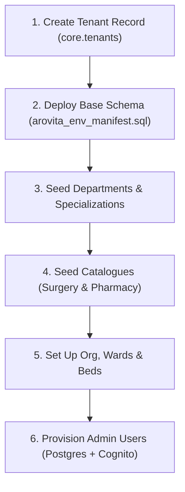

# HMS Tenant Provisioning & Initialization Guide

This guide provides a comprehensive step-by-step walkthrough to successfully create, initialize, and seed a new tenant in the HMS (Hospital Management System) database environment.

In this architecture, tenants are isolated using a **UUID** (`tenant_id`) and Row-Level Security (RLS) policies. To make a tenant fully operational, you must provision its core tenant definition, departments, specializations, catalogues (clinics & pharmacy), ward layouts, and admin user profiles.

---

## ── Tenant Setup Workflow ─────────────────────────────────────────────



---

## ── Step-by-Step Implementation ──────────────────────────────────────

### Step 1: Create the Tenant Row
First, you must create a row in the `core.tenants` table. This generates the unique UUID that all subsequent steps will reference.

```sql
INSERT INTO core.tenants (id, name, slug, is_active)
VALUES (
    'add22d47-2bc7-4bd2-9221-75fb580289d0', -- Tenant UUID
    'Arovita Hospital Bengaluru',           -- Tenant Name
    'arovita-blr',                          -- Slug
    TRUE
)
ON CONFLICT (slug) DO NOTHING;
```

> [!NOTE]
> Ensure the `slug` is unique as it is typically used for routing subdomain or API tenant headers.

---

### Step 2: Deploy Schemas & RBAC
Run the consolidated environment manifest to build the schema, enums, roles, and permissions:
```bash
# Example execution (replace credentials/host as appropriate for your env)
psql -h <db-host> -U <db-user> -d <db-name> -f arovita_env_manifest.sql
```

---

### Step 3: Seed Tenant Departments & Specializations
Seed the department hierarchy for the tenant and map them to their global specialization roles. 

```sql
DO $$
DECLARE
    v_tenant_id UUID := 'add22d47-2bc7-4bd2-9221-75fb580289d0';
    d_emergency UUID := gen_random_uuid();
    d_surgery   UUID := gen_random_uuid();
    d_proctology UUID := gen_random_uuid();
    d_nursing   UUID := gen_random_uuid();
    d_pharmacy  UUID := gen_random_uuid();
    
    s_proctologist      UUID;
    s_colorectal        UUID;
    s_scrub_nurse       UUID;
    s_ward_nurse        UUID;
    s_pharmacist_sp     UUID;
BEGIN
    -- 1. Insert Departments
    INSERT INTO identity.departments (department_id, tenant_id, department_name, is_active)
    VALUES
        (d_emergency,  v_tenant_id, 'Emergency',                   TRUE),
        (d_surgery,    v_tenant_id, 'Surgery / Operation Theatre', TRUE),
        (d_proctology, v_tenant_id, 'Proctology / Hemorrhoids',    TRUE),
        (d_nursing,    v_tenant_id, 'Nursing',                     TRUE),
        (d_pharmacy,   v_tenant_id, 'Pharmacy',                    TRUE)
    ON CONFLICT (tenant_id, department_name) DO NOTHING;

    -- 2. Fetch specializations (global)
    SELECT specialization_id INTO s_proctologist FROM identity.specializations WHERE specialization_name = 'Proctologist';
    SELECT specialization_id INTO s_colorectal   FROM identity.specializations WHERE specialization_name = 'Colorectal Surgeon';
    SELECT specialization_id INTO s_scrub_nurse  FROM identity.specializations WHERE specialization_name = 'Scrub Nurse';
    SELECT specialization_id INTO s_ward_nurse   FROM identity.specializations WHERE specialization_name = 'Ward Nurse';
    SELECT specialization_id INTO s_pharmacist_sp FROM identity.specializations WHERE specialization_name = 'Clinical Pharmacist';

    -- 3. Map Department ↔ Specialization
    INSERT INTO identity.department_specializations (department_id, specialization_id)
    VALUES
        (d_proctology, s_proctologist),
        (d_proctology, s_colorectal),
        (d_proctology, s_ward_nurse),
        (d_surgery,    s_colorectal),
        (d_surgery,    s_scrub_nurse),
        (d_nursing,    s_ward_nurse),
        (d_pharmacy,   s_pharmacist_sp)
    ON CONFLICT DO NOTHING;
END $$;
```

---

### Step 4: Seed Tenant Catalogues
Seeding the Surgery & Procedure Catalogue and Pharmacy Medicine Master for the new tenant. When deploying `arovita_env_manifest.sql`, the dynamic loops will seed active tenants automatically. If you want to seed it manually or on-demand for a single tenant, use the following structure:

```sql
DO $$
DECLARE
    v_tenant_id UUID := 'add22d47-2bc7-4bd2-9221-75fb580289d0';
    v_dept_proctology UUID;
    v_dept_surgery UUID;
BEGIN
    -- Resolve Department IDs
    SELECT department_id INTO v_dept_proctology FROM identity.departments WHERE tenant_id = v_tenant_id AND department_name = 'Proctology / Hemorrhoids';
    SELECT department_id INTO v_dept_surgery FROM identity.departments WHERE tenant_id = v_tenant_id AND department_name = 'Surgery / Operation Theatre';

    -- 1. Surgery & Procedure catalogue
    INSERT INTO clinical.surgery_procedure_catalogue (tenant_id, service_code, service_name, order_type, department_id, estimated_cost)
    VALUES
        (v_tenant_id, 'PILE_LASER_SCLERO',      'Laser sclerotherapy',       'PROCEDURE', v_dept_proctology, 15000.00),
        (v_tenant_id, 'PILE_HEMORRHOIDECTOMY',  'Hemorrhoidectomy',          'SURGERY',   v_dept_surgery,    25000.00),
        (v_tenant_id, 'PILE_KSHARASUTRA',       'Ksharasutra',               'PROCEDURE', v_dept_proctology, 12000.00),
        (v_tenant_id, 'FIS_SPHINCTEROTOMY',     'Sphincterotomy',            'SURGERY',   v_dept_surgery,    20000.00)
    ON CONFLICT (tenant_id, service_code) DO NOTHING;

    -- 2. Pharmacy Medicine Master
    INSERT INTO pharmacy.medicine_master (tenant_id, name, generic_name, category, phase, default_dosage, default_frequency, default_route, default_duration_days, notes, created_by)
    VALUES
        (v_tenant_id, 'Lignocaine 2%', 'Lignocaine', 'Local Anaesthetic', 'PRE_OPERATIVE', '2%', 'SOS', 'TOPICAL', NULL, 'Pre-procedure anaesthesia.', '00000000-0000-0000-0000-000000000000'),
        (v_tenant_id, 'Ceftriaxone', 'Ceftriaxone', 'Antibiotic', 'PRE_OPERATIVE', '1g', 'OD', 'IV', NULL, 'Infection prophylaxis', '00000000-0000-0000-0000-000000000000'),
        (v_tenant_id, 'Paracetamol', 'Paracetamol', 'Analgesic', 'POST_OPERATIVE', '500mg', 'QDS', 'ORAL', NULL, 'Safe in pregnancy', '00000000-0000-0000-0000-000000000000')
    ON CONFLICT (tenant_id, name) DO NOTHING;
END $$;
```

---

### Step 5: Provision Organizations, Wards & Beds
Initialize the ward structure and bed allocations to allow admitting and tracking IPD patients.

```sql
DO $$
DECLARE
    v_tenant_id UUID := 'add22d47-2bc7-4bd2-9221-75fb580289d0';
    v_org_id UUID := gen_random_uuid();
    v_ward_id UUID := gen_random_uuid();
BEGIN
    -- 1. Create Organization
    INSERT INTO core.organizations (id, tenant_id, parent_org_id, type, name, is_active)
    VALUES (v_org_id, v_tenant_id, NULL, 'hospital', 'Sri Hari Surgical Branch', TRUE)
    ON CONFLICT DO NOTHING;

    -- 2. Create General Ward
    INSERT INTO patient.wards (id, tenant_id, name, ward_type, floor, capacity, is_active)
    VALUES (v_ward_id, v_tenant_id, 'General Ward A', 'GENERAL', '1', 10, TRUE)
    ON CONFLICT (tenant_id, name) DO NOTHING;

    -- 3. Seed Beds
    INSERT INTO patient.beds (id, tenant_id, ward_id, bed_number, bed_type, status, is_active)
    VALUES
        (gen_random_uuid(), v_tenant_id, v_ward_id, 'B-01', 'STANDARD', 'AVAILABLE', TRUE),
        (gen_random_uuid(), v_tenant_id, v_ward_id, 'B-02', 'STANDARD', 'AVAILABLE', TRUE),
        (gen_random_uuid(), v_tenant_id, v_ward_id, 'B-03', 'STANDARD', 'AVAILABLE', TRUE)
    ON CONFLICT (ward_id, bed_number) DO NOTHING;
END $$;
```

---

### Step 6: Create Admin Users
To gain access to the newly created tenant system, provision a system administrator profile:

1. **Cognito provisioning**:
```bash
aws cognito-idp admin-create-user \
    --user-pool-id "ap-south-1_gVAVhZBPB" \
    --username "admin.bengaluru@arovita.com" \
    --user-attributes Name=email,Value=admin.bengaluru@arovita.com Name=phone_number,Value=+918904025186 Name=custom:tenant_id,Value=add22d47-2bc7-4bd2-9221-75fb580289d0 Name=custom:role,Value=ITC-001 \
    --message-action SUPPRESS

aws cognito-idp admin-set-user-password \
    --user-pool-id "ap-south-1_gVAVhZBPB" \
    --username "admin.bengaluru@arovita.com" \
    --password "ArovitaAdmin2026!" \
    --permanent
```

2. **Postgres Sync**:
```sql
INSERT INTO identity.hms_users (
    id, tenant_id, full_name, email, phone, role_id, employee_id, is_active, login_enabled, cognito_provisioned
)
VALUES (
    gen_random_uuid(),
    'add22d47-2bc7-4bd2-9221-75fb580289d0', -- Tenant UUID
    'Bengaluru Admin User',
    'admin.bengaluru@arovita.com',
    '+918904025186',
    'ITC-001',                            -- SYSTEM_ADMINISTRATOR role_id
    'EMP-BLR-ADM01',
    TRUE,
    TRUE,
    TRUE
)
ON CONFLICT (email) DO NOTHING;
```

---

## ── Tenant Setup Script (Unified Blueprint) ───────────────────────

The SQL script below consolidates all Postgres database steps (Tenant insert, Departments, Specializations, Catalogues, Wards, Beds) into a single, atomic, and safe-to-run transaction block.

> [!TIP]
> Just change the `v_new_tenant_id`, `v_tenant_name`, and `v_tenant_slug` variables at the top of the block before running to provision any new tenant in seconds.

```sql
BEGIN;

DO $$
DECLARE
    -- Configure your new tenant details here:
    v_new_tenant_id UUID := 'add22d47-2bc7-4bd2-9221-75fb580289d0';
    v_tenant_name   TEXT := 'Arovita Hospital Bengaluru';
    v_tenant_slug   TEXT := 'arovita-blr';
    
    -- Local variables for department mapping
    d_emergency     UUID := gen_random_uuid();
    d_surgery       UUID := gen_random_uuid();
    d_proctology    UUID := gen_random_uuid();
    d_nursing       UUID := gen_random_uuid();
    d_billing       UUID := gen_random_uuid();
    d_pharmacy      UUID := gen_random_uuid();
    d_records       UUID := gen_random_uuid();
    d_radiology     UUID := gen_random_uuid();
    d_laboratory    UUID := gen_random_uuid();

    -- Global specialization lookups
    s_proctologist      UUID;
    s_colorectal        UUID;
    s_anesthesiologist  UUID;
    s_scrub_nurse       UUID;
    s_ot_tech           UUID;
    s_circ_nurse        UUID;
    s_triage_nurse      UUID;
    s_ward_nurse        UUID;
    s_emr_nurse         UUID;
    s_hk_staff          UUID;
    s_records_officer   UUID;
    s_billing_exec      UUID;
    s_head_nurse        UUID;

    -- Org and Ward allocations
    v_org_id            UUID := gen_random_uuid();
    w_gen_a             UUID := gen_random_uuid();
    w_icu               UUID := gen_random_uuid();
    w_emr               UUID := gen_random_uuid();
BEGIN
    -- 1. Insert Tenant definition
    INSERT INTO core.tenants (id, name, slug, is_active)
    VALUES (v_new_tenant_id, v_tenant_name, v_tenant_slug, TRUE)
    ON CONFLICT (slug) DO NOTHING;

    RAISE NOTICE 'Provisioned Tenant definition: % (%)', v_tenant_name, v_new_tenant_id;

    -- 2. Insert standard departments
    INSERT INTO identity.departments (department_id, tenant_id, department_name, is_active)
    VALUES
        (d_emergency,  v_new_tenant_id, 'Emergency',                   TRUE),
        (d_surgery,    v_new_tenant_id, 'Surgery / Operation Theatre', TRUE),
        (d_proctology, v_new_tenant_id, 'Proctology / Hemorrhoids',    TRUE),
        (d_nursing,    v_new_tenant_id, 'Nursing',                     TRUE),
        (d_billing,    v_new_tenant_id, 'Billing & Finance',           TRUE),
        (d_pharmacy,   v_new_tenant_id, 'Pharmacy',                    TRUE),
        (d_records,    v_new_tenant_id, 'Medical Records',             TRUE),
        (d_radiology,  v_new_tenant_id, 'Radiology',                   TRUE),
        (d_laboratory, v_new_tenant_id, 'Laboratory',                  TRUE)
    ON CONFLICT (tenant_id, department_name) DO NOTHING;

    -- Resolve actual IDs (in case they already existed from concurrent run)
    SELECT department_id INTO d_emergency  FROM identity.departments WHERE tenant_id = v_new_tenant_id AND department_name = 'Emergency';
    SELECT department_id INTO d_surgery    FROM identity.departments WHERE tenant_id = v_new_tenant_id AND department_name = 'Surgery / Operation Theatre';
    SELECT department_id INTO d_proctology FROM identity.departments WHERE tenant_id = v_new_tenant_id AND department_name = 'Proctology / Hemorrhoids';
    SELECT department_id INTO d_nursing    FROM identity.departments WHERE tenant_id = v_new_tenant_id AND department_name = 'Nursing';
    SELECT department_id INTO d_billing    FROM identity.departments WHERE tenant_id = v_new_tenant_id AND department_name = 'Billing & Finance';
    SELECT department_id INTO d_pharmacy   FROM identity.departments WHERE tenant_id = v_new_tenant_id AND department_name = 'Pharmacy';
    SELECT department_id INTO d_records    FROM identity.departments WHERE tenant_id = v_new_tenant_id AND department_name = 'Medical Records';
    SELECT department_id INTO d_radiology  FROM identity.departments WHERE tenant_id = v_new_tenant_id AND department_name = 'Radiology';
    SELECT department_id INTO d_laboratory FROM identity.departments WHERE tenant_id = v_new_tenant_id AND department_name = 'Laboratory';

    -- 3. Resolve global specialization references
    SELECT specialization_id INTO s_proctologist     FROM identity.specializations WHERE specialization_name = 'Proctologist';
    SELECT specialization_id INTO s_colorectal       FROM identity.specializations WHERE specialization_name = 'Colorectal Surgeon';
    SELECT specialization_id INTO s_anesthesiologist FROM identity.specializations WHERE specialization_name = 'Anesthesiologist';
    SELECT specialization_id INTO s_scrub_nurse      FROM identity.specializations WHERE specialization_name = 'Scrub Nurse';
    SELECT specialization_id INTO s_ot_tech          FROM identity.specializations WHERE specialization_name = 'OT Technician';
    SELECT specialization_id INTO s_circ_nurse       FROM identity.specializations WHERE specialization_name = 'Circulating Nurse';
    SELECT specialization_id INTO s_triage_nurse     FROM identity.specializations WHERE specialization_name = 'Triage Nurse';
    SELECT specialization_id INTO s_ward_nurse       FROM identity.specializations WHERE specialization_name = 'Ward Nurse';
    SELECT specialization_id INTO s_emr_nurse        FROM identity.specializations WHERE specialization_name = 'Emergency Nurse';
    SELECT specialization_id INTO s_hk_staff         FROM identity.specializations WHERE specialization_name = 'Housekeeping Staff';
    SELECT specialization_id INTO s_records_officer  FROM identity.specializations WHERE specialization_name = 'Medical Records Officer';
    SELECT specialization_id INTO s_billing_exec     FROM identity.specializations WHERE specialization_name = 'Billing Executive';
    SELECT specialization_id INTO s_head_nurse       FROM identity.specializations WHERE specialization_name = 'Head Nurse';

    -- 4. Insert Department ↔ Specialization Mappings
    INSERT INTO identity.department_specializations (department_id, specialization_id)
    VALUES
        (d_proctology, s_proctologist), (d_proctology, s_colorectal), (d_proctology, s_anesthesiologist), (d_proctology, s_circ_nurse), (d_proctology, s_ward_nurse),
        (d_surgery,    s_colorectal), (d_surgery, s_anesthesiologist), (d_surgery, s_scrub_nurse), (d_surgery, s_ot_tech), (d_surgery, s_hk_staff),
        (d_nursing,    s_triage_nurse), (d_nursing, s_ward_nurse), (d_nursing, s_emr_nurse), (d_nursing, s_head_nurse),
        (d_emergency,  s_emr_nurse), (d_emergency, s_triage_nurse), (d_emergency, s_anesthesiologist),
        (d_records,    s_records_officer),
        (d_billing,    s_billing_exec),
        (d_pharmacy,   s_pharmacist_sp)
    ON CONFLICT DO NOTHING;

    -- 5. Seed clinical surgery/procedure catalogue
    INSERT INTO clinical.surgery_procedure_catalogue (tenant_id, service_code, service_name, order_type, department_id, estimated_cost)
    VALUES
        (v_new_tenant_id, 'PILE_LASER_SCLERO',      'Laser sclerotherapy',       'PROCEDURE', d_proctology, 15000.00),
        (v_new_tenant_id, 'PILE_HEMORRHOIDECTOMY',  'Hemorrhoidectomy',          'SURGERY',   d_surgery,    25000.00),
        (v_new_tenant_id, 'PILE_KSHARASUTRA',       'Ksharasutra',               'PROCEDURE', d_proctology, 12000.00),
        (v_new_tenant_id, 'PILE_INJ_SCLERO',        'Injection sclerotherapy',   'PROCEDURE', d_proctology, 8000.00),
        (v_new_tenant_id, 'FIS_LASER_SCLERO',       'Laser sclerotherapy',       'PROCEDURE', d_proctology, 15000.00),
        (v_new_tenant_id, 'FIS_ANAL_DILATATION',    'Anal dilatation',           'PROCEDURE', d_proctology, 10000.00),
        (v_new_tenant_id, 'FIS_SPHINCTEROTOMY',     'Sphincterotomy',            'SURGERY',   d_surgery,    20000.00),
        (v_new_tenant_id, 'FIS_KSHARAKARMA',        'Ksharakarma',               'PROCEDURE', d_proctology, 12000.00),
        (v_new_tenant_id, 'FISTULA_LASER_THERAPY',  'Laser fistula therapy',     'PROCEDURE', d_proctology, 18000.00),
        (v_new_tenant_id, 'FISTULA_FISTULECTOMY',   'Fistulectomy',              'SURGERY',   d_surgery,    22000.00),
        (v_new_tenant_id, 'FISTULA_KSHARASUTRA',    'Ksharasutra',               'PROCEDURE', d_proctology, 12000.00),
        (v_new_tenant_id, 'PROLAPSE_THIERSCH',      'Thiersch procedure',        'SURGERY',   d_surgery,    30000.00)
    ON CONFLICT (tenant_id, service_code) DO UPDATE SET
        service_name = EXCLUDED.service_name,
        estimated_cost = EXCLUDED.estimated_cost;

    -- 6. Seed pharmacy medicine master catalogue
    INSERT INTO pharmacy.medicine_master (tenant_id, name, generic_name, category, phase, default_dosage, default_frequency, default_route, default_duration_days, notes, created_by)
    VALUES
        (v_new_tenant_id, 'Lignocaine 2%', 'Lignocaine', 'Local Anaesthetic', 'PRE_OPERATIVE', '2%', 'SOS', 'TOPICAL', NULL, 'Pre-procedure anaesthesia.', '00000000-0000-0000-0000-000000000000'),
        (v_new_tenant_id, 'Bupivacaine 0.5%', 'Bupivacaine', 'Local Anaesthetic', 'PRE_OPERATIVE', '0.5%', 'SOS', 'TOPICAL', NULL, 'Pre-procedure anaesthesia.', '00000000-0000-0000-0000-000000000000'),
        (v_new_tenant_id, 'GTN 0.2% Ointment', 'Glyceryl Trinitrate', 'Sphincter Relaxant', 'PRE_OPERATIVE', '0.2%', 'BD', 'TOPICAL', NULL, 'Reduce sphincter tone.', '00000000-0000-0000-0000-000000000000'),
        (v_new_tenant_id, 'Ceftriaxone', 'Ceftriaxone', 'Antibiotic', 'PRE_OPERATIVE', '1g', 'OD', 'IV', NULL, 'Infection prophylaxis', '00000000-0000-0000-0000-000000000000'),
        (v_new_tenant_id, 'Metronidazole', 'Metronidazole', 'Antibiotic', 'PRE_OPERATIVE', '500mg', 'TDS', 'ORAL', NULL, 'Safe after 1st trimester', '00000000-0000-0000-0000-000000000000'),
        (v_new_tenant_id, 'Paracetamol', 'Paracetamol', 'Analgesic', 'POST_OPERATIVE', '500mg', 'QDS', 'ORAL', NULL, 'Safe in pregnancy', '00000000-0000-0000-0000-000000000000'),
        (v_new_tenant_id, 'Diclofenac', 'Diclofenac', 'Analgesic (NSAID)', 'POST_OPERATIVE', '50mg', 'BD', 'ORAL', NULL, 'Avoid in 3rd trimester', '00000000-0000-0000-0000-000000000000'),
        (v_new_tenant_id, 'Lactulose', 'Lactulose', 'Stool Softener', 'POST_OPERATIVE', '15ml', 'BD', 'ORAL', NULL, 'Safe in pregnancy', '00000000-0000-0000-0000-000000000000')
    ON CONFLICT (tenant_id, name) DO NOTHING;

    -- 7. Seed core Hospital organization structure
    INSERT INTO core.organizations (id, tenant_id, parent_org_id, type, name, is_active)
    VALUES
        (v_org_id, v_new_tenant_id, NULL, 'hospital', v_tenant_name || ' Main Facility', TRUE),
        (gen_random_uuid(), v_new_tenant_id, v_org_id, 'department', 'Emergency Block', TRUE),
        (gen_random_uuid(), v_new_tenant_id, v_org_id, 'pharmacy',   'Dispensary A', TRUE)
    ON CONFLICT DO NOTHING;

    -- 8. Seed Ward Layout and Beds
    INSERT INTO patient.wards (id, tenant_id, name, ward_type, floor, capacity, is_active)
    VALUES
        (w_gen_a,   v_new_tenant_id, 'General Ward A',   'GENERAL',   '1', 20, TRUE),
        (w_icu,     v_new_tenant_id, 'ICU',              'ICU',       '2',  8, TRUE),
        (w_emr,     v_new_tenant_id, 'Emergency Ward',   'EMERGENCY', 'G', 12, TRUE)
    ON CONFLICT (tenant_id, name) DO NOTHING;

    -- Resolve Ward IDs (just in case)
    SELECT id INTO w_gen_a FROM patient.wards WHERE tenant_id = v_new_tenant_id AND name = 'General Ward A';
    SELECT id INTO w_icu   FROM patient.wards WHERE tenant_id = v_new_tenant_id AND name = 'ICU';
    SELECT id INTO w_emr   FROM patient.wards WHERE tenant_id = v_new_tenant_id AND name = 'Emergency Ward';

    INSERT INTO patient.beds (id, tenant_id, ward_id, bed_number, bed_type, status, is_active)
    VALUES
        (gen_random_uuid(), v_new_tenant_id, w_gen_a, 'B-01', 'STANDARD', 'AVAILABLE', TRUE),
        (gen_random_uuid(), v_new_tenant_id, w_gen_a, 'B-02', 'STANDARD', 'AVAILABLE', TRUE),
        (gen_random_uuid(), v_new_tenant_id, w_icu,   'ICU-01', 'ICU',    'AVAILABLE', TRUE),
        (gen_random_uuid(), v_new_tenant_id, w_icu,   'ICU-02', 'ICU',    'AVAILABLE', TRUE),
        (gen_random_uuid(), v_new_tenant_id, w_emr,   'EMR-01', 'STANDARD', 'AVAILABLE', TRUE)
    ON CONFLICT (ward_id, bed_number) DO NOTHING;

    RAISE NOTICE 'Tenant initialization and seeding completed successfully for %', v_tenant_slug;
END $$;

COMMIT;
```

---

## ── Verification Check ────────────────────────────────────────────────

Once the setup script runs successfully, verify the setup by executing:

```sql
-- 1. Check Tenant exists and is active
SELECT * FROM core.tenants WHERE id = 'add22d47-2bc7-4bd2-9221-75fb580289d0';

-- 2. Verify departments were created for the tenant
SELECT department_name, is_active FROM identity.departments WHERE tenant_id = 'add22d47-2bc7-4bd2-9221-75fb580289d0';

-- 3. Verify surgery catalogue has loaded
SELECT service_code, service_name, estimated_cost FROM clinical.surgery_procedure_catalogue WHERE tenant_id = 'add22d47-2bc7-4bd2-9221-75fb580289d0';

-- 4. Verify pharmacy master has loaded
SELECT name, generic_name, phase FROM pharmacy.medicine_master WHERE tenant_id = 'add22d47-2bc7-4bd2-9221-75fb580289d0';
```
